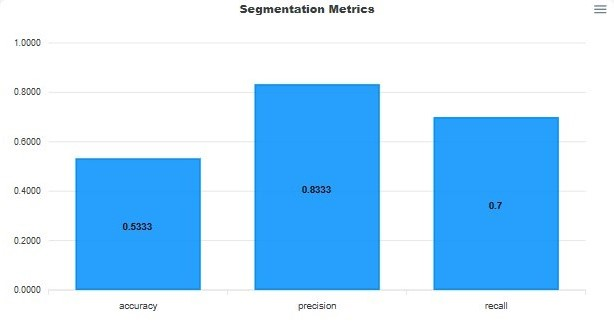
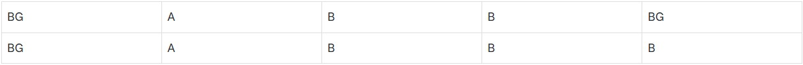
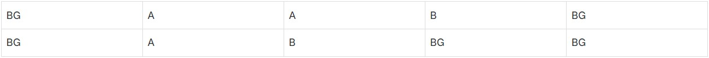
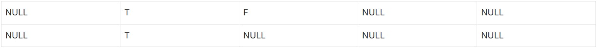
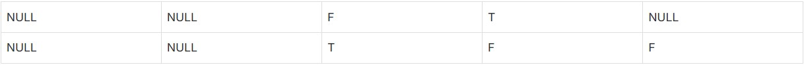

# Segmentation Metrics

This section will describe the validation metrics reported in [ModelPack validation sessions](../tutorials/validation.md#modelpack) for segmentation.  The different types of validation methods available are Ultralytics, EdgeFirst, and YOLOv7.  These validation methods have been implemented in EdgeFirst Validator to reproduce specific metrics seen in other applications.  These metrics and their differences will be described in more detail below.

## EdgeFirst Segmentation Metrics

The segmentation metrics describe the average precision, recall, and accuracy.  These metrics are represented as a bar chart.  Shown below is an example.

<figure markdown="span">
  { align=center }
  <figcaption>Segmentation Metrics</figcaption>
</figure>

The equations for precision, recall, and accuracy are similar to object detection, except that in segmentation we are classifying predictions as either true or false on a pixel-by-pixel basis.  Shown below are the equations for precision, recall, and accuracy. 

$$
\text{precision} = \frac{\text{true predictions}}{\text{total predictions}}
$$

$$
\text{recall} = \frac{\text{true predictions}}{\text{total ground truths}}
$$

$$
\text{accuracy} = \frac{\text{true predictions}}{\text{predictions U ground truths}}
$$

The average precision, recall, and accuracy is the sum of precision, recall, and accuracy per class divided by the number of classes.  

$$
\text{AP} = \frac{1}{n}\sum_{i=1}^{n}\text{precision}_{i}, n = \text{number of classes}
$$

$$
\text{AR} = \frac{1}{n}\sum_{i=1}^{n}\text{recall}_{i}, n = \text{number of classes}
$$

$$
\text{aACC} = \frac{1}{n}\sum_{i=1}^{n}\text{accuracy}_{i}, n = \text{number of classes}
$$

The next section will show an example of the metric computations on a small sample.

### Sample Computation

This section will show an example of how segmentation metrics are calculated.  Consider the following 5x2 segmentation masks for the ground truth and the model prediction with classes background (BG), A, and B.

<figure markdown="span">
  { align=center }
  <figcaption>Ground Truth Mask</figcaption>
</figure>

<figure markdown="span">
  { align=center }
  <figcaption>Prediction Mask</figcaption>
</figure>

We start by calculating the metrics per class which is the precision, recall, and accuracy for class A and B.  Class background is not included in the computations because it dilutes the revelant classes A and B since most of the area in the mask is typically classified as background. 

**Class A Metrics**

The following table shows the classifications for class A where T is denoted as a true prediction, F is denoted as a false prediction, and NULL are placed on the positions that do not involve class A.

<figure markdown="span">
  { align=center }
  <figcaption>Classification A</figcaption>
</figure>

Using the equations for precision, recall, and accuracy above, these are the metrics for class A.

* $\text{precision} = \frac{2}{3}$
* $\text{recall} = \frac{2}{2}$
* $\text{accuracy} = \frac{2}{3}$

**Class B Metrics**

The following table shows the classifications for class B.

<figure markdown="span">
  { align=center }
  <figcaption>Classification B</figcaption>
</figure>

These are the metrics for class B.

* $\text{precision} = \frac{2}{2}$
* $\text{recall} = \frac{2}{5}$
* $\text{accuracy} = \frac{2}{5}$

**Resulting Metrics**

Based on the metrics of each class shown above, the average metrics can now be calculated.

* $\text{AP} = \frac{(\frac{2}{3} + \frac{2}{2})}{2} = \frac{5}{6} \approx 0.83$
* $\text{AR} = \frac{(\frac{2}{2} + \frac{2}{5})}{2} = \frac{7}{10} = 0.70$
* $\text{aACC} = \frac{(\frac{2}{3} + \frac{2}{5})}{2} = \frac{8}{15} \approx 0.53$

## Model Timings

These timings are measured in the same way as ModelPack as described under the [Model Timings](detection.md#model-timings) section.