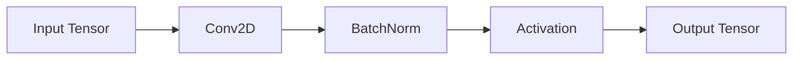
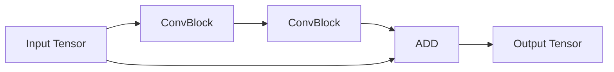
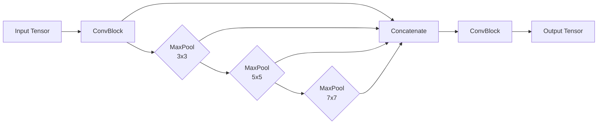
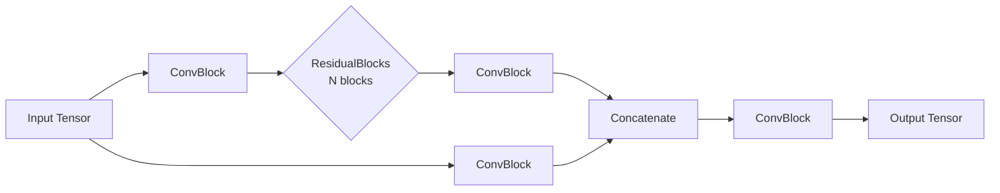
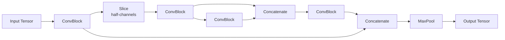
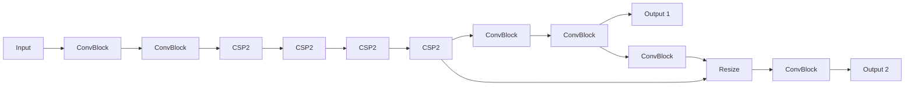
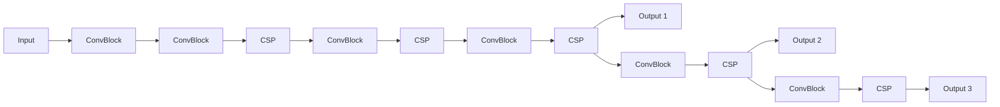

# ModelPack Building Blocks

ModelPack is implemented using Keras 3.x framework and the Functional API. We have developed few building blocks that connect between them to form the backbone in an iterative way. The main building block in ModelPack is the Convolutional block, integrated by a Convolution, a Batch Normalization and the Activation function. This block is used to generate more complex ones, like Residual (Kaiming He 2015), CSP (Chien-Yao Wang 2019) and a modified SPP (He, Kaiming, et al 2015).

## Convolutional Block

In this block we included a Conv2D object followed by a BN, followed by an activation. Activation is a global parameter that can be either of Sigmoid, SiLU, ReLU, or ReLU6. 

Each convolution layer adds an L2 kernel regularization initialized at 0.0005 and removes bias regularization since the block includes Batch Normalization. 

## Residual Blocks

Residual layers are a core component of deep learning architectures, introduced with the ResNet (Residual Network) model in 2015. They address the degradation problem, where increasing network depth leads to worse training accuracy—not due to overfitting, but because deeper networks are harder to optimize. The key idea of a residual layer is to use a shortcut (or skip) connection that allows the input of a layer to bypass intermediate layers and be added directly to the output. Instead of learning a direct mapping `H(x)`, the network learns a residual function `F(x) = H(x) - x`, making the final output `H(x) = F(x) + x`. This helps the network learn identity mappings more easily, which stabilizes training and improves gradient flow.

A typical residual block includes two or more convolutional layers with batch normalization and ReLU activation, plus the shortcut connection. If input and output dimensions differ, a 1x1 convolution adjusts the shape. The framework implements an iterative Residual layer that is conditioned by the height/repeats of the model. In other words, multiple Residual blocks are stacked depending on the expansion factor

## SPP Block (Spatial Pyramid Pooling)

The Spatial Pyramid Pooling (SPP) layer is a technique used in convolutional neural networks (CNNs) to handle inputs of varying sizes while preserving spatial information. Traditional CNNs require fixed-size inputs because fully connected layers expect a fixed-length feature vector. SPP solves this limitation by introducing a flexible pooling mechanism that outputs a fixed-length representation regardless of input size.
SPP works by applying multiple levels of spatial pooling (e.g., max or average pooling) over different regions of the feature map. At each level, the feature map is divided into a set number of bins (e.g., 1x1, 2x2, 4x4), and pooling is performed within each bin. The outputs from all levels are then concatenated into a single feature vector. This creates a multi-scale representation, capturing both global and local spatial features.

Because of this design, the SPP layer allows networks to accept images of arbitrary sizes during inference, which is especially useful in tasks like object detection, where objects appear at different scales and locations. SPP also improves robustness and accuracy by enhancing spatial context understanding.

In this block, we use progressively stacked max pooling layers with increasing kernel sizes to capture features at multiple receptive fields. Since each pooling layer is applied with a stride of 1 and same padding, spatial resolution is preserved, but the context size increases.
Smaller objects tend to be more dominant in earlier pooling stages, where fine details are retained. As pooling layers stack, the receptive field grows, helping to enhance larger or more abstract features. By concatenating features from all stages, the model retains fine-grained local features as well as broader contextual ones.
This multi-scale feature representation helps the model become more robust to object scale variations, similar in spirit to spatial pyramid pooling but implemented through stacked, fixed-stride pooling.

## CSP

The CSP (Cross-Stage Partial) block architecture enhances feature learning efficiency and gradient flow by splitting the input tensor into two parallel paths. One path undergoes multiple convolutional and residual operations, enabling deep feature extraction and reuse through repeated transformations that strengthen representation power. The second path, processed by a lightweight ConvBlock, preserves spatial information and acts as a shortcut for stable gradient propagation. Afterward, both paths are concatenated to fuse low- and high-level features, balancing detail retention with abstraction. This design reduces computational redundancy by partially processing the input while maintaining high accuracy and rich feature diversity. The final ConvBlock after concatenation blends the combined features into a cohesive representation, improving the model’s generalization and convergence. Overall, this structure achieves better gradient flow, less memory cost, and enhanced representational capacity—key reasons CSP architectures outperform standard residual networks in speed-accuracy trade-offs for detection and classification tasks.

For the case of CSPDarknet19 backbones we used a more compressed CSP layer with the following structure (This layer will be referenced as CSP2):

The CSP2 layer is a more compact variation of the standard Cross Stage Partial (CSP) module, designed to improve computational efficiency while maintaining strong feature representation. In this configuration, the input first passes through an initial convolutional block to normalize and extract primary features. The output is then split into two halves along the channel dimension, allowing only part of the feature maps to undergo deeper convolutional processing. This “partial gradient flow” strategy reduces redundancy by applying multiple ConvBlocks to just half of the channels, while the other half bypasses the heavier computation path. Both branches are then recombined through concatenation, ensuring that fine-grained spatial information and abstract features are preserved. The final ConvBlock fuses these combined features into a balanced output representation. Overall, CSP2 effectively reduces input channel size by half, lowering parameters and computation cost while retaining high representational power.

# ModelPack Backbones

ModelPack is versatile framework designated for Object Detection and Semantic Segmentation, initially inspired by YoloV4 architecture (Bochkovskiy 2020). The framework exposes two different backbones, the CSPDarknet19 and CSPDaknet53. Different to original implementation that only provided the large and tiny architectures, we adopt the approach proposed by EfficientDet (Tan 2020) and expose the compound scaling factors to produce the nano, small, medium and large architectures for each backbone. This approach considerably reduces the number of parameters on each model and speeds up the inference on embedded devices.

## Compound Scaling Factors

The scaling factor moves in two different directions, affecting in that way the width and height of the model. The width parameter modifies the number of filters on each convolutional layer: nano (0.25), small (0.5), medium (0.75) and large (1.0). The height parameter affects the number of convolutional blocks at different levels: nano (0.33), small (0.33), medium (0.66) and large (1.0). For the case of the CSPDarknet19 backbone, we only modify the expansion on the width direction to avoid overlapping with CSPDarknet53 backbone.

| Backbone             | Parameters |
|-----------------------|------------|
| CSPDarknet19-nano     | 1.42M      |
| CSPDarknet19-small    | 2.48M      |
| CSPDarknet19-medium   | 4.18M      |
| CSPDarknet19-large    | 5.6M       |
| CSPDarknet53-nano     | 2.7M       |
| CSPDarknet53-small    | 7.4M       |
| CSPDarknet53-medium   | 22.8M      |
| CSPDarknet53-large    | 49.7M      |

## CSPDarknet19 General Overview

`Output 1` and `Output 2` are designated features maps used for training detection and segmentation models. For the case of classification. The `Output2` is used.

### **ImageNet Results (RGB, ReLU6, 224×224) — CSPDarknet19**

| Model            | Top-1 Acc | Top-5 Acc | Top-10 Acc | Batch | Params |
|------------------|-----------|-----------|------------|--------|---------|
| csp19-nano   | 0.52      | 0.76      | 0.86       | 256    | 1.42 M  |
| csp19-small  | 0.62      | 0.84      | 0.89       | 256    | 2.48 M  |
| csp19-medium | 0.66      | 0.87      | 0.91       | 256    | 4.18 M  |
| csp19-large  | —         | —         | —          | 256    | 5.6 M   |

## CSPDarknet53 General Overview

Similar to CSPDarkNet19, `Output 1`, `Output 2` and `Output 3` are mainly involved during detection or segmentation. For the case of classification, Only `Output 3` is used.

### **ImageNet Results (RGB, ReLU6, 224×224) — CSPDarknet53**

| Model            | Top-1 Acc | Top-5 Acc | Top-10 Acc | Batch | Params |
|------------------|-----------|-----------|------------|--------|---------|
| csp53-nano   | 0.72      | 0.91      | 0.94       | 256    | 2.70 M  |
| csp53-small  | 0.83      | 0.95      | 0.98       | 128    | 7.40 M  |
| csp53-medium | 0.91      | 0.99      | 0.99       | 128    | 22.8 M  |
| csp53-large  | —         | —         | —          | 128    | 49.7 M  |

## Classification Model

CSPDarknet19 and CSPDarknet53 were both pretrained on ImageNet 1K. The last output on each backbone was used as feature extractor and fedded into a classifier in the following way

# References
- Bochkovskiy, A., Wang, C. Y., & Liao, H. Y. M. "YOLOv4: Optimal Speed and Accuracy of Object Detection."Computer Vision and Pattern Recognition, 2020.

 - Chien-Yao Wang, Hong-Yuan Mark Liao, I-Hau Yeh, Yueh-Hua Wu, Ping-Yang Chen, Jun-Wei Hsieh. "CSPNet: A New Backbone that can Enhance Learning Capability of CNN." Computer Vision and Pattern Recognition, 2019.

- He, Kaiming, et al. "Spatial pyramid pooling in deep convolutional networks for visual recognition." IEEE transactions on pattern analysis and machine intelligence, 2015.

- Kaiming He, Xiangyu Zhang, Shaoqing Ren, Jian Sun. "Deep Residual Learning for Image Recognition." Computer Vision and Pattern Recognition, 2015.

- Tan, Mingxing, Ruoming Pang, and Quoc V. Le. "Efficientdet: Scalable and efficient object detection." Proceedings of the IEEE/CVF conference on computer vision and pattern recognition, 2020.

- Zhang, P., Zhang, Z., Hao, Y., Zhou, Z., Luo, B., & Wang, T. "Multi-scale feature enhanced domain adaptive object detection for power transmission line inspection." Ieee Access, 2020.

