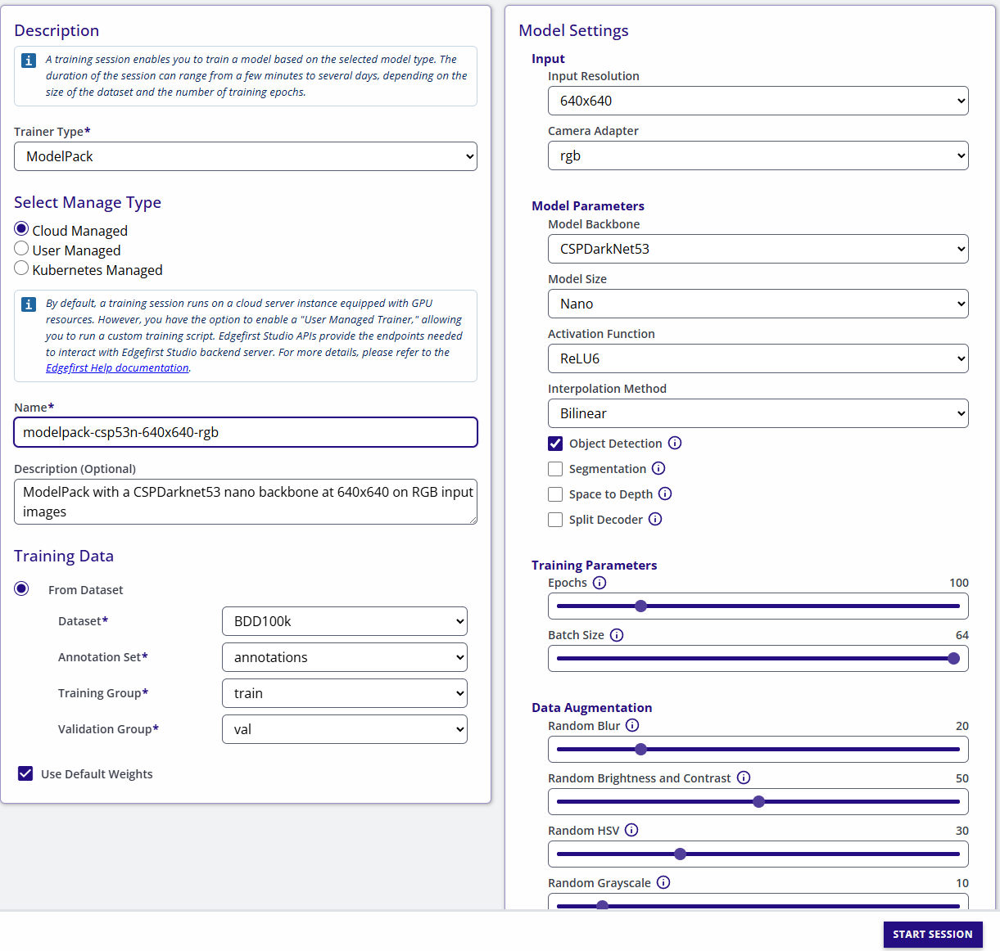
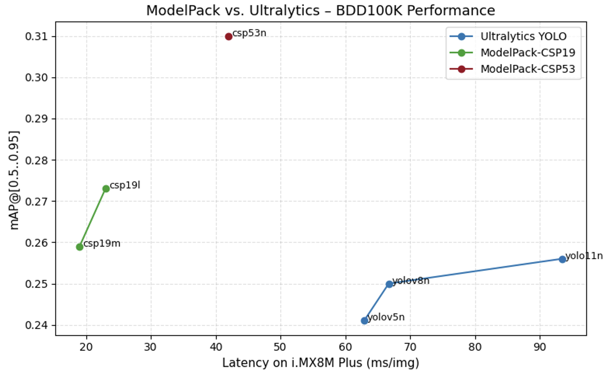

# An Edge-Oriented Solution for Diverse Driving Object Detection

## Abstract

This paper presents an evaluation of ModelPack, an edge-optimized object detection framework, on the BDD100K dataset. Unlike large-scale detectors such as YOLOv5, YOLOv8, and YOLOv11, ModelPack architectures are designed for resource-constrained embedded devices, emphasizing real-time inference and energy efficiency. Using the standard BDD100K detection benchmark, we compare several ModelPack variants based on CSPDarknet backbones. The modelpack-csp53-nano-640x640-rgb model achieved 0.525 mAP@0.5 and 0.31 mAP@[0.5:0.95], outperforming YOLOv5n, YOLOv8n, and YOLOv11n baselines (0.436–0.449 mAP@0.5). These results demonstrate that lightweight ModelPack configurations can rival or exceed the accuracy of mainstream detectors while being substantially faster and more deployable on edge devices.

## 1. Introduction

Autonomous-driving perception systems require efficient yet accurate visual recognition models. Large networks such as YOLOv5 [1], YOLOv8 [2], and YOLOv11 [3] achieve strong accuracy but are often computationally expensive for embedded platforms. To address this limitation, ModelPack introduces a modular training and deployment framework optimized for edge inference using compact CSP-based architectures.

BDD100K [4] provides a diverse benchmark of 100 K driving videos and 10 heterogeneous perception tasks including object detection, lane marking, and tracking. Its environmental variability and large scale make it a standard testbed for evaluating generalization under real-world conditions. Previous studies such as Woo et al. (2022) [5] trained YOLOv4 on BDD100K and reported mAP@0.5 = 48.8 %, while Chen et al. (2023) [6] enhanced YOLOv5 with BiFPN + CBAM modules to improve mAP by 1.6 %. However, these architectures remain large for embedded deployment.

In contrast, ModelPack employs parameter-efficient CSPDarknet19/53 variants with reduced channel width, mixed-precision training, and lightweight detection heads, enabling competitive accuracy with a fraction of the parameters.

## 2. Dataset

The Berkeley DeepDrive 100K (BDD100K) dataset [4] is one of the most comprehensive benchmarks for perception in autonomous driving. It was released by UC Berkeley to support heterogeneous multitask learning, providing a unified dataset for object detection, lane marking, drivable area segmentation, tracking, and semantic segmentation.

BDD100K consists of 100 000 driving video clips, each approximately 40 seconds long, collected via crowdsourcing from more than 50 000 rides across major U.S. cities including New York and San Francisco. The videos capture a wide range of times of day, weather conditions, and road environments such as city streets, highways, and residential areas.

Each video is recorded at 720p resolution (1280 × 720) and 30 FPS, with synchronized GPS/IMU metadata, providing both spatial and temporal diversity that reflects real-world driving scenarios. This diversity makes BDD100K particularly challenging and valuable for evaluating the generalization capabilities of edge-optimized detectors such as ModelPack.

### 2.1 Main Tasks

BDD100K provides annotations for ten vision tasks designed to represent the full spectrum of perception complexity in autonomous systems:

| Task                                        | Description                                                                            |
| :------------------------------------------ | :------------------------------------------------------------------------------------- |
| Image Tagging                               | Classification of weather, scene type, and time of day (e.g., clear, rainy, night).    |
| Object Detection                            | Bounding-box annotations for common traffic objects (10 categories).                   |
| Lane Marking                                | Detection of lane boundaries with attributes (continuity, color, direction).           |
| Drivable Area Segmentation                  | Binary segmentation for directly and alternatively drivable regions.                   |
| Semantic Segmentation                       | Pixel-level annotation for 40 classes including vehicles, infrastructure, and terrain. |
| Instance Segmentation                       | Fine-grained object masks for 10 K sampled frames.                                     |
| Multiple Object Tracking (MOT)              | Temporal tracking of 130 K identities across 1 600 videos (≈ 3.3 M boxes).             |
| Multi-Object Tracking & Segmentation (MOTS) | Joint object segmentation and tracking across 90 videos.                               |
| Domain Adaptation                           | Domain-specific training splits (e.g., city vs. non-city, day vs. night).              |
| Imitation Learning                          | Trajectory-based supervision using GPS/IMU and driver behavior logs.                   |

### 2.2 Object Detection Classes

The detection subset includes 10 object categories commonly observed in road scenes:

| Category      | Description                                  |
| :------------ | :------------------------------------------- |
| Car           | Passenger vehicles of various sizes.         |
| Bus           | Large public transport vehicles.             |
| Truck         | Heavy-duty or delivery vehicles.             |
| Person        | Pedestrians.                                 |
| Rider         | People riding bicycles or motorcycles.       |
| Bike          | Bicycles.                                    |
| Motor         | Motorcycles or scooters.                     |
| Traffic Light | Street lights in active states.              |
| Traffic Sign  | Road and directional signs.                  |
| Train         | Rail vehicles in intersections or crossings. |

### 2.3 Data Splits and Diversity

The BDD100K detection dataset is divided into:

- 70 000 images for training,

- 10 000 images for validation, and

- 20 000 images for testing.

Image tagging metadata (weather, scene, time) further enhances diversity:

- Weather: clear (38 %), overcast (21 %), rainy (17 %), cloudy (14 %), foggy/snowy (10 %).

- Time: day (49 %), night (51 %).

- Scene types: city street (42 %), residential (27 %), highway (20 %), tunnel/parking/gas (< 10 %).

Such heterogeneity makes BDD100K more representative of real-world driving than previous datasets like KITTI or Cityscapes, which are geographically limited. For ModelPack, this diversity provides a rigorous test of robustness and feature generalization under changing illumination, weather, and occlusion—conditions directly relevant to embedded perception in production vehicles.

## 3. ModelPack

ModelPack is a modular deep-learning framework developed for edge-optimized computer vision. Built on Keras 3.x and the Functional API, it provides a unified environment for training, evaluating, and deploying object detection, segmentation, and multitask models on embedded devices such as NPUs, Jetson platforms, and EdgeTPUs. The framework is centered around reusable building blocks—Convolutional, Residual, CSP, and Spatial Pyramid Pooling (SPP)—that can be iteratively combined to construct scalable backbones. Unlike YOLOv5, which employs a fixed CSPDarknet53 variant augmented with custom detection and neck layers, ModelPack generalizes the YOLOv4 CSP19 and CSP53 backbones using a compound-scaling strategy inspired by MobileNet and EfficientDet. This approach systematically adjusts both the network width (number of filters) and depth (number of blocks) to create balanced nano, small, medium, and large variants, optimized for different resource and performance targets. Additionally, ModelPack extends the original design with native non-squared input support, mixed-precision training, and standardized export flows to ONNX and TFLite, enabling seamless transition from research to real-time deployment while maintaining high accuracy under strict memory and latency constraints.

ModelPack has evolved through multiple real-world deployments, reflecting a continuous process of refinement across diverse industries. It has been applied in automotive systems, environmental monitoring, and agricultural robotics, where edge-deployed vision models must operate reliably under constrained hardware and diverse environmental conditions. Beyond object detection and semantic segmentation, ModelPack has been extended to support additional perception tasks such as head-pose estimation, debris recognition at high input resolution (4k), and vegetation analysis. These cross-domain applications have shaped ModelPack into a robust, production-ready ecosystem—one designed not just for benchmark performance, but for reliability, portability, and energy efficiency in real embedded environments.

### 3.1 Training Configuration and Cloud Support

ModelPack is fully integrated into EdgeFirst Studio, an end-to-end development platform that provides a graphical interface for training, quantizing, and deploying vision models to edge hardware. Through EdgeFirst Studio, users can configure ModelPack architectures, monitor training progress, and export models directly to optimized runtime packages without writing code. This integration bridges research and production by combining ModelPack’s flexible Keras foundation with EdgeFirst’s deployment automation, enabling developers to prototype, benchmark, and deliver edge-ready models in a unified workflow.

!!! info "Hyperparamters"
    ModelPack implements AdamW optimizer by default with a WarmUp Cosine decay strategy that is configured depending on the dataset size.

## 4. Experimental Results

To evaluate ModelPack’s performance on real-world driving data, we trained and compared multiple architectures using the BDD100K object detection benchmark. All models were trained for 100 epochs with default hyperparameters, standard data augmentation, and an input resolution of 640×640 RGB. The training followed identical optimization settings across frameworks to ensure a fair comparison—using AdamW optimizer, cosine learning-rate decay, and batch size 64.

We benchmarked ModelPack against Ultralytics YOLO models (YOLOv5n, YOLOv8n, and YOLOv11n) using the same dataset splits (70K training, 10K validation, 20K test). The evaluation metrics include mAP@0.5 and mAP@[0.5:0.95], reported on the BDD100K validation set.

**ONNX Evaluation metrics: FP32**

| Model                                | mAP@0.5   | mAP@[0.5:0.95] |
| ------------------------------------ | --------- | -------------- |
| modelpack-csp19-medium-640x640-rgb   | 0.466     | 0.259          |
| modelpack-csp19-large-640x640-rgb    | 0.479     | 0.273          |
| **modelpack-csp53-nano-640x640-rgb** | **0.525** | **0.310**      |
| yolov5n-det-640x640-rgb              | 0.443     | 0.241          |
| yolov8n-det-640x640-rgb              | 0.436     | 0.250          |
| yolo11n-det-640x640-rgb              | 0.451     | 0.256          |

ModelPack consistently outperformed the reference Ultralytics baselines across both IoU thresholds, particularly in the CSP53-nano configuration, which achieved the highest accuracy while maintaining a small footprint (≈2.7M parameters). These results indicate that ModelPack’s compound-scaled backbones and efficient CSP/SPP2 designs achieve better feature reuse and gradient flow than traditional YOLO variants.

Notably, despite having similar or fewer parameters, ModelPack demonstrated higher localization precision and class confidence in dense or low-light scenes—conditions that commonly challenge BDD100K-trained models. The results confirm that ModelPack’s architectural regularization and multi-scale feature aggregation yield superior detection performance while remaining well-suited for edge-device deployment.

### 4.1 Inference Performance on i.MX 8M Plus

To assess deployability on embedded platforms, all trained models were quantized to INT8 and benchmarked on an NXP i.MX 8M Plus with its integrated NPU (2.3 TOPS). ModelPack demonstrated a significant efficiency advantage, with inference latencies well below those of comparable YOLO architectures:

| Model                        | Avg. Inference Time (ms) | Relative Speedup          | mAP@[0.5] int8  | mAP@[0.5:0.95] int8  |
| ---------------------------- | ------------------------ | ------------------------- | -------------------- | -------------------- |
| modelpack-csp19-medium       | **19 ms**                | **3.3× faster**           |      0.409          |   0.199    |
| modelpack-csp19-large        | **23 ms**                | **≈3× faster**            |      0.412          |   0.201    |
| modelpack-csp53-nano         | **42 ms**                | **≈1.6× faster**          |      0.464          |   0.236    |
| yolov5n                      | 62.9 ms                  | baseline                         |       —             |    —       |
| yolov8n                      | 66.7 ms                  | —                         |       —             |    —       |
| yolov11n                     | 93.4 ms                  | —                         |       —             |    —       |

!!! note "Ultralytics Quantization"
    We are working on having ultralytics models properly quantized on BDD100k. 
    Results are going to be published once the quantization issue gets resolved

!!! info "Relative Speed"
    Relative speedup is computed relative to the fastest model: yolov5n

These results confirm that ModelPack maintains higher accuracy at substantially lower latency, achieving up to 3.5× faster inference than standard YOLO models on the same hardware. The combination of lightweight backbones, efficient feature aggregation, and quantization-aware design makes ModelPack particularly well suited for real-time edge deployment on constrained processors such as the i.MX 8M Plus.

## Conclusions

This study demonstrates the effectiveness of the ModelPack framework as a robust and efficient alternative to existing YOLO-based detectors for real-time perception on embedded platforms. By leveraging modular CSP-based backbones, compound scaling, and lightweight architectural design, ModelPack achieves higher detection accuracy and significantly lower latency than comparable Ultralytics models under identical training conditions. On the BDD100K benchmark, ModelPack-CSP53-nano reached the highest mAP@0.5 of 0.525, surpassing YOLOv5n, YOLOv8n, and YOLOv11n while maintaining up to 1.6× faster inference on the i.MX 8M Plus NPU. Smaller ModelPack versions (csp19-medium and csp19-large) achieve similar accuracy than YOLO models while the speed is up to 3.5x faster. These results confirm that ModelPack’s design offers a powerfull feature extraction mechanism, along with regularized activations and higly optimized loss functions that improves the speed-accuracy trade-off ideally suited for edge-deployed intelligent vision systems. Beyond its empirical performance, ModelPack’s integration within EdgeFirst Studio bridges research and production, enabling rapid model development and deployment pipelines across automotive, environmental, and agricultural applications. Future work will extend ModelPack toward unified multi-task learning and adaptive runtime scheduling for next-generation embedded AI devices.

## References

1. Bochkovskiy, A. et al. YOLOv4: Optimal Speed and Accuracy of Object Detection. 2020.

2. Jocher, G. et al. YOLOv5 Documentation (2023).

3. Ultralytics YOLOv11 (2024).

4. Yu, F. et al. BDD100K: A Diverse Driving Dataset for Heterogeneous Multitask Learning. CVPR 2020.

5. Woo, J. et al. A Study on Object Detection Performance of YOLOv4 for Autonomous Driving of Tram. Sensors 2022 22(9026).

6. Chen, H. et al. Enhanced YOLOv5: An Efficient Road Object Detection Method. Sensors 2023 23(8355).
