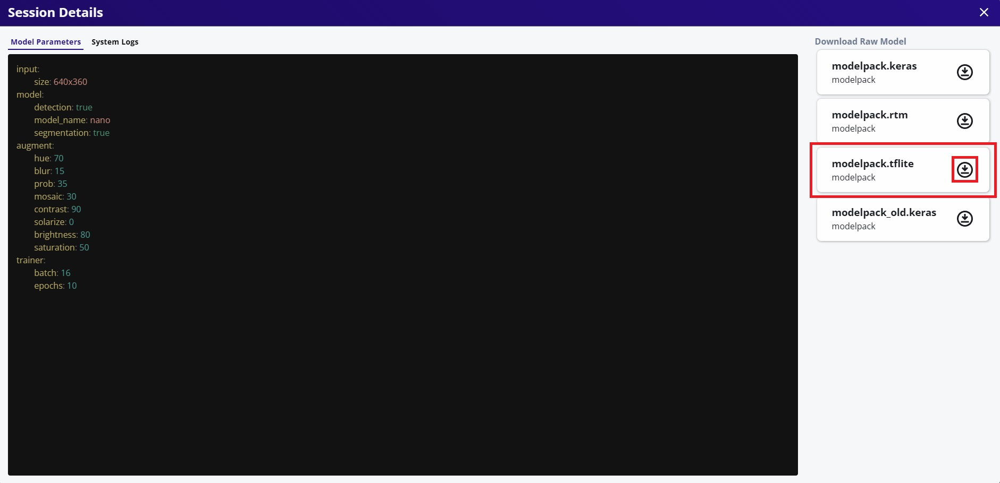
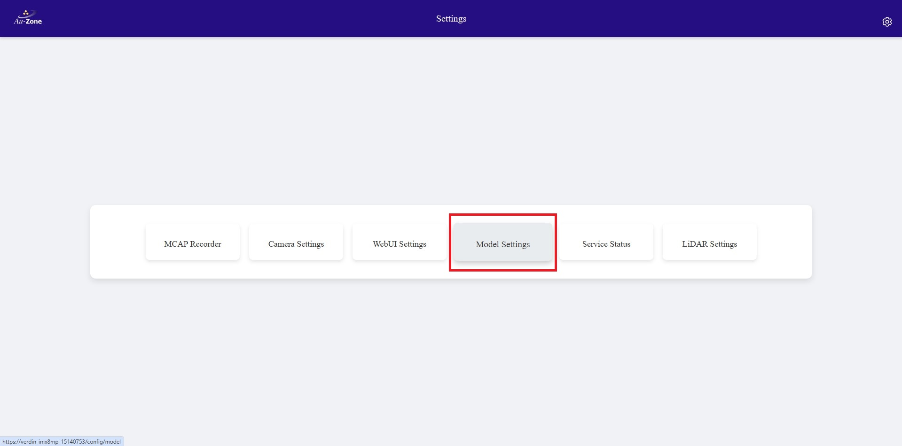
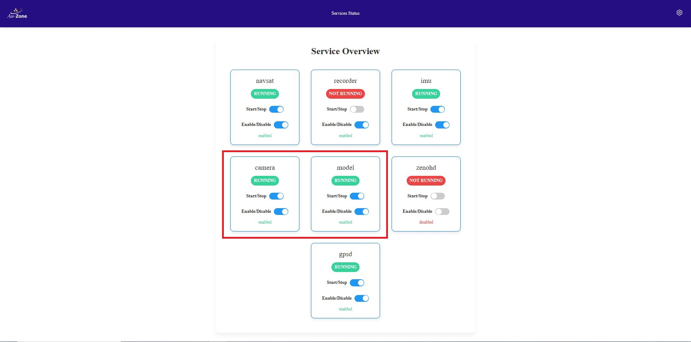
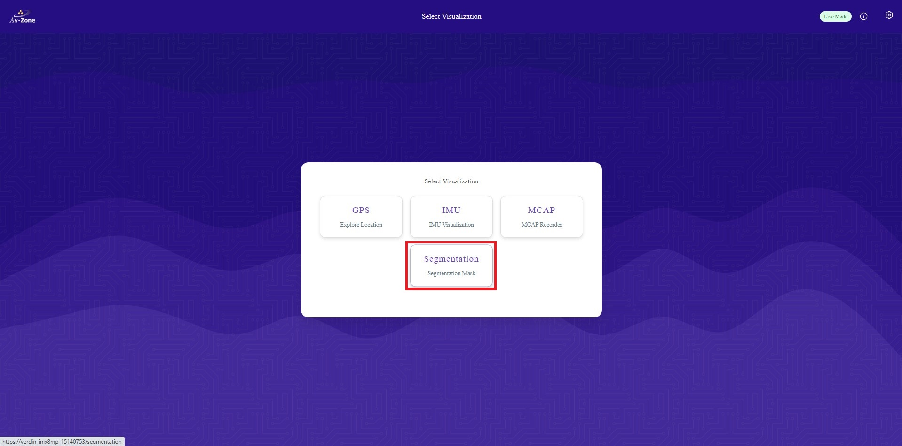

# Deploying Modelpack

Now that you have [validated your Vision Model](validation.md), this page will provide a walk-through for deploying Vision models in an [EdgeFirst Platform](../../platforms/index.md).

## Download the Model

Download the model from EdgeFirst Studio into the EdgeFirst Platform. There are two methods for downloading the model.

### Download and SCP

As mentioned under the [Trained Models](training.md#trained-models) section, the trained models can be downloaded by clicking the "View Session Details" button.

<figure markdown="span">
{ align=center }
<figcaption>Training Session Attributes</figcaption>
</figure>

This will open the session details and the models are listed on the right with downward arrow buttons that downloads the models to your PC. In this example, we will be deploying the TFLite model on device.

<figure markdown="span">
{ align=center }
<figcaption>Session Details</figcaption>
</figure>

Once the model has downloaded to your PC, you can SCP the model to the EdgeFirst Platform by using this command template.

```shell
scp <path to the downloaded TFLite model> <destination path>
```

An example command is shown below.

```shell
scp modelpack.tflite torizon@verdin-imx8mp-15140753:~
```

For more information, please visit [Secure Copy](../../platforms/ssh.md#secure-copy).

### Download using the Client

This method expects you to have connected to the EdgeFirst Platform via [SSH](../../platforms/ssh.md). The [EdgeFirst Client](../../perception/studio.md) will already come pre installed in the device. You can verify the installation with the client version command.

```shell
$ edgefirst-client version
Deep View Enterprise 3.7.0e
```

Next login to the client with the command.

```shell
$ edgefirst-client login
Username: user
Password: ****
```

You will now be able to download the model on the device by the download-artifact command.

```shell
edgefirst-client download-artifact <session ID> <model name>
```

The `download-artifact` expects three arguments.

* session ID: Pass the trainer or validation session ID associated with the models.
* model name: Pass the specific model that will be downloaded to the device.
* download path (optional): Specify the path to the download the model. If not provided, it will download to the current working directory.

Please see [EdgeFirst Client](../../perception/studio.md) For more information on using the client via command line.

## Visit the WebUI service

Visit the WebUI service by entering the URL `https://<hostname>/` in your browser.

!!! note
    Replace <hostname> with the hostname of your device.

You should be greeted with the following page.

<figure markdown="span">
{ align=center }
<figcaption>WebUI</figcaption>
</figure>

For more information, please see the [Web UI Walkthrough](../../platforms/walkthrough.md).

## Update the Model Path 

Once you are in the WebUI main page, specify the path to the model in the device.

Click the settings icon on the top right corner of the page.

<figure markdown="span">
{ align=center }
<figcaption>Settings</figcaption>
</figure>

Select "Model Settings".

<figure markdown="span">
{ align=center }
<figcaption>Model Settings</figcaption>
</figure>

Configure the model path as specified under "MODEL:". Once configured, click "Save Configuration" to save your changes.

<figure markdown="span">
{ align=center }
<figcaption>Model Path</figcaption>
</figure>

## Enable and Start the Camera and Model Services

Ensure that the Camera and Model services are enabled. To verify, go back to the settings page and click on the "Service Status" button.

<figure markdown="span">
{ align=center }
<figcaption>Service Status</figcaption>
</figure>

You will be greeted with the "Service Overview" page. Ensure that the "camera" and "model" services are enabled and running by toggling the sliders as shown.

<figure markdown="span">
{ align=center }
<figcaption>Service Overview</figcaption>
</figure>

## Run the Segmentation App

Once the model and camera services are enabled, go back to the main page and then select the "Segmentation" application as shown.

<figure markdown="span">
{ align=center }
<figcaption>Segmentation App</figcaption>
</figure>

This will run inference on the model specified to generate segmentation masks on the detected objects. In this case, the model is identifying people in the video feed.

<figure markdown="span">
{ align=center }
<figcaption>Segmentation Sample 1</figcaption>
</figure>

<figure markdown="span">
{ align=center }
<figcaption>Segmentation Sample 2</figcaption>
</figure>