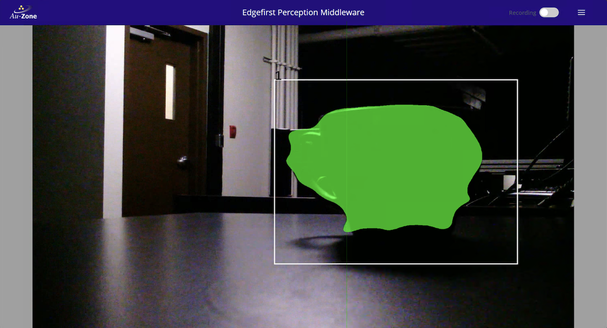
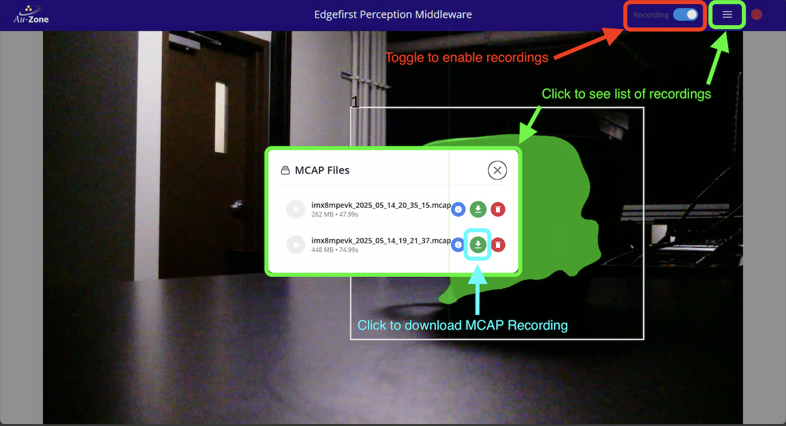

# Deploying to Embedded Targets

This guide will walk you through installing the EdgeFirst Middleware in "user-mode" on a target device.  If you're using a Maivin or Raivin refer to the [Deploying to the Maivin](maivin.md) guide instead.


## Installation

!!! warning

    This workflow is currently only supported on NXP i.MX 8M Plus EVK platforms running the [NXP Yocto BSP](https://www.nxp.com/design/design-center/software/embedded-software/i-mx-software/embedded-linux-for-i-mx-applications-processors:IMXLINUX).

The EdgeFirst Middleware can be easily installed on embedded targets using the Python package manager to install the middleware binaries and sample models.  Simply run the following command to install the middleware.

```bash
pip3 install edgefirst
```

This can also be done through a Python virtual environment to keep all the packages in a user-defined location.

```bash
pip3 install virtualenv
python3 -m virtualenv venv
source venv/bin/activate
pip3 install edgefirst
```

## Usage

Once installed, the applications can be launched using the `edgefirst` launcher which handles running the various services.  The applications can also be run directly, for example `edgefirst-camera` to run the camera service.  The launcher is an optional but convenient way to run all the applications in "user-mode" in contrast to having the middleware integrated into the system as "system-mode" where the applications will be managed by systemd.

### Live Camera Mode

The live camera mode is launched using the following command.  By default it will run a person detection and segmentation model, if you wish to run your own model simply use the `--model mymodel.tflite` parameter and provide the path to your TFLite model.  Currently only ModelPack for Detection & Segmentation is supported by the launcher.

```bash
edgefirst live
```

!!! note

    The live camera mode uses the camera found at `/dev/video3` by default.  If your camera is on another device entry you can use the `--camera /dev/videoX` parameter to select the correct camera, replace `X` with the correct camera index.

Once launched, you can access the live camera view and model overlays by pointing your browser to your device's IP address using `https://MY_DEVICE_IP`.  You'll see something like the following.



If testing a model trained using a few images collected on a phone you'll notice the performance is probably poor.  With small datasets it is especially important to include samples captured with the target device's camera which is luckily easy to do from the web interface.  There is a toggle button in the top-right of the screen which will start an MCAP recording.



You can also access the MCAP recordings from the working directory where the `edgefirst live` command was run.

Once you have your MCAP download to your PC you may upload it to EdgeFirst Studio to annotate and further train your model.  Uploading MCAP recordings is done through the [Snapshot Dashboard](../../../studio/snapshots.md).

### Services

The `edgefirst` launcher is the preferred method of launching multiple services as user-mode whereas system-mode would prefer using systemd to manage services.  The services are described below which is intended for more advanced manual configuration of the services. 

#### Camera Service

The Camera Service or EdgeFirst Camera Publisher implements the standard ROS2 camera interfaces plus a proprietary extension to provide DMA support.  As with all EdgeFirst services the ROS2 interfaces are implemented over Zenoh and can plug into a true ROS2 setup using the zenoh-bridge-dds service.

Deploy this service in your target with the following command.  The `&` parameter will run the service in the background allowing you to continue using the terminal.  We also specify `--mirror none` to avoid any horizontal or vertical flip to the camera feed.  By default, the camera is flipped both horizontally and vertically to compensate for the orientation of the Maivin camera which is installed upside-down. 

```shell
edgefirst-camera --h264 --mirror none &
```

The command below lists all available parameters from this service.

```shell
edgefirst-camera -h
```

!!! info

    To bring background executed commands to the foreground, enter `fg` allowing you to exit the program via CTRL-C.

#### Model Service

The Model Service or Maivin Detection Service deploys a ModelPack Detection and Segmentation model for inference to output bounding boxes or segmentation masks on the detected objects in the camera feed. 

Deploy this service in your target with the following command.  In this command specify the path to the model denoted by `--model`.  We recommend using a quantized TFLite model in embedded targets.

```shell
edgefirst-model --model mymodel.tflite &
```

The command below lists all available parameters from this service.

```shell
edgefirst-camera -h
```

!!! warning

    The camera service needs to be running in the background as described [above](#camera-service) to fetch camera frames for model inference. 

#### Webserver Service

The Webserver Service or the EdgeFirst Web UI Server deploys a webserver on target to provide a GUI that's accessible using the target's IP address as the endpoint on a browser `https://MY_DEVICE_IP`.  The GUI would provide visualizations from the camera feed and model inferences and exposed the features for recording an MCAP, downloading an MCAP locally, deleting an MCAP, or listing the recorded MCAPs as shown in the [Live Camera Mode](#live-camera-mode) section.

If a virtual environment was created, deploy this service using the command below.  The `--docroot` directory needs to be specified.

```shell
edgefirst-websrv --docroot venv/share/edgefirst/webui
```

If a virtual environment was not created, deploy this service using the command below.

```shell
edgefirst-websrv --docroot /usr/share/edgefirst/webui/
```
