# Deploying to the Maivin

Now that you have validated your Vision Model from either a [managed](../validation/managed.md) or [user-managed](../validation/user_managed.md) session, this guide will walk you through deploying Vision models in a [Maivin Platform](../../../platforms/index.md).  

**Maivin 1** | **Maivin 2** 
:------------------:|:------------------:
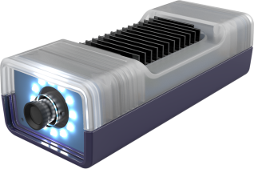 |  

This guide will showcase two methods of deploying the model.

1. [Live View (Segmentation App)](#live-view-segmentation-app)
2. [MCAP Recording](#record-mcap)

## Download the Model

First download the model from EdgeFirst Studio into the Maivin Platform.  There are two methods for downloading the model.  The first method is to download the model from EdgeFirst Studio and then SCP the model file to the Maivin Platform.  The second method is to use the EdgeFirst Client to download the model directly in the device.

### Download and SCP

As mentioned under the [Training Outcomes](../training.md#training-outcomes) section, the trained models can be downloaded by clicking the "View Additional Details" button on the training session card in EdgeFirst Studio. 

<figure markdown="span">
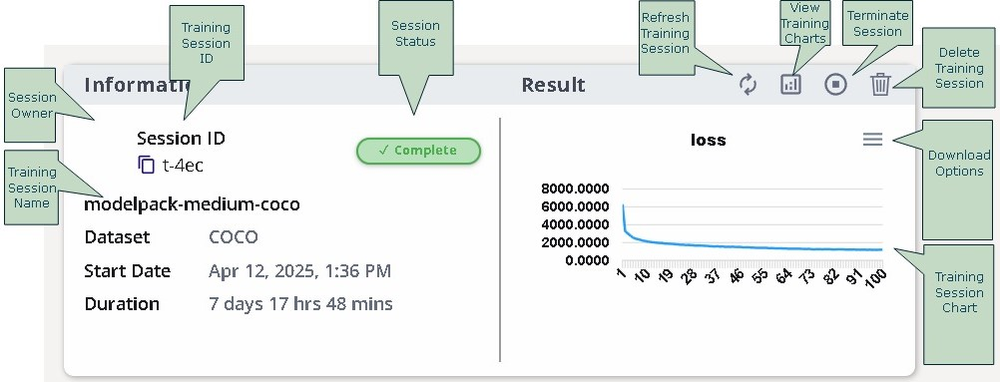{ align=center }
<figcaption>Training Session Attributes</figcaption>
</figure>

This will open the session details and the models are listed under the "Artifacts" tab as shown below.  Click on the downward arrow indicated in red to download the models to your PC.  In this example, you will be deploying the TFLite model in the Maivin.

| Session Details                                                | Artifacts                                                                     |
|----------------------------------------------------------------|-------------------------------------------------------------------------------|
| 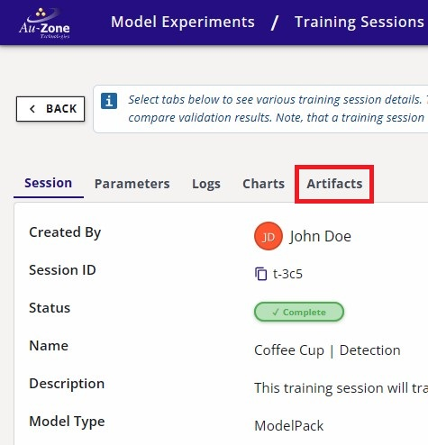 |  | 

Once the model is downloaded in your PC, you can `SCP` the model to the Maivin by using this command template.

```shell
scp <path to the downloaded TFLite model> <destination path>
```

An example command is shown below.

```shell
scp modelpack.tflite torizon@verdin-imx8mp-15140753:~
```

For more information, please visit [Secure Copy](../../../platforms/ssh.md#secure-copy).

### Download using the Client

This method expects you to have already connected to the Maivin via [SSH](../../../platforms/ssh.md).  The [EdgeFirst Client](../../../perception/studio.md) can be installed via `pip3 install edgefirst-client`.  You can verify the installation with the client version command.

```shell
$ edgefirst-client version
EdgeFirst Studio Server: 3.7.5-def7735 Client: 1.3.4
```

Next login to the client with the command.

```shell
$ edgefirst-client login
Username: user
Password: ****
```

You can download the model on the device using the `download-artifact` command as shown below.

```shell
edgefirst-client download-artifact <session ID> <model name>
```

The `download-artifact` expects three arguments.

* session ID: Pass the integer trainer or validation session ID associated with the models.
* model name: Pass the specific model that will be downloaded to the device.  Usually this is `modelpack.tflite`.
* download path (optional): Specify the path to download the model.  If not provided, it will download to the current working directory.

You can find more information on using the [EdgeFirst Client](../../../perception/studio.md) in the command line.

## Visit the Web UI Service

Use your browser to connect to the Web UI of the remote device, enter the following URL `https://<hostname>/`.

!!! note
    Replace `<hostname>` with the hostname of your device.

You will be greeted with the Maivin [Web UI Main Page](../../../platforms/walkthrough.md) page.

<figure markdown="span">
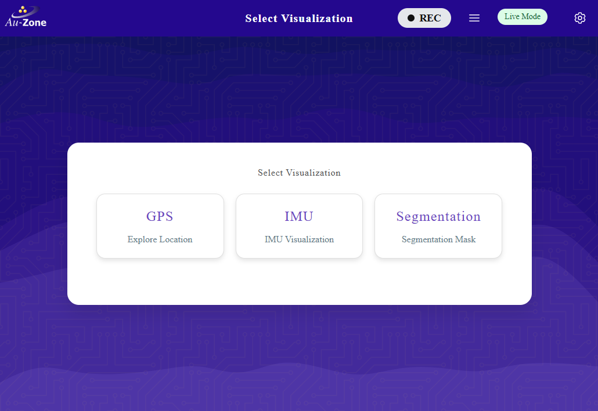{ align=center }
<figcaption>Web UI Main Page</figcaption>
</figure>

For more information, please see the [Web UI Walkthrough](../../../platforms/walkthrough.md).

## Update the Model Path 

Next you will need to specify the path to the model in the device.  You can either update the model path in the Web UI or via the command line.

!!! note "Configure Model Settings"
    Whenever a new model has been updated, ensure that the [model settings](../../../platforms/configuration.md#model-configuration) such as the score and the IoU thresholds are ideally set for this model. 

### Web UI

Once you are in the Web UI main page, you can specify the path to the model by following the steps below.

Click the settings icon on the top right corner of the page.

<figure markdown="span">
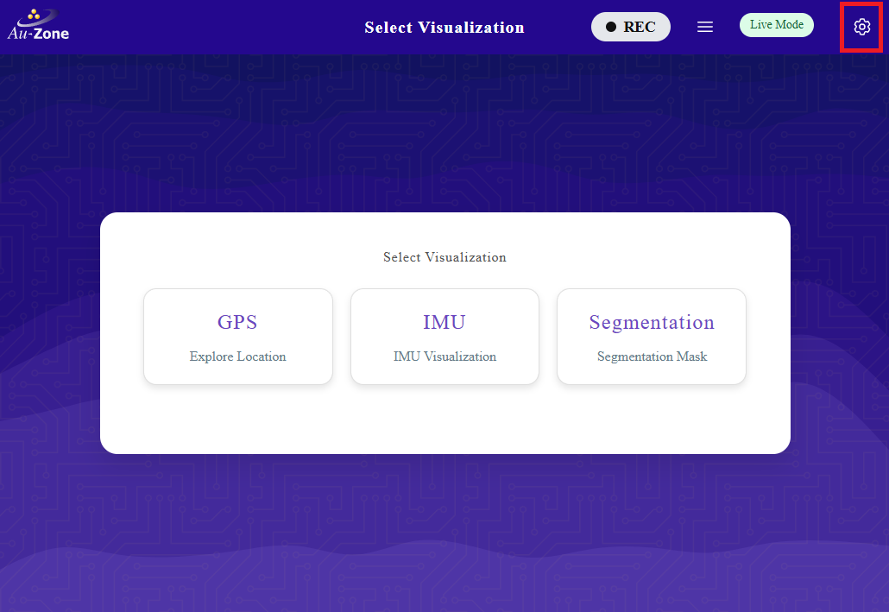{ align=center }
<figcaption>Settings</figcaption>
</figure>

Select "Model Settings".

<figure markdown="span">
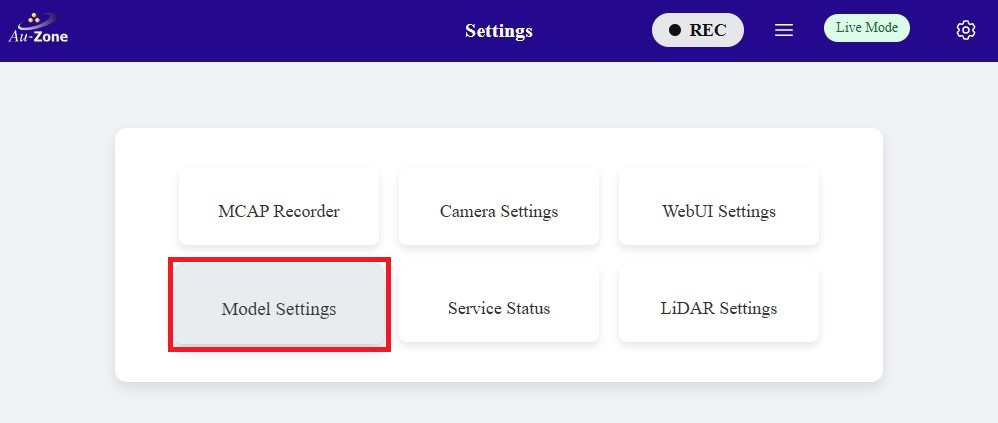{ align=center }
<figcaption>Model Settings</figcaption>
</figure>

Configure the path to the model in your device as specified under "MODEL:".  Once configured, click "Save Configuration" to save your changes.

<figure markdown="span">
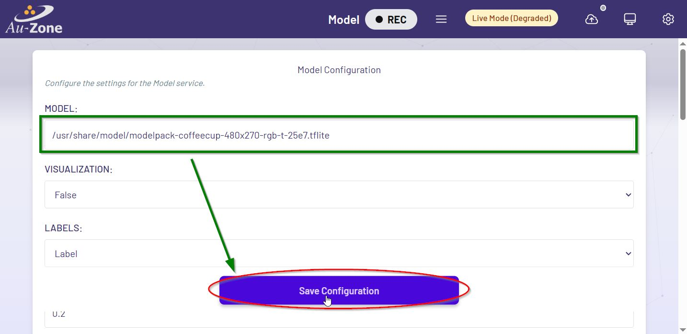{ align=center }
<figcaption>Model Path</figcaption>
</figure>

### Command Line

To update the model path using the command line in the device, edit the following file using `sudo vi /etc/default/model`.

Next, you will see the file with the following contents.

```vi
# This is the configuration file for the model systemd service file.  When
# running systemctl start detect the service will use these configurations.
# If running model directly, you must continue to use the command-line options.

# A model is required for the model application. This can be a segmentation model
# and/or a detection model.
MODEL = "path/to/mymodel.tflite"
```

Edit the following line `MODEL = "path/to/mymodel.tflite"` to point to the specific path to your model.  To edit, press `i` to enter into "Insert Mode".  You should now be able to edit the lines.  To exit "Insert Mode", press the ESC key on your keyboard.  Next save and exit the file by typing `:wq` on your keyboard.  More examples for using `vi` can be found [here](https://coderwall.com/p/adv71w/basic-vim-commands-for-getting-started).

Once the path to the model has been updated, restart the model service using `sudo systemctl restart model`.

## Enable and Start the Services

Once the model path in the device is specified, ensure that the Camera, Model, and Recorder services are enabled.  To verify, go back to the settings and click on the "Service Status" button.

<figure markdown="span">
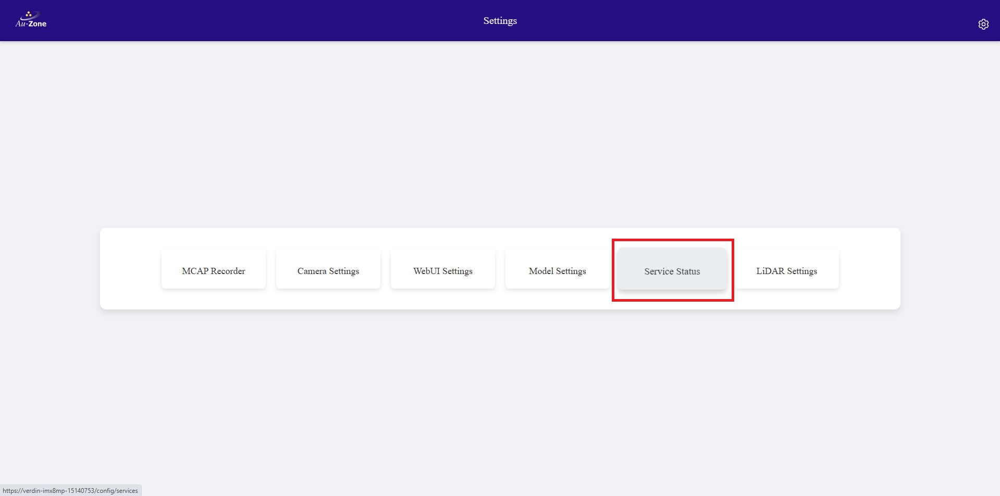{ align=center }
<figcaption>Service Status</figcaption>
</figure>

You will be greeted with the "Service Overview" page.  Ensure that the "camera" and "model" services are enabled and running by toggling the "Enable" and "Start" buttons as shown.  Only "Enable" the "recorder" service as shown.  You will be using the recorder service in [MCAP Recording](#record-mcap).

<figure markdown="span">
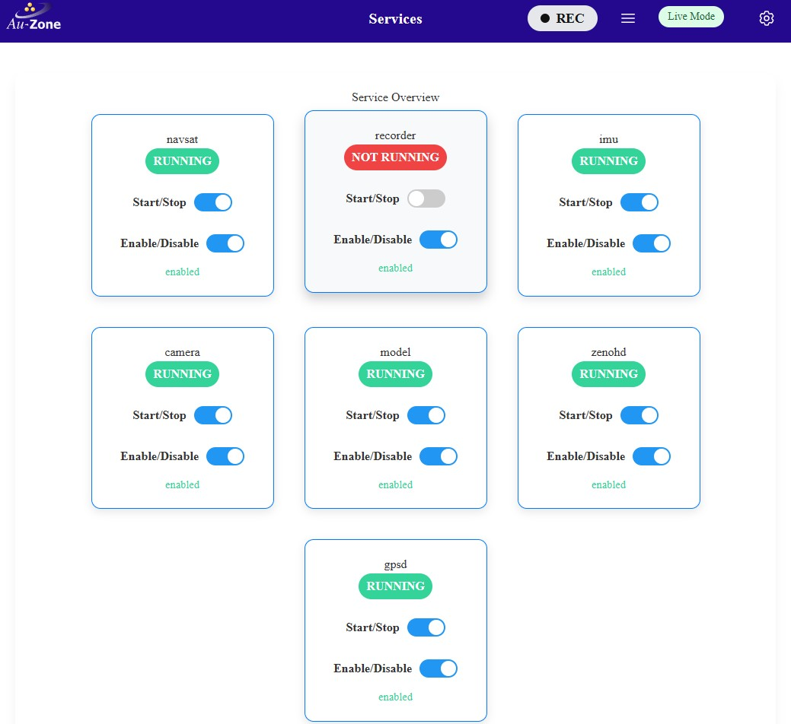{ align=center }
<figcaption>Service Overview</figcaption>
</figure>

## Live View (Segmentation App)

Now you will see live inference of the model in the device.  Once the model and camera services are enabled, go back to the main page and then select the "Segmentation" application as shown.

<figure markdown="span">
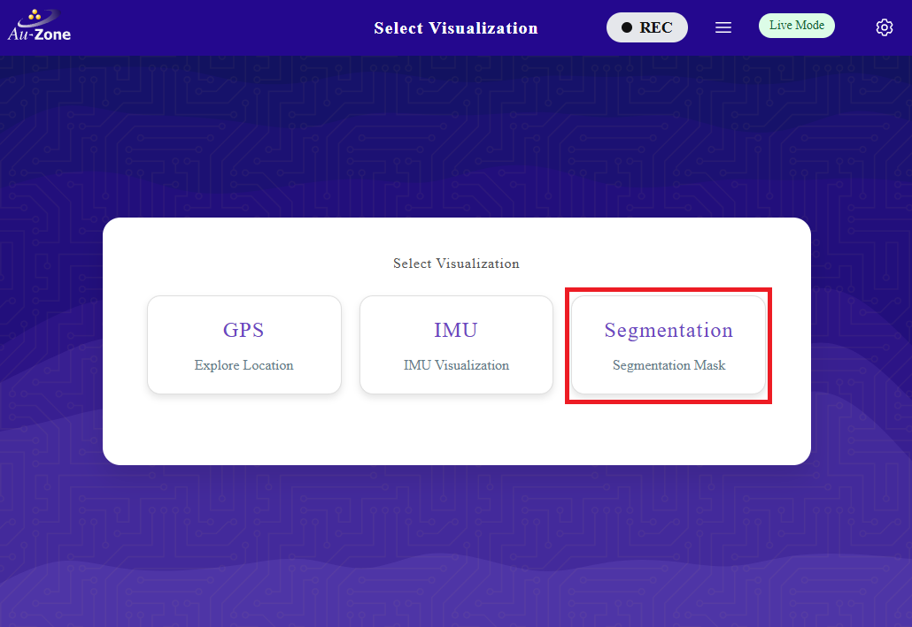{ align=center }
<figcaption>Segmentation App</figcaption>
</figure>

This will run inference on the model specified to generate segmentation masks on the detected objects.  In this case, the model is identifying people in the video feed.  An example is shown below.

<figure markdown="span">
{ align=center }
<figcaption>Sample 1</figcaption>
</figure>

Now that the model has been updated, you can make new recordings using the model's inference and then visualizing the recording using Foxglove Studio.




## Inference Visualization in Foxglove
Once the MCAP recording has been downloaded, you can use Foxglove Studio to see the playback of MCAP recordings and the model inference.  The following preview is a frame from the MCAP with the model inference masks overlaid on top of the video. 

<figure markdown="span">
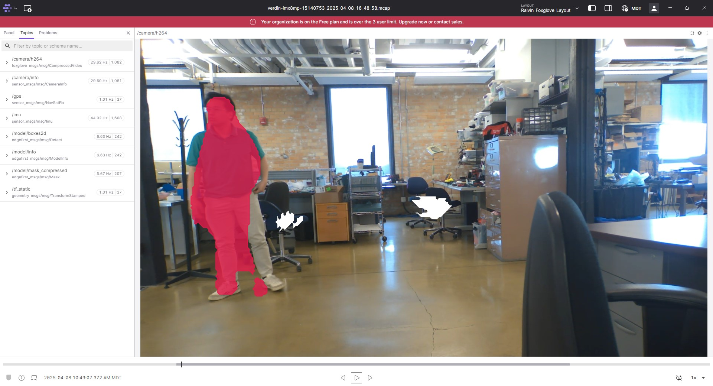{ align=center }
<figcaption>Foxglove Sample 1</figcaption>
</figure>

More information on the MCAP playback is provided in [Foxglove Studio](../../../platforms/foxglove.md).

## Next Steps

In this tutorial, you have fetched the trained and validated model from EdgeFirst Studio, copied the model in the Maivin, configured the Maivin model services, and ran inference on the model in the device.  You have seen the model running live using the Maivin's camera and ran a Maivin MCAP recording to capture the model inference in the frames that can be visualized using Foxglove Studio. 

For more examples on deploying ModelPack in other platforms, see [Model Deployment](../../tutorials/deployment.md).