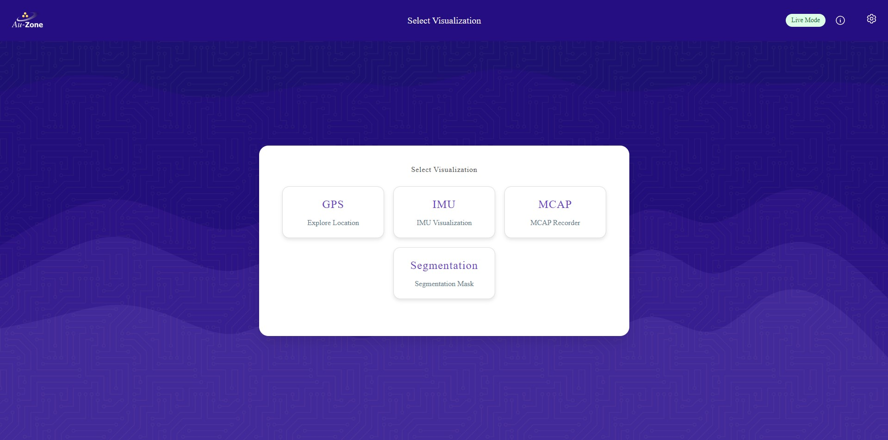
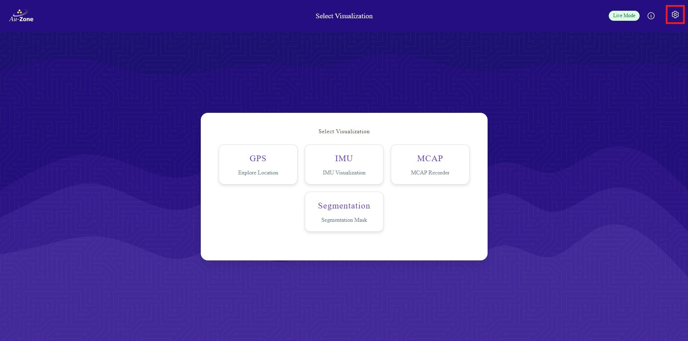
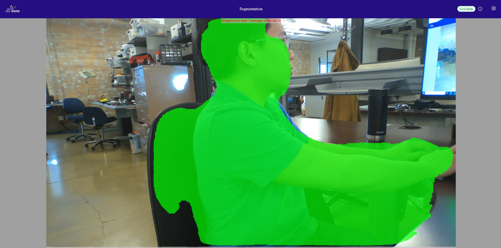
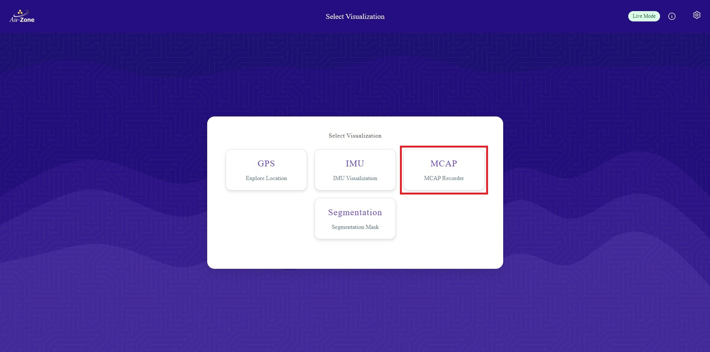

# Deploying in the Maivin

Now that you have [validated your Vision Model](../validation.md), this page will provide a walk-through for deploying Vision models in a [Maivin Platform](../../../platforms/index.md).  This page will showcase two types of deployments.

1. [Live View (Segmentation App)](#live-view-segmentation-app)
2. [MCAP Recording](#mcap-recording)

## Download the Model

First download the model from EdgeFirst Studio into the Maivin Platform.  There are two methods for downloading the model.  The first method is to download the model from EdgeFirst Studio and then SCP the model file to the Maivin Platform.  The second method is to use the EdgeFirst Client to download the model directly in the device.

### Download and SCP

As mentioned under the [Trained Models](../training.md#training-outcomes) section, the trained models can be downloaded by clicking the "View Additional Details" button on the training session card in EdgeFirst Studio. 

<figure markdown="span">
{ align=center }
<figcaption>Training Session Attributes</figcaption>
</figure>

This will open the session details and the models are listed under the "Artifacts" tab as shown below.  Click on the downward arrow indicated in red to download the models to your PC.  In this example, we will be deploying the TFLite model in the Maivin.

| Session Details                                                | Artifacts                                                                     |
|----------------------------------------------------------------|-------------------------------------------------------------------------------|
|  |  | 

Once the model is downloaded in your PC, you can `SCP` the model to the Maivin by using this command template.

```shell
scp <path to the downloaded TFLite model> <destination path>
```

An example command is shown below.

```shell
scp modelpack.tflite torizon@verdin-imx8mp-15140753:~
```

For more information, please visit [Secure Copy](../../../platforms/ssh.md#secure-copy).

### Download using the Client

This method expects you to have already connected to the Maivin via [SSH](../../../platforms/ssh.md).  The [EdgeFirst Client](../../../perception/studio.md) will already come pre installed in the device.  You can verify the installation with the client version command.

```shell
$ edgefirst-client version
EdgeFirst Studio Server: 3.7.5-def7735 Client: 1.3.4
```

Next login to the client with the command.

```shell
$ edgefirst-client login
Username: user
Password: ****
```

You can download the model on the device using the `download-artifact` command as shown below.

```shell
edgefirst-client download-artifact <session ID> <model name>
```

The `download-artifact` expects three arguments.

* session ID: Pass the integer trainer or validation session ID associated with the models.
* model name: Pass the specific model that will be downloaded to the device.  Usually this is `modelpack.tflite`.
* download path (optional): Specify the path to download the model.  If not provided, it will download to the current working directory.

Please see [EdgeFirst Client](../../../perception/studio.md) for more information on using the client via the command line.

## Visit the WebUI Service

Visit the WebUI service by entering the URL `https://<hostname>/` in your browser.

!!! note
    Replace `<hostname>` with the hostname of your device.

You should be greeted with the following page.

<figure markdown="span">
{ align=center }
<figcaption>WebUI</figcaption>
</figure>

For more information, please see the [Web UI Walkthrough](../../../platforms/walkthrough.md).

## Update the Model Path 

Once you are in the WebUI main page, you will need to first specify the path to the model in the device.

Click the settings icon on the top right corner of the page.

<figure markdown="span">
{ align=center }
<figcaption>Settings</figcaption>
</figure>

Select "Model Settings".

<figure markdown="span">
{ align=center }
<figcaption>Model Settings</figcaption>
</figure>

Configure the path to the model in your device as specified under "MODEL:".  Once configured, click "Save Configuration" to save your changes.

<figure markdown="span">
{ align=center }
<figcaption>Model Path</figcaption>
</figure>

## Enable and Start the Services

Once the model path in the device is specifed, ensure that the Camera, Model, and Recorder services are enabled.  To verify, go back to the settings and click on the "Service Status" button.

<figure markdown="span">
{ align=center }
<figcaption>Service Status</figcaption>
</figure>

You will be greeted with the "Service Overview" page.  Ensure that the "camera" and "model" services are enabled and running by toggling the "Enable" and "Start" buttons as shown.  Only "Enable" the "recorder" service as shown.  We will be using the recorder service in [MCAP Recording](#mcap-recording).

<figure markdown="span">
{ align=center }
<figcaption>Service Overview</figcaption>
</figure>

## Live View (Segmentation App)

Now we will demonstrate a live inference of the model in the device.  Once the model and camera services are enabled, go back to the main page and then select the "Segmentation" application as shown.

<figure markdown="span">
{ align=center }
<figcaption>Segmentation App</figcaption>
</figure>

This will run inference on the model specified to generate segmentation masks on the detected objects.  In this case, the model is identifying people in the video feed.  Examples are shown below.

<figure markdown="span">
{ align=center }
<figcaption>Sample 1</figcaption>
</figure>

<figure markdown="span">
{ align=center }
<figcaption>Sample 2</figcaption>
</figure>

## MCAP Recording

Now we will demonstrate running a recording on the device, saving the model inferences, and then visualizing the recording using Foxglove Studio.  Once the model, camera, and recorder services are enabled, go back to the main page and then select the "MCAP" application as shown.

<figure markdown="span">
{ align=center }
<figcaption>MCAP Recorder</figcaption>
</figure>

You will be greeted with the MCAP recording page.

<figure markdown="span">
{ align=center }
<figcaption>MCAP Recording Page</figcaption>
</figure>

Toggle the "Recording" button as shown to start recording the video feed.  To stop the recording, toggle the same button and then the recording will be stored as an MCAP file.

For more information on MCAP recordings, please see the [MCAP Recording Service](../../../platforms/recording.md).

### Inference Visualization in Foxglove

The MCAP recordings are listed under the list of "MCAP Files" which can then be downloaded to your PC.

<figure markdown="span">
{ align=center }
<figcaption>MCAP Files</figcaption>
</figure>

Once the MCAP recording has been downloaded, we can use Foxglove Studio to see the playback of MCAP recordings and the model inference.  The following preview is a frame from the MCAP with the model inference masks overlaid on top of the video. 

<figure markdown="span">
{ align=center }
<figcaption>Foxglove Sample 1</figcaption>
</figure>

More information on the MCAP playback is provided in [Foxglove Studio](../../../platforms/foxglove.md).

In this tutorial, you have fetched the trained and validated model from EdgeFirst Studio, copied the model in the Maivin, configured the Maivin model services, and ran inference on the model in the device.  You have seen the model running live using the Maivin's camera and ran a Maivin MCAP recording to capture the model inference in the frames that can be visualized using Foxglove Studio. 

For examples on deploying ModelPack in other platforms, see [Model Deployment](../../../getting_started/models/deployment.md).