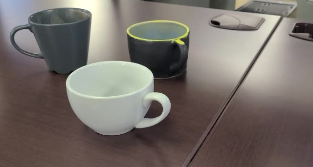
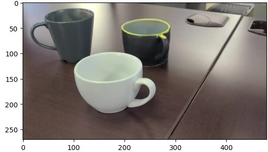
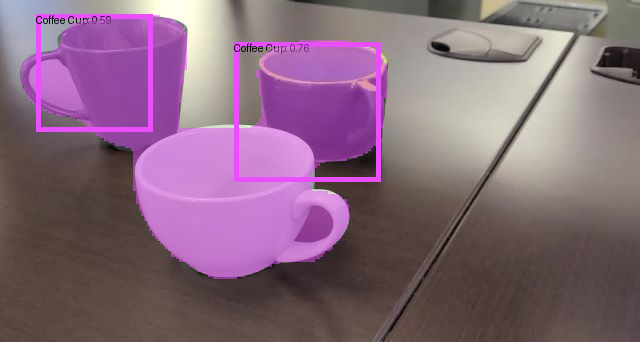
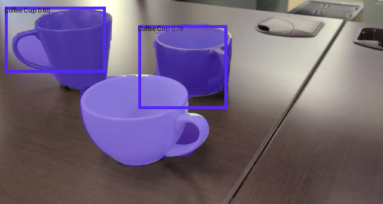

# Deploying in the PC

In this tutorial, we are going to give you the tools needed to run Vision models on a PC for object detection, segmentation, or multitask allowing you to build your own applications in just a few lines of code!

It is important to go through the [User Worklows](../../../getting_started/workflows/index.md#user-journey) first before moving forward with the tutorials in this notebook.  The workflows presented ultimately stop at the the model deployment stages which will be the primary focus of this notebook. 

!!! warning
    The tutorials presented in this notebook requires a trained and validated Vision model. 

!!! info
    The examples provided below are in python showing both ONNX (Float) and TFLite (Quantized) Multitask models which outputs bounding boxes and segmentation masks.

## Requirements

To run the examples, let's first install the following dependencies.

```shell
$ pip install edgefirst-client
$ pip install 'numpy<2.0.0'
$ pip install pillow
$ pip install matplotlib
$ pip install onnxruntime-gpu
$ pip install tflite-runtime
```

## Connect to EdgeFirst Client

First take a look at using [EdgeFirst Client](../../../perception/studio.md) to fetch the model artifacts from EdgeFirst Studio.  Once all the dependencies have been installed, the client needs to be connected to EdgeFirst Studio to fetch the model artifacts to your PC.  Run the following code block below to connect the EdgeFirst Client to the Studio.  Modify the "username" and "password" to be your own.  The code block will execute successfully if the credentials are correct.

```python
from edgefirst_client import Client

username = 'username'
password = 'password'

client = Client()
client.login_sync(username, password)
```

## Retrieve Training Session ID

Once you have connected to EdgeFirst Client, you can find the training session ID that contains the trained model artifacts.  Once you have the training session ID, you can fetch these artifacts from EdgeFirst Studio locally to run model inference in this demo. 

There are two possible ways to get the artifacts from the training session:

1. Manually download `modelpack.onnx` or `modelpack.tflite` and `labels.txt` from the [EdgeFirst Studio training session](../../modelpack/training.md#training-outcomes).
2. Using `edgefirst-client` command line interface.

In this tutorial, you will explore option two which is to run the `edgefirst-client` command to fetch the model artifacts.

First verify that the connection is successful by listing the projects available.

```python
client.projects_sync() # This will list all the projects available to the user
```

**Output:**

```text
[Project { id: 365, name: "Object Detection", description: "This project trains and deploys Vision models for detecting objects." }, Project { id: 35, name: "Sample Project", description: "" }]
```

By following the [EdgeFirst Studio Quickstart](../../../index.md#initial-steps), you should have created a project.  In this example, the project that was created is called "Object Detection".  Make a note of your project ID.  In this case, it is `365`.  Adjust the code block below to replace with your project ID.

```python
# Retrieve the project ID where the dataset is stored (all experiments/training/validation sessions are stored in the same project)
project_id = 365

# List all the experiments/training/validation sessions available for the project
client.experiments_sync(project_id)
```

**Output**:

```text
[Experiment { id: 496, project_id: 365, name: "Coffee Cup", description: "Training a Coffee Cup Detection Model." }, Experiment { id: 529, project_id: 365, name: "ModelPack", description: "" }]
```

The command above will list all experiments in your project.  Make a note of the experiment ID that contains the training and validation sessions you deployed.  In this case, it is `496`.  Adjust the code block below to replace with your experiment ID.

```python
# By using the experiment ID, the user can retrieve all the training sessions available for that experiment.
experiment_id = 496

trainers = client.trainer_sessions_sync(experiment_id)
for i, trainer in enumerate(trainers):
    print(f"session {i+1}: ID [{trainer.id()}], Name: {trainer.name()}")
```

**Output**:

```text
session 1: ID [859], Name: @NO_TERMINATE | Coffee Cup Detection 
```

The command above will list all the training sessions in your experiment.  Make a note of the training session ID that contains your model artifacts.  In this case it is `859`.  Now that you have isolated the training session that contains your model artifacts, run the code block below to list the artifacts stored in the training session.  Adjust the code block to replace with your training session ID. 

```python
session_id = 859

# The user can also list the artifacts stored in the training session by using the trainer session ID
client.artifacts_sync(session_id)
```

**Output**:

```text
[Artifact { name: "labels.txt", model_type: "modelpack" },
Artifact { name: "modelpack.keras", model_type: "modelpack" },
Artifact { name: "modelpack.onnx", model_type: "modelpack" },
Artifact { name: "modelpack.tflite", model_type: "modelpack" }]
```

## Download the Model Artifacts

Now that you have located the training session ID containing your artifacts, you can move forward with downloading the model artifacts locally.  Execute the code block below to download the artifacts `modelpack.onnx` (model file) or `modelpack.tflite` and `labels.txt` (unique labels).  Ensure these files exist.  Otherwise, update the code block to match your model file names.

=== "ONNX"

    ```python
    # Download the artifacts
    client.download_artifact_sync(session_id, 'modelpack.onnx', filename='modelpack.onnx')
    client.download_artifact_sync(session_id, 'labels.txt', filename='labels.txt')
    ```

=== "TFLite"

    ```python
    # Download the artifacts
    client.download_artifact_sync(session_id, 'modelpack.tflite', filename='modelpack.tflite')
    client.download_artifact_sync(session_id, 'labels.txt', filename='labels.txt')
    ```

Next take a look at the contents of the labels.  Ensure that these labels are expected.  In this case, the only class in the dataset is "Coffee Cup".

```shell
$ !cat ./labels.txt
```

**Output**:

```text
background
Coffee Cup
```

## Model Deployment

In this demo, we will show running the Vision model fetched above for multitask with the ONNX and TFlite models showing examples in python.  The ONNX model is a float model suited for inference in the PC, ideally using the GPU.  The TFLite model is a quantized model suited for inference in edge devices.  These models will generate bounding boxes and segmentation masks on the detected objects in the image. 

To run inference on the model you need to have an input image.  You can capture an image with a mobile device.  A sample image is shown below.

<figure markdown="span">
{align=center}
<figcaption>Sample Coffee Cup Image</figcaption>
</figure>

### Import Dependencies

For this example, start by importing the dependencies.

```python
import os
import numpy as np
import matplotlib.pyplot as plt
from PIL import Image, ImageFont, ImageDraw
```

### Load the Model 

Next load the model for inference.  The examples below show methods for both the ONNX and the TFLite.

=== "ONNX"

    ```python
    import onnxruntime

    # Loading the Model
    providers = ['CUDAExecutionProvider', 'CPUExecutionProvider']
    model_path = "modelpack.onnx"
    model = onnxruntime.InferenceSession(model_path, providers=providers)

    inputs = model.get_inputs()
    outputs = model.get_outputs()

    dtype = inputs[0].type
    shape = inputs[0].shape[1:3]
    height, width = shape

    output_names = [x.name for x in outputs]
    ```

=== "TFLite"

    ```python
    from tflite_runtime.interpreter import (
        Interpreter,
        load_delegate
    )

    delegate = '/usr/lib/libvx_delegate.so' # Edge device NPU delegate (Optional).
    model_path = "modelpack.tflite"

    if os.path.exists(delegate) and delegate.endswith(".so"):
        ext_delegate = load_delegate(delegate, {})
        model = Interpreter(
            model_path, experimental_delegates=[ext_delegate])
    else:
        model = Interpreter(model_path)

    model.allocate_tensors()

    # Get input and output tensors.
    input_details = model.get_input_details()
    output_details = model.get_output_details()
    
    dtype = "uint8"
    shape = input_details[0]['shape'][1:3]
    height, width = shape
    ```

### Run Model Inference

Now that the model has been loaded, you can pass the input image to the model for inference.  Run the next code blocks below. 

#### Input Preprocessing 

Change the path to the image file as needed.  First preprocess the input image to match the input requirements of the model such as the image resolution and data type.

```python
# Loading the Image
image_path = "sample-coffee-cup.jpg"
original = Image.open(image_path)

# Image Preprocessing
image = original.resize((width, height))
image = np.array(image).astype(np.uint8) 
plt.imshow(image)
```

**Output**:

```text
<matplotlib.image.AxesImage at 0x7fae37b88a30>
```

{align=center}

#### Run Inference

Invoke the model for inference.

=== "ONNX"

    ```python
    input_tensor = np.expand_dims(image, axis=0).astype(np.float32)
    input_tensor /= 255.0 # Float models requires unsigned normalization.

    # Run Model Inference
    outputs = model.run(output_names, {model.get_inputs()[0].name: input_tensor})
    ```

=== "TFLite"

    ```python
    input_tensor = np.expand_dims(image, axis=0)
    model.set_tensor(input_details[0]['index'], input_tensor)
    # Model Inference
    model.invoke()
    ```

#### Output Postprocessing

Next we will post process the model outputs such as parsing the outputs from the model and passing the outputs to the NMS for filtered boxes.

##### Parsing Outputs

=== "ONNX"

    ```python
    # Parsing the Outputs
    boxes, classes, scores, masks = None, None, None, None
    if isinstance(outputs, list):
        for output in outputs:
            if len(output.shape) == 4:
                if output.shape[-2] == 1:
                    boxes = output
                else:
                    masks = output
            else:
                scores = output
    else:
        masks = outputs
    ```

=== "TFLite"

    ```python
    box_details, mask_details, score_details = None, None, None
    boxes, classes, scores, masks = None, None, None, None

    for output in output_details:
        if len(output["shape"]) == 4:
            if output["shape"][-2] == 1:
                box_details = output
            else:
                mask_details = output
        else:
            score_details = output

    if box_details and score_details:
        boxes = model.get_tensor(box_details["index"])
        scores = model.get_tensor(score_details["index"])

    if box_details["dtype"] != np.float32:
        scale, zero_point = box_details["quantization"]
        boxes = (boxes.astype(np.float32) - zero_point) * scale  # re-scale

    if score_details["dtype"] != np.float32:
        scale, zero_point = score_details["quantization"]
        scores = (scores.astype(np.float32) - zero_point) * scale  # re-scale
        
    if mask_details:
        masks = model.get_tensor(mask_details["index"])

        if mask_details["dtype"] != np.float32:
            scale, zero_point = mask_details["quantization"]
            masks = (masks.astype(np.float32) - zero_point) * scale  # re-scale
    ```

##### Bounding Box NMS

To filter the bounding boxes, we will use the Non-Maximum Suppression (NMS) algorithm. Before applying NMS, first define the IoU and score thresholds.

```python
# Setting NMS Parameters
iou_threshold = 0.50
score_threshold = 0.25
```

Next we remove predictions with confidence scores below the score threshold.

```python
# Decoding Detection Outputs
boxes = np.reshape(boxes, (-1, 4))
scores = scores[0][..., 1:]  # Remove background boxes first
classes = np.argmax(scores, axis=-1).reshape(-1)

# Apply NMS Filters
max_scores = np.max(scores, axis=-1)
mask = max_scores >= score_threshold
scores = max_scores[mask]
boxes = boxes[mask]
classes = classes[mask]
```

Next we can apply NMS on the boxes and scores from the model outputs. The NMS code snippet is placed in the [Appendix](#nms-code-snippet) below.

```python
keep = NMS(
    boxes,
    scores,
    threshold=iou_threshold
)

boxes = boxes[keep]
scores = scores[keep]
classes = classes[keep]
```

##### Decoding Segmentation Masks

```python
masks = np.argmax(masks, axis=-1)
masks = masks.astype(np.uint8)
masks = Image.fromarray(masks[0])
masks = masks.resize((original.width, original.height), Image.NEAREST)
```

#### Output Visualization

Next we will load the `labels.txt` files to convert model output indices into meaningful names. Each bounding box gets a label, the next steps will show visualization of the postprocessed model outputs with meaningful labels. 

```python
with open('labels.txt', 'r') as f:
    labels = f.readlines()
labels = [label.strip() for label in labels]
labels.remove("background") # Remove background as this class is filtered out from NMS
colors = np.random.randint(0, 256, (len(labels), 3)) # Assigning colors to each label
```

Using Pillow, we can draw bounding boxes on the image.

```python
font = ImageFont.load_default()
font._size = 500

for box, score, cls in zip(boxes, scores, classes):
    xmin, ymin, xmax, ymax = box
    # Resize boxes to original size
    xmin = int(xmin * original.width)
    ymin = int(ymin * original.height)
    xmax = int(xmax * original.width)
    ymax = int(ymax * original.height)
    # Draw boxes into original image
    draw = ImageDraw.Draw(original)
    draw.rectangle((xmin, ymin, xmax, ymax),
                    outline=tuple(colors[cls]), width=5)
    draw.text((xmin, ymin),
                f"{labels[cls]}: {score:.2f}", fill=(0,0,0), font=font)
```

Similarly, we can draw segmentation masks on the image.

```python
unique_labels = np.unique(masks).tolist()
unique_labels.sort()

for label in unique_labels[1:]:
    mask = np.array(masks)
    mask = mask == label
    color_mask = np.array(original)
    color_mask[mask] = colors[label - 1]
    original = Image.blend(
        original.convert('RGBA'),
        Image.fromarray(color_mask).convert('RGBA'),
        alpha=0.5
    )
```

We can save the visualization output.

```python
original.save("output.png")
```

This output visualization will look like the following for the models ran.

| ONNX Output                     | TFLite Output               | 
|---------------------------------|-----------------------------|
|  |  |

## Appendix

### ONNX Python Script

The python example provided above for deploying the ONNX model can be downloaded as a single python script by clicking on this [link](assets/onnx.py){: download="onnx_example.py" }. 

### TFLite Python Script

The python example provided above for deploying the TFLite model can be downloaded as a single python script by clicking on this [link](assets/tflite.py){: download="tflite_example.py" }. 

### NMS Code Snippet

=== "Python"

    ```python
    # NMS implementation in Python and Numpy
    def NMS(bboxes, psocres, threshold):

        xmin = bboxes[:, 0]
        ymin = bboxes[:, 1]
        xmax = bboxes[:, 2]
        ymax = bboxes[:, 3]

        sorted_idx = psocres.argsort()[::-1]
        areas = (xmax - xmin + 1) * (ymax - ymin + 1)

        keep = []
        while len(sorted_idx) > 0:
            rbbox_i = sorted_idx[0]
            keep.append(rbbox_i)

            overlap_xmins = np.maximum(xmin[rbbox_i], xmin[sorted_idx[1:]])
            overlap_ymins = np.maximum(ymin[rbbox_i], ymin[sorted_idx[1:]])
            overlap_xmaxs = np.minimum(xmax[rbbox_i], xmax[sorted_idx[1:]])
            overlap_ymaxs = np.minimum(ymax[rbbox_i], ymax[sorted_idx[1:]])

            overlap_widths = np.maximum(0, (overlap_xmaxs - overlap_xmins+1))
            overlap_heights = np.maximum(0, (overlap_ymaxs - overlap_ymins+1))
            overlap_areas = overlap_widths * overlap_heights

            ious = overlap_areas / \
                (areas[rbbox_i] + areas[sorted_idx[1:]] - overlap_areas)

            delete_idx = np.where(ious > threshold)[0]+1
            delete_idx = np.concatenate(([0], delete_idx))

            sorted_idx = np.delete(sorted_idx, delete_idx)

        return keep
    ```