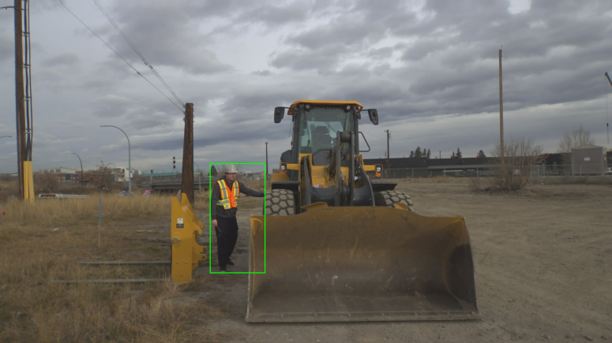
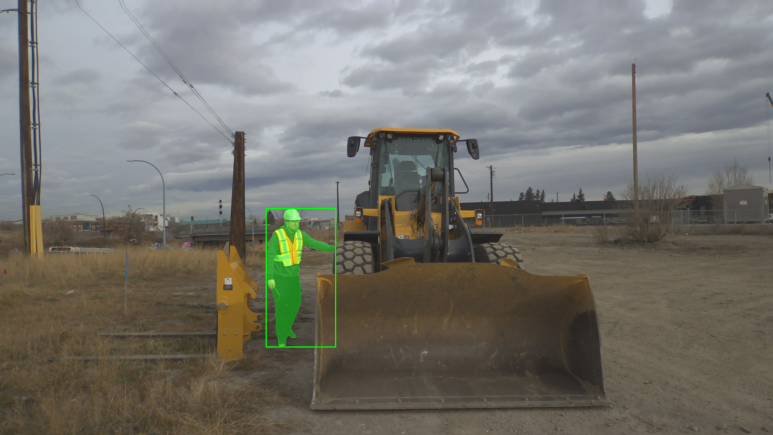

# ModelPack Overview

ModelPack is a single-sensor (single-input) architecture of a Vision model tasked with detecting objects in an image via bounding boxes, segmentation masks, or both. A Vision model is a type of model that interprets images or videos to perform tasks such as object recognition, image classification, and much more. There are three types of Vision models that are supported in EdgeFirst Studio. 

1. Detection: Models that output bounding boxes and scores that provide 4-point coordinates on the image marking the locations of the object.
2. Segmentation: Models that output segmentation masks with the same shape as the input image to distinguish pixels belonging to the object or its background. 
3. Multitask: A combination of object detection and segmentation. These models outputs bounding boxes, scores, and segmentation masks.

| Detection                   | Segmentation                | Multitask                     |
|-----------------------------|-----------------------------|-------------------------------|
|  |  |  |