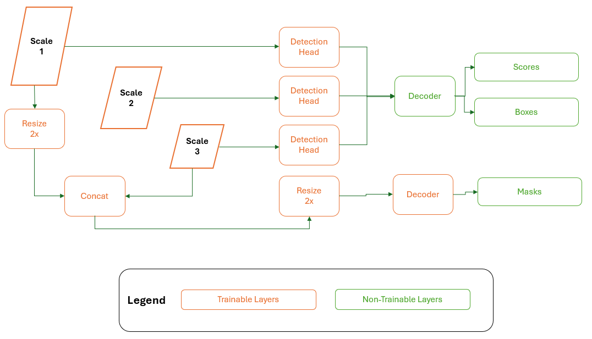

# ModelPack Overview

ModelPack is an advanced computer vision solution developed by Au-Zone Technologies as part of their EdgeFirst.AI middleware. It provides both object detection and instance segmentation capabilities, enabling high-performance, low-latency AI inference on embedded devices, particularly those with AI accelerators (NPUs) in the 0.5 TOPS and up range.

| Detection                   | Segmentation                | Multitask                     |
|-----------------------------|-----------------------------|-------------------------------|
|  |  |  |

ModelPack is optimized for real-time vision applications such as industrial automation, robotics, and autonomous systems. It combines object detection — locating multiple objects within an image using bounding boxes — with instance segmentation, which outlines each object’s exact shape at the pixel level. This unified approach enables detailed scene understanding at the edge and can contribute in a late fusion with the radar model.

## Quick Start Guide

This section includes a  tutorial useful to understand how to operate ModelPack from EdgeFirst Studio. At this point the user should know how to [Record/Capture Datasets](../../datasets/tutorials.md) from either Maivin or Raivin.

### Musicbox Detector

The [MusicBox Tutorial](tutorials/musicbox.md) shows the whole ModelPack live cycle, from data collection to model deployment. At the end of this tutorial, the user will be able to go outside and record data to play with ModelPack at any scale.

<!-- ModelPack exposes two different outputs that can be combined depending on the problem. The first one is a regression output for object detection that decode bounding boxes and classes. The second output is a classification output that assign a class to each pixel. Segmentation output is aproximatelly half of the input size. 

Modelpack is a single-sensor (single-input) architecture of a Vision model tasked with detecting objects in an image via bounding boxes, segmentation masks, or both. A Vision model is a type of model that interprets images or videos to perform tasks such as object recognition, image classification, and much more. There are three types of Vision models that are supported in EdgeFirst Studio. 

1. Detection: Models that output bounding boxes and scores that provide 4-point coordinates on the image marking the locations of the object.
2. Segmentation: Models that output segmentation masks with the same shape as the input image to distinguish pixels belonging to the object or its background. 
3. Multitask: A combination of object detection and segmentation. These models outputs bounding boxes, scores, and segmentation masks. -->

## ModelPack Architecture
ModelPack is a modern object detector and it adopts similar scaling strategies than Yolo familiy models. 
The model expands and contracts based on the width and height parameters. 
Modelpack shares a Darknet53 backbone similar to [YOLOx](https://arxiv.org/pdf/2107.08430v2). 
Different than YOLOx, ModelPack is NOT anchor free, which makes the model more accurate and stable after quantization.

Figure reproduced from: [Yang, L., Chen, G. & Ci, W. Multiclass objects detection](https://asp-eurasipjournals.springeropen.com/articles/10.1186/s13634-023-01045-8)

As mentioned above, ModelPack merges Semantic Segmentation and Object Detection on the same model and it is user reponsibility depending on problem requirements.  Semantic Segmentation only uses two scales (Scale 1 and Scale 2). On the other hand, Object Detection task uses the three scales.

While solving both tasks in the same inference cycle, the three scales are used.

ModelPack outputs can be configured on Studio User Interface as explained in ModelPack training guide ([here](training.md)).

