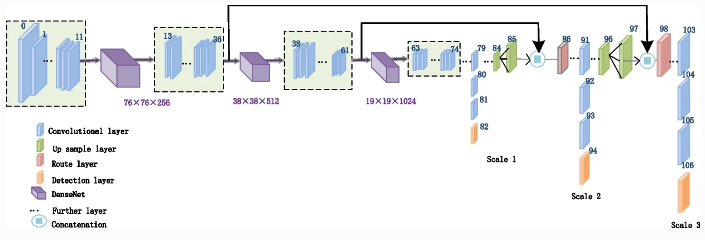

# ModelPack Overview

ModelPack is an advanced computer vision solution developed by Au-Zone Technologies as part of their EdgeFirst.AI middleware. It provides both object detection and semantic segmentation capabilities, enabling high-performance, low-latency AI inference on embedded devices, particularly those with AI accelerators (NPUs) in the 0.5 TOPS and up range.

| Detection                   | Segmentation                | Multitask                     |
|-----------------------------|-----------------------------|-------------------------------|
|  |  |  |

ModelPack is optimized for real-time vision applications such as industrial automation, robotics, and autonomous systems. It combines object detection — locating multiple objects within an image using bounding boxes — with instance segmentation, which outlines each object’s exact shape at the pixel level. This unified approach enables detailed scene understanding at the edge and can contribute in a late fusion with the radar model.

## ModelPack Architecture
ModelPack is a modern object detector and it adopts similar scaling strategies seen in the YOLO family models. 
The model expands and contracts based on the width and height parameters. 
Modelpack shares a Darknet53 backbone similar to [YOLOx](https://arxiv.org/pdf/2107.08430v2). 
Different than YOLOx, ModelPack is NOT anchor free, which makes the model more accurate and stable after quantization.

Figure reproduced from: [Yang, L., Chen, G. & Ci, W. Multiclass objects detection](https://asp-eurasipjournals.springeropen.com/articles/10.1186/s13634-023-01045-8)

As mentioned above, ModelPack merges Semantic Segmentation and Object Detection on the same model and it is user reponsibility depending on problem requirements.  Semantic Segmentation only uses two scales (Scale 1 and Scale 2). On the other hand, Object Detection task uses the three scales.

While solving both tasks in the same inference cycle, the three scales are used.

ModelPack outputs can be configured on Studio User Interface as explained in the [ModelPack training guide](training.md).
