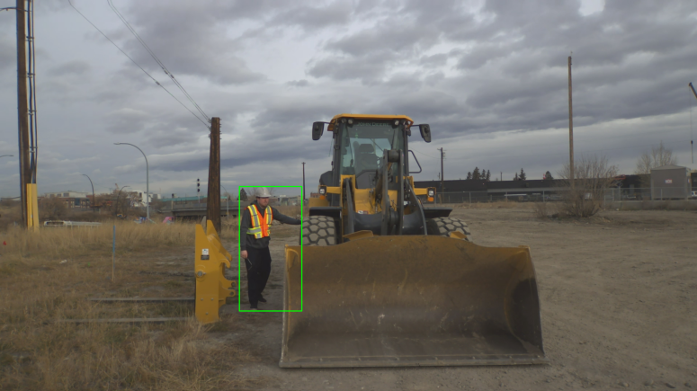
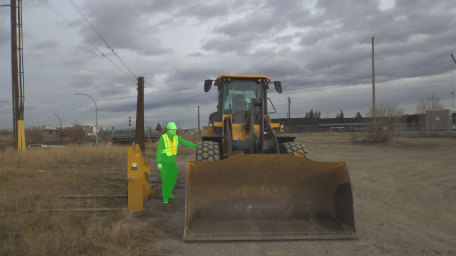

# ModelPack Overview

ModelPack is an advanced computer vision solution developed by Au-Zone Technologies as part of their EdgeFirst.AI middleware. It provides both object detection and semantic segmentation capabilities, enabling high-performance, low-latency AI inference on embedded devices, particularly those with AI accelerators (NPUs) in the 0.5 TOPS and up range.

| Detection                   | Segmentation                | Multitask                     |
|-----------------------------|-----------------------------|-------------------------------|
|  |  |  |

ModelPack is optimized for real-time vision applications such as industrial automation, robotics, and autonomous systems. It combines object detection — locating multiple objects within an image using bounding boxes — with instance segmentation, which outlines each object’s exact shape at the pixel level. This unified approach enables detailed scene understanding at the edge and can contribute in a late fusion with the radar model.

## Getting Started

ModelPack can be trained now in EdgeFirst Studio using a Graphical User Interface by following four simple steps:

=== "Select Framework"

    <h2 id="select-framework" style="display: none;"></h2>

    1. Select **ModelPack** within the available training frameworks.

    {{ img("../assets/modelpack/modelpack-train-01.jpg", "Select ModelPack Training Framework") }}{ align=center }

    

    [Next → 2. Name Session](#name-session){ .md-button .md-button--primary }
    

=== "Name Session"

    <h2 id="name-session" style="display: none;"></h2>

    2. Set a **name** and **description** *(optional)* for the training session.

    {{ img("../assets/modelpack/modelpack-train-02.jpg", "Set Name and Description") }}{ align=center }

    

    [1. Select Framework ← Back](#select-framework){ .md-button }
    [Next → 3. Select Dataset](#select-dataset){ .md-button .md-button--primary }
    

=== "Select Dataset"

    <h2 id="select-dataset" style="display: none;"></h2>

    3. Choose your **dataset**.

    {{ img("../assets/modelpack/modelpack-train-03.jpg", "Select a Dataset") }}{ align=center }

    

    [2. Name Session ← Back](#name-session){ .md-button }
    [Next → 4. Configure & Train](#train){ .md-button .md-button--primary }
    

=== "Train"

    <h2 id="train" style="display: none;"></h2>

    4. **[Configure the launch form](#training-parameters)** (input, model, training, augmentation and export) and start the session.

    {{ img("../assets/modelpack/modelpack-train-04.jpg", "Configure and Train") }}{ align=center }

    

    [3. Select Dataset ← Back](#select-dataset){ .md-button }
    [Next → 5. Validate](../validation/vision/managed.md){ .md-button  .md-button--primary }
    

=== "Training Parameters"

    <h2 id="training-parameters" style="display: none;"></h2>

    The ModelPack launch form groups its fields as follows.

    1. **Training Session**
        1. **Name**: The name of the training session, also used to name the artifacts (e.g. `modelpack-coffecup-640x640-rgba-t-<session ID>.onnx`)
        2. **Description**: An optional description of the training session, commonly used to highlight some parameters
    2. **Source Dataset**: The dataset the session trains and validates on, with its annotation set and tag
    3. **Destination Experiment**: The experiment the training session is created in.  Artifacts and charts are published there when training finishes
    4. **Input**
        1. **Input Resolution**: The network input resolution (width x height), 480x270 by default.  The list covers 1:1, 16:9 and 4:3 resolutions from 320x180 up to 3840x2160 (4K UHD) and 2592x1944.  Pick the resolution closest to your deployment camera.  Higher resolutions need more GPU memory, and the trainer reduces the batch size automatically when it does not fit.  With [Input Tiling (SAHI)](#input-tiling-sahi) the Input Resolution is the tile size.  In case you need a different resolution to be supported, please reach out and [email our support team](mailto:support@edgefirst.ai)
        2. **Camera Adaptor**: The target camera format of the model input, one of RGB (default), BGR, RGBA, BGRA, Greyscale or YUYV.  See [Camera Adaptor and Letterbox](#camera-adaptor-and-letterbox)
        3. **Input Tiling (SAHI)**: Off by default.  Trains on native-resolution tiles of each image and validates on full images.  The tiling settings and **Tiled Validation** that follow it configure the tiles.  See [Input Tiling (SAHI)](#input-tiling-sahi)
        4. **Letterbox Resize**: On by default.  Resizes each image into the model input while preserving its aspect ratio.  See [Camera Adaptor and Letterbox](#camera-adaptor-and-letterbox)
    5. **Model Parameters**: Configures the model architecture and the tasks to train
        1. **Model Backbone**: CSPDarkNet19 (default), optimized for inference time, or CSPDarkNet53, optimized for accuracy
        2. **Model Size**: Nano (default), Small, Medium or Large.  Similar to modern architectures, ModelPack scales the channel width and the block depth with the size (width `0.25`, `0.375`, `0.5`, `0.75` and depth `0.33`, `0.33`, `0.33`, `0.67` from Nano to Large)
        3. **Activation Function**: The main activation used in the model, one of ReLU, ReLU6 (default) and SiLU.  ReLU6 produces the best tradeoff between speed and accuracy in most cases
        4. **Object Detection**: Trains an object detection model (enabled by default)
        5. **Segmentation**: Trains a semantic segmentation model.  Selecting both **Object Detection** and **Segmentation** produces a multitask model with one output per task
        6. **Focus Input**: Off by default.  Reshapes the input as a 2x2 patch grid before the first convolution, trading per-pixel processing for a higher channel count at half resolution.  This is often a small inference speedup on NPUs, with a possible accuracy cost on very small objects
        7. **Fine Detection Head**: Off by default.  Adds a stride-8 (P3) detection head so small objects, below 32 pixels, have enough feature cells to localize.  Recommended together with Input Tiling.  It applies to CSPDarkNet19; CSPDarkNet53 always has the stride-8 head
    6. **Training Parameters**
        1. **Epochs**: The number of epochs to train the model, 50 by default (1 to 500)
        2. **Batch Size**: The number of samples processed in a single training step, 16 by default (1 to 64).  Remember the larger the input resolution the smaller the batch size

        !!! note "ModelPack always trains"
            Every ModelPack session trains on the selected dataset.  The backbone starts from ImageNet-pretrained weights and the detection and segmentation heads start fresh.

    7. **Data Augmentation**: The probability of each augmentation technique, in percent.  Augmentation is crucial for training models and reducing overfitting, especially on small datasets.  See [Vision Augmentations](../augmentations.md)
        1. **Random Brightness and Contrast**: 50 by default
        2. **Random HSV**: Random hue, saturation and value, 30 by default
        3. **Random Grayscale**: 10 by default
        4. **Random Horizontal Flip**: 50 by default
        5. **Random Vertical Flip**: 0 by default.  A vertical mirror is not label-preserving for ground-referenced scenes; enable it for overhead or aerial imagery
        6. **Random Shift and Scale**: 25 by default.  Not used with Input Tiling
        7. **Random Mosaic**: 25 by default.  With Input Tiling, four tiles are combined at native scale
        8. **Mosaic Center Jitter**: 0 by default (0 to 0.45).  The half-range for randomizing the center point of a mosaic, as a fraction of the tile size.  0 keeps the fixed-center 2x2 mosaic layout; higher values vary the size of each quadrant.  It has an effect only when **Random Mosaic** is above 0
    8. **Export Parameters**: The session publishes FP32 and FP16 ONNX models, a TensorFlow SavedModel and an INT8 calibration snapshot.  The [converter apps](../conversion/index.md) use them to produce INT8 quantized models for each target NPU
        1. **Calibration Samples**: The number of images in the INT8 calibration snapshot, 500 by default (100 to 2000).  Very low counts can reduce quantized accuracy.  Snapshots are reused across sessions with matching settings
        2. **ONNX Opset Version**: The ONNX opset version of the exported model, 11, 12 or 13 (default).  Keep the default unless a downstream tool requires an older version
    9. **Start Session**: This button starts the training session

## Camera Adaptor and Letterbox

The **Camera Adaptor** dropdown in the Input group selects the target camera format of the model input.  Select the format that matches your deployment camera or ISP output to avoid runtime color conversions.  See [Camera Adaptor](../cameraadaptor.md) for the supported formats and platform guidance.

The photometric augmentations (brightness and contrast, HSV and grayscale) apply to the RGB, BGR and Greyscale formats.  The RGBA, BGRA and YUYV formats receive the geometric augmentations only.

**Letterbox Resize** fits each image into the model input with an aspect-preserving letterbox: the image is scaled to fit, centred, and padded with gray (114).  Boxes are remapped into the padded image, and segmentation masks are padded with the background class.  Leave it on for general datasets.  For fixed-camera datasets whose frames already match the input aspect ratio it has no effect and can be turned off, which resizes the image directly to the model input and skips the padding.

The resize mode is recorded in the [model metadata](../metadata.md) so deployment runtimes preprocess identically, and the calibration snapshot uses the same resize mode, so INT8 calibration sees the deployment input.

## Input Tiling (SAHI)

Small objects in high-resolution images lose most of their pixels when the image is downscaled to the model's input size.  **Input Tiling (SAHI)** trains on native-resolution tiles of each image instead of downscaling the whole image, then validates on full images, so small objects keep their native pixel scale.

With Input Tiling enabled, the **Input Resolution** is the tile size; 640x640 is the preferred choice.  Input Tiling supports object detection with the **RGB** or **BGR** camera adaptor.

The following settings, in the Input group, control how tiles are sampled.  Their defaults are the validated recipe.

| Setting | Default | Description |
|---------|---------|-------------|
| **Tiles per Image** | 4 (1 to 8) | Tiles cut from each decoded image per epoch. |
| **Background Tiles (%)** | 15 (0 to 50) | Percentage of tiles that contain no annotated object.  Lower it for densely annotated datasets. |
| **Full-Image Tiles (%)** | 10 (0 to 50) | Percentage of tiles that show the whole image fitted into the tile, keeping large objects and scene context.  The remaining tiles are placed around objects. |
| **Grid-Aligned Tiles (%)** | 25 (0 to 100) | Percentage of object and background tiles taken from the deployment tile grid, so the model sees the tile edges it meets at inference. |
| **Native-Scale Tiles (%)** | 50 (0 to 100) | Percentage of tiles cropped at exactly the deployment scale.  The rest are zoomed within the **Tile Zoom Range**. |
| **Tile Zoom Range** | 1.33 (1.0 to 2.0) | Largest zoom applied to non-native tiles, in and out equally: 1.33 samples between 0.75x and 1.33x.  1.0 disables zoom. |
| **Minimum Visible Fraction** | 0.25 (0.05 to 0.9) | An object cut by a tile edge is kept as a target only when at least this fraction of its area is inside the tile. |
| **Final Native Epochs** | 10 (0 to 50) | Closing epochs trained on native-scale tiles only, with the tile mosaic off, to match deployment.  Limited to half of the epochs. |
| **Class-Balanced Tiles** | Off | Places more tiles around objects of rare classes. |
| **Tiled Validation** | Whole Image | How validation scores the model on full images.  See [Tiled Validation](#tiled-validation). |

A tile smaller than the Input Resolution, such as a full-image tile or a tile cut from an image smaller than the tile, is letterboxed, centred, into it.  With Input Tiling, **Random Mosaic** combines four tiles at native scale and **Random Shift and Scale** is not used, because the tile sampler applies its own zoom.  The anchors are fit to the boxes as they appear in the tiles.

### Tiled Validation

A tile-trained model is scored on full images, the deployment metric, rather than per tile.  **Tiled Validation** selects how.

| Tiled Validation | Description |
|------------------|-------------|
| **Whole Image** (default) | Each full image runs through the model in one pass at native resolution. |
| **Tile Grid** | Each image is cut into the deployment tile grid, an evenly distributed grid with at least 10% overlap between tiles.  Each tile is detected separately, and the detections are lifted to image coordinates and merged across tiles. |
| **Both** | Runs both and reports the tile grid metrics alongside the whole-image metrics.  This is slower. |

### Deploying Tile-Trained Models

A tile-trained model exports at the tile size.  Its [model metadata](../metadata.md#tiling) carries a `tiling` section describing the deployment tile grid and the merge of detections across tiles, so the runtime cuts each frame into tiles of the Input Resolution.  The calibration snapshot holds deployment-grid tiles rather than whole images; see [Tiled Models](../conversion/calibration.md#tiled-models).

## ModelPack Architecture

ModelPack is a modern object detector and it adopts similar scaling strategies seen in the YOLO family models.
The model expands and contracts based on the width and height parameters.
ModelPack shares two main backbones: a Darknet53 backbone similar to [YOLOx](https://arxiv.org/pdf/2107.08430v2) which maximizes accuracy and a Darknet19 backbone for boosting inference time.
Different than YOLOx, ModelPack is NOT anchor free, which makes the model more accurate and stable after quantization.

{{ figure("../assets/darknet-53-backbone.png", "Darknet-53 Backbone") }}

Figure reproduced from: [Yang, L., Chen, G. & Ci, W. Multiclass objects detection](https://asp-eurasipjournals.springeropen.com/articles/10.1186/s13634-023-01045-8)

As mentioned above, ModelPack merges Semantic Segmentation and Object Detection on the same model and it is user responsibility depending on problem requirements.  Semantic Segmentation only uses two scales (Scale 1 and Scale 2). On the other hand, Object Detection task uses the three scales.

While solving both tasks in the same inference cycle, the three scales are used.

{{ figure("../assets/modelpack-arch.png", "ModelPack Architecture") }}

ModelPack outputs are configured in the [launch form](#training-parameters) of the training session.  See [Training Vision Models](../training/vision.md) for the training workflow.
