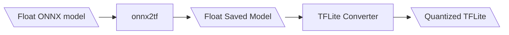

# ModelPack Quantization

To run a ModelPack Float32 ONNX model [trained in EdgeFirst Studio](../training/vision.md) on an embedded platform such as an i.MX 8M Plus EVK, the model will need to be quantized to an INT8 or UINT8 model and converted to TFLite format.  The steps below describe this process.

## ONNX to TFLite

Follow along this tutorial to convert your ModelPack Float32 ONNX model into a quantized TFLite.  If you do not have a model available, you can click and download this sample model [coffeecup-modelpack-multitask-t-1f54.onnx](assets/coffeecup-modelpack-multitask-t-1f54.onnx){: download="coffeecup-modelpack-multitask-t-1f54.onnx"} which is needed for this tutorial. 

The steps for this conversion process are shown below.



1. Open a command prompt in your PC.

2. Install the following required [dependencies](assets/requirements.txt){: download="requirements.txt"}.

    !!! tip

        You can download the file "requirements.txt" that lists the required dependencies and run `pip install -r requirements.txt` to install these packages.  Otherwise, run each package installation line by line as shown below.

    ```shell
    $ pip install onnx2tf==1.28.2
    $ pip install tf_keras==2.19.0
    $ pip install onnx==1.18.0 
    $ pip install onnx_graphsurgeon==0.5.8
    $ pip install psutil==7.0.0
    $ pip install ai-edge-litert==1.4.0 
    $ pip install sng4onnx==1.0.4
    $ pip install tensorflow==2.19.1
    $ pip install opencv-python==4.12.0.88
    $ pip install numpy==2.1.3
    ```

    These versions of the libraries were tested.

    ```shell
    onnx2tf                      1.28.2
    tf_keras                     2.19.0
    onnx                         1.18.0 
    onnx_graphsurgeon            0.5.8
    psutil                       7.0.0
    ai-edge-litert               1.4.0 
    sng4onnx                     1.0.4
    tensorflow                   2.19.1
    opencv-python                4.12.0.88
    numpy                        2.1.3
    ```

3. Export the ONNX model to TensorFlow saved model.

    `onnx2tf -i path/to/mymodel.onnx -o model_tf --non_verbose`

4. Run the TFLite [converter script](assets/converter.py){: download="converter.py"} below using TensorFlow with this command `python3 converter.py`.

    !!! tip "Download the Python script"
        
        Download the python script by clicking on the link above. 

    !!! note "Prepare a set of images"
        This process also requires sample images needed during quantization. 
        You can click on the link and download these [set of images with coffee cup samples](assets/coffeecup.zip){: download="coffeecup.zip"} for quantizing a
        coffee cup model as shown in this tutorial.  Unzip this file into a directory.

    !!! note "Modify the file paths"

        In this script, the path to the images and the model are set to the following.  Also ensure that the model input shape is set to the correct dimensions.

        ```python
        model_path = "model_tf" # Path to the TensorFlow saved mdoel
        images_path = "coffeecup/*.jpg" # Conversion requires image samples for quantization.
        input_shape = (480, 270) # Model (width, height) input shape.
        output_path = "coffeecup-modelpack-multitask-t-1f54.tflite" # Path to save the TFLite model. 
        ```

        Make sure to modify these paths specific to your setup. 

    === "converter.py"

        ```python 
        import tensorflow as tf
        import numpy as np
        import glob
        import cv2

        model_path = "model_tf" # Path to the TensorFlow saved mdoel
        images_path = "coffeecup/*.jpg" # Conversion requires image samples for quantization.
        input_shape = (480, 270) # Model (width, height) input shape.
        output_path = "coffeecup-modelpack-multitask-t-1f54.tflite" # Path to save the TFLite model. 

        def representative_data_gen():
            images = glob.glob(images_path)

            for image in images:
                image = cv2.imread(image)
                image = cv2.resize(image, input_shape)
                image = cv2.cvtColor(image, cv2.COLOR_BGR2RGB)
                image = image.astype(np.float32)
                image = image / 255.0
                image = np.expand_dims(image, axis=0)
                yield [image]

        converter = tf.lite.TFLiteConverter.from_saved_model(model_path)
        converter.optimizations = [tf.lite.Optimize.DEFAULT]
        converter.representative_dataset = representative_data_gen
        converter.target_spec.supported_ops = [tf.lite.OpsSet.TFLITE_BUILTINS_INT8]
        converter.inference_input_type = tf.uint8
        converter.inference_output_type = tf.uint8

        tflite_model = converter.convert()
        with open(output_path, "wb") as f:
            f.write(tflite_model)
        ```

## Next Steps

Once you have converted your model to a quantized TFLite, you can verify the performance of the model by [Running the Quantized ModelPack](npu.md) in the i.MX 8M Plus EVK's NPU. 
