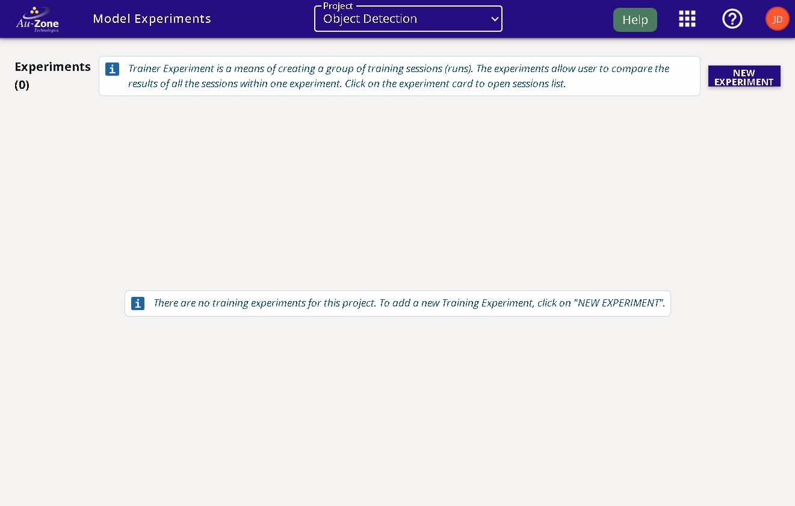
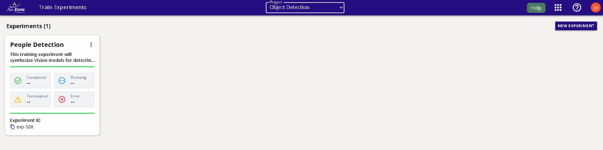
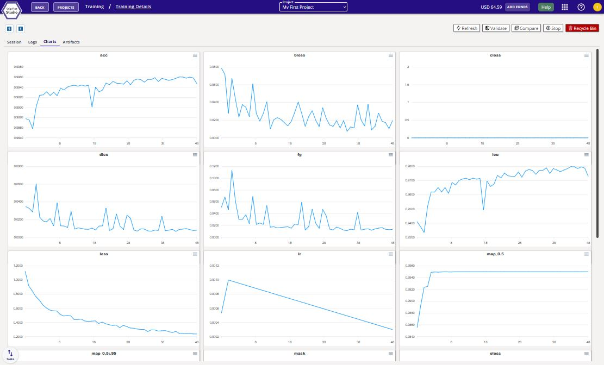

# Training ModelPack

This tutorial describes the steps to train **ModelPack Vision** models in EdgeFirst Studio.  For a tutorial to train Fusion models, see [Training Fusion Models](../fusion/training.md). 

## Verify Dataset

First ensure that the dataset is ready to be used for training.  This means that the dataset is properly annotated and the dataset is properly split into training and validation groups.  The section in [Verify Dataset](../../datasets/tutorials/management.md#verify-dataset) will show what to look for in a dataset before deploying it for training.

## Specify Project Experiments

From the projects page, choose the project that contains the dataset you plan to use.  In this example, the project chosen is the "Object Detection" project which was created in the [Quickstart Guide](../../index.md#create-project).  Next click the "Model Experiments" button as indicated in red.

<figure markdown="span">
{ align=center }
<figcaption>Model Experiments</figcaption>
</figure>

## Create Model Experiment

You will be greeted with the "Model Experiments" page.  A new project will not have any experiments as shown below.  You will need to first create a model experiment.  As mentioned in the [Model Experiments Dashboard](../../studio/models.md), model experiments will contain both training and validation sessions. 

<figure markdown="span">
{ align=center }
<figcaption>Model Experiments Page</figcaption>
</figure>

Click on the "New Experiment" button as shown on the top right corner of the page.

<figure markdown="span">
{ align=center }
<figcaption>New Experiment Button</figcaption>
</figure>

Enter the name and the description of the experiment marked by the fields shown below.  Click on the "Create New Experiment" button to create your experiment.

<figure markdown="span">
{ align=center }
<figcaption>Experiment Fields</figcaption>
</figure>

Your created experiment will appear like the following below.  At the start, this experiment will contain zero training and validation sessions.  The next step will show how to start your first training session on this experiment using the dataset in the project. 

<figure markdown="span">
{ align=center }
<figcaption>Created Experiment</figcaption>
</figure>

## Create Training Session

In the experiment card, click the "Training Sessions" button as indicated in red below.

<figure markdown="span">
{ align=center }
<figcaption>Training Sessions</figcaption>
</figure>

You will be greeted to the "Training Sessions" page as shown below.  

<figure markdown="span">
{ align=center }
<figcaption>Training Sessions Page</figcaption>
</figure>

Start a training session by clicking on the "New Session" button on the top right corner of the page.

<figure markdown="span">
{ align=center }
<figcaption>New Session Button</figcaption>
</figure>

You will be greeted with a training session dialog.  In this dialog, specify the "Trainer Type" to "ModelPack" and provide a name and description of the training session as shown below.  Next specify the dataset to be used with training and validation partitions.  In this example, the dataset specified is the "modelpack-coffecup-640x640-rgba" dataset which was created in the [Getting Started](../../index.md).  Next specify the training parameters.  By default, an object detection (bounding boxes) model will be trained.  However, you can specify either "Segmentation" or "Multitask" as shown below.  This model will output both bounding boxes and segmentation masks.  Additional information on these parameters are provided by hovering over the info button .

!!! tip "Input Resolution"
    We recommend changing the input resolution to 640x360 to maximize detection rates on small datasets.

!!! warning "Large Batch Size"
    For small datasets, a large batch size may produce poor results. Use a batch size of 4 or 8.

For more information on available "Data Augmentations" please see [Vision Augmentations](../augmentations.md).

<figure markdown="span">
{ align=center }
<figcaption>Training Session Fields</figcaption>
</figure>

 1. Model Name: This field specify the name of the trining session and will be used to name the artifacts (e.g. `modelpack-coffecup-640x640-rgba.tflie`, `modelpack-coffecup-640x640-rgba.onnx`)
 2. Description: This fiels is used to add some hints about the training session. Commonly used to highlight some parameters.
 3. Training Data: In this section the user must select the dataset as well as train/val groups
 4. Input Resolution: The user can pick predifined input resulutions. Even when ModelPack accepts any resolution we keep this option as simpler as possible. In case you need a different resolution to be supported, please get in touch with our team.
 5. Camera Adaptor: ModelPack accepts three different input optimizations. It could be either of rgb, rgba, or yuyv.
 6. Model Parameters: This section configures the model architecture. 
    1. Model Backbone: Model backbone exposes a CSPDarknet19 optimized for boosting inference time and a CSPDarknet53 optimized for accuracy.
    2. Model Size: Similar to modern architectures, ModelPack also accept dynamic scaling factors (`width in [0.25, 0.5, 0.75, 1.0]`, `depth in [0.33, 0.33, 0.66, 1.0]`).
    3. Activation Function: Thids parameter defines the main activation used in the model. Exposed values are ReLU, ReLU6 and SiLU. The best tradeoff between speed and accuracy is produced by ReLU6 activation in most of the cases.
    4. Interpolation Method: Model upsample layers are ruled by a resize operation. This operation can run with two different algorithms: `Bilinear` or `Nearest`
    5. Object Detection: Enables object detection task (enabled by default)
    6. Segmentation: Enables Semantic Segmentation
    7. Space to Depth: This feaute enables the Space to Depth Transformation to the input in order to reduce model complexity on higher resolutions.
    8. Split Decoder: Remove the decoder from the model and use a very optimized one from edgefirst. This feature is very useful when the location of the boxes has to be precise (0-offset)
 7. Training Parameters: In this section the user is able to specify the number of epochs to train the model as well as the batch size. Remember the larger the input reslution the smaller the batch size. 
 8. Data Augmentation: This section controls the probablity of each augmentation technique. This feature is crucial for training models  and reduce overfitting, specially in small datasets.
 9. Start Session: This button will start the training session

## Session Progress

Once the training session has started, the progress with the stages will be shown on the left and additional information and status is shown on the right.

<figure markdown="span">
{ align=center }
<figcaption>Training Session</figcaption>
</figure>

The training process begins with cloud instance initialization. Then the dataset is downloaded and cached. Training starts afterwards.
At the end of the training process, ModelPack quantizes the model and publishes the checkpoints.

## Completed Session

The completed session will look as follows with the status set to "Complete".

<figure markdown="span">
{ align=center }
<figcaption>Completed Session</figcaption>
</figure>

The attributes of the training sessions in EdgeFirst Studio are labeled below.

<figure markdown="span">
{ align=center }
<figcaption>Training Session Attributes</figcaption>
</figure>

## Training Outcomes

Once the training session completes, you can view the training charts by clicking the "View Training Charts" button on the top of the session card.

<figure markdown="span">
{ align=center }
<figcaption>Training Charts</figcaption>
</figure>

You can go back to the training session card by pressing the "Back" button as indicated in red below on the top left corner of the page. 

<figure markdown="span">
{ align=center }
<figcaption>Back to the Session Card</figcaption>
</figure>

The trained model artifacts can be downloaded by clicking the "View Additional Details" button on the training session card in EdgeFirst Studio.  This will open the session details and the models are listed under the "Artifacts" tab as shown below.  Click on the downward arrows to download the models to your PC.

| Session Details                                                | Artifacts                                                                     |
|----------------------------------------------------------------|-------------------------------------------------------------------------------|
|  |  | 

It is also possible to compare the training metrics for multiple sessions.  See [Training Sessions](../../studio/models.md#training-sessions) in the Model Experiments Dashboard for further details. 

!!! info "Netron"
    You can visualize the architecture of these models using [https://netron.app/](https://netron.app/).

## Next Steps 

Now that you have generated your Vision model, follow along the next steps for validating your model either through [managed](validation/managed.md) or [user-managed](validation/user_managed.md) validation sessions.