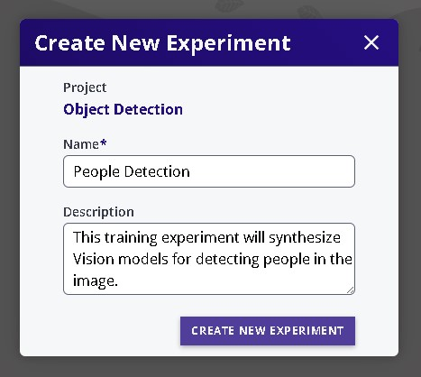
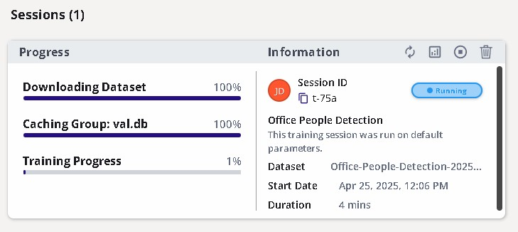

# Training ModelPack

This tutorial describes the steps to train **ModelPack Vision** models in EdgeFirst Studio.  For a tutorial to train Fusion models, see [Training Fusion Models](../fusion/training.md).  It is highly recommended for users to be familiar with the concepts and UI elements in EdgeFirst Studio as described in the [EdgeFirst Studio: Overview](../../getting_started/studio.md).

## Verify Dataset

First ensure the dataset is ready to be used for training.  This means that the dataset is properly annotated and the dataset is properly split into training and validation samples.  The section in [Verifying Datasets](../../datasets/tutorials.md#verifying-datasets) will show what to look for in a dataset before deploying it for training.

## Specify Project Experiments

From the projects page, choose the project that contains the dataset you plan to use.  In this example, the project chosen is the  "Object Detection" project which was created in the [Quickstart Guide](../../index.md#create-project).  Next click the "Model Experiments" button as indicated in red.

<figure markdown="span">
{ align=center }
<figcaption>Model Experiments</figcaption>
</figure>

## Create Model Experiment

You will be greeted with the "Model Experiments" page.  A new project will not have any experiments as shown below.  You will need to first create a model experiment.  As mentioned in the [EgdeFirst Studio Overview](../../getting_started/studio.md#model-experiments), model experiments will contain the training and validation sessions. 

<figure markdown="span">
{ align=center }
<figcaption>Model Experiments Page</figcaption>
</figure>

Click on the "New Experiment" button as shown on the top right corner of the page.

<figure markdown="span">
{ align=center }
<figcaption>New Experiment Button</figcaption>
</figure>

## Select the Trainer Tool

Once the training dataset is ready, select "Train Experiments" from the tool options.  

<figure markdown="span">
{ align=center }
<figcaption>Tool Options</figcaption>
</figure>

## Specify the Project

Specify the project to run training at the center of the top menu bar.

<figure markdown="span">
{ align=center }
<figcaption>Project Selection</figcaption>
</figure>

## Create Training Experiment

If you haven't already done so, create a training experiment.  
Create a new training experiment by clicking the "NEW EXPERIMENT" button on the top right.

<figure markdown="span">
{ align=center }
<figcaption>Create New Experiment</figcaption>
</figure>

This will provide pop-up for the user to specify the name and description of 
the experiment.  Give a name and a description that reflects your goals in this experiment.

<figure markdown="span">
{ align=center }
<figcaption>Create New Experiment</figcaption>
</figure>

Click on the "CREATE NEW EXPERIMENT" button to create your new training experiment.  This will show
the created experiment. 

<figure markdown="span">
{ align=center }
<figcaption>Created Experiment</figcaption>
</figure>

Open the created experiment by clicking on the experiment.  Inside the experiment, we can create multiple training sessions.  Each training session will train Vision models which we will explore next.

<figure markdown="span">
{ align=center }
<figcaption>Inside the Experiment</figcaption>
</figure>

## Create Training Session

Create a new training session within this experiment by clicking the "NEW SESSION" button as shown below.

<figure markdown="span">
{ align=center }
<figcaption>Training Session</figcaption>
</figure>

Configure the settings on the left panel by specifying "Trainer Type" to "ModelPack"
and provide additional configurations for the name of the session and the dataset to deploy.  
Next configure the settings on the right panel by specifying training parameters.  

Additional information on these parameters are provided by hovering over the info button.
For more information on available vision augmentations please see [Vision Augmentations](../augmentations.md).

<figure markdown="span">
{ align=center }
<figcaption>Training Options</figcaption>
</figure>

## Start the Session

Start the session by clicking the "START SESSION" button on the bottom right.

<figure markdown="span">
{ align=center }
<figcaption>Start the Session</figcaption>
</figure>

## Session Progress

The training session has now started while the progress is tracked on the 
left panel and additional information and status is shown on the right panel.

<figure markdown="span">
{ align=center }
<figcaption>Training Session</figcaption>
</figure>

The completed session will look as follows.

<figure markdown="span">
{ align=center }
<figcaption>Completed Session</figcaption>
</figure>

<figure markdown="span">
{ align=center }
<figcaption>Training Session Attributes</figcaption>
</figure>

## Training Outcomes

The training metrics are shown by clicking the button that views the training charts on the top right of the session card.  

<figure markdown="span">
{ align=center }
<figcaption>Training Metrics</figcaption>
</figure>

The training metrics are shown on the left and the trained model files are listed on the right. 
The trained Keras, TFLite, ONNX, and RTM models can be downloaded by clicking on the downward arrows on the right.

!!! info
    You can visualize the architecture of these models using [https://netron.app/](https://netron.app/).

## Next Steps 

Now that you have generated your Vision model, follow these next steps
for [validating your Vision model](validation.md).