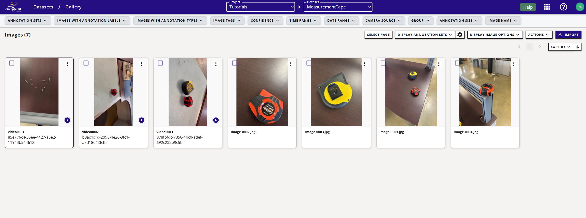
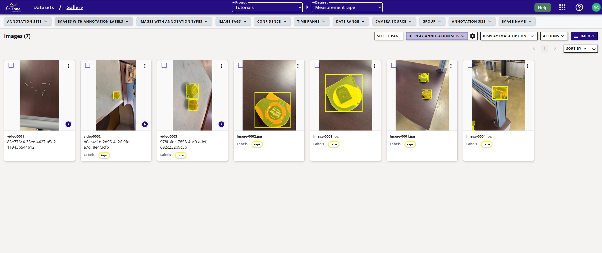
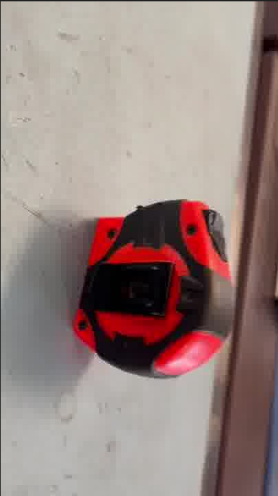
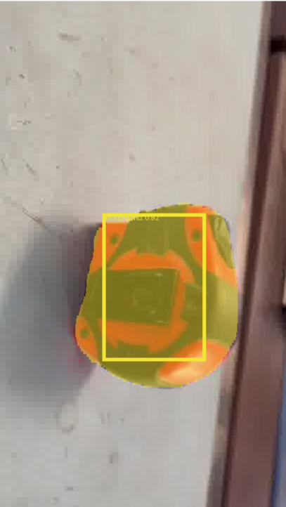

# Tutorial 1: Measurement Tape Detector

This tutorial shows the step by step Machine Learning process in Edgefirst Studio.

* [Data Collection](#data-collection)
* [Data Annotation](#data-annotation-using-agtg)
* [Model Training](#model-training)
* [Model Inference on PC](#model-inference-on-pc)

## Data Collection

Data collection process starts as simple as collecting pictures and videos of the objects.  In this example, the objects to detect are measurement tapes.

<figure markdown="span">
{ align=center }
<figcaption>Data Collection</figcaption>
</figure>

The image above shows measurement tape images captured from different angles and positions using an iPhone, though any camera will work you just need to be able to transfer the photos and videos to your PC. We recorded both images and videos with varying camera orientations to ensure diverse perspectives.  

Follow this [tutorial](../../../datasets/tutorials/capture.md#capture-with-a-phone) for capturing images and videos with your phone and uploading the files into EdgeFirst Studio for annotation.

After uploading the files, check the [gallery](../../../datasets/tutorials/management.md#view-dataset) view to verify that all data (videos and images) has been imported successfully.

<figure markdown="span">
{ align=center }
<figcaption>Dataset Gallery</figcaption>
</figure>

!!! note 
    Videos appear as sequences with a play button overlay on the preview thumbnail.

## Data Annotation using AGTG

Once the dataset samples has been uploaded to EdgeFirst Studio, you can start annotating the samples via [Automatic Ground Truth Generation (AGTG)](../../../datasets/tutorials/annotations/automatic.md#semi-automatic-ground-truth-generation). 

After completing the annotations, the gallery will display previews of all annotated videos and images.

<figure markdown="span">
{ align=center }
<figcaption>Annotations Preview</figcaption>
</figure>

Once your dataset has been fully annotated, you are now ready to begin model training.

## Model Training

We will now walk you through training a detection and segmentation model (multitask), but first ensure that your dataset contains training and validation groups.  If the GUI shows 0 Groups, you'll need to [create training and validation groups](../../../datasets/tutorials/management.md#split-dataset) before starting training. 

Once the groups have been created, follow these steps for [training your model](../../training/vision.md). 

## Model Inference on PC 

Now that ModelPack has been trained on your dataset, you can start [deploying the trained models](../../deployment/pc.md) on your PC. 

| Input Image | Model Output |
|-----------------|-----------|
|  |  |
