# Tutorial 1: Detection and Segmentation of Measurement tapes

This tutorial shows step by step the whole Machine Learning process on Edgefirst Studio. The tutorial is split in the following sections:

* [Data Collection](#data-collection)
* [Data Annotation using AGTG](#data-annotation-using-agtg)
* [Model Training](#model-training)
* [Model Inference on PC](#model-inference-on-pc)

## Data Collection

Data collection process starts as simple as collecting pictures and videos of the objects. 

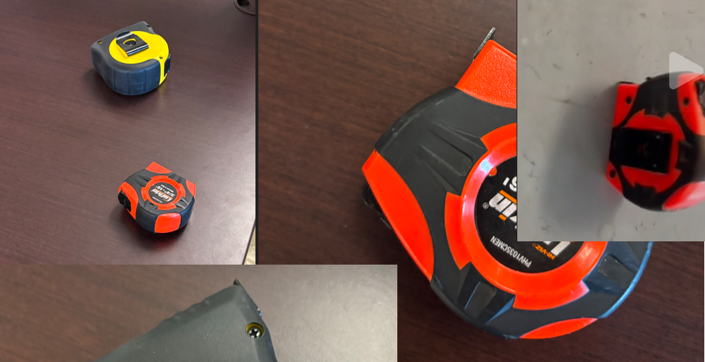

The image above shows measurement tape images captured from different angles and positions using an iPhone, though any camera will work you just need to be able to transfer the photos and videos to your PC. We recorded both images and videos with varying camera orientations to ensure diverse perspectives.

To create a dataset in EdgeFirst Studio, navigate to the Tutorials project and click the `Create New` button. Name the dataset "MeasurementTape" and add a single label: `tape`. You can keep the default `Annotations Set Name` or modify it as needed. Adding a description will be useful when accessing the dataset through the `edgefirst-client` API.

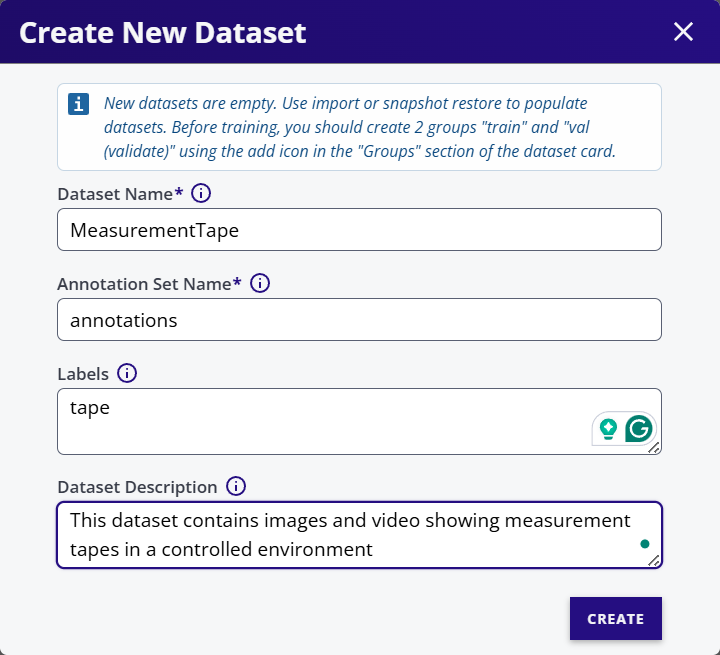

Once the dataset is created, click the menu in the top-right corner of the dataset card to import data from your PC or smartphone.

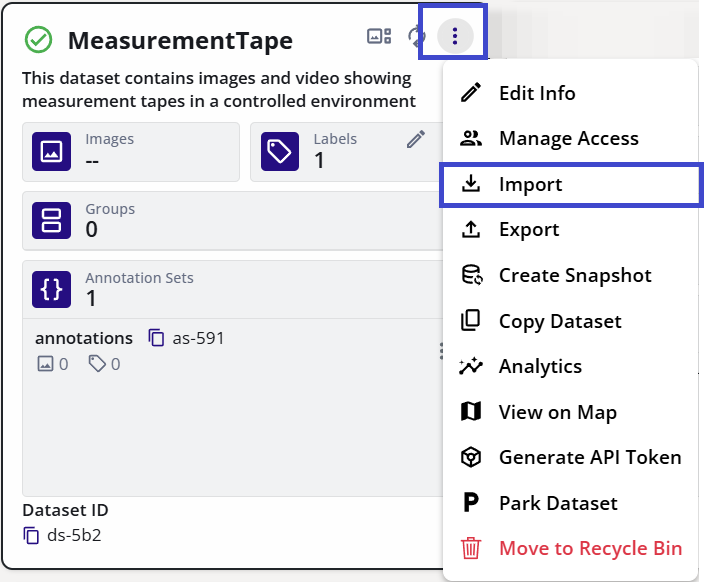

In the Import Dialog, you can choose between importing an Images Folder or Video. For images, you can drag and drop multiple files at once. For videos, you can only import one at a time and set the FPS (Frames per Second) ratio.

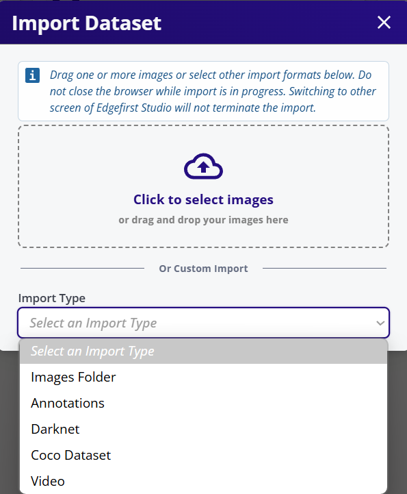

After importing, check the gallery view to verify that all data (videos and images) has been imported successfully.


Note that videos appear as sequences with a play button overlay on the preview.

!!! info
    We recommend using videos rather than individual images. This is because AGTG leverages tracking information, allowing you to annotate just a single frame. With individual images, you'll need to annotate each one separately.


## Data Annotation using AGTG

Once the dataset is loaded, you can start the AGTG server from the gallery view. Select any dataset instance (image or video) from the gallery view to automatically enter editing mode.

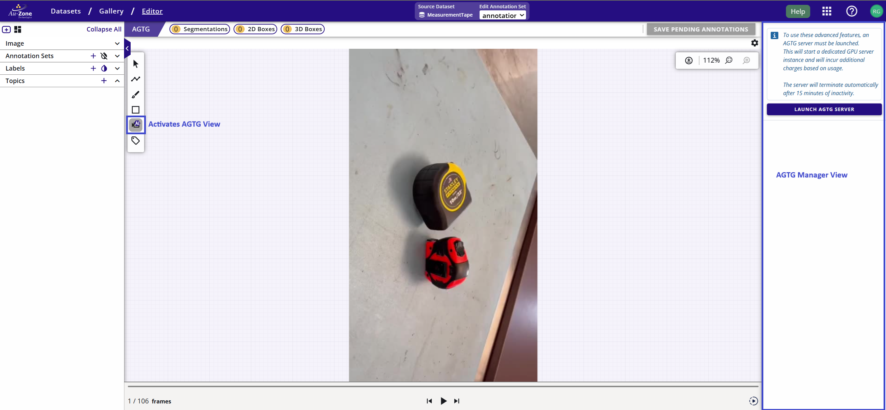

Click the AI-assisted button on the left side of the GUI to open the AGTG Manager View. On first use, you'll see an empty server list. Click the LAUNCH AGTG SERVER button and wait a few minutes for the server to initialize.

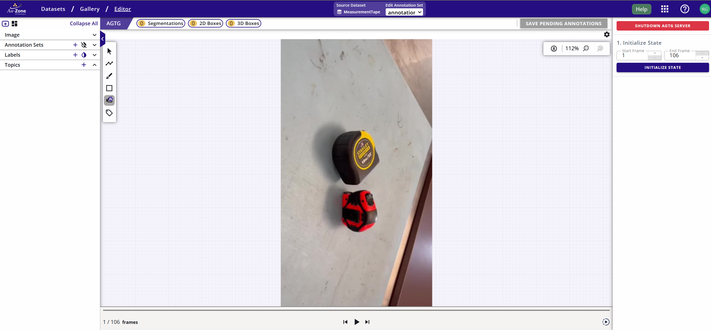

The annotation process is straightforward. For each video, you'll need to initialize the state and begin annotating. You can use multiple prompts per object (Boxes, Points). Each object must be annotated independently so the tracker can assign a unique ID. Use the **`(+)`** button to add more objects. In the example below, we used box prompts. Click the **`SAVE PENDING ANNOTATIONS`** button to save your work. Continue this process until you've annotated the entire dataset.

You can also annotate in reverse mode by starting with the last occurrence of an object and tracking backwards.

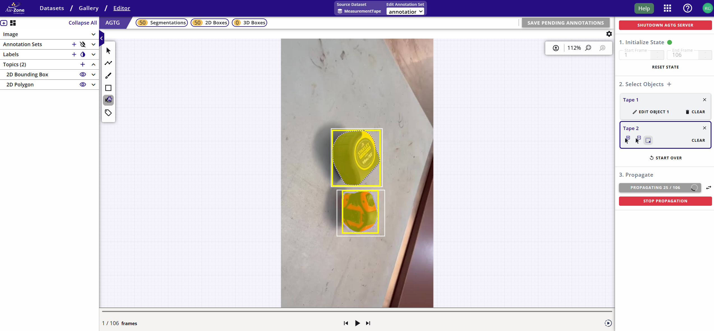

!!! info
    The first object in each sequence may take a few seconds to initialize, which is normal.

After completing the annotations, the gallery will display previews of all annotated videos and images.


You are now ready to begin model training.


## Model Training

We will now walk you through training a detection and segmentation model, but first there's a few house keeping steps to prepare the dataset. The first step is to ensure your dataset contains training and validation groups. If the GUI shows 0 Groups, you'll need to create them before starting training. Click the **`(+)`** button in the groups section to randomly shuffle the data and create the groups.  This will also need to be done after adding additional images and videos to the dataset.

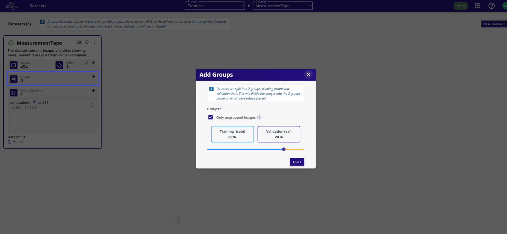

Once the groups are created, you can select a training session for ModelPack from the Model Experiments menu.

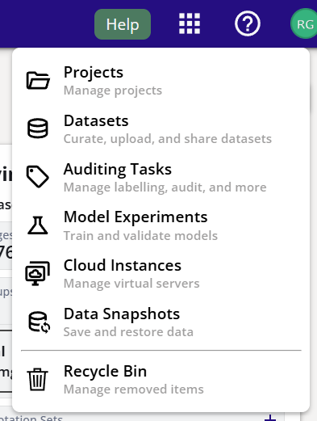

Create a **`New Experiment`** and name it *Measurement Tape Tutorial*

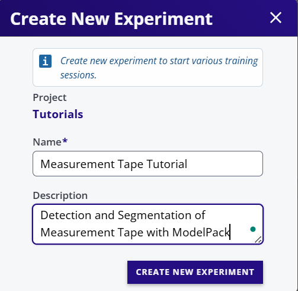

After creating the experiment, a new preview will appear in the GUI showing statistics about experiments made on this dataset (everything will be empty at creation time).

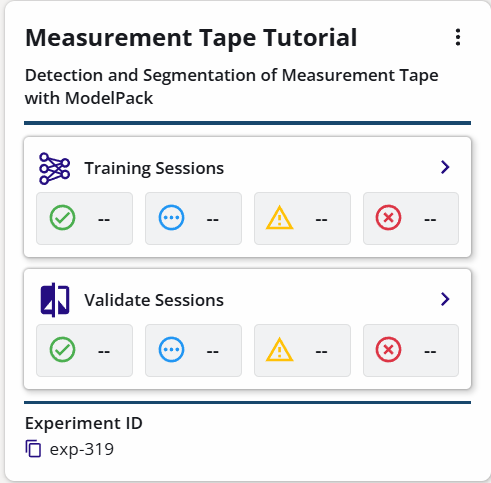

Select the experiment and create a new instance of ModelPack by clicking the training section on the preview card. Click the **`NEW SESSION`** button to configure ModelPack parameters. You must select a dataset and provide a descriptive name. Remember to check segmentation to enable training on both tasks. We recommend changing the input resolution to 640x360 to maximize detection rates on small datasets. Once the GUI is configured, click **`START SESSION`** and wait a few minutes for the model to complete training and quantization.

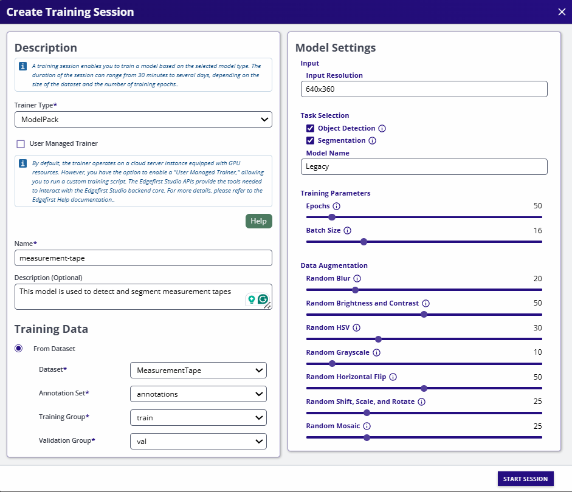

Now that training has started, wait for the model to finish processing and for the status to change from `Running` to `Complete`

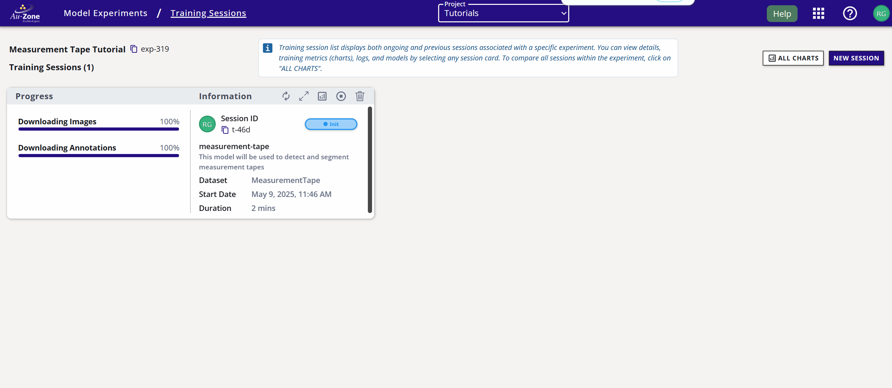

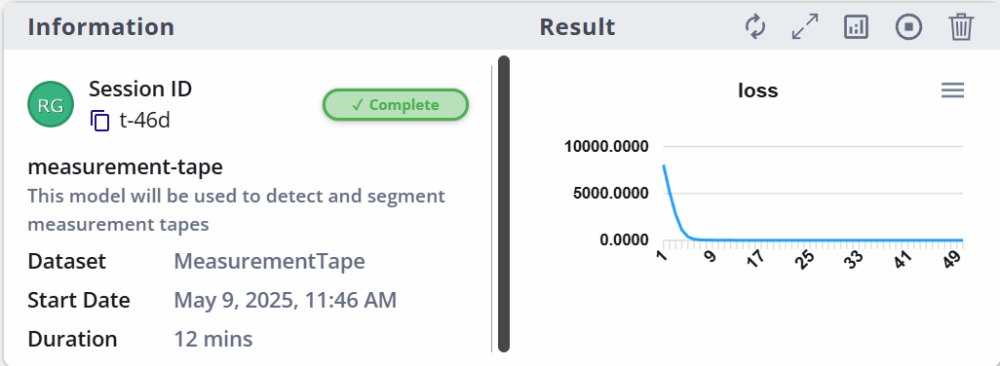


## Model Inference on PC 

Now that ModelPack has been trained on our dataset, we can download the `modelpack.onnx` file from the artifacts and run inference. In this section, we'll walk through the steps required to run the model and visualize the results.


### Requirements

Install the following dependencies in your local python environment:

```shell
pip install Pillow
pip install onnxruntime 
```

### Inference


Before running inference we need to load the model into an ONNX Inference Session.

```python

import onnxruntime as ort
from PIL import Image, ImageDraw, ImageFont
import numpy as np

session = ort.InferenceSession(model_path, providers=providers)
```

Once the session is loaded we can query the model input parameters in order to resize the input tensor to the correct dimensions.

```python

# Get input and output details
input_name = session.get_inputs()[0].name
input_shape = session.get_inputs()[0].shape
output_names = [output.name for output in session.get_outputs()]

# Assume input shape: [1, height, width, 3] or [1, 3, height, width]
_, height, width, _ = input_shape if len(input_shape) == 4 else (
    None, input_shape[2], input_shape[3], input_shape[1])

# Load the image
original = Image.open(image_path).convert("RGB")

# Resize The Image and build the input tensor
image = original.resize((width, height))
image = np.array(image, dtype=np.float32)
image = image / 255.0 # Unsigned normalization is requiered for float ModelPack
input_data = np.expand_dims(image, axis=0)
```

with the tensor already prepared, we can run the inference by calling:

```python
# Call the Model
boxes, scores, masks = session.run(output_names, {input_name: input_data})
```

The model produces three outputs: bounding boxes, class scores, and segmentation masks.
These outputs require post-processing to filter out unnecessary boxes and extract class IDs.

For mask decoding, we select the highest probability index for each pixel:

```python

masks = np.argmax(masks, axis=-1)
masks = masks.astype(np.uint8)

# Visualize the results
masks = Image.fromarray(masks[0])
masks = masks.resize((original.width, original.height), Image.NEAREST)

# Overlay masks on the original image
unique_labels = np.unique(masks).tolist()
unique_labels.sort()
colors = np.random.randint(0, 256, (len(unique_labels) - 1, 3))

for label in unique_labels[1:]:
    mask = np.array(masks)
    mask = mask == label
    color_mask = np.array(original)
    color_mask[mask] = colors[label - 1]
    original = Image.blend(
        original.convert('RGBA'),
        Image.fromarray(color_mask).convert('RGBA'),
        alpha=0.5
    )
```

To filter the bounding boxes, we will use the Non-Maximum Suppression (NMS) algorithm. Before applying NMS, we first remove predictions with confidence scores below a threshold of 0.25.

```python

# Reshape boxes and scores and compute classes
boxes = np.reshape(boxes, (-1, 4))
scores = scores[0][..., 1:]  # remove background boxes first
classes = np.argmax(scores, axis=-1).reshape(-1)

# Prefilter boxes and scores by minimum score
max_scores = np.max(scores, axis=-1)
mask = max_scores >= 0.25

# Prefilter the boxes, scores and classes IDs
scores = max_scores[mask]
boxes = boxes[mask]
classes = classes[mask]
```

Now we are ready to run the NMS algorithm and remove boxes with overlap higher than 0.5:


```python
keep = NMS(
    boxes,
    scores,
    threshold=0.5
)

```

One more time, we need to filter the boxes, scores and classes by `keep` indices:

```python

# Filter boxes, scores, and classes
boxes = boxes[keep]
scores = scores[keep]
classes = classes[keep]

# Visualize the results
font = ImageFont.load_default()
font._size = 100

for box, score, cls in zip(boxes, scores, classes):
    xmin, ymin, xmax, ymax = box
    # Resize boxes to original size
    xmin = int(xmin * original.width)
    ymin = int(ymin * original.height)
    xmax = int(xmax * original.width)
    ymax = int(ymax * original.height)
    # Draw boxes into original image
    draw = ImageDraw.Draw(original)
    draw.rectangle((xmin, ymin, xmax, ymax),
                    outline=tuple(colors[cls - 1]), width=5)
    draw.text((xmin, ymin),
                f"{labels[cls]}: {score:.2f}", fill=tuple(colors[cls - 1]), font=font)
```

Finally, we can save the output image by calling the following function:

```python
original.save("output_onnx.png")
```

In our case, the output looks like:

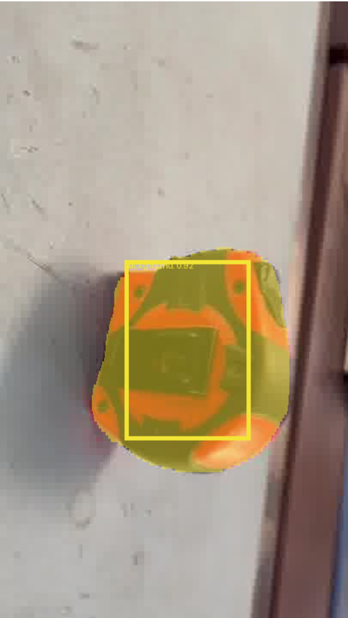


## Appendix 1: NMS Code snippet


```python

# NMS implementation in Python and Numpy
def NMS(bboxes, psocres, threshold):

    xmin = bboxes[:, 0]
    ymin = bboxes[:, 1]
    xmax = bboxes[:, 2]
    ymax = bboxes[:, 3]

    sorted_idx = psocres.argsort()[::-1]
    areas = (xmax - xmin + 1) * (ymax - ymin + 1)

    keep = []
    while len(sorted_idx) > 0:
        rbbox_i = sorted_idx[0]
        keep.append(rbbox_i)

        overlap_xmins = np.maximum(xmin[rbbox_i], xmin[sorted_idx[1:]])
        overlap_ymins = np.maximum(ymin[rbbox_i], ymin[sorted_idx[1:]])
        overlap_xmaxs = np.minimum(xmax[rbbox_i], xmax[sorted_idx[1:]])
        overlap_ymaxs = np.minimum(ymax[rbbox_i], ymax[sorted_idx[1:]])

        overlap_widths = np.maximum(0, (overlap_xmaxs - overlap_xmins+1))
        overlap_heights = np.maximum(0, (overlap_ymaxs - overlap_ymins+1))
        overlap_areas = overlap_widths * overlap_heights

        ious = overlap_areas / \
            (areas[rbbox_i] + areas[sorted_idx[1:]] - overlap_areas)

        delete_idx = np.where(ious > threshold)[0]+1
        delete_idx = np.concatenate(([0], delete_idx))

        sorted_idx = np.delete(sorted_idx, delete_idx)

    return keep
```