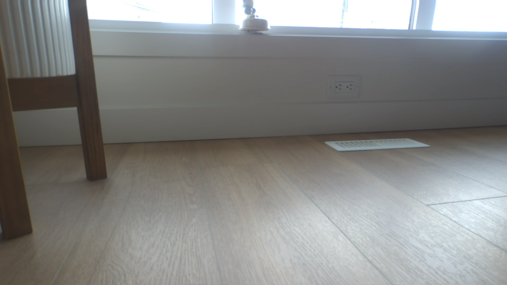
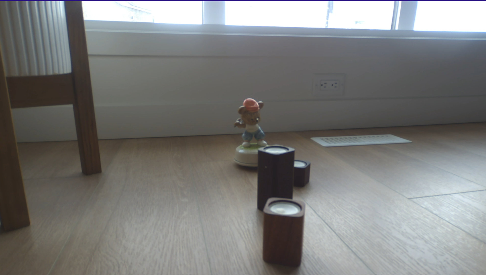
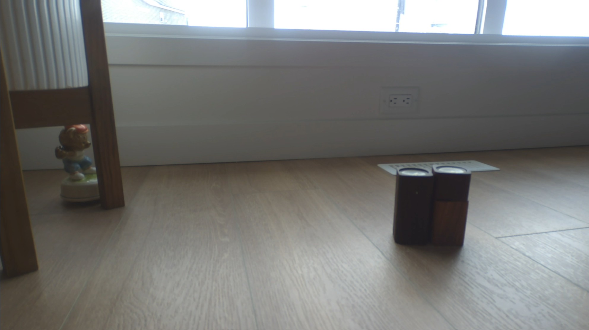
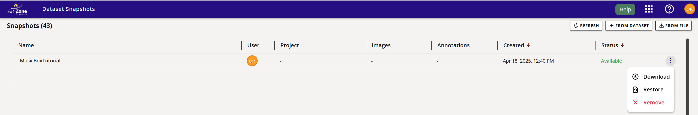
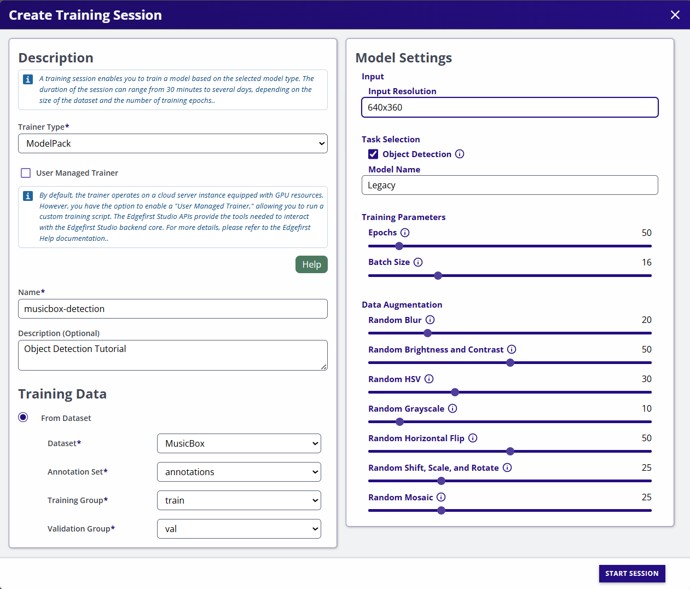

# Tutorial 2: MusicBox Detector

This tutorial will demonstrate the four most important stages in every Machine Learning process.

<figure markdown="span">
{ align=center }
<figcaption>Machine Learning Process</figcaption>
</figure>

* [Data Collection](#data-collection)
* [Data Annotation](#data-annotation)
* [Model Training](#model-training)
* [Model Deployment](#model-deployment)

The process begins with the [Maivin Platform](../../../platforms/index.md).  Using the web interface on the device, we can start the recording process.  Once data is recorded, we can access the recording files and import them into [EdgeFirst Studio](../../../studio/index.md).  Studio will create a dataset from the recording. Once the dataset is created, we can begin the annotation process to produce both bounding boxes and segmentation masks.  For this tutorial, we will focus solely on bounding boxes.

The duration of the annotation process depends on the dataset size.  For this specific dataset, which contains approximately 150 images, the entire annotation process takes around 3 minutes. After annotation, we need to partition the dataset and use ModelPack for training.  The training process will generate the model checkpoints, which will be deployed to the target device in the final step.

## Data Collection

To begin recording a dataset, power on the [Maivin](../../../platforms/quickstart.md) platform and connect it to a network in order to access the [Web User Interface (WebUI)](../../../platforms/walkthrough.md).

<figure markdown="span">
{ align=center }
<figcaption>Web UI Main Page</figcaption>
</figure>

Follow these instructions for [capturing data](../../../datasets/tutorials/capture.md#capture-with-an-edgefirst-platform) using an EdgeFirst Platform.

<figure markdown="span">
{ align=center }
<figcaption>Segmentation View</figcaption>
</figure>

!!! tip "Segmentation View"
    We recommend using the **Segmentation** view first to check the camera is enabled and the target object is visible.

The recording process takes a few seconds to initialize all services on the device.  Once ready, the GUI will display the name of the recording (in red) that is about to begin.  Now switch to the camera view and start interacting with the object — reposition it, and make creative or playful changes to the scene.

|  |  |  |
|------------------------------|------------------------------|------------------------------|
|  |  |  |

!!! reminder
    Randomness helps improve dataset quality and enhances the model’s generalization ability.

Once you have completed your recording, you can find instructions for [downloading](../../../datasets/tutorials/capture.md#download-mcap) your recording to your PC and [uploading](../../../datasets/tutorials/capture.md#upload-mcap) the recording to EdgeFirst Studio.

### Restore Snapshot

!!! warning
    Restoring a snapshot will incur costs against your EdgeFirst Studio account.

In the Snapshot interface, hover over "MusicBoxTutorial" (renamed above). A three-dot menu will appear on the right side of the GUI (next to "Available").
Click it and select Restore.  See [Restore Snapshots](../../../studio/snapshots.md#restore-snapshot) for details.

<figure markdown="span">
{ align=center }
<figcaption>Restore Snapshot</figcaption>
</figure>

The GUI will prompt you to select a project and dataset name.  Choose the "Tutorials" project and name the dataset *MusicBoxTutorial*.

<figure markdown="span">
{ align=center }
<figcaption>Restore Snapshot Dialog</figcaption>
</figure>

!!! tip "Additional Options"
    The restore dialog provides advance options like *Topic Selection*, *Frame Rate*, *Depth Generation*, and *Automatic Ground Truth Generation*.  Leave all options at their default settings.  These features are explained in [AGTG](../../../studio/agtg.md).

Click **RESTORE SNAPSHOT**.  The dialog will close, and the dataset API will export the selected MCAP topics into a dataset, which will appear in the Dataset User Interface.  Progress is shown in the Dataset UI.

<figure markdown="span">
{ align=center }
<figcaption>Dataset UI</figcaption>
</figure>

The dataset is exported in [EdgeFirst Studio Format](../../../datasets/format/index.md).

## Data Annotation

Once the dataset is exported, we can see all the recorded sequences.

<figure markdown="span">
{ align=center }
<figcaption>Dataset Gallery</figcaption>
</figure>

In the dataset view, add the classes to be annotated.  For now, we will add a single class: `musicbox`.
Now we can start annotating the sequences.  It's important that the dataset was imported as sequences, so the AGTG pipeline can use timing and tracking data to annotate most frames automatically.

Select any sequence to visualize it.  Remember that MCAPs were exported at one frame per second.

If you are new to Studio, refer to [Automatic Ground Truth Generation (AGTG)](../../../datasets/tutorials/annotations/automatic.md#semi-automatic-ground-truth-generation) to learn how to annotate the dataset.
Your dataset should now look like this in the Gallery (disable the "Show Sequences" option).

<figure markdown="span">
{ align=center }
<figcaption>Annotations Overview</figcaption>
</figure>

## Dataset Partition

To train the model, it is essential to [create training and validation](../../../datasets/tutorials/management.md#split-dataset) groups within the dataset.  The training set teaches the model, while the validation set is used to evaluate model performance during training.

<figure markdown="span">
{ align=center }
<figcaption>Dataset Groups</figcaption>
</figure>

## Model Training

As with other Studio features, model training has a dedicated user interface.  See [Model Training](../../training/vision.md) for details.

Inside the experiment, create a New Session and name it `musicbox-detector`. This name is also assigned to the cloud instance under the Studio console.

* **Trainer**: `ModelPack`

* **Description**: `Object Detection`

* **Dataset**: `MusicBoxTutorial`

* **Groups**: Select `train` and `val`

Most hyper parameters are auto-tuned by ModelPack, but some can be customized:

* **Input Resolution**: `640x360
`
* **Model Name**: `Legacy` (more model variants are going to be integrated in future versions)

* **Epochs**: `50 (default)`

* **Batch Size**: `Default is 16.`

Since our dataset is small, we need to use strong data augmentation to prevent overfitting and it is recommended to slightly increase the probability for each augmentation technique.

<figure markdown="span">
{ align=center }
<figcaption>Training Session</figcaption>
</figure>

After creation, your session should look like the following.

<figure markdown="span">
{ align=center }
<figcaption>Training Session Progress</figcaption>
</figure>

## Model Deployment

Once training completes, follow these steps for [deploying the model](../../deployment/maivin.md) to the Maivin platform.

Begin testing the model with the object. If the model does not perform as expected, record a few more minutes of data and repeat the training process.  Use this opportunity to identify edge cases and collect additional samples that can help improve the model's performance.

## Conclusion

In this tutorial, we walked through the complete process of building and deploying an object detection model on an embedded device using the Maivin Platform, EdgeFirst Studio, and ModelPack.  From data collection to model deployment, we covered a few essential steps of the machine learning pipeline:

* Data Collection using the Maivin Web Interface
* Data Annotation with EdgeFirst Studio
* Model Training with ModelPack
* Model Deployment on the Maivin unit

This workflow is not limited to object detection, the same process applies to any dataset type and to both segmentation and detection tasks, making it a powerful and consistent pipeline for embedded AI development.

Thanks to the **Automatic Ground Truth Generation** ([AGTG](../../../studio/agtg.md)) feature, the annotation process becomes significantly faster and easier often requiring just a few clicks per sequence to annotate large volumes of data.  This drastically reduces the manual labelling effort while maintaining high-quality ground truth data.

By following this tutorial, you now have a practical understanding of how to:

* Collect and prepare real-world data using the Maivin platform
* Use AGTG to automate the annotation process
* Train compact, optimized models with ModelPack
* Deploy models to the edge for real-time inference

This workflow ensures repeatability, scalability, and efficient development for embedded machine learning applications.  Whether you are building a smart camera, an industrial monitor, or a self driving vehicle, or an edge AI prototype, this pipeline helps you go from raw data to deployment quickly and effectively.
