# Tutorial 1: The MusicBox Detector

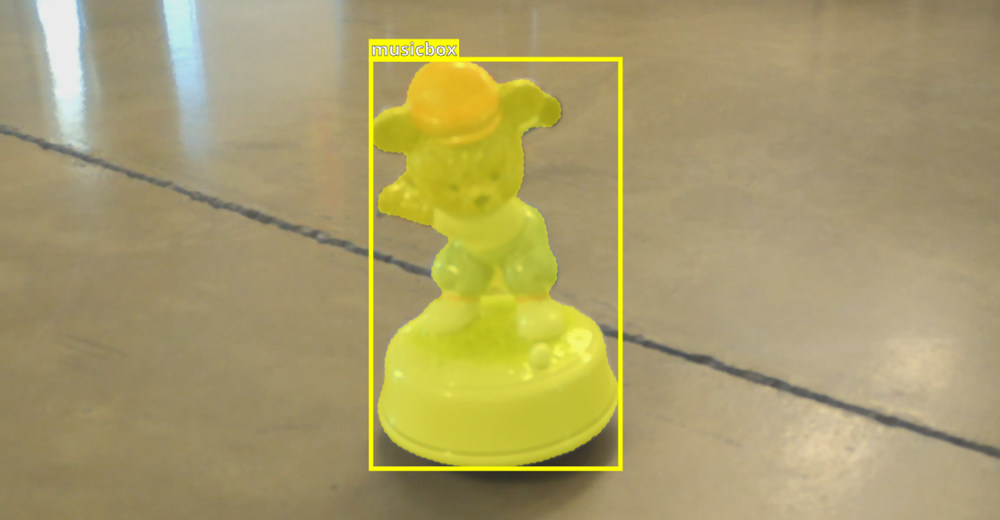

In this tutorial, we will demonstrate how to execute the four most important steps in every Machine Learning pipeline: **Data Collection**, **Data Annotation**, **Model Training**, and **Model Deployment**.

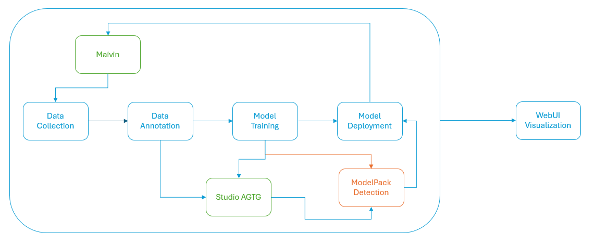

The process begins with the [Maivin Platform](../../../platforms/index.md). Using the web interface on the device, we can start the recording process. Once data is recorded, we can access the recording files and import them into Studio. Studio will create a dataset. Once the dataset is created, we can begin the annotation process to produce both bounding boxes and segmentation masks. For this tutorial, we will focus solely on bounding boxes.

The duration of the annotation process depends on the dataset size. For this specific dataset, which contains approximately 150 images, the entire annotation process takes around 3 minutes. After annotation, we need to partition the dataset and use ModelPack for training. The training process will generate the model checkpoints, which will be deployed to the target device in the final step.

## Data Collection

To begin recording a dataset, power on the Maivin platform and connect it to a network in order to access the Web Interface (WebUI).

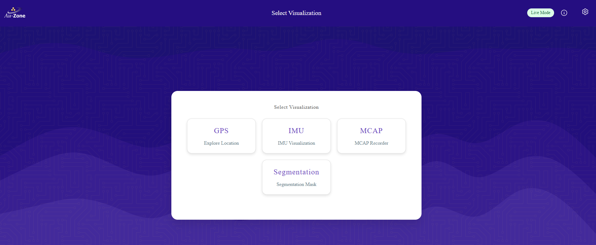


The default interface will load once you open the homepage on the target device in your browser (Google Chrome is recommended).
For this tutorial, we’ll use only two out of the four options available on the WebUI:

- **Segmentation Model**: Displays the live camera feed along with the default people segmentation model.

- **MCAP**: Allows you to control recording options and provides download links for each recording stored on the Maivin device.

For a detailed walkthrough, see [Web UI Walkthrough](../../../platforms/walkthrough.md)


The first recommended step is to go to the **Segmentation** view to check the camera’s field of view and ensure your target object is visible.

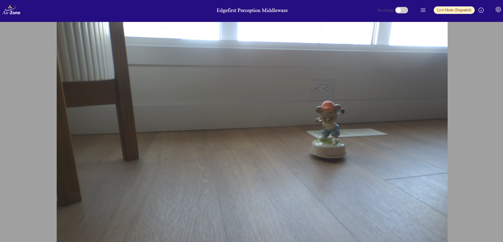.

Once the object is clearly visible, return to the homepage and select the MCAP option to start recording. Click the Recording button (toggle on the left side).

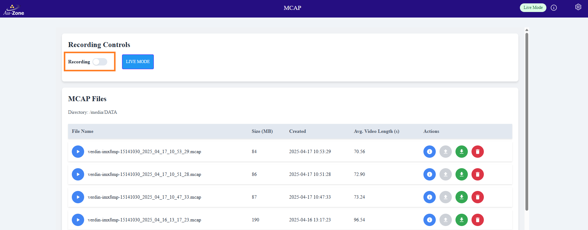

The recording process takes a few seconds to initialize all services on the device. Once ready, the GUI will display the name of the recording (in red) that is about to begin. Now switch to the camera view and start interacting with the object — reposition it, and make creative or playful changes to the scene.

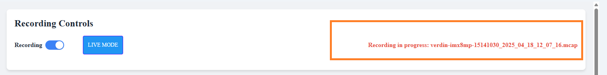


| 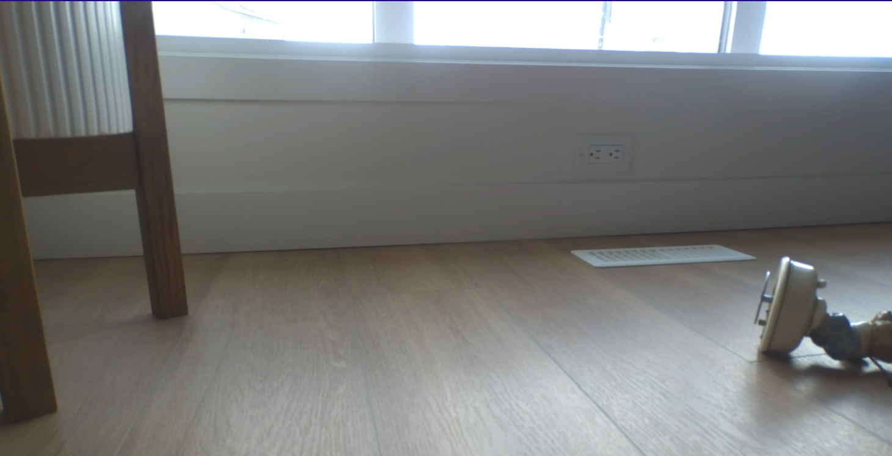 |  | 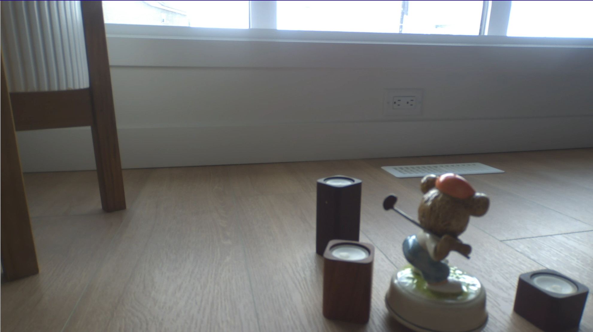 |
|------------------------------|------------------------------|------------------------------|
|  | 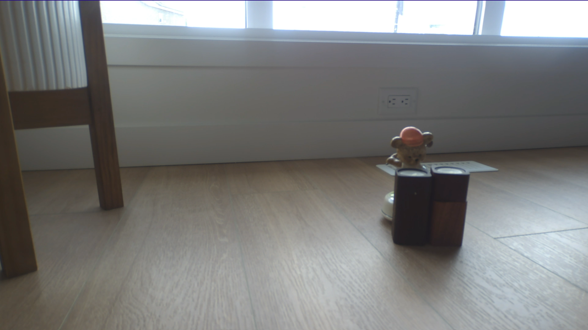 |  |


!!! Remainder
    Randomness helps improve dataset quality and enhances the model’s generalization ability.


Now it’s time to download the dataset from the unit and upload it to Studio for annotation and model training. On the MCAP page, click the download icon next to each MCAP file and save it to your local PC.

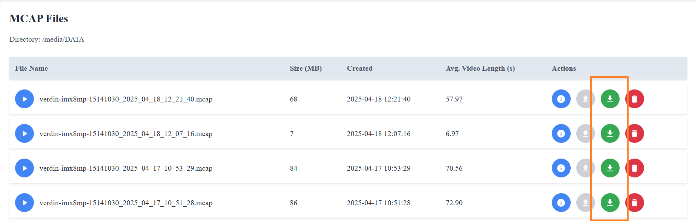

Once stored locally, you’re ready to import the MCAPs into Studio via the [Snapshot Dashboad](../../../studio/snapshots.md).

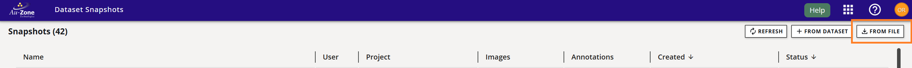

In the GUI, click the **FROM FILE** button (top-right corner). This opens a multi-file selection dialog to upload all MCAP files at once. Studio will upload the files to the cloud for preprocessing. The GUI will show the name of one of the MCAPs as the default snapshot name. You can rename it by clicking on it (e.g., rename to *MusicBoxTutorial*).

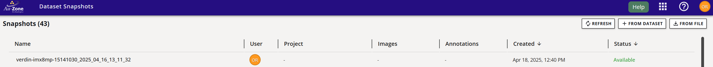

Before restoring the dataset, you need to [Create a Project](../../../studio/projects.md) and name it *Tutorials*

### Restore Snapshot

In the Snapshot interface, hover over *MusicBoxTutorial* (renamed above). A three-dot menu will appear on the right side of the GUI (next to "Available"). 
Click it and select Restore. See [Restore Snapshots](../../../studio/snapshots.md) for details.


The GUI will prompt you to select a project and dataset name. Choose the *Tutorials* project and name the dataset *MusicBoxTutorial*.

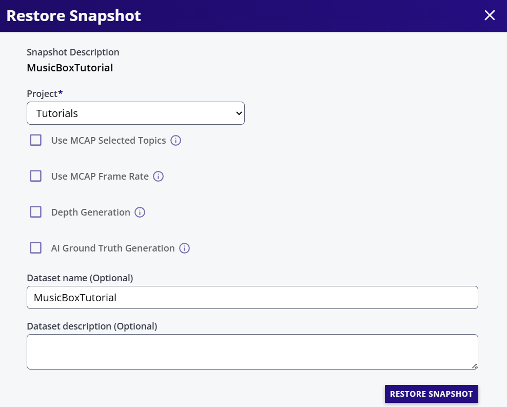

!!! tip "Additional Options" 
    The restore dialog provides advanced options like *Topic Selection*, *Frame Rate*, *Depth Generation*, and *Automatic Ground Truth Generation*. Leave all options at their default settings. These features are explained in [AGTG](../../../studio/agtg.md)

Click **RESTORE SNAPSHOT**. The dialog will close, and the dataset API will export the selected MCAP topics into a dataset, which will appear in the Dataset User Interface. Progress is shown in the Dataset UI.

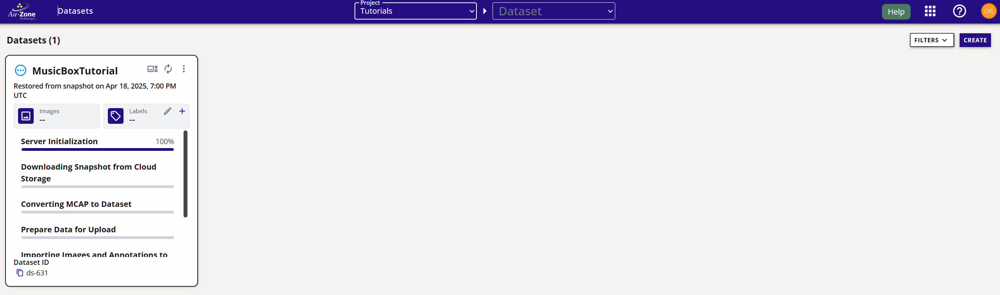

The dataset is exported in [EdgeFirst Studio Format](../../../datasets/format.md)

## Data Annotation

Once the dataset is exported, we can see all the recorded sequences.

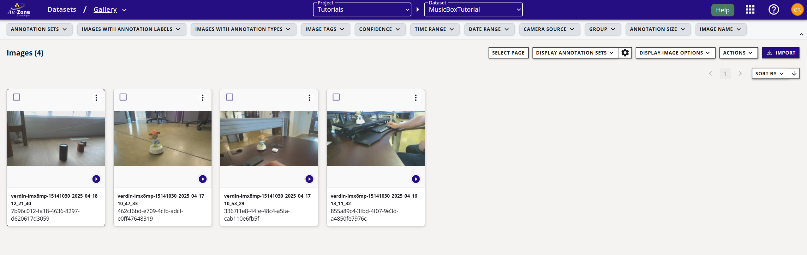

Once the dataset is exported, you will see all the recorded sequences.

In the dataset view, add the classes to be annotated. For now, we will add a single class: musicbox.
Now we can start annotating the sequences. It's important that the dataset was imported as sequences, so the AGTG pipeline can use timing and tracking data to annotate most frames automatically.

Select any sequence to visualize it. Remember that MCAPs were exported at one frame per second.


If you are new to Studio, refer to [Automatic Ground Truth Generation (AGTG)](../../../studio/agtg.md) to learn how to annotate the dataset. 
Your dataset should now look like this in the Gallery (disable the *Show Sequences* option):

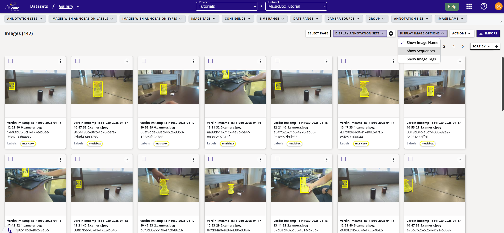

## Dataset Partition

To train the model, it is essential to create training and validation groups within the dataset.
The training set teaches the model, while the validation set is used to evaluate model performance during training.

On the dataset card, click the + button next to *Group* and create two groups: `train` and `val`.
Assign 80% of the data to training and 20% to validation.


The data is randomly distributed between both groups.

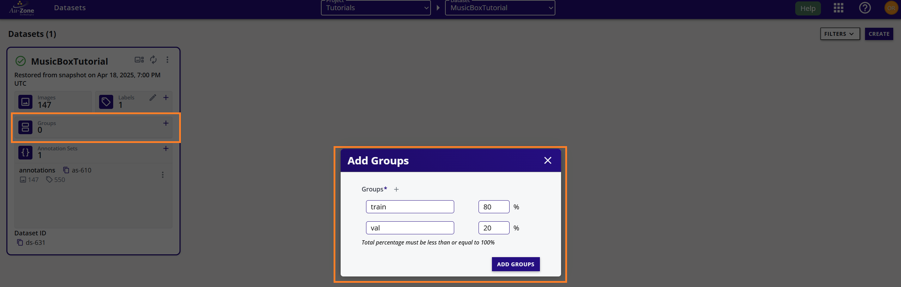

Data is randomly added to each dataset.

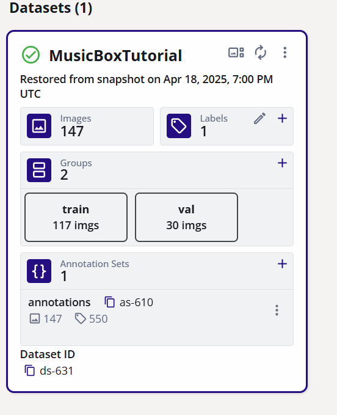


## Model Training

As with other Studio features, *Model Training* has a dedicated user interface. See [Model Training](./../training.md) for details
First, create an experiment to store all training sessions related to this dataset. Name it *MusicBox Detection Tutorial*. See [Create Training Experiment](../training.md) for details.

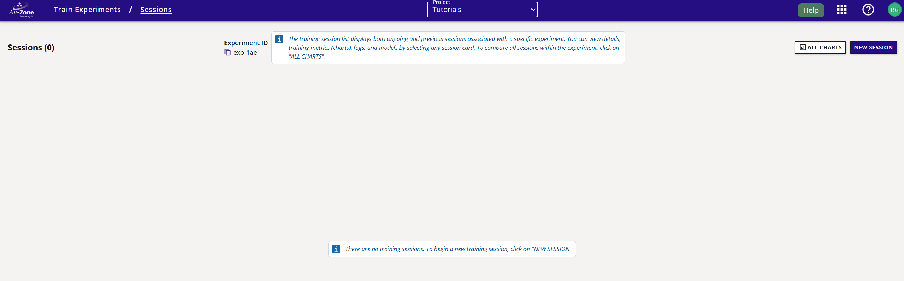

Experiments are useful for comparing parameters across the same dataset and task, and for staying organized.

Inside the experiment, create a New Session and name it `musicbox-detector`. This name is also assigned to the cloud instance under the Studio console.

- **Trainer**: `ModelPack`

- **Description**: `Object Detection`

- **Dataset**: `MusicBoxTutorial`

- **Groups**: Select `train` and `val`

Most hyperparameters are auto-tuned by ModelPack, but some can be customized:

- **Input Resolution**: `640x360
`
- **Model Name**: `Legacy` (more model variants are going to be integrated in future versions)

- **Epochs**: `50 (default)`

- **Batch Size**: `Default is 16.`

For small datasets, a large batch size may produce poor results. Use a batch size of 4 or 8.

Since our dataset is small, we need to use strong data augmentation to prevent overfitting and it is recommended to increase a bit the probability for each augmentation technique.

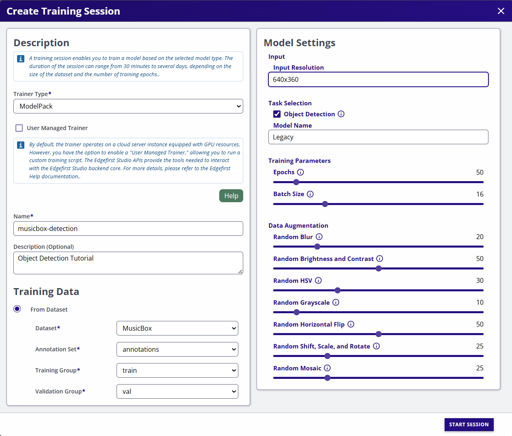

After creation, your session should look like this:

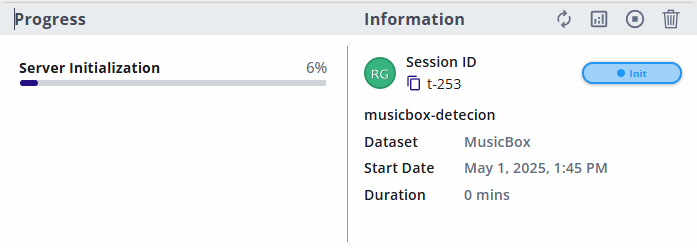

You’ll find general training info in this summarized view. Additional actions are available via the top buttons (top-right of the training card).

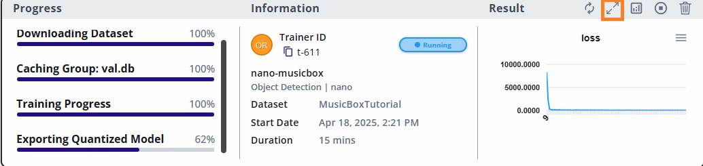

The training process begins with cloud instance initialization. Then the dataset is downloaded and cached. Training starts afterward.
At the end of the training process, ModelPack quantizes the model and publishes the checkpoints.

Clicking the training card will show the expanded view containing all the logs and checkpoints.

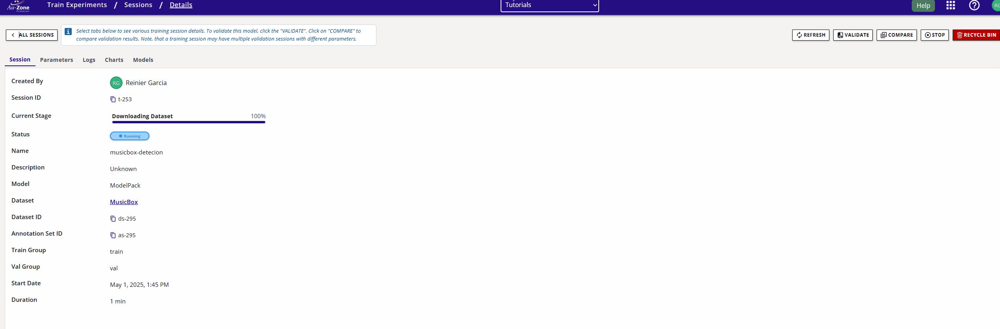

From the available checkpoints, download the **TFLite** model - optimized for embedded devices — and deploy it to the Maivin unit for edge inference.

## Model Deployment

In the expanded session view, download the **TFLite** model and copy it to the Maivin device using scp:

`scp modelpack.tflite torizon@verdin-imxmp-xxxxx:~/modelpack.tflite`

From this point, there are two different options to deploy the new trained model. The first one is to change the model path from the WebUI on the device and the second one is changing the path to the model in the service configuration file.

### Model Deployment via WebUI

From the WebUI the user must access to the Model Settings view and change the model location there:


Remember to save the configurations at the end of the process. The  Model Configuration page can be accessed via the following url:
`https://verdin-imx8mp-xxxxx/config/model`

### Manual Model Deployment

In case the manual deployment is needed, you need to connect to the device via ssh:

```shell
$ ssh torizon@verdin-imx8mp-15141030
```

and edit the model parameters in `/etc/default/model`

```shell
$ vi /etc/default/model
```

then restart the model service using the `systemctl` command

```shell
$ sudo systemctl stop model
$ sudo systemctl start model 
```

!!! tip "Model Excecution" 
    Rember to use **sudo** to start and stop model services

Now the model is running, open the browser and check the camera to see the model detection the object.


Begin testing the model with the object. If the model does not perform as expected, record a few more minutes of data and repeat the training process. Use this opportunity to identify edge cases and collect additional samples that can help improve the model's performance.

## Conclusion

In this tutorial, we walked through the complete process of building and deploying an object detection model on an embedded device using the Maivin Platform, EdgeFirst Studio, and ModelPack. From data collection to model deployment, we covered few essential step of the machine learning pipeline:

- Data Collection using the Maivin Web Interface

- Data Annotation with EdgeFirst Studio

- Model Training with ModelPack

- Model Deployment on the Maivin unit

This workflow is not limited to object detection, the same process applies to any dataset type and to both segmentation and detection tasks, making it a powerful and consistent pipeline for embedded AI development.

Thanks to the **Automatic Ground Truth Generation** (AGTG) feature, the annotation process becomes significantly faster and easier—often requiring just a few clicks per sequence to annotate large volumes of data. This dramatically reduces manual labeling effort while maintaining high-quality ground truth data.

By following this tutorial, you now have a practical understanding of how to:

- Collect and prepare real-world data

- Use AGTG to automate annotation

- Train compact, optimized models with ModelPack

- Deploy models to the edge for real-time inference

Using this workflow ensures repeatability, scalability, and efficient development for embedded machine learning applications. Whether you're building a smart camera, an industrial monitor, or a self driving vehicle, or an edge AI prototype, this pipeline helps you go from raw data to deployment quickly and effectively.

