# Validating Modelpack

This page will provide a walk-through for validating the performance of Vision models that have been trained using Modelpack in EdgeFirst Studio, through the [QuickStart Guide](../../index.md) or [Training Modelpack](training.md).  This page will focus only on the validation of Modelpack.

## Select the Validator Tool

Select *Validator* from the tool options.

<figure markdown="span">
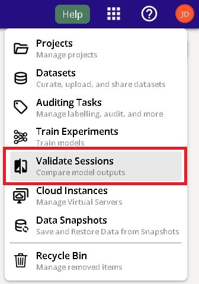{ align=center }
<figcaption>Tool Options</figcaption>
</figure>

## Specify the Project

Specify the project to run validation at the center of the top menu bar.

<figure markdown="span">
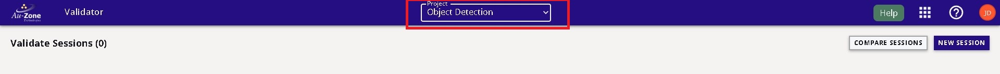{ align=center }
<figcaption>Project Selection</figcaption>
</figure>

## Create Validation Session
 
Create a new validation session by clicking the *create* button on the top right of the page.

<figure markdown="span">
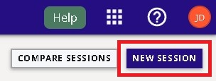{ align=center }
<figcaption>Create New Session</figcaption>
</figure>

Configure the settings on the left panel by specifying the name of the validation session, 
the model file to validate, and the dataset to deploy.  Next configure the settings 
on the right panel by specifying the validation parameters.

!!! note
    Additional information on these parameters are provided by hovering over the info button.

<figure markdown="span">
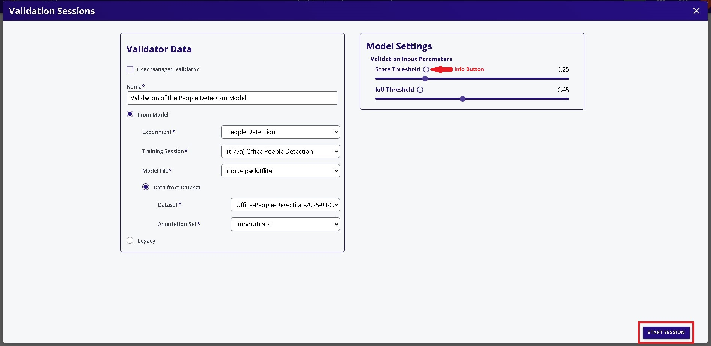{ align=center }
<figcaption>Validation Options</figcaption>
</figure>

## Start the Session 

Start the session by clicking the *START SESSION* button on the bottom right.

<figure markdown="span">
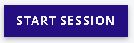{ align=center }
<figcaption>Start the Session</figcaption>
</figure>

## Session Progress

The validation session has now started while the progress is tracked on the left 
panel and additional information and status is shown on the right panel.  

<figure markdown="span">
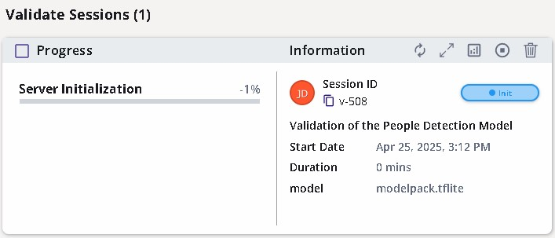{ align=center }
<figcaption>Validation Session</figcaption>
</figure>

<figure markdown="span">
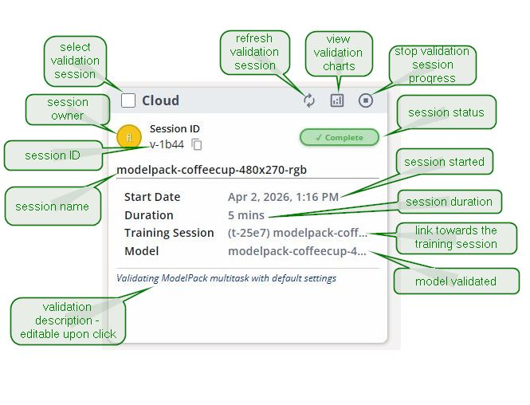{ align=center }
<figcaption>Validation Session Attributes</figcaption>
</figure>

## Completed Session

Once completed, the status will be shown as complete.

<figure markdown="span">
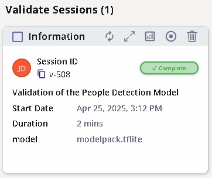{ align=center }
<figcaption>Completed Session</figcaption>
</figure>

## Validation Metrics 

The metrics are shown by clicking the button that views the validation charts on the top left of the session card.  

<figure markdown="span">
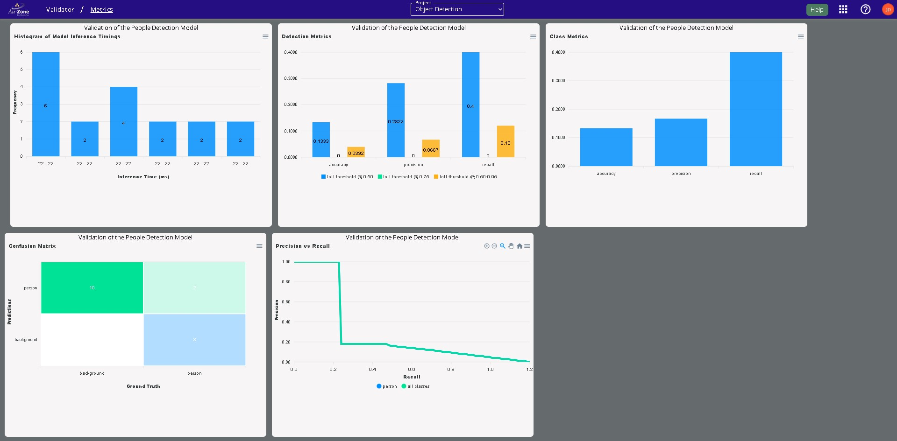{ align=center }
<figcaption>Validation Metrics</figcaption>
</figure>

!!! note
    See [Validation Metrics](../metrics.md#modelpack) for further details.

## Comparing Metrics

It is also possible to compare validation metrics for multiple sessions.  
This is done by checking the checkboxes on the top left of the session cards.

<figure markdown="span">
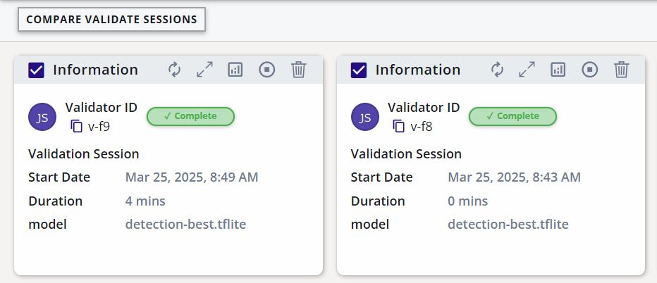{ align=center }
<figcaption>Comparing Sessions</figcaption>
</figure>

Compare the validation sessions by clicking the *COMPARE VALIDATE SESSION* button on the top left.  This will display the validation metrics side by side for the specified validation sessions.

<figure markdown="span">
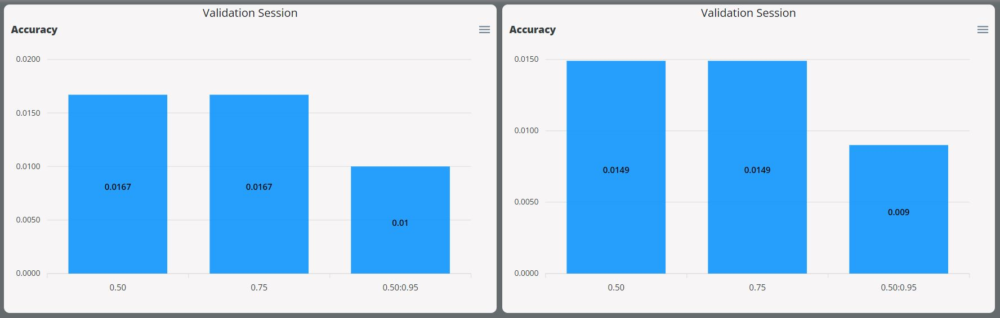{ align=center }
<figcaption>Metrics Side-by-Side</figcaption>
</figure>

## Next Steps

Now that you have validated your Vision model, follow these next steps for [deploying your Vision model](deployment.md).