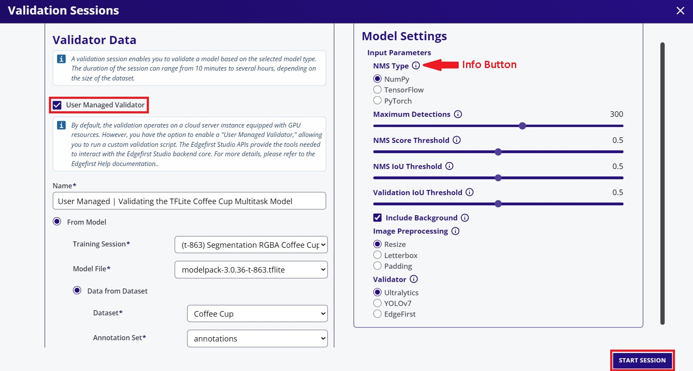
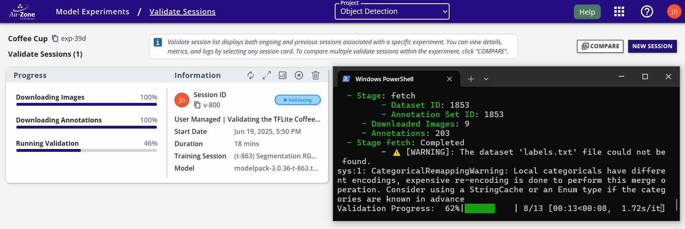
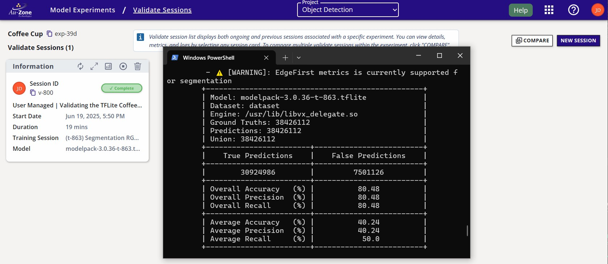
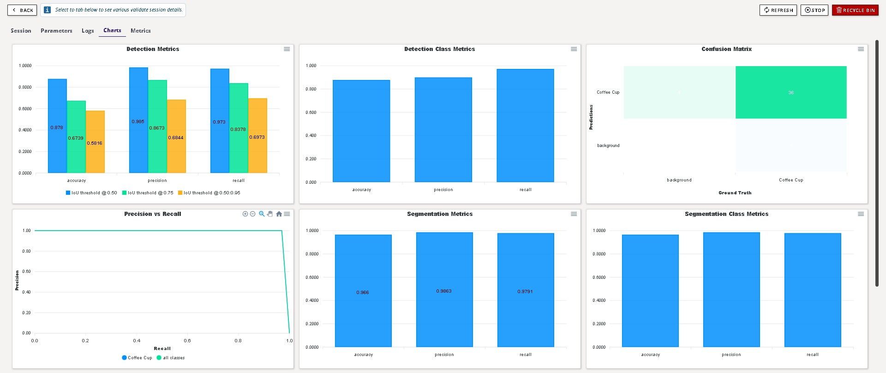
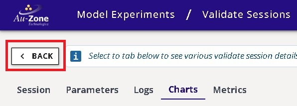

# User Managed Validation

This tutorial will describe the steps to validate the performance of **ModelPack Vision** models as user-managed sessions in EdgeFirst Studio that have been trained through the [end-to-end worklows](../../../getting_started/workflows/index.md) or [Training ModelPack](../training.md).  A user-managed validation session is hosted in an embedded platform for a proper measurement of the model inference times when deployed on target.  A [managed validation](managed.md) session creates an EC2 server to deploy the model for validation.



You will be greeted with the validation session configuration window.  In this window, specify the "User Managed Validator" to true as shown in red. Next specify the name of the validation session, the model to validate, and the dataset to deploy.  In this example, the TFLite model will be validated and the "Coffee Cup" dataset with the validation partition will be used.  Next specify, the validation parameters on the right.  Additional information on these parameters are provided by hovering over the info buttons as indicated in red below. 

<figure markdown="span">
{ align=center }
<figcaption>Validation Session Fields</figcaption>
</figure>

Once the configurations have been made, go ahead and click on the "Start Session" button on the bottom right of the window.  This will create the validation session to track validation progress that will run in the embedded platform. 

## Session Progress

Once the validation session has been created, [SSH](../../../platforms/ssh.md) into the platform and install the following dependencies. 

!!! warning "Virtual Environment"
    To avoid reinstallation of existing system packages, we recommend setting up a python virtual environment
    prior to running the pip installations below.

```shell
pip install edgefirst-validator
```

Next login to your account in EdgeFirst Studio by using the [EdgeFirst Client](../../../perception/studio.md) which comes installed with the validator package. The command below will prompt you to enter your EdgeFirst Studio credentials. 

```
edgefirst-client --server <> login
```

!!! note
    Specify the EdgeFirst Studio server among these variations: "test", "stage", "saas".  This is an optional parameter as the default is set to "saas". 

Next download the dataset using edgefirst-client by following the commands shown
for downloading the [dataset](../../../perception/studio.md#dataset-operations) and the [annotations](../../../perception/studio.md#annotation-management).

Once the validator is installed and authenticated, run validation using the following command.

```shell
edgefirst-validator --session-id v-800
```

!!! note
    Replace the session ID parameter specific to the validation session ID in your project.

Once entered, the following validation progress should now be indicated in EdgeFirst Studio as shown below.

<figure markdown="span">
{ align=center }
<figcaption>Validation Session</figcaption>
</figure>

## Completed Session

The completed session will look as follows with the status set to "Complete".

<figure markdown="span">
{ align=center }
<figcaption>Completed Session</figcaption>
</figure>

The attributes of the validation session are labeled below.

<figure markdown="span">
{ align=center }
<figcaption>Validation Session Attributes</figcaption>
</figure>

## Validation Metrics 

Once the validation session completes, you can view the validation metrics by clicking the "View Validation Charts" button on the top of the session card.

<figure markdown="span">
{ align=center }
<figcaption>Validation Charts</figcaption>
</figure>

!!! info
    See [detection](../../metrics/detection.md) and [segmentation](../../metrics/segmentation.md) metrics for further details.

You can go back to the validation session card by pressing the "Back" button as indicated in red below on the top left corner of the page. 

<figure markdown="span">
{ align=center }
<figcaption>Back to the Session Card</figcaption>
</figure>

## Comparing Metrics

It is also possible to compare validation metrics for multiple sessions.  See [Validation Sessions](../../../getting_started/studio.md#validation-sessions) in EdgeFirst Studio Overview for further details. 

## Next Steps

Now that you have validated your Vision model, you can find examples for deploying your model in the [PC](../deployment/pc.md), in the [EVK](../deployment/evk.md), and in the [Maivin Platform](../deployment/maivin.md). 