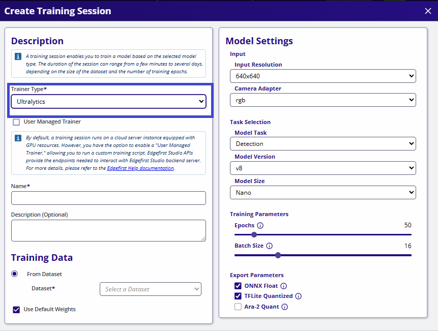
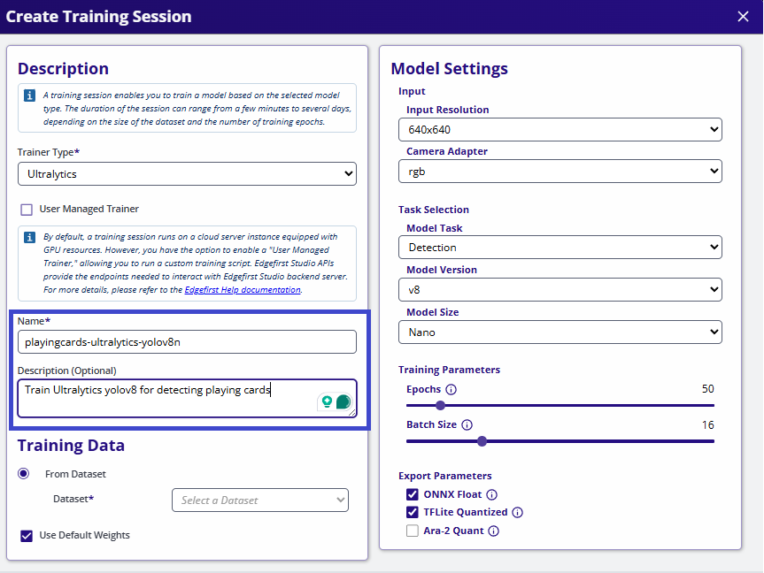
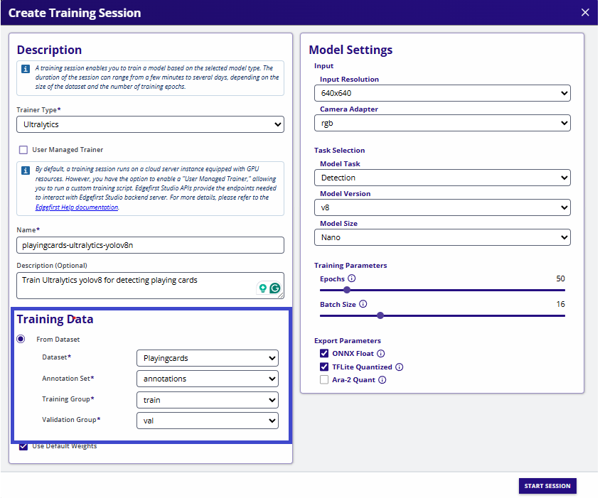
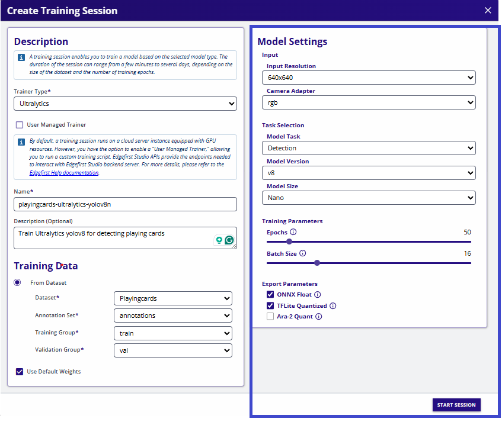

# Ultralytics

The EdgeFirst Studio Model Zoo includes the [Ultralytics](https://docs.ultralytics.com/) YOLO which is a popular implementation of the ubiquitous YOLO architecture for one-shot detection models, and capable of being applied to various other tasks such as instance segmentation.  This document describes the integration into EdgeFirst Studio, supported features, and optimized deployment strategies.  For further details of the Ultralytics implementation of the YOLO architecture, please refer to their documentation.

Our Model Zoo ecosystem provides a collection of models to be re-trained through EdgeFirst Studio and deployed to a wide range of devices using a consistent workflow to achieve the best performance and latency at the edge.

## Getting Started

YOLOv8 and YOLOv11 can be trained now in Edgefirst Studio using a Graphical User Interface by following four simple steps:

=== "Select Framework"

    <h2 id="select-framework" style="display: none;"></h2>

    1. Select **Ultralytics** within the available training frameworks.

    { align=center }

    

    [Next → 2. Name Session](#name-session){ .md-button .md-button--primary }
    

=== "Name Session"

    <h2 id="name-session" style="display: none;"></h2>

    2. Set a **name** and **description** *(optional)* for the training session.

    { align=center }

    

    [1. Select Framework ← Back](#select-framework){ .md-button }
    [Next → 3. Select Dataset](#select-dataset){ .md-button .md-button--primary }
    

=== "Select Dataset"

    <h2 id="select-dataset" style="display: none;"></h2>

    3. Choose your **dataset**.

    { align=center }

    

    [2. Name Session ← Back](#name-session){ .md-button }
    [Next → 4. Configure & Train](#train){ .md-button .md-button--primary }
    

=== "Train"

    <h2 id="train" style="display: none;"></h2>

    4. **Configure model parameters** (architecture, input size, epochs, etc.) and start **Training**.

    { align=center }

    

    [3. Select Dataset ← Back](#select-dataset){ .md-button }
    [Next → 5. Validate](../validation/vision/managed.md){ .md-button  .md-button--primary }
    

!!! note "Important"
    Datasets and default weights are handled internally by Edgefirst Studio.  There’s no need to migrate or store data locally.

## Custom Models

If you have a custom float model, it is highly recommended to export to a quantized model to deploy and maximize the model's performance using the target's NPU.  In this section, we will show examples of [quantizing float ONNX to a TFLite](quantize.md).  We will also be showing examples of [deploying a quantized ONNX or TFLite](npu.md) in the NXP **i.MX 8M Plus EVK** using the NPU execution providers from onnxruntime or the OpenVX delegate for tflite-runtime to deploy the model in the NPU. 

Deploying a quantized TFLite on the **i.MX 95 EVK** requires an extra step of [converting the model using NXP's eIQ neutron converter](neutron.md).  This will allow the model to be deployed on the i.MX 95 using the Neutron delegate in the platform. 

!!! warning "Specific BSP versions required"

    The latest BSP available for the Maivin lacks the `onnxruntime` library needed to run ONNX on the NPU.

    On the i.MX 8M Plus EVK, BSP v5.15 are used in the examples which was noted to have the providers needed for ONNX to run on the NPU `NnapiExecutionProvider`, `VsiNpuExecutionProvider`.  Later BSPs such as v6.12 did not have these providers.  This still needs confirmation from NXP as to why these providers were removed. 

## License

Ultralytics YOLO is covered by the GNU AGPL-3.0 license which allows for free use of this model within the constraints of the license.  Ultralytics offers [commercial licensing options](https://www.ultralytics.com/license).
