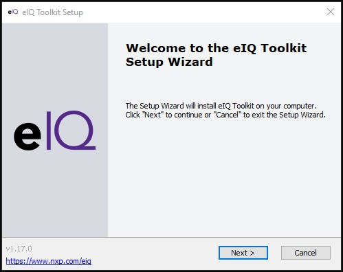
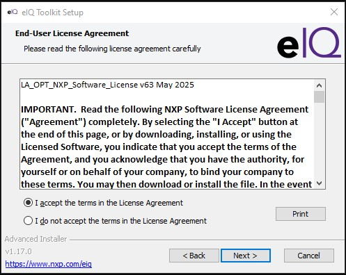
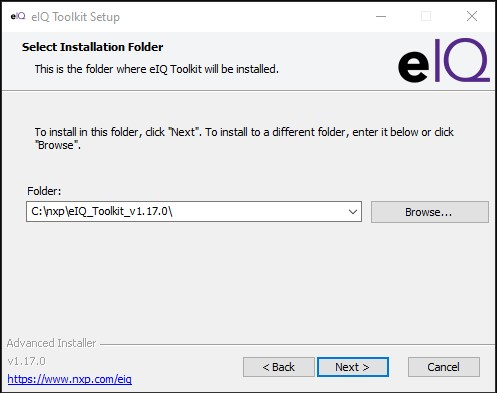

# iMX.95 Neutron Model Conversion

In this section, you will find instructions for converting a quantized TFLite model using [NXP's eIQ Neutron Converter Tool in the eIQ Toolkit](https://community.nxp.com/t5/MCX-Microcontrollers-Knowledge/eIQ-Neutron-NPU-Lab-Guides/ta-p/1799233) to allow deployment of the model in the [NXP i.MX 95](https://www.nxp.com/products/i.MX95) EVK platform.  This will allow you to take [YOLOv8](https://yolov8.com/) TFLite quantized models and run them on the i.MX 95 EVK platform.

## Install eIQ Toolkit

Visit the eIQ Toolkit [Downloads page](https://www.nxp.com/design/design-center/software/eiq-ai-development-environment/eiq-toolkit-for-end-to-end-model-development-and-deployment:EIQ-TOOLKIT).  In this example, the Windows installer is selected.  Click "Download" to download the installer in your system.

{{ figure("assets/eIQ-toolkit-installer.jpg", "eIQ Toolkit Installer") }}

!!! info "NXP Account"

    You will need to be signed in to the [NXP website](https://www.nxp.com) to download the installer.

Once downloaded, click on the executable to start the installation process.

{{ figure("assets/eIQ-toolkit-installer-executable.jpg", "eIQ Toolkit Installer") }}

Follow the Setup Wizard that pops up and accepts the terms and agreement.  

| Setup Wizard                          | Terms and Agreement                       |
|---------------------------------------|-------------------------------------------|
|  |  |

Next, specify the folder to store the toolkit.  It's recommended to keep the suggested path.  Keep all settings default and finally click "Install" to start the installation.

| Installation Path                         | Install                            |
|-------------------------------------------|------------------------------------|
|  |  |

Wait for the installation to finish and once it's done, click "Finish".

| Installation Path                           | Complete                                          |
|---------------------------------------------|---------------------------------------------------|
|  |  |

Once NXP eIQ Toolkit is installed, open a command prompt in your system and verify the installation with the command below.

```shell
>"C:\nxp\eIQ_Toolkit_v1.17.0\eIQ Portal.exe"
```

This should start the eIQ portal.  To exit the application, CTRL-C on the command prompt.

{{ figure("assets/eIQ-portal.jpg", "eIQ Portal") }}

## Run Neutron Converter

Prior to running the converter, confirm your target's BSP.  This will be useful in specifying the version of Neutron Converter needed in your system.

```shell
# uname -a
Linux imx95evk 6.12.20-lts-next-gdfaf2136deb2 #1 SMP PREEMPT Wed Jun  4 10:15:09 UTC 2025 aarch64 GNU/Linux
```

Now, check that Neutron Converter is installed in your system with the version that matches your target's BSP (6.12.20).

```shell
C:\nxp\eIQ_Toolkit_v1.17.0>cd "bin\neutron-converter\MCU_SDK_25.06.00+Linux_6.12.20_2.0.0"

C:\nxp\eIQ_Toolkit_v1.17.0\bin\neutron-converter\MCU_SDK_25.06.00+Linux_6.12.20_2.0.0>neutron-converter.exe --version
eIQ neutron-converter.exe version 2.0.2+0X0cebb80a
```

!!! tip "Help Options"

    You can find the options and descriptions with the command.

    ```shell
    C:\nxp\eIQ_Toolkit_v1.17.0\bin\neutron-converter\MCU_SDK_25.06.00+Linux_6.12.20_2.0.0>neutron-converter.exe --help
    ```

Once that the right version of Neutron Converter is available in your system, you can start converting quantized TFLite models to be executable in i.MX 95 platforms with the command below.  You can find instructions for quantizing ONNX to TFLite in the [Model Quantization section](quantize.md).  In this example, the TFLite model [`yolov8s-seg_full_integer_quant.tflite`](assets/yolov8s-seg_full_integer_quant.tflite){: download="yolov8s-seg_full_integer_quant.tflite"} has been pre-generated using the instructions above on the YOLOv8 Segmentation model.

```shell
C:\nxp\eIQ_Toolkit_v1.17.0\bin\neutron-converter\MCU_SDK_25.06.00+Linux_6.12.20_2.0.0>neutron-converter.exe --input yolov8s-seg_full_integer_quant.tflite --target imx95
Converting model with the following options:
  Input  = yolov8s-seg_full_integer_quant.tflite
  Output = yolov8s-seg_full_integer_quant_converted.tflite
  Target = imx95
INFO: Created TensorFlow Lite XNNPACK delegate for CPU.
Starting Tile scheduling. This might take a while.
[================================================================================] 100 %
Starting TCM allocation. This might take a while.
[================================================================================] 100 %
Conversion statistics:
  Number of operators after import    = 293
  Number of operators after optimize  = 338
    Number of operators converted     = 303
    Number of operators NOT converted = 35
  Number of operators after extract   = 36
    Number of Neutron graphs          = 1
    Number of operators NOT converted = 35
  Operator conversion ratio           = 303 / 338 = 0.89645
  Operators converted                 = 0,1,2,3,4,5,6,7,8,9,10,11,12,13,14,15,16,17,18,19,20,21,22,23,24,25,26,27,28,29,30,31,32,33,34,35,36,37,38,39,40,41,42,43,44,45,46,47,48,49,50,51,52,53,54,55,56,57,58,59,60,61,62,63,64,65,66,67,68,69,70,71,72,73,74,75,76,77,78,79,80,81,82,83,84,85,86,87,88,89,90,91,92,93,94,95,96,97,98,99,100,101,102,103,104,105,106,107,108,109,110,111,112,113,114,115,116,117,118,119,120,121,122,123,124,125,126,127,128,129,130,131,132,133,134,135,136,137,138,139,140,141,142,143,144,145,146,147,148,149,150,151,152,153,154,155,156,157,158,159,160,161,162,163,164,165,166,167,168,169,170,171,172,173,174,175,176,177,178,179,180,181,182,183,184,185,186,187,188,189,190,191,192,193,194,195,196,197,198,199,200,201,202,203,204,205,206,207,208,209,210,211,212,213,214,215,216,217,218,219,222,223,224,225,226,227,228,229,230,231,232,233,234,235,236,237,238,239,240,243,244,245,246,247,248,249,250,251,254,255,256,257,258,259,260,261,262,263,264,265,266,267,268,269,270,271,272,275,276,277,278,279,280,281,282,283,287,288,289,290,291,292,293,294,295,296,297,298,299,300,301,302,303,304,305,330,331,332,333,334,335,336,337,
Time for optimization = 0.0457691 (seconds)
Time for extraction   = 0.459354 (seconds)
Time for generation   = 154.223 (seconds)
```

A new model file will be generated with the suffix "_converted".  This converted model will be ready for deployment to the i.MX 95 platform.

## Next Steps

You can deploy this converted model by following the instructions for [deploying the model on target](npu.md#deploying-quantized-tflite).
