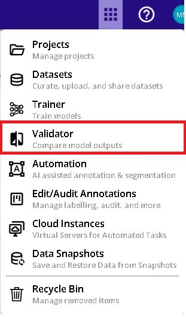
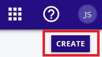
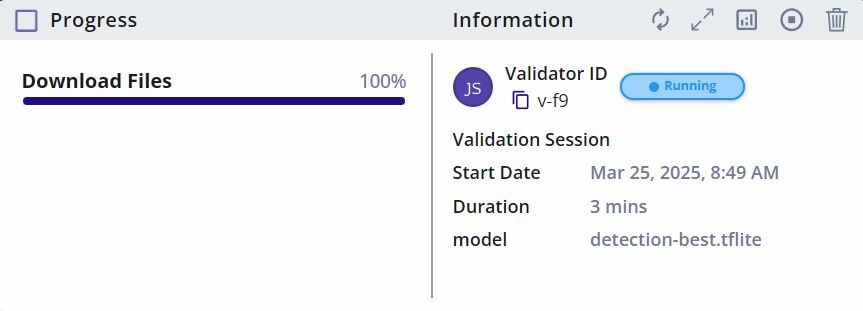
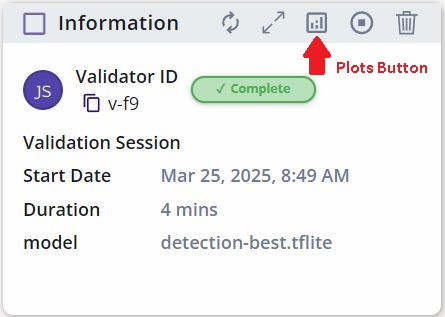
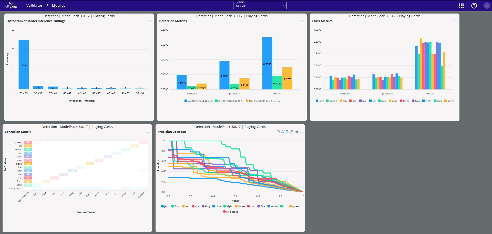
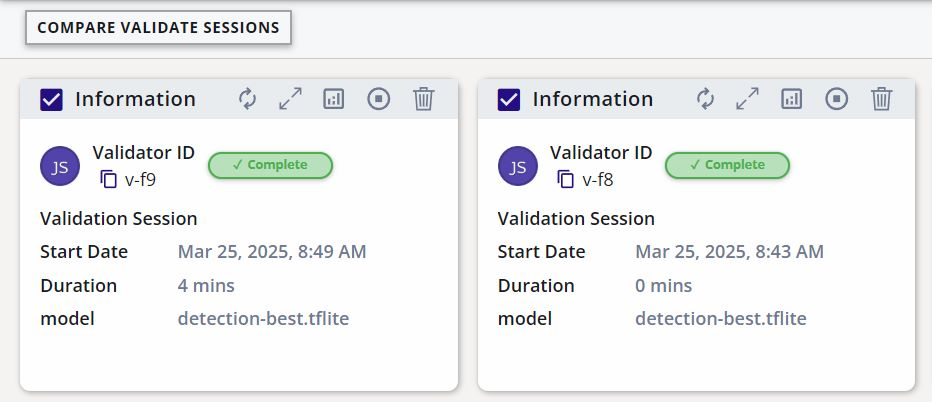

# Modelpack

This page will provide a walk-through on using DVE for validating the performance of Vision models that have been trained using Modelpack, through the [QuickStart Guide](../../getting_started/index.md) or [Training Modelpack](../training/1_modelpack.md). This page will focus only on the validation of Modelpack.

1. Select *Validator* from the tool options.

	<figure markdown="span">
	{ align=center }
	<figcaption>Tool Options</figcaption>
	</figure>

2. Specify the project to run validation at the center of the top menu bar.

	<figure markdown="span">
	{ align=center }
	<figcaption>Project Selection</figcaption>
	</figure>

3. Create a new validation session by clicking the *create* button on the top right of the page.

	<figure markdown="span">
	{ align=center }
	<figcaption>Create New Session</figcaption>
	</figure>

4. Configure the settings on the left panel by specifying the name of the validation session, the model file to validate, and the dataset to deploy. Next configure the settings on the right panel by specifying the validation parameters.

    > *Note:* 
	> *Additional information on these parameters are provided by hovering over the info button.* 

    <figure markdown="span">
	{ align=center }
	<figcaption>Validation Options</figcaption>
	</figure>

5. Start the session by clicking the *START SESSION* button on the bottom right.

	<figure markdown="span">
	{ align=center }
	<figcaption>Start the Session</figcaption>
	</figure>

6. The validation session has now started while the progress is tracked on the left panel and additional information and status is shown on the right panel. 

    <figure markdown="span">
	{ align=center }
	<figcaption>Validation Session</figcaption>
	</figure>

7. Once completed, the status will be shown as complete.

    <figure markdown="span">
	{ align=center }
	<figcaption>Completed Session</figcaption>
	</figure>

8. The metrics are shown by clicking the plots button on the top left of the session card. 

    <figure markdown="span">
	{ align=center }
	<figcaption>Validation Metrics</figcaption>
	</figure>

    > *Note:*
    > *See [Metrics](metrics.md) for further details.*

9. It is also possible to compare validation metrics for multiple sessions. This is done by checking the checkboxes on the top left of the session cards.

    <figure markdown="span">
	{ align=center }
	<figcaption>Comparing Sessions</figcaption>
	</figure>

    Compare the validation sessions by clicking the *COMPARE VALIDATE SESSION* button on the top left. This will display the validation metrics side by side for the specified validation sessions.

    <figure markdown="span">
	{ align=center }
	<figcaption>Metrics Side-by-Side</figcaption>
	</figure>