# Metrics

This page is dedicated to describing the metrics reported in DVE after running validation. DVE supports validation of Modelpack and Fusion models.
The following sections will describe the metrics reported for each type of validation.

## Modelpack

This section will describe the validation metrics reported in Modelpack validation sessions.

### Object Detection Metrics

The object detection metrics describe the mean average precision (mAP), recall (mAR), and accuracy (mACC) at IoU thresholds 0.50, 0.75, and 0.50-0.95. These metrics are represented as a bar chart. Shown below is an example.

<figure markdown="span">
  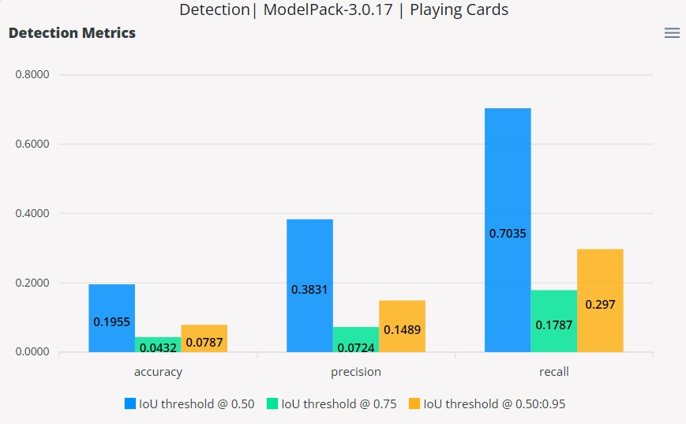{ align=center }
  <figcaption>Detection Metrics</figcaption>
</figure>

#### Mean Average Precision

The mAP is based on the area under the precision vs. recall curve which plots the tradeoff between precision and recall by adjusting the IoU thresholds. The average precision is first calculated by finding the area under the precision vs. recall curve for each class at varying IoU thresholds. The mAP at 0.50 and 0.75 is the mean of the average precision across all classes, but only at the IoU threshold values of 0.50 and 0.75. For the case of mAP at 0.50-0.95, the average precision at 0.50-0.95 is first calculated by taking the mean of the average precision (area under the curve) across IoU thresholds 0.50 to 0.95 in 0.05 steps. This process is done per class and the final mAP at 0.50-0.95 is the mean of the average precision at 0.50-0.95 values across all classes.

#### Mean Average Recall

This metric is calculated as the sum of the recall values of each class over the number of classes at specified IoU thresholds. 
The mean average recall at IoU thresholds 0.50 and 0.75 are calculated based on the equations below. 

$$
\text{mAR} = \frac{1}{n}\sum_{i=1}^{n}\text{recall}_{i}, n = \text{number of classes}
$$

> *Note:*
> *The equation for recall is shown in the [Glossary](#glossary).*

The metric for mAR 0.50-0.95 is calculated by taking the sum of mAR values at IoU thresholds 0.50, 0.55, ..., 0.95 and then dividing by the number of validation IoU thresholds (in this case 10). 

$$
\text{mAR}_{0.50-0.95} = \frac{1}{10}\sum_{i=0.50}^{n}\text{mAR}_{i}, i = \text{0.50, 0.55, 0.60, ..., 0.95}
$$

#### Mean Average Accuracy

This metric is calculated as the sum of accuracy values of each class over the number of classes at specified IoU thresholds.
The mean average accuracy at IoU thresholds 0.50 and 0.75 are calculated based on the equations below. 

$$
\text{mACC} = \frac{1}{n}\sum_{i=1}^{n}\text{accuracy}_{i}, n = \text{number of classes}
$$

> *Note:*
> *The equation for accuracy is shown in the [Glossary](#glossary).*

The following equation below calculates the mean average accuracy for a range of IoU thresholds from 0.50-0.95 which is calculated similarly to mean average recall. 

$$
\text{mACC}_{0.50-0.95} = \frac{1}{10}\sum_{i=0.50}^{n}\text{mACC}_{i}, i = \text{0.50, 0.55, 0.60, ..., 0.95}
$$

### Segmentation Metrics

The segmentation metrics describe precision, recall, accuracy, and IoU. These metrics are represented as a bar chart. Shown below is an example.

<figure markdown="span">
  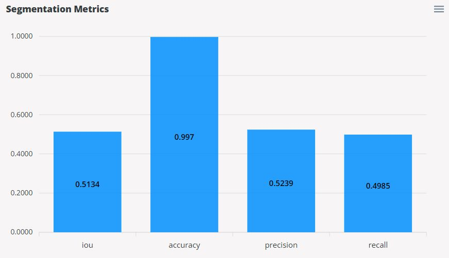{ align=center }
  <figcaption>Segmentation Metrics</figcaption>
</figure>

#### Precision

This metric is calculated based on the equation for precision shown in the [Glossary](#glossary). A true positive is when the prediction label matches the true (actual) label. A false positive is when the prediction label does not match the true (actual) label.

#### Recall

This metric is calculated based on the equation for recall shown in the [Glossary](#glossary). A true positive is when the prediction label matches the true (actual) label. A false negative is when the prediction label is a positive class, but the true (actual) label is a negative class (background).

#### Accuracy

This metric is based on the proportion of the correct predictions over the total predictions. A correct prediction is where the prediction labels equals the true (actual) labels. 

#### IoU

This metric is the intersection over union. The intersection is based on the logical AND operation of the true (actual) labels and the prediction labels. The union is based on the logical OR operation of the true (actual) labels and the prediction labels. 

### Model Timings

The model inference timings are represented as a histogram where the y-axis shows the frequency of occurences in each bin in the x-axis. We can expect the speed of the model to be based on the bin with the highest frequency. However, the timings could be distributed across the bins to show variations in the model inference times.

<figure markdown="span">
  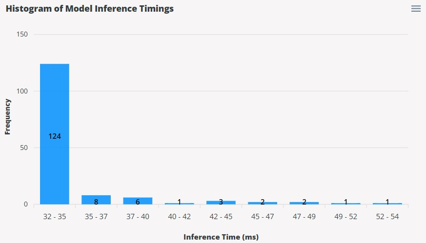{ align=center }
  <figcaption>Model Timings</figcaption>
</figure>

### Confusion Matrix

The Confusion Matrix provides a summary of the prediction results by comparing the predicted labels with the ground truth (actual) labels. This matrix will show the ground truth labels along the x-axis and the predicted labels along the y-axis. Along the diagonal where both ground truth labels and prediction labels match shows the true positive (correct predictions) counts of that class. However, throughout validation, the matrix shows the cases where the model can misidentify labels or fail to find the labels.

<figure markdown="span">
  { align=center }
  <figcaption>Confusion Matrix</figcaption>
</figure>

### Precision vs. Recall

The precision vs. recall curve shows the tradeoff between precision and recall. At lower thresholds, precision will tend to be lower due to increased leniency for valid detections. However, more detections will tend to result in higher recall as the model finds more ground truth labels. Increasing the threshold will start to increase precision for more precise detections, but will start to reduce recall due to the reduction of model detections. The following curve shows the precision vs. recall trend for each of the classes in the dataset, along with the average curve for all the classes. A higher area under the curve, the better the model performance as this indicates maximized values for precision and recall throughout the varying thresholds. 

<figure markdown="span">
  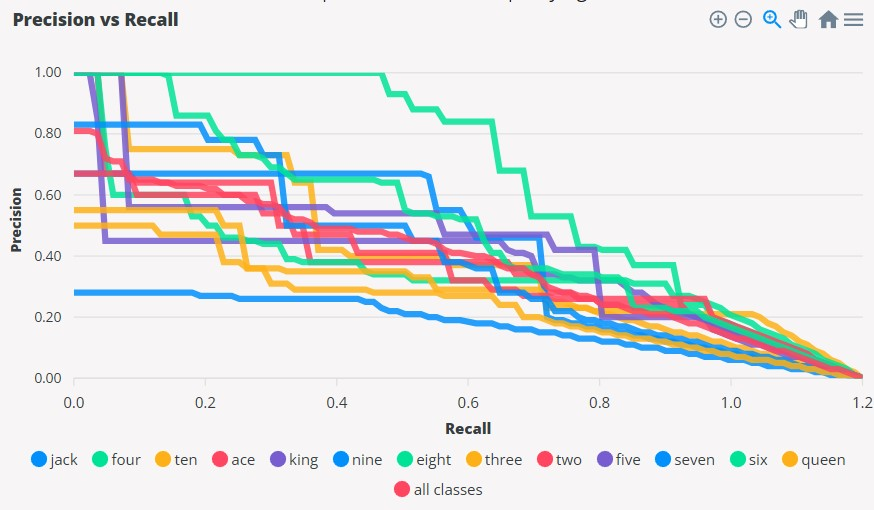{ align=center }
  <figcaption>Precision vs. Recall</figcaption>
</figure>

## Fusion

This section will describe the validation metrics reported in Fusion validation sessions.

### Base Metrics

The Fusion validation sessions reports the metrics for precision, recall, F1-score, and IoU represented as a bar chart. Shown below is an example. 

<figure markdown="span">
  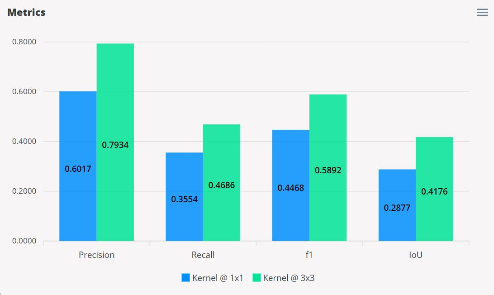{ align=center }
  <figcaption>Base Metrics</figcaption>
</figure>

By default, these metrics are calculated based on the kernel sizes 1x1 and 3x3 which can be configured when starting a new session (*See step 4. in [Radar Validation](2_fusion.md)*). The kernel size is the window size setting where a kernel size of 1x1 indicates a 1-to-1 match between the ground truth and the model occupancy grid. A prediction can only be correct in a 1x1 kernel if the position of the prediction is in the same position as the ground truth. However, increasing the kernel size is more lenient by allowing predictions to be correct if their positions are within 3 meters away (3x3 kernel) from the ground truth. 

The metrics and their equations are described below.

#### Precision

This metric is based on how well the model makes correct predictions. In other words, out of the total predictions, how many of these predictions were correct. The equation for precision is shown in the [Glossary](#glossary).

#### Recall

This metric is based on how well the model finds the ground truth. In other words, out of the total ground truth, how many were found by the model. The equation for recall shown in the [Glossary](#glossary).

#### F1-Score

This metric is based on both precision and recall. It measures how well the model performs overall in terms of how well the model makes correct predictions and finds the ground truth. The following table demonstrates the nature of the F1-score as a function of precision and recall.

<figure markdown="span">
  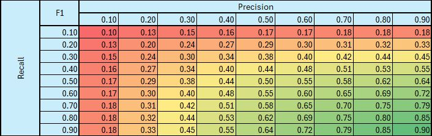{ align=center }
  <figcaption>F1-Score</figcaption>
</figure>

The table highlights how F1 is the average between precision and recall over the diagonal where both precision and recall are equal. Furthermore, it also highlights how the F1-score needs both precision and recall to have very good scores in order to have a very good F1-score. As an example, consider a recall of 0.90, but a precision of 0.10, the final value of the F1-score is 0.18 which is quite poor. The same is true if the roles were switched where precision is 0.90, but recall is 0.10. The nature of the F1-score indicates that a well performing model requires both precision and recall to be high. 

It is also important to note that for certain use-cases precision is more important over recall and vice versa. For example, an application in the farming industry for identifying good crops vs. bad crops, one would argue that precision is more important than recall. It would be better to miss a bad crop than to identify a good crop as a bad crop. Another example for an application in safety that requires detection of people, one would argue that recall is more important than precision. It is better to misidentify an object for being a person than to miss an actual person in the scene.  

The equation for the F1-score is shown below.

$$
\text{F1-score} = \frac{2 * precision * recall}{precision + recall}
$$

#### IoU

This metric is defined as the intersection over union. It also measures how well the model performs overall by comparing the amount of correct predictions over the total amount of ground truths and the model predictions. This metric, however, is not as lenient as the F1-score as demonstrated by the following table.

<figure markdown="span">
  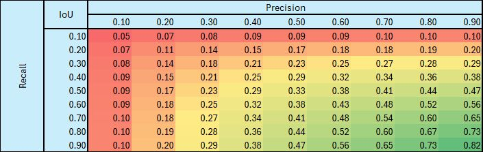{ align=center }
  <figcaption>IoU Score</figcaption>
</figure>

Along the diagonal, it is easier to see why the IoU metric is not as lenient as the F1-score. It shows how for an equal value of precision and recall, the final IoU score is lower than the average. For example, a precision of 0.10 and a recall of 0.10, the IoU is 0.05 which is half of the average value. The scores are always lower than the average between the precision and recall, but as both precision and recall increases, the final IoU score approaches the average, but still does not reach it. Furthermore, the IoU scores also requires both precision and recall to have very high scores in order for the IoU to have a very high score. For example, if recall is 0.90 and precision is 0.10, the final IoU score is 0.10. The same is true if precision is 0.90 and recall is 0.10. This shows that a well performing model have very good scores for both precision and recall. 

The equation for the IoU score is shown below.

$$
\text{IoU} = \frac{\text{intersection}}{\text{union}} = \frac{\text{true positives}}{\text{true positives} + \text{false positives} + \text{false negatives}}
$$

### Model Timings

These timings are measured in the same way as Modelpack as described under [Model Timings](#model-timings) in the *Modelpack* section.

### Precision vs. Recall

The precision vs. recall curve is based on varying detection thresholds from 0 to 1 in 0.05 steps. The principle in practice is that for lower thresholds precision is low, but recall is high and as the threshold increases, precision increases and recall decreases. This shows the tradeoff between precision and recall. The nature of this tradeoff is due to increased detections at low threshold thus capturing more ground truths (high recall) but much more prone to false predictions (low precision). The opposite is true for high thresholds. A well performing model shows a high area under the curve of the precision vs. recall curve. 

<figure markdown="span">
  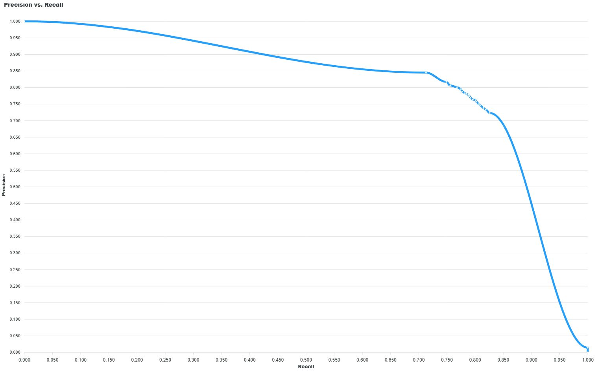{ align=center }
  <figcaption>Precision vs. Recall</figcaption>
</figure>

Another representation of the precision vs. recall is to incorporate the varying threshold in the plot. The following curve shows the precision and recall vs. thresholds curve. As mentioned, at lower thresholds precision is low and recall is high, but increasing the threshold we can see precision and recall converge to a point. The point of convergence indicates the ideal threshold to use for deploying the model. This is the optimum threshold where precision and recall are balanced such that one is not sacrificing the other. 

<figure markdown="span">
  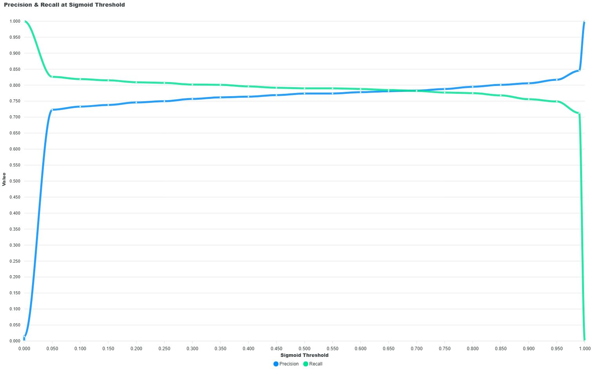{ align=center }
  <figcaption>Precision and Recall vs Thresholds</figcaption>
</figure>

### BEV Heatmaps

There are four BEV heatmaps generated. The heatmaps are a representation of the occupancy grid that is the output of the Radar model. This occupancy grid is the field of view of the model that represents positions in the scene in meters. The BEV heatmaps provides indications where the model is generally making right or wrong predictions. Furthermore, the heatmaps also indicate how the ground truth is distributed across the dataset. 

> *Note:*
> On a cell by cell basis, the sum of true positive, false positive, and false negative rates equals 1.

#### True Positives Heatmap

<figure markdown="span">
  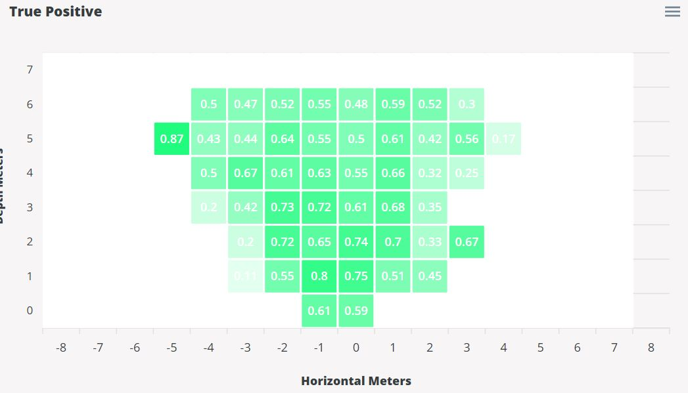{ align=center }
  <figcaption>True Positive Heatmap</figcaption>
</figure>

The measurement is based on each cell. For each cell, what % of the sum of true positives, false positives, and false negatives were true positives. The equation for this heatmap is the following.

$$
\text{cell outcome} = \frac{\text{true positives}}{\text{true positives} + \text{false positives} + \text{false negatives}}
$$

#### False Negatives Heatmap

<figure markdown="span">
  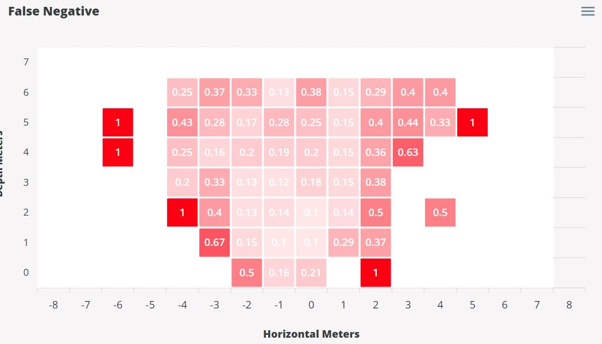{ align=center }
  <figcaption>False Negative Heatmap</figcaption>
</figure>

The measurement is based on each cell. For each cell, what % of the sum of true positives, false positives, and false negatives were false negatives. The equation for this heatmap is the following.

$$
\text{cell outcome} = \frac{\text{false negatives}}{\text{true positives} + \text{false positives} + \text{false negatives}}
$$

#### False Positives Heatmap

<figure markdown="span">
  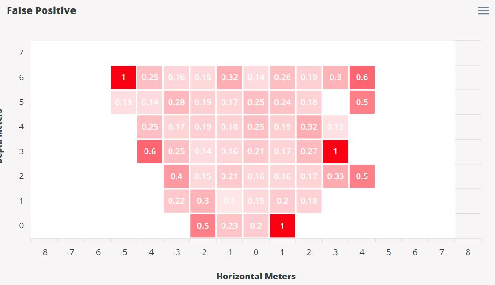{ align=center }
  <figcaption>False Positive Heatmap</figcaption>
</figure>

This measurement is based on each cell. For each cell, what % of the sum of true positives, false positives, and false negatives were false positives. The equation for this heatmap is the following.

$$
\text{cell outcome} = \frac{\text{false positives}}{\text{true positives} + \text{false positives} + \text{false negatives}}
$$

#### Ground Truth Heatmap

<figure markdown="span">
  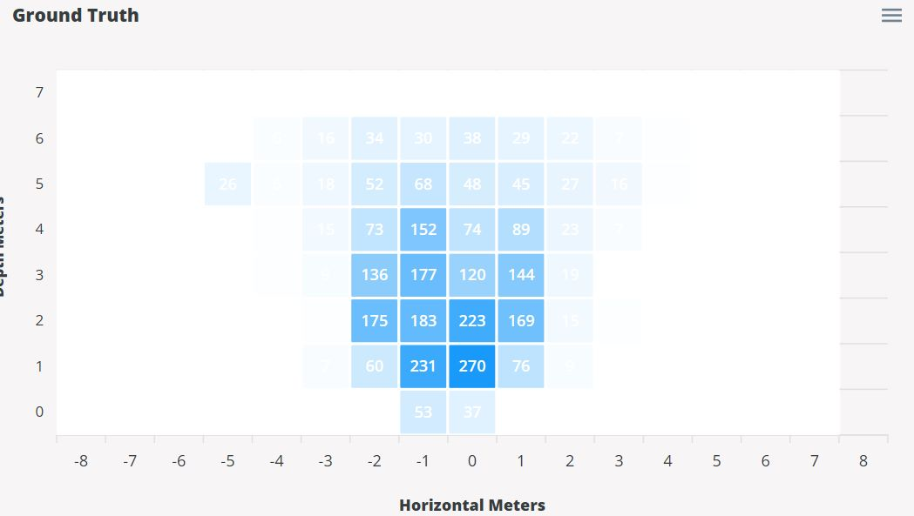{ align=center }
  <figcaption>Ground Truth Heatmap</figcaption>
</figure>

This measurement is purely based on the ground truth counts. This heatmap provides indications of the concentration of samples in the dataset. This heatmap has no equation, it is the collection of ground truth counts throughout the experiment.

## Glossary

This section will explain the definitions of key terms frequently mentioned throughout this page.

| **Term**          | **Definition**                                                                                                                                          |
|-------------------|---------------------------------------------------------------------------------------------------------------------------------------------------------|
| **True Positive** | Correct model predictions. The model prediction label matches the ground truth label. For object detection, the IoU and confidence scores must meet the threshold requirements. |
| **False Positive** | Incorrect model predictions. The model prediction label does not match the ground truth label. |
| **False Negative** | The absence of model predictions. For cases where the ground truth is a positive class, but the model prediction is a negative class (background). |
| **Precision** | Proportion of correct predictions over total predictions. $\text{precision} = \frac{\text{true positives}}{\text{true positives} + \text{false positives}}$ |
| **Recall** | Proportion of correct predictions over total ground truth. $\text{recall} = \frac{\text{true positives}}{\text{true positives} + \text{false negatives}}$ |
| **Accuracy** | Propertion of correct predictions over the union of total predictions and ground truth. $\text{accuracy} = \frac{\text{true positives}}{\text{true positives} + \text{false negatives} + \text{false positives}}$ |
| **IoU** | The intersection over union. $\text{IoU} = \frac{\text{intersection}}{\text{union}} = \frac{\text{true positives}}{\text{true positives} + \text{false positives} + \text{false negatives}}$ |