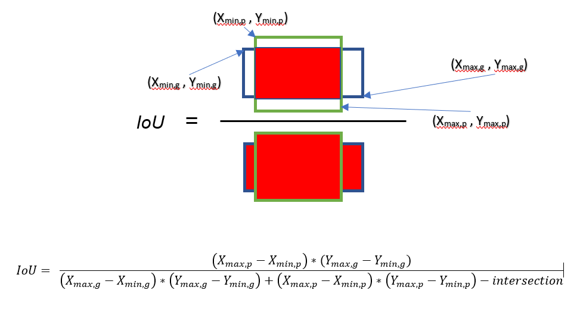
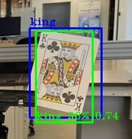
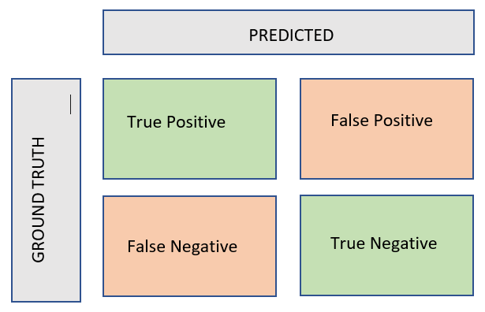
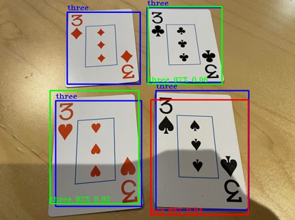
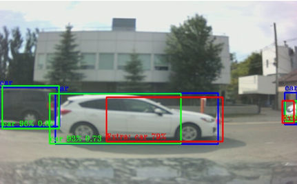
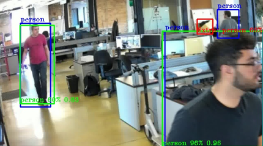

# Object Detection Classifications

This section describes how EdgeFirst Validator classifies the detections into true positives, false positives, and false negatives that allow computation of the validation metrics.

## Definitions

### Intersection Over Union (IoU)

The IoU is a ratio of the intersection area of the bounding boxes over the area of union.

<figure markdown="span">
  { align=center }
  <figcaption>IoU Visualization</figcaption>
</figure>

<!-- 
$$
\text{IoU} = \frac{(\text{X}_{\text{max,p}} - \text{X}_{\text{min,p}}) * (\text{Y}_{\text{max,g}} - \text{Y}_{\text{min,g}})}{(\text{X}_{\text{max,g}} - \text{X}_{\text{min,g}}) * (\text{Y}_{\text{max,g}} - \text{Y}_{\text{min,g}}) + (\text{X}_{\text{max,p}} - \text{X}_{\text{min,p}}) * (\text{Y}_{\text{max,p}} - \text{Y}_{\text{min,p}}) - intersection}
$$ -->

Ideally for each prediction, there is an associated ground truth. Both the prediction bounding box (green) and the ground truth bounding box (blue) are drawn on the resulting image. However, the predicted and ground truth boxes may not match exactly. The IoU measures how closely the predictions match the ground truth; values closer to 1 indicate a better match.

<figure markdown="span">
  { align=center }
  <figcaption>IoU Example</figcaption>
</figure>

### Classifications

Model detections will be classified using the confusion matrix.

<figure markdown="span">
  { align=center }
  <figcaption>Classifications</figcaption>
</figure>

**True Positive**: A true positive detection meets the following criteria.

* Model detections match the ground truth label.
* The calculated IoU >= IoU threshold.
* The confidence score >= score threshold.

**False Positive**:

* Classification: Model detections that do not match the ground truth label and the calculated IoU is equal to or greater than the validation IoU threshold.
* Localization: Model detections that are not matched to any ground truths.  These false positives can also be predictions that have an IoU less than the validation IoU threshold.

**False Negative**: These are missed detections.  Any ground truth bounding box without a predicted bounding box.

**True Negative**: This category is not used.

#### Example Cases

This section will show examples of each of the classifications explained above.  For the cases below, the blue bounding box represents the ground truth and the red or the green bounding boxes represents the model detections.  Green represents a true positive detection whereas red represents a false positive detection.  The detection labels include the label, the confidence score denoted as a percentage, and the IoU score normalized between 0 and 1.  Localization false positive detections will be denoted with the label 'LOC' and then the detection label and the confidence score.  Classification false positive detections will be denoted with the label 'CLF' and then the detection label, confidence score, and IoU.

!!! note
    The image samples below are now deprecated in terms of the labeling format: "Extra" is now denoted as "LOC" and a misclassification includes a "CLF" (seen in EdgeFirst Validator 3.0.9 and higher).

<figure markdown="span">
  { align=center }
  <figcaption>Example 1</figcaption>
</figure>

* The model predictions that are in green are true positives for the class 'three' because the prediction and the ground truth label match and the IoUs are greater than the set threshold of 0.50.
* The top left card 'three' only shows the ground truth in blue.  This is a false negative for the class 'three' since the model missed to predict this label.
* The model prediction that is in red is a classification false positive for the class 'ace' because it is paired to the ground truth, but the labels are not matching ('ace' and 'three').

<figure markdown="span">
  { align=center }
  <figcaption>Example 2</figcaption>
</figure>

* The model prediction that is in red would be a localization false positive for the class 'car' because it detected another car even though a prediction (car 93% 0.73) is already matched to the ground truth (blue).

<figure markdown="span">
  { align=center }
  <figcaption>Example 3</figcaption>
</figure>

* The model prediction that is in red would be classified as a localization false positive because the prediction does not correlate to any ground truth.  The person annotation on the top right shown in blue is a false negative because there are not pairing model predictions for this annotation.  The model predictions shown in green are true positives as it meets the requirements of a true positive described above.

## Further Reading

This page has described how EdgeFirst Validator classifies predictions into true positives, false positives (classification and localization), and false negatives.  To learn more about the rules governing the matching algorithm, please see [Matching and Classification Rules](matching.md).
