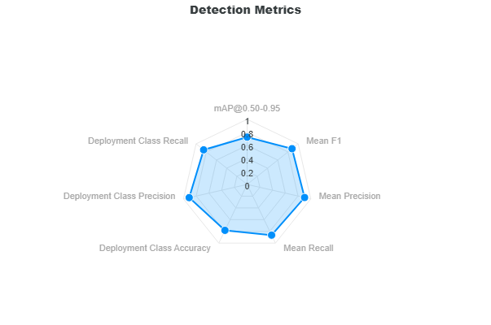
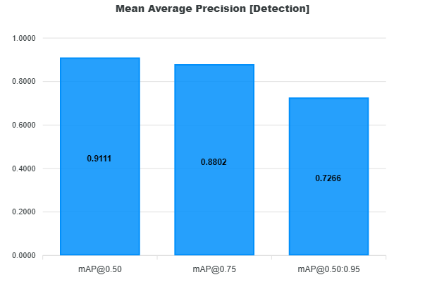
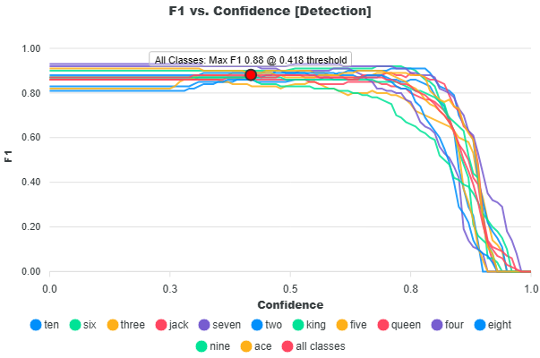
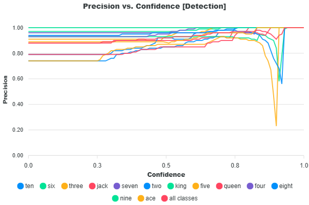
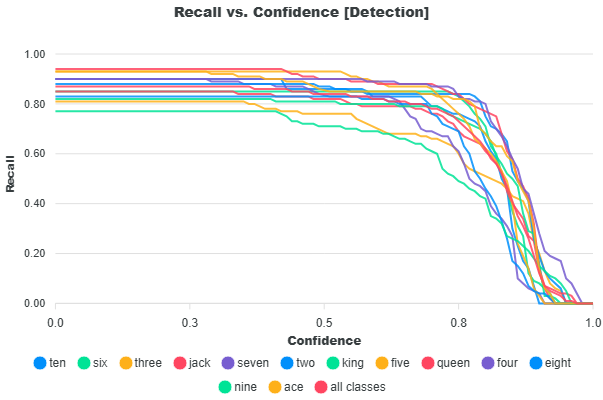
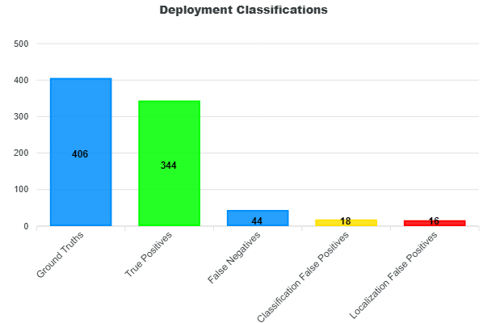
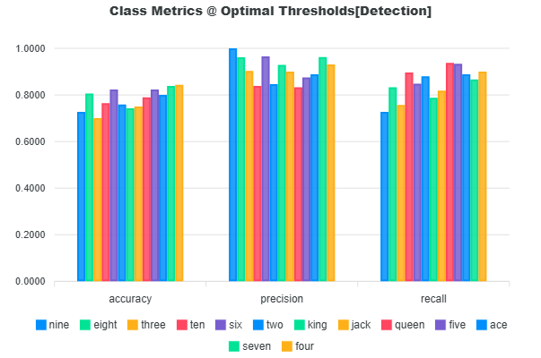
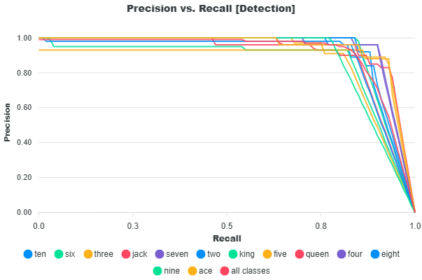
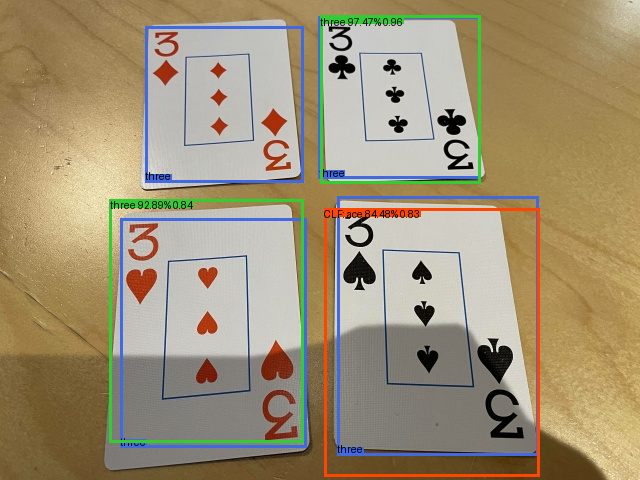
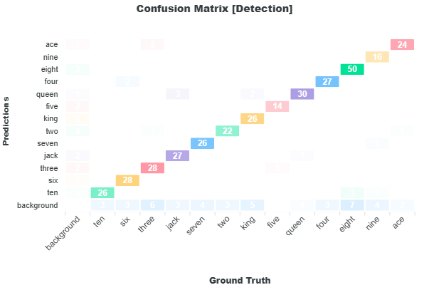

# Object Detection Metrics

This section describes the validation metrics reported for [Object Detection Validation](../../vision/managed.md).  The object detection metrics are based on IoU which measures how closely the predictions aligns with the ground truth annotations.  For object detection, the IoU is calculated from bounding boxes.  However, for [instance segmentation](../segmentation.md#instance-segmentation-metrics), the IoU is calculated from instance masks.  The methods for computing object detection and instance segmentation metrics are the same.  The object detection metrics are categorized into **Full-Curve Metrics** and **Deployment Metrics**. 

The Full-Curve Metrics assess the model performance across varying score and IoU thresholds for all classes.  The Deployment Metrics are based on the best model performance at the optimal score threshold.

## Full-Curve Metrics

Full-Curve Metrics evaluate model performance across a wide range of confidence (score) thresholds.  To enable this, the NMS score threshold is set very low (e.g., 0.001), allowing nearly all predictions to be considered.  The model is then evaluated over thresholds from 0 to 1 to understand how performance changes as filtering becomes more or less strict.

The Full-Curve Metrics include:

* mean Average Precision (mAP)
* Mean Precision
* Mean Recall
* Mean F1 Score

<figure markdown="span">
	{ align=center }
	<figcaption>Detection Metrics</figcaption>
</figure>

### Mean Average Precision (mAP)

Mean Average Precision (mAP) is one of the most important metrics for evaluating object detection models and is computed using the same methodology as Ultralytics (YOLO).

<figure markdown="span">
	{ align=center }
	<figcaption>Mean Average Precision</figcaption>
</figure>

The mAP measures how well the model balances precision and recall across confidence thresholds, while also evaluating detection quality at different IoU thresholds.

**Definitions**

* Precision: Fraction of predicted objects that are correct
* Recall: Fraction of ground truth objects that are detected
* AP (Average Precision): Area under the Precision–Recall curve for a given class and IoU threshold
* mAP (mean AP): Mean of AP values across all classes

**How mAP is computed**

For a fixed IoU threshold, compute the AP (average precision):

1. Predictions are sorted by confidence score
2. Precision and recall are computed cumulatively
3. A Precision–Recall curve is generated by sweeping the score threshold
4. AP is computed as the area under this curve

!!! note
	IoU does not create the curve — it defines what counts as a true positive.

For each class:

1. Compute AP at each IoU threshold
2. For mAP@0.50:0.95, average AP across all IoU thresholds
3. Then average across all classes

**We report mAP at IoU thresholds (0.50, 0.75, 0.50-0.95):**

* **mAP@0.50**
	* Lenient matching (IoU ≥ 0.50)
	* Focuses on detection correctness
* **mAP@0.75**
	* Stricter matching
	* Requires better localization
* **mAP@0.50:0.95 (COCO metric)**
	* Average AP across IoU thresholds from 0.50 to 0.95 (step 0.05)
	* Evaluates both detection and localization quality

### F1 Score

The Mean F1 Score is the harmonic mean between precision and recall used to determine the model’s optimal score threshold. It is computed from the F1 vs Confidence curve, which shows how the F1 score changes as the score threshold varies.  The model's optimal score threshold is at the max F1 score of this curve.

<figure markdown="span">
	{ align=center }
	<figcaption>F1 versus Confidence</figcaption>
</figure>

For each confidence threshold:

* Precision and recall are computed per class
* The F1 score is calculated as the harmonic mean:

$$
\text{F1} = \frac{2 * precision * recall}{precision + recall}
$$

!!! note
	The equations for precision and recall are provided in the [glossary](../index.md#glossary).

The optimal score threshold is selected as the point where the mean F1 score across all classes is maximized:

$$
t^* = \arg\max_t \ \frac{1}{C} \sum_{c=1}^{C} \text{F1}_c(t)
$$

The reported Mean F1 Score is the average of per-class F1 values at this optimal threshold:

$$
\text{Mean F1} = \frac{1}{C} \sum_{c=1}^{C} \text{F1}_c(t^*)
$$

The Mean F1 score represents the best balance between precision and recall and defines the recommended operating score threshold for deploying the model.

### Mean Precision

This metric is defined as the average of the per-class precision values at the threshold where the mean F1 score is highest.  This score reflects the overall ability of the model to avoid false positives across all classes.

<figure markdown="span">
	{ align=center }
	<figcaption>Precision versus Confidence</figcaption>
</figure>

At the selected threshold:

1. Precision is obtained for each class
2. The values are averaged:

$$
\text{Mean Precision} = \frac{1}{C} \sum_{c=1}^{C} \text{Precision}_c(t^*)
$$

!!! note
	The equation for precision is provided in the [glossary](../index.md#glossary).

The Mean Precision metric measures how accurate the model’s predictions are at the optimal threshold.  A high precision score indicates fewer false positives.

### Mean Recall

This metric is defined as the average of the per-class recall values at the where the mean F1 score is highest.  This score reflects the model’s ability to find all relevant objects (true positives) across all classes.

<figure markdown="span">
	{ align=center }
	<figcaption>Recall versus Confidence</figcaption>
</figure>

At this threshold:

1. Recall is obtained for each class
2. The values are averaged:

$$
\text{Mean Recall} = \frac{1}{C} \sum_{c=1}^{C} \text{Recall}_c(t^*)
$$

!!! note
	The equation for recall is provided in the [glossary](../index.md#glossary).

The Mean Recall metrics measures how well the model detects ground truth objects.  A high recall score indicates fewer missed detections.

### Optimal Thresholds

## Deployment Metrics

As mentioned, the Full-Curve Metrics assess the model performance at varying NMS score thresholds to find the optimal score threshold that yields the max F1-score.  

<figure markdown="span">
	{ align=center }
	<figcaption>Optimal Score Threshold</figcaption>
</figure>

This score threshold is then used to filter the predictions.  These filtered predictions are then classified into true positives, false positives (classification, localization), and false negatives. 

!!! note "Classifications"
	For more information on how these predictions are matched and classified into true positives, false positives, and false negatives, please see [Matching and Classification Rules](matching.md).

<figure markdown="span">
	{ align=center }
	<figcaption>Deployment Classifications</figcaption>
</figure>

Additional insight into these classifications can be gained by examining the distributions of prediction scores and IoUs, shown in the histograms below.  In both plots, green represents true positives, yellow represents classification false positives, and red represents localization false positives.

| Histogram of Scores             | Histogram of IoUs           |
|---------------------------------|-----------------------------|
|  |  |

These histograms help reveal how different types of predictions are distributed.  For example, a high number of false positives with high confidence scores may indicate issues with the model’s classification behavior or training data. Similarly, a concentration of predictions with low IoU values suggests poor localization, meaning predicted objects are not well aligned with the ground truth.

Further analysis can be performed using the [Confusion Matrix](#confusion-matrix), which breaks down prediction outcomes by class.  This visualization highlights which classes the model detects well and which it frequently misses, potentially indicating a need for more training data for those classes.  It also reveals common misclassifications between classes, helping identify areas that may require further investigation or improvements in the training dataset.

From these plots, the sum of true positives, false positives, and false negatives equals the totals reported in the deployment classifications. Every prediction is accounted for in this breakdown.

Lastly, the precision, recall, and accuracy scores of each class are provided in the Class Metrics bar chart.  You can find the equations for precision, recall, and accuracy in the [Glossary](../index.md#glossary). 

<figure markdown="span">
	{ align=center }
	<figcaption>Class Metrics</figcaption>
</figure>

The deployment precision, recall, and accuracy are also calculated based on the mean value of the precision, recall, and accuracy of each class as shown in the next sections.

<figure markdown="span">
	{ align=center }
	<figcaption>Detection Metrics</figcaption>
</figure>

### Deployment Class Precision

The deployment class precision is the average of the precision values of each class.

$$
\text{deployment class precision} = \frac{1}{n}\sum_{i=1}^{n}\text{precision}_{i}, n = \text{number of classes}
$$

!!! note "Precision Equation"
	The equation for precision is shown in the [Glossary](../index.md#glossary).

Precision measures how well the model outputs correct predictions.  Precision alone does not provide a final summary of the model performance because it only considers the ratio of the number of correct detections to the total number of detections.  Consider a case where the model might have made 9 detections which are all correct and yields a precision of 100%, but there are 200 ground truth annotations, the model missed the rest of the 191 annotations which yields a recall of 4.5%.

### Deployment Class Recall

The deployment class recall is the average of the recall values of each class.

$$
\text{deployment class recall} = \frac{1}{n}\sum_{i=1}^{n}\text{recall}_{i}, n = \text{number of classes}
$$

!!! note "Recall Equation"
	The equation for recall is shown in the [Glossary](../index.md#glossary).

Recall measures how well the model finds the ground truth annotations.  A similar idea is presented for recall, this metric only considers the ratio of correct detections against the total number of ground truths.  However, it is possible that the model will correctly find all ground truth annotations, but it might have generated large amounts of localization false positives.

### Deployment Class Accuracy

The deployment class accuracy is the average of the accuracy values of each class.

$$
\text{deployment class accuracy} = \frac{1}{n}\sum_{i=1}^{n}\text{accuracy}_{i}, n = \text{number of classes}
$$

!!! note "Accuracy Equation"
	The equation for accuracy is shown in the [Glossary](../index.md#glossary).

This accuracy metric provides a better representation of the overall model performance over precision and recall.  The accuracy metric aims to combine both precision and recall by considering correct detections (TP), false detections (localization FP and classification FP), and missed detections (FN).  The accuracy is the ratio of the correct detections against all model detections and all ground truth objects.  This metric aims to measure how well the model aligns its detections to the ground truth and a perfect alignment suggests zero missed annotations and zero false detections.

## Precision versus Recall

According to Mariescu-Istodor and Fränti (2023), “The performance is a trade-off between precision and recall. Recall can be increased by lowering the selection threshold to provide more predictions at the cost of decreased precision.”  In EdgeFirst Validator, this selection threshold corresponds to the score threshold used in Non-Maximum Suppression (NMS), which filters detections based on their confidence scores.

Lowering the score threshold allows more detections to pass through, increasing the likelihood of identifying ground truth objects (higher recall), but also introducing more incorrect predictions (lower precision). Increasing the threshold has the opposite effect: it filters out more detections, improving precision while potentially missing true objects and reducing recall.

The Precision–Recall curve illustrates this trade-off across different threshold values. At lower thresholds, the model produces more detections, resulting in higher recall but lower precision. As the threshold increases, precision improves due to stricter filtering, while recall decreases as fewer detections are retained. The curve below shows this relationship for each class in the dataset, along with the average across all classes. A larger area under the curve indicates better overall performance, reflecting a stronger balance between precision and recall across thresholds.

<figure markdown="span">
  { align=center }
  <figcaption>Precision versus Recall</figcaption>
</figure>

Precision and recall are common metrics used for evaluating object detectors in machine learning.  According to Mariescu-Istodor and Fränti (2023), "Precision is the number of correct results (true positives) relative to the number of all results.  Recall is the number of correct results relative to the number of expected results" (p.1).  In this case interpreting "all results" as the model's detection results and "expected results" as the ground truth in the dataset - precision is defined as the fraction of correct detections out of the total detections, and recall is defined as the fraction of correct detections out of the total ground truth.  

Taking from Vignesh-Babu (2020) and Padilla, Passos, Dias, Netto, & Da Silva (2021), the equation for precision and recall is defined as the following.

$$
\text{precision} = \frac{\text{TP}}{\text{TP} + \text{FP}} = \frac{\text{TP}}{\text{all predictions}}
$$

$$
\text{recall} = \frac{\text{TP}}{\text{TP} + \text{FN}} = \frac{\text{TP}}{\text{all ground truths}}
$$

However, on the account of the [EdgeFirst Validator's method of classifying detections](matching.md) where false positives are further categorized into localization and classification false positives, then **the total number of detections is really the sum of true positives, classification false positives, and localization false positives**.  **The total number of ground truths is the sum of true positives, false negatives, and classification false positives** as shown in the resulting image below.

<figure markdown="span">
  { align=center }
  <figcaption>playing_cards_v7; 000000000027.png </figcaption>
</figure>

In this image there are two true positives, one false negative, one classification false positive, and four ground truth objects.  To agree with the definition of recall being the fraction of all correct detections over all ground truths, the number ground truth becomes the sum of true positives, false negatives, and classification false positives.  The formulas are thus adjusted in the following way which is implemented in EdgeFirst Validator.  

$$
\text{precision} = \frac{\text{TP}}{\text{TP} + \text{FP}_{\text{all}}} = \frac{\text{TP}}{\text{all predictions}}
$$

$$\text{FP}_{\text{all}} = \text{classification FP} + \text{localization FP}$$

$$
\text{recall} = \frac{\text{TP}}{\text{TP} + \text{FN} + \text{FP}_{\text{c}}} = \frac{\text{TP}}{\text{all ground truth}}
$$

$$\text{FP}_{\text{c}} = \text{classification FP}$$

## Confusion Matrix

<figure markdown="span">
  { align=center }
  <figcaption>Confusion Matrix</figcaption>
</figure>

The Confusion Matrix provides a comparison between the ground truth and the prediction labels which gives an indication of how closely the model predictions matches the ground truth and the areas where it diverges.  The Confusion Matrix tracks the counts of each ground truth and prediction label.  These counts are based on the [deployment metrics](#deployment-metrics) counts of true positives, false positives, and false negatives.  In this representation of the matrix, the ground truth labels are placed along the x-axis and the prediction labels along the y-axis.  Along the diagonal where both prediction and ground truth label matches, you can find the number of true positives of the specific label.  **The sum of the values along the diagonal equals the number of true positives presented in the deployment metrics**. The first column where the ground truth label is "background" is the number of localization false positives where a model makes a false prediction of objects that are not present in the image.  **The sum of the first column equals the number of localization false positives in the deployment metrics**.  The last row where the prediction label is "background" is the number of false negatives where the model missed to detect these labels in the image.  **The sum of the last row equals the number of false negatives in the deployment metrics**.  Throughout the matrix, you may see counts for mismatching labels.  **The label mismatches represents the classification false positives and its sum equals the number of classification false positives in the deployment metrics**.

## Further Reading

This page has described the object detection metrics reported by EdgeFirst Validator.  To better understand the rules set for matching model predictions to ground truth and classifying predictions into true positives, false positives, and false negatives see [Matching and Classification Rules](matching.md).

## References

Fränti, P., & Mariescu-Istodor, R. (2023, March 1). Soft precision and recall. https://doi.org/10.1016/j.patrec.2023.02.005

Babu, G. V. (2021, December 13). Metrics on Object Detection - gandham vignesh babu - Medium. Retrieved from [Metrics on Object Detection](https://vignesh943628.medium.com/metrics-on-object-detection-b9fe3f1bac59)

Padilla, R., Passos, W. L., Dias, T. L. B., Netto, S. L., & Da Silva, E. A. B. (2021, January 25). A Comparative Analysis of Object Detection Metrics with a Companion Open-Source Toolkit.
[A Comparative Analysis of Object Detection Metrics with a Companion Open-Source Toolkit | MDPI](https://doi.org/10.3390/electronics10030279)

Blogger, T. (2023, November 7). Mean Average Precision (mAP): Definitions & Misconceptions | Medium. Retrieved from [Mean Average Precision (mAP): Common Definitions, Myths & Misconceptions](https://medium.com/@tenyks_blogger/mean-average-precision-definition-and-common-myths-c679a809807a)
