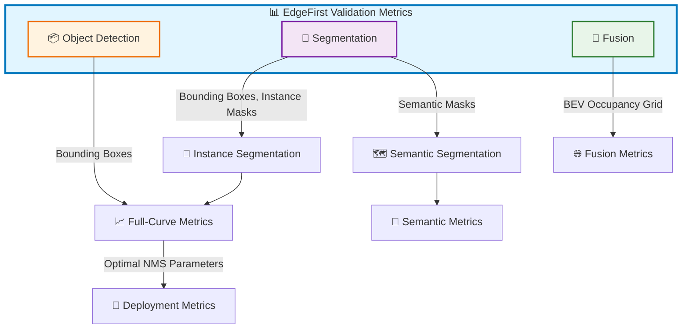

# EdgeFirst Validation Metrics

The EdgeFirst Validation metrics report the accuracy and timing performance of object detection, segmentation, and fusion models.  The [EdgeFirst Profiler](../../../profiler/index.md) runs the model on the target and publishes its predictions and timing trace to {{ studio_link("EdgeFirst Studio") }}, which then computes the metrics described in this section.

Validation evaluates a model’s performance before deployment to determine whether it is ready for real-world application.  It measures how the model performs across a range of settings (such as NMS score thresholds and IoU thresholds) and identifies the optimal configuration that yields the best overall performance.

At this optimal setting, validation summarizes model accuracy by reporting how many predictions are correct, incorrect, or missed.  In addition to accuracy, it also measures performance characteristics such as inference time, as well as preprocessing and postprocessing latency, to estimate the total runtime of the deployment pipeline.

In short, validation determines both the **best operating configuration** and whether the model meets the accuracy and performance requirements for deployment.

This section describes the metrics for [object detection](detection/index.md) which assess how well the model detects objects in the image through bounding boxes.  This measurement is based on how well the prediction bounding boxes aligns with the ground truth (dataset) bounding boxes.  These metrics are categorized into **Full-Curve Metrics** and **Deployment Metrics**.  The Full-Curve metrics assess how well the model performs across varying NMS score and IoU thresholds.  The Deployment Metrics assess how well the model performs at the optimal NMS settings.

Furthermore, this section also describes the [segmentation metrics](segmentation.md) which is categorized into **Instance** and **Semantic** Segmentation.  Instance segmentation tracks each object separately and its metrics are similar to object detection, but it also assess how well the model segments the objects in the image.  This type of metrics requires both bounding boxes and segmentation masks from the model and the ground truth (dataset).  Semantic segmentation classifies each pixel in the image that belong to a specific class. These metrics assess how well the model segments the objects in the image and it requires only segmentation masks from the model and the ground truth (dataset).

Lastly, the [Fusion metrics](fusion.md) validates the performance of EdgeFirst Fusion models which assess how well the model localizes the objects in world coordinates in a BEV perspective. Fusion models are trained by combining data from the camera and perception sensors such as the LiDAR or Radar to enhance the model's detection capabilities especially under adverse weather conditions. More information can be found under [Fusion](../../fusion/index.md).

## Glossary

Common terms and definitions frequently used throughout this section.

| **Term**          | **Definition**                                                                                                                                          |
|-------------------|---------------------------------------------------------------------------------------------------------------------------------------------------------|
| **True Positive** | Correct model predictions.  The model prediction label matches the ground truth label.  For object detection, the IoU and confidence scores must meet the threshold requirements.  |
| **False Positive** | Incorrect model predictions.  The model prediction label does not match the ground truth label.  |
| **False Negative** | The absence of model predictions.  For cases where the ground truth is a positive class, but the model prediction is a negative class (background).  |
| **True Negative** | Generally not used in object detection metrics because background regions are not explicitly enumerated.  Conceptually, a true negative corresponds to a background region correctly not detected as an object.  |
| **Precision** | Proportion of correct predictions over total predictions.  $\text{precision} = \frac{\text{true positives}}{\text{true positives} + \text{false positives}}$ |
| **Recall** | Proportion of correct predictions over total ground truth.  $\text{recall} = \frac{\text{true positives}}{\text{true positives} + \text{false negatives}}$ |
| **Accuracy** | Proportion of correct predictions over the union of total predictions and ground truth.  $\text{accuracy} = \frac{\text{true positives}}{\text{true positives} + \text{false negatives} + \text{false positives}}$ |
| **IoU** | The intersection over union.  $\text{IoU} = \frac{\text{intersection}}{\text{union}} = \frac{\text{true positives}}{\text{true positives} + \text{false positives} + \text{false negatives}}$ |
