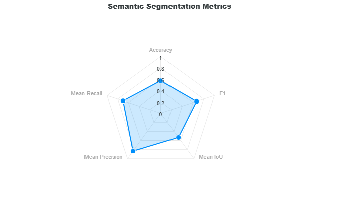

# Segmentation Metrics

This section describes the validation metrics reported for [Segmentation Validation](../vision/managed.md).  The segmentation task classifies into either **instance** or **semantic** segmentation.  Instance segmentation tracks each object separately which is very similar to object detection except that the model also outputs segmentation masks.  This type of validation requires both bounding boxes and segmentation masks.  Semantic segmentation classifies each pixel in the image to a specific class.  This type of segmentation does not identify individual objects, but a group of objects that belong to the same class.  This type of validation only requires segmentation masks. 

## Instance Segmentation Metrics

We define the same metrics for instance segmentation as object detection by providing scores for Mean Precision, Mean Recall, F1, and the mean Average Precision (mAP) as described in the [Object Detection Metrics](detection/index.md#full-curve-metrics) section.

## Semantic Segmentation Metrics

The semantic segmentation metrics is comprised of the computation of the Overall Accuracy, Mean Recall, Mean Precision, Mean IoU, and F1.  These metrics are represented as a radar plot to see correlations between these metrics.

<figure markdown="span">
{ align=center }
<figcaption>Semantic Segmentation Metrics</figcaption>
</figure>

The equations for precision, recall, and accuracy are similar to object detection, except that in semantic segmentation we are classifying predictions as either true or false on a pixel-by-pixel basis.  A prediction pixel is true if its class matches the ground truth.  Otherwise, it is a false prediction.  Shown below are the equations for precision, recall, accuracy, and F1.

$$
\text{precision} = \frac{\text{true predictions}}{\text{total predictions}}
$$

$$
\text{recall} = \frac{\text{true predictions}}{\text{total ground truths}}
$$

$$
\text{accuracy} = \frac{\text{true predictions}}{\text{predictions U ground truths}}
$$

$$
\text{F1} = \frac{2 * \text{precision} * \text{recall}}{\text{precision} + \text{recall}} = \frac{\text{2 * true predictions}}{\text{total predictions} + \text{total ground truths}}
$$

The mean precision, recall, and accuracy is the sum of precision, recall, and accuracy per class divided by the number of classes.  In addition, the mean mask IoU follows the same computation.

$$
\text{Mean Precision} = \frac{1}{n}\sum_{i=1}^{n}\text{precision}_{i}, n = \text{number of classes}
$$

$$
\text{Mean Recall} = \frac{1}{n}\sum_{i=1}^{n}\text{recall}_{i}, n = \text{number of classes}
$$

$$
\text{Mean Accuracy} = \frac{1}{n}\sum_{i=1}^{n}\text{accuracy}_{i}, n = \text{number of classes}
$$

$$
\text{Mean Mask IoU} = \frac{1}{n}\sum_{i=1}^{n}\text{mask IoU}_{i}, n = \text{number of classes}
$$

The next section will show an example on how these metrics are calculated on a small sample.

### Sample Computation

Consider the following 5x2 segmentation masks for the ground truth and the model prediction with classes background (BG), A, and B.

<div style="display: flex; justify-content: center; gap: 40px;">
	<div style="text-align: center;">
		<p><strong>Ground Truth Mask</strong></p>
		<table>
			<tr>
				<td>BG</td><td>A</td><td>B</td><td>B</td><td>BG</td>
			</tr>
			<tr>
				<td>BG</td><td>A</td><td>B</td><td>B</td><td>B</td>
			</tr>
		</table>
	</div>
	<div style="text-align: center;">
		<p><strong>Prediction Mask</strong></p>
		<table>
			<tr>
				<td>BG</td><td>A</td><td>A</td><td>B</td><td>BG</td>
			</tr>
			<tr>
				<td>BG</td><td>A</td><td>B</td><td>BG</td><td>BG</td>
			</tr>
		</table>
	</div>
</div>

!!! note "Class Indices"
	If these classes were represented as integer indices, the background class is placed at the last index so that:

	* 0: A
	* 1: B
	* 2: BG

```shell
	+--------------------------------------------------+
	|           SEMANTIC SEGMENTATION METRICS          |
	+--------------------------------------------------+
	| Ground Truths: 7                                 |
	| Predictions: 5                                   |
	| Union: 7                                         |
	+------------------------+-------------------------+
	|    True Predictions    |    False Predictions    |
	+------------------------+-------------------------+
	|           4            |            3            |
	+--------------------------------------------------+
	| Overall Accuracy   (%) |          57.14          |
	| Overall F1         (%) |          66.67          |
	+------------------------+-------------------------+
	| Mean IoU           (%) |          53.33          |
	| Mean Precision     (%) |          83.33          |
	| Mean Recall        (%) |           70.0          |
	+------------------------+-------------------------+
```

We start by calculating the metrics per class which is the precision, recall, and accuracy for class A and B.  Class background is not included in the computations because it dilutes the relevant classes A and B since most of the area in the mask is typically classified as background.

**Class A Metrics**

The following table shows the classifications for class A where T is denoted as a true prediction, F is denoted as a false prediction, and NULL are placed on the positions that do not involve class A.

<div style="text-align: center;">
	<p><strong>Classification A</strong></p>
	<table>
		<tr>
			<td>NULL</td><td>T</td><td>F</td><td>NULL</td><td>NULL</td>
		</tr>
		<tr>
			<td>NULL</td><td>T</td><td>NULL</td><td>NULL</td><td>NULL</td>
		</tr>
	</table>
</div>

Using the equations for precision, recall, and accuracy above, these are the metrics for class A.

* $\text{precision} = \frac{2}{3}$
* $\text{recall} = \frac{2}{2}$
* $\text{accuracy} = \frac{2}{3}$
* $\text{mask IoU} = \frac{2}{3}$

**Class B Metrics**

The following table shows the classifications for class B.

<div style="text-align: center;">
	<p><strong>Classification B</strong></p>
	<table>
		<tr>
			<td>NULL</td><td>NULL</td><td>F</td><td>T</td><td>NULL</td>
		</tr>
		<tr>
			<td>NULL</td><td>NULL</td><td>T</td><td>F</td><td>F</td>
		</tr>
	</table>
</div>

These are the metrics for class B.

* $\text{precision} = \frac{2}{2}$
* $\text{recall} = \frac{2}{5}$
* $\text{accuracy} = \frac{2}{5}$
* $\text{mask IoU} = \frac{2}{5}$

**Combined Metrics**

<div style="text-align: center;">
	<p><strong>Combined Classification</strong></p>
	<table>
		<tr>
			<td>NULL</td><td>T</td><td>F</td><td>T</td><td>NULL</td>
		</tr>
		<tr>
			<td>NULL</td><td>T</td><td>T</td><td>F</td><td>F</td>
		</tr>
	</table>
</div>

From the combined classification, we can see that there are 4 true predictions and 3 false predictions. There is also a total of 5 predictions and 7 ground truths.  From here we can calculate the overall accuracy and F1 score.

**Resulting Metrics**

Based on the metrics of each class shown above, the metrics can now be calculated.

* $\text{Mean Precision} = \frac{(\frac{2}{3} + \frac{2}{2})}{2} = \frac{5}{6} \approx 0.8333$
* $\text{Mean Recall} = \frac{(\frac{2}{2} + \frac{2}{5})}{2} = \frac{7}{10} = 0.7000$
* $\text{Mean Mask IoU} = \frac{(\frac{2}{3} + \frac{2}{5})}{2} = \frac{8}{15} \approx 0.5333$
* $\text{Overall Accuracy} = \frac{4}{7} \approx 0.5714$
* $\text{Overall F1} = \frac{2 * 4}{5 + 7} = \frac{8}{12} \approx 0.6667$
