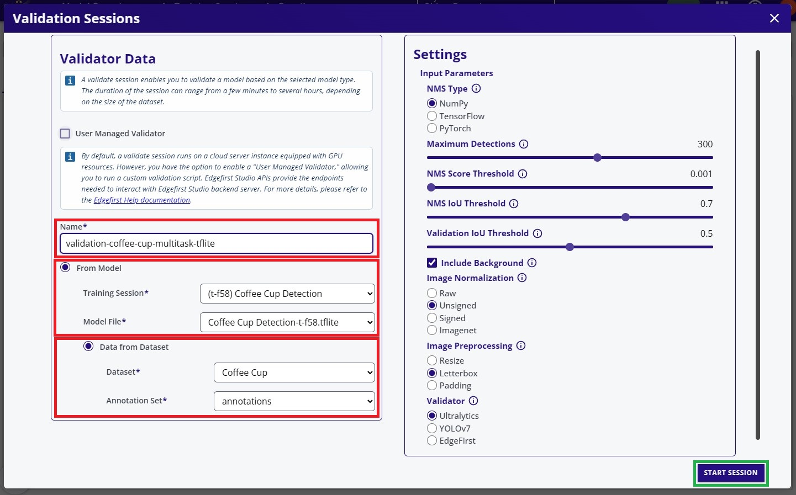
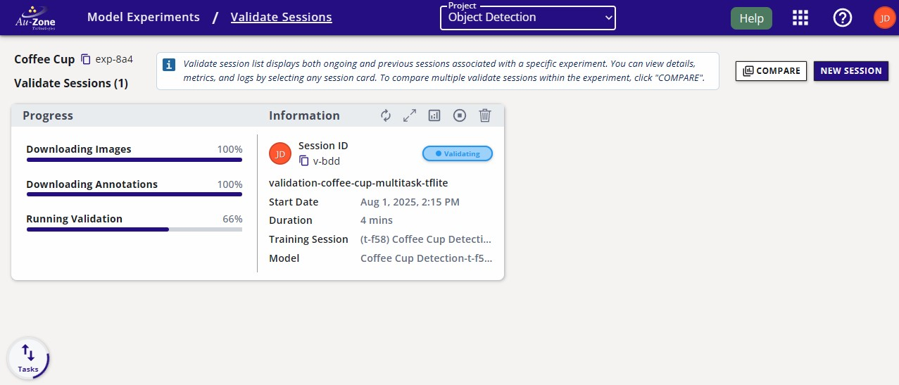
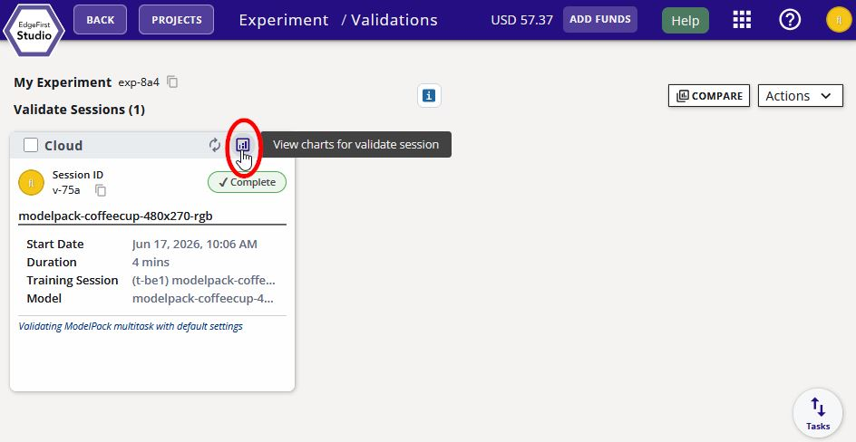

# On Cloud Validation

This tutorial will show the steps for running validation on the cloud. This type of validation is hosted as a managed validation session in EdgeFirst Studio.  A managed validation session is self hosted in an EC2 instance which is suited for users that do not have an embedded platform available to host the validation process.  In this tutorial, you will validate a **Vision** model that was trained through the [end-to-end workflows](../../../getting_started/workflows/index.md) or [Training Vision](../../training/vision.md).  For a tutorial to validate Fusion models, see [Validating Fusion Models](../fusion/managed.md).

Another type of validation is the [On Target Validation](user_managed.md) which is hosted as a user-managed validation session in EdgeFirst Studio.  A user-managed validation session deploys the model in an embedded platform.



You will be greeted with a validation session dialog.  In this dialog, specify the name of the validation session, the model to validate, and the dataset to deploy.  In this example, the TFLite model will be validated and the "Coffee Cup" dataset with the validation partition will be used.  Next specify, the validation parameters on the right.  Additional information on these parameters are provided by hovering over the info button . 

<figure markdown="span">
{ align=center }
<figcaption>Validation Session Fields</figcaption>
</figure>

Once the settings have been specified, go ahead and click on the "Start Session" button on the bottom right of the dialog.  This will start the validation session which will validate the model using the validation partition of the dataset.

## Session Progress

Once the validation session has started, the progress with the stages will be shown on the left and additional information and status is shown on the right.

<figure markdown="span">
{ align=center }
<figcaption>Validation Session</figcaption>
</figure>

## Completed Session

The completed session will look as follows with the status set to "Complete".

<figure markdown="span">
{ align=center }
<figcaption>Completed Session</figcaption>
</figure>

The attributes of the validation sessions in EdgeFirst Studio are labeled below.

<figure markdown="span">
{ align=center }
<figcaption>Validation Session Attributes</figcaption>
</figure>

## Validation Metrics 

Once the validation session completes, you can view the validation metrics by clicking the "View Validation Charts" button on the top of the session card.

<figure markdown="span">
{ align=center }
<figcaption>Validation Charts</figcaption>
</figure>

!!! info
    See [detection](../metrics/detection.md) and [segmentation](../metrics/segmentation.md) metrics for further details.

You can go back to the validation session card by pressing the "Back" button as indicated in red below on the top left corner of the page. 

<figure markdown="span">
{ align=center }
<figcaption>Back to the Session Card</figcaption>
</figure>

## Comparing Metrics

It is also possible to compare validation metrics for multiple sessions.  See [Validation Sessions](../../../studio/models.md#validation-sessions) in the Model Experiments Dashboard.

## Next Steps

Now that you have validated your Vision model, you can find examples for deploying your model in the [EVK](../../deployment/evk.md) or the [Maivin Platform](../../deployment/maivin.md).  Furthermore, you can also find examples for running your [ModelPack model](../../deployment/pc/mpk.md) or [Ultralytics model](../../deployment/pc/ultralytics.md) in your PC.
