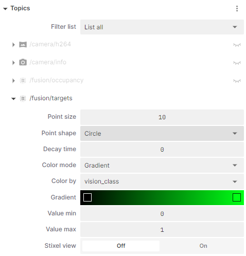
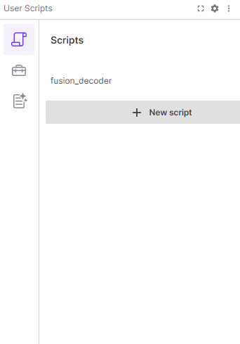

# Advanced Foxglove
This section will describe two, more advanced tasks with [Foxglove Studio](foxglove.md):
1. Using the 3D Panel to view the post-processed [Radar](radar.md) outputs contained in the Fusion Targets topics.
2. Using the User Scripts panel to created a short Typescript script that also outputs the values for those topics.

It is assumed you have read the [introduction to Foxglove Studio](foxglove.md), familiarized yourself with the application, and have [downloaded an MCAP](recording.md#downloading-and-analysis) that has recorded the [`/fusion/targets` topic](configuration.md#fusion-recording).

## The Fusion Targets Topic
The Fusion Targets topic contains post-processed radar outputs that identify targets as people.  For each target it detects, it returns the following information about the target:
* x, y, and z co-ordinates of the target, in metres
* speed, in metres per second
* power
* radar cross section
* cluster ID
* Fusion Class
* Vision Class

The first six fields are generated from the Radar, while the last three are generated by the Fusion service.  Each of the nine fields is 4-bytes in size and is noted in the `/fusion/targets` topic `fields` field.  
{align=center}

Each target takes up 36 bytes of data which is noted in the "point_step" field.  There is a "width" field in the topic which counts the number of targets, a "row_step" field that counts the number of bytes of raw data in the topic, such that `row_step = point_step * width`.  We can see these fields in a Raw Messages Panel looking at the `/fusion/targets` topic; the nine items in the "fields" field being the per-target information described above.
{align=center}

The Fusion and Vision Class are produced by Fusion service on the Raivin.  They will report 0 for any cluster not identified as a person and 1 for any cluster as belonging to a human.  The Raivin WebUI can use [either class or both classes together](configuration.md#draw-pcd) to determine if any radar target is a person or not.

## 3D Panes for Fusion
To Create a 3D view for the Fusion Class:
1. From a panel in Foxglove, click the "More" kebob icon and change the panel to a "3D" panel.  
  {align=center}
2. Click the "Settings" gear icon for the panel to open up the Settings Panel.  
  {align=center}
3. Change the title from 3D to "Vision Class"
4. In the "Topics" side-panel, click the "visibility" closed-eye icon on the "/fusion/targets" to view the topic.  
  {align=center}
5. Expand the "/fusion/topics" settings and configure the following settings:
   1. Point Size to "10"
   2. Color mode to "Gradient"
   3. Color by to "vision_class"
   4. Set Gradient values to "000000ff" (black) and "00ff15ff" (green)
   5. Set Value min to "0" and "max to "1"  
  {align=center}
6. Expand the "Custom Layer" side-panel, and then the "Grid" settings and configure the following settings.
   1. Set Size and Divisions to "12"
   2. Set the "Position X" setting to "6"  
  {align=center}

Once all that is finished, you should have a panel that looks as the left panel as follows - camera panel also shown for comparison.  
{align=center}

### Adding Vision Class
The steps above and be followed for Vision Class as well, but please note - you cannot have both classes on the same 3D panel, as each topic is only allowed once.  If you want, you can also do these in an easier fashion.
1. On the "More" kebob icon of the fusion class, split the panel (in this case, down)
  {align=center}
2. In the bottom Fusion Class panel, make the following changes:
   1. Change the "Title" to Vision Class
   2. In the "/fusion/targets" settings, change "Color by" to "vision_class" and the right gradient to "ff8300ff" (orange)
  {align=center}

The new panels should looks as below.
{align=center}

In the bottom right corner of this screenshot, we see a "/studio_script/output_topic" Raw Messages Panel.  This is the output of TypeScript user script created in FoxGlove that we will describe in the next subection.

## User Scripting
FoxGlove has a ["User Scripts"][fg_us] panel that uses [TypeScript][typescript] to manipulate the MCAP topics.  This section will show a script created extract the "fusion_class" and "vision_class" values of each target and output if either class is reporting a person from the radar output.

### The User Script Interface
When you change a panel to a User Scripts panel, you will see the Welcome splash screen.  
{align=center}
The important icon in the left sidebar is the top one, the "Scripts" scroll icon, which will open any scripts you have created for editing.  The "Ulitilies" toolbox icon, which displays the various importable libraries, is also important and worth reviewing.  If we have script already created, we can click on it to edit it.  It is recommended that you open the "User Scripts" panel in fullscreen if you create scripts in it.
{align=center}

There is one script, "fusion_decoder", which is the script we can look at. Since you do not have this script, it is included below - you can copy-and-paste this into a new script panel.

### The Script
Here is the "fusion_decoder" script.

```TypeScript
import { Input } from "./types";
import { Float32Reader } from "./readers";

export const inputs = ["/fusion/targets"];
export const output = "/studio_script/output_topic";

export default function script(event: Input<"/fusion/targets">): {
  Person: Array<string>;
} {
  let targets = event.message.width;
  let d: Uint8Array = new Uint8Array(event.message.data);
  let p_step = event.message.point_step;
  let out_array: Array<string> = [];

  for (let ii = 0; ii < targets; ii++) {
    let f32r = new Float32Reader(ii * p_step);
    let fusion = f32r.read(d, 28);
    let vision = f32r.read(d, 32);

    if (fusion + vision > 0) {
      let temp = `Fusion: ${fusion} Vision: ${vision}`;
      out_array.push(temp);
    }
  }
  return { Person: out_array };
}
```
We first need to import the "Input" class from the "./types" library as it is the class type of input topics.  We also need a reader to parse the 32-bit Floating Point numbers in from the 8-bit unsigned integer data array.  Lastly, we need to declare the input and output topics we will be using in the script.

This default function will take an inputed topic and return an array of strings with the name of "Person".  Referring back to the image in the previous section, we see that this is a Raw Messages Panel for the output topic, `/studio_script/output_topic` which comes from the script `fusion_decoder`, and is a list of strings named "Person".

As `event` is the variable name for the `/fusion/targets` topic, we can use the `message` instance variable to access the topic elements.  For example, `event.message.width` and `event.message.point_step` refer to the "width" and "point steps" fields discussed above.  We set the topic data to a Uint8Array named `d` for short-hand and initialize the output array.

We then have the for loop that goes through each Fusion target and determines what the Fusion and Vision classes report.  We create a new reader at the starting offset of the target ``ii*p_step``, and read the values at offsets 28 and 32, respectively for `fusion_class` and `vision_class`.  If either value is 1, it will append the infomration to the output array.

Once all the targets have been processed, the function returns the array of strings as the "Person" array.  To confirm this is done correctly, we should check to see if the new `/studio_script/output_topic` topic exists.  If you have a "Data Source Info" panel up (or create one), you should see the topic in the list:
{align=center}
If it exists, we should be able to load the topic in a Raw Messages Panel as we did above.

Using this script as a base to expand functionality should be quite easy.  For example, let's not just output the Fusion and Vision class values for each target person; let's also include Cluster ID and X,Y,Z distances.  We can do this by replacing the inside of the if statement with the following code.

```TypeScript
    if (fusion + vision > 0) {
      let x = Math.round(f32r.read(d, 0) * 100) / 100;
      let y = Math.round(f32r.read(d, 4) * 100) / 100;
      let z = Math.round(f32r.read(d, 8) * 100) / 100;
      let id = f32r.read(d, 24);

      out_array.push(`tar: ${id} (${x}, ${y}, ${z}) F: ${fusion} V: ${vision}`);
    }
```

{align=center}

For more detailed information about Foxglove Studio features, visit the [Foxglove Documentation website][foxglove_doc].

[fg_us]: https://docs.foxglove.dev/docs/visualization/panels/user-scripts
[typescript]: https://www.typescriptlang.org/
[foxglove_doc]: https://docs.foxglove.dev/docs/introduction/