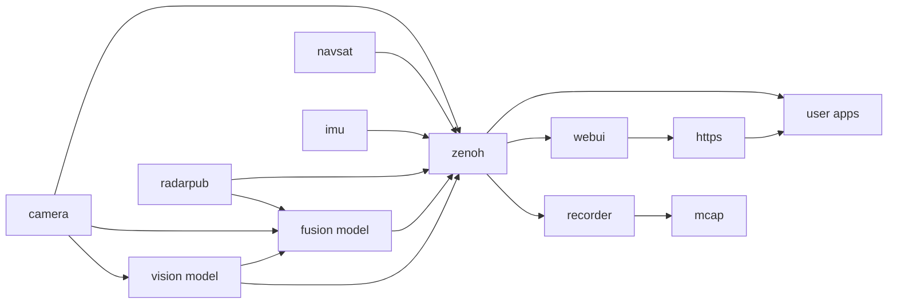

# System Architecture

The EdgeFirst Perception Modules run a Linux operating system based on Toradex's Torizon, we refer to
the operating system as Torizon for Maivin.  The operating system packages include common libraries
and tools you would expect to find on a typical embedded Linux operating system focused on computer
vision and AI (Python, OpenCV, etc...).  

Central to the EdgeFirst Perception Modules is the EdgeFirst Perception Middleware, what we call our
collection of applications and libraries used in the implementation of the perception stack.  The
details of the low-level libraries are covered in the EdgeFirst Perception Developer Guide, for 
this document we focus on describing the application services and how they fit together to deliver 
the perception middleware.

## Middleware Services

The Perception Middleware is modular and split into various application services, each focused on a
general task.  For example a camera service is charged with interfacing with the camera and ISP
(Image Signal Processor) to efficiently deliver camera frames to other services who need access
to the camera.  The camera service is also responsible for encoding camera frames using a video
codec into H.265 video for efficient recording or remote streaming, this feature of the camera
service can be configured or disabled if recording or streaming are not required.

The middleware services communicate with each other using the Zenoh networking middleware which
provides a highly efficient publisher/subscriber communications stack.  This architecture is similar
to ROS2 and our services encode their messages using the ROS2 CDR (Common Data Representation).
We use the ROS2 standard schemas where applicable and augment with our own custom schemas where
required.  The Recorder and Foxglove chapters go into more detail on how this allows efficient
streaming and recording of messages and interoperability with industry standard tools.

