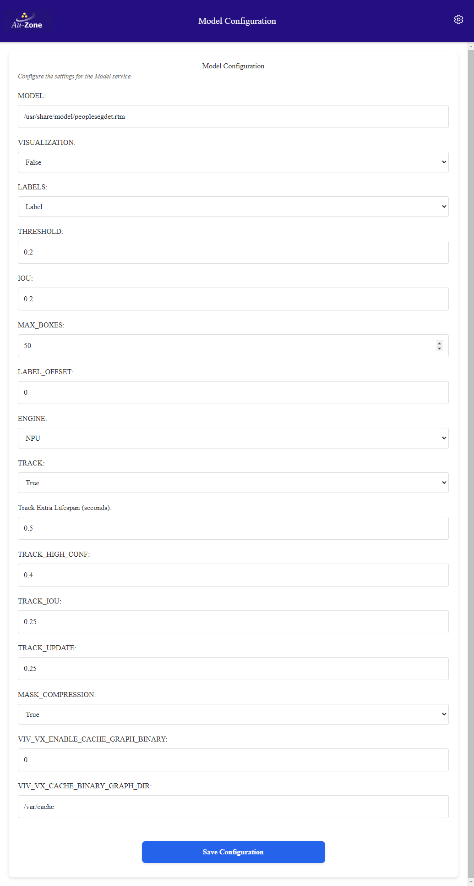
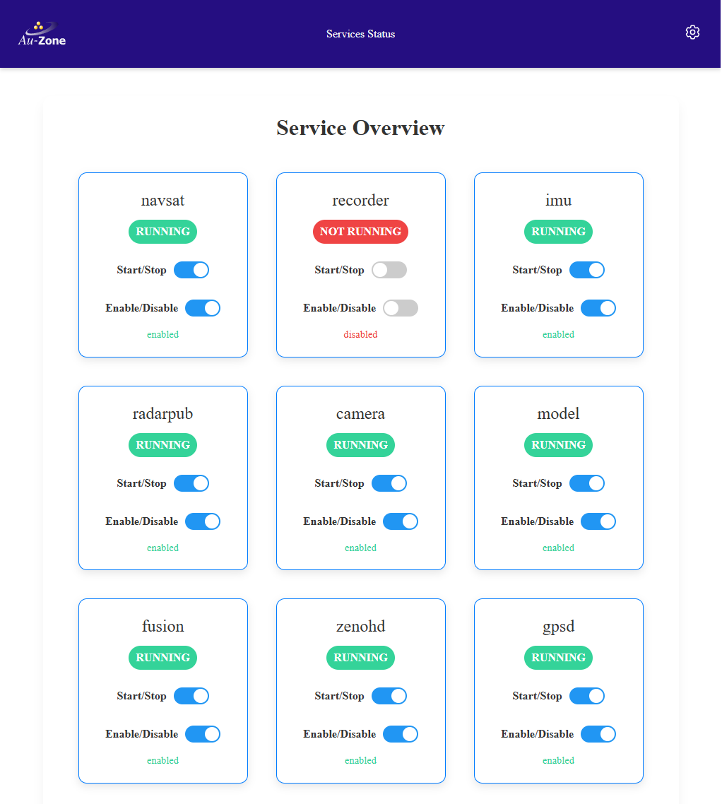

# Configuration
This section describes the various settings pages and what they do.  The root Settings Page can be reached by clicking the rightmost gear icon on the top ribbon of any page of the Raivin web-interface.
{align=center}

Every settings page has a "Save Configuration" button at the bottom of the page. If you make changes, click this button to save them.
{align=center}

## MCAP Recorder Settings Page
This page configures how sensor and processed outputs are saved on the [MCAP Recording Page](./recording.md).
{align=center}

```{tip}
These values are stored in the `/etc/default/recorder` file on the device and can be hand-edited.  This is not recommended.
```

### Storage Location
This controls the storage location for the MCAP recordings.  If using an SD Card, this should point to /media/DATA or adjusted for the SD Card mount point.

### Compression
This controls the MCAP compression level.  Compression will impact the CPU usage compared to no compression but can have significant benefits to MCAP size.  It is most impactful when recording the `/radar/cube` or `/model/mask` topics.  Options are `none`, `lz4`, and `zstd`.  The [LZ4][lz4] compression is faster while [ZSTD][zstd] provides better compression.  No compression is the fastest but creates files up to 3x larger.

### Topics recording
The rest of the page reports upon which topics are recording and allows the user to enable or disable certain optional topics.  Mandatory topics that cannot be changed on the page include:
- **/tf_static**: This is a meta-topic that includes information from all recorded topics.
- **/gps**: This is the GPS topic that includes latitude, longitude, elevation, etc.
- **/imu**: This is where the IMU sensor exports its information, and includes acceleration and orientation information about the vision module.
- **/camera/info**: This includes information about the video sensor.
- **/camera/h264**: This contains the raw-video output of the video sensor, in H.264 format.

These topics are parts of the "Localization Topics" and "Camera Topics", which are currently locked.

Clicking on the "Model Topics" box will enable recording of all the Model and Fusion recording topics, as described below.

#### Model Recording
Checking the "/model" topic box enables the following topics:
- **/model/info**: This contains information regarding the model being run.
- **/model/boxes2d**: This includes detection boxes from the model, if the model supports object detection.
- **/model/mask_compressed**: This contains the output of the segmentation model if running.

#### Fusion Recording
Checking the "/fusion" topic box enables recording of the following topics:
- **/fusion/targets**: This contains information regarding the analysis of the radar targets, specifically which are people and which are not.
- **/fusion/occupancy**: This contains information regarding the occupancy of targets on a polar grid emanating from the camera.

#### Radar Recording
Checking the "/radar" topic box enables the following topics:
- **/radar/info**: This contains information regarding the radar.
- **/radar/targets**: This contains the target information from the radar sensor.
- **/radar/clusters**:  This contains the clustered information from the radar sensor.
It also opens up the "/radar/cube" topic that can be enabled.

#### Radar Cube
- **/radar/cube**: The raw radar cube data output.  This can be a lot of data, and we provide
expose a setting to user to limit this.

The Radar Cube FPS setting limits the radar cube framerate to reduce recording size.  While the camera topic is encoded with H.264 which makes use of keyframes to significantly reduce the topic size, no such compression is available for the radar cube which means only the COMPRESSION parameter applies (if enabled).  While capturing datasets, the full 18 FPS is typically not required and it is recommended to set this parameter to 1-5 FPS to reduce the MCAP size.

## Camera Settings
This page configures the camera service that interacts with the Raivin's [OmniVision OS08A20 image sensor][os08a20].  With the exception of the H.264 Bitrate and maybe camera or stream sizes, it is not recommended that you change these settings.
{align=center}

```{tip}
These values are stored in the `/etc/default/camera` file on the device and can be hand-edited.  This is not recommended.
```

### Camera Device
This configures what camera device the camera service will use, which on Raivin will be `/dev/video3`.

### Camera Size
This sets the camera resolution which is used for the camera capture and separate from the streaming resolution. The camera resolution can be set to any resolution supported by the camera.

### Stream Size
This configures the streaming resolution for the H.264 and JPEG streaming.  The H.264 stream supports up to HD resolution (1920x1080).  The JPEG stream supports all resolutions but is encoded on the CPU so the practical limit is around 960x540 or 640x360 to maintain 16:9 aspect ratio.

### Mirror
The camera mirror setting can flip the camera image to match the orientation of the camera. The camera can also be mirrored horizontally to provide a mirror image.  Accepted values are "none", "horizontal", "vertical", and "both".  This is set to "both" as the image sensor is both upside-down and inverted.

### H.264 Bitrate
Controls the H.264 streaming compression level.  The higher the bitrate, the better the quality of the image.  The actual bitrate remains variable based on the scene but this value sets the cap. Possible values are "auto", "mbps5", "mbps25", "mbps50", and "mbps100".  The "auto" setting is about 10 Mbps on the Raivin. This also impacts MCAP recording size.

### H.264 Streaiming
This setting enables or disables the /camera/h.264 topic.

### JPEG Streaming.
This setting enables or disables the /camera/jpeg topic.

## WebUI Settings Page
This page configures how information is displayed on the [Segmentation Page](./walkthrough.md#the-segmentation-page).
{align=center}

```{tip}
These values are stored in the `/etc/default/webui` file on the device and can be hand-edited.  This is not recommended.
```
### Mirror Inputs
This mirrors both the Segmentation View as well as the Occupancy Grid on the Segmentation page.

### Angle Bins
These three settings set the left-side minimum, right-side maximum, and width size (in degrees) of the angular radar views on the Segmentation and Occupancy pages.  The below image shows a minimum of -70, maximum of 70, and a binwidth of 14.
{align=center}

### Range Bins
These three settings set the near-side minimum, far-side maximum, and width size (in meters) of the radar views on the Segmentation and Occupancy pages.  The below image shows a minimum of 2, maximum of 9, and a binwidth of 1.
{align=center}

### Draw PCD
There are three settings for drawing the Point Cloud Data (PCD):
- **Grid Draw PCD**: This controls drawing the PCD on the Occupancy Page
- **Combined Grid Draw PCD**: This controls drawing the PCD on the Occupancy Grid on the Segmentation Page.
- **Combined Camera Draw PCD**: This controls drawing the PCD on the Segementation View on the Segmentation Page.

Each of these settings can be configured to disable drawing the PCD, or draw it based on radar power, radar cross-section (RCS) area, speed of object, or post-processed output from the Fusion model, Vision model, or Combined from both.

### Topics
The topic settings control the following:
- **Mask Topic**: This sets what topic the Segmentation View uses as input to draw segmentation masks.
- **Detect Topic**: This sets what topic the Segmentation View uses as input to draw detection boxes.
- **PCD Topic**: This sets what topic the Segmentation View and both Occupancy Grids use as input to draw radar data.
- **H264 Topic**: This sets what topic the Segmentation View uses to get the video feed.

### Draw Boxes and Draw Boxes Text
The settings turn on objection detection boxes and text from the Detect Topic to display on the Segmentation View.  If there is no Detect Topic, boxes will not be displayed.

### Show Stats and People Count
These settings enable statistics views and a people counter on the Segmentation and Occupancy Pages.  The statistics are near the top right of the screen while the people counter is at the bottom right.
{align=center}

## Model Configuration
These settings configure the perception engine that is processing input from the video sensor and providing output on the model topics.
{align=center}
```{tip}
These values are stored in the `/etc/default/model` file on the device and can be hand-edited.  This is not recommended.
```

### Model
A model is required for the model application. This can be a segmentation model and/or a detection model.

### Engine
The model can be run using different computation engines.  The default engine is the i.MX 8M Plus NPU.  Other options are the CPU or the GPU.

### Detection-only Settings
The following settings will only impact detection-based output in the `/model/boxes2d` topic with models that output object detection results.

#### Visualization
Enables publishing the legacy visualization message for detection models.  It is 'false' by default which means only the primary model box and mask topics will be available.  If using Foxglove Studio make sure you install the [EdgeFirst for Foxglove Plug-in](./foxglove.md#installing-edgefirst-plugin).

#### Threshold
Score threshold sets the minimum detection score before a bounding box is generated for the inferred object for detection.

#### IOU
Detection IoU controls the minimum overlap for merging boxes during NMS.  A larger number will produce more boxes with some overlap while a smaller number will generate fewer boxes.

#### MAX_BOXES
The maximum number of detection boxes which can be generated.

#### LABEL_OFFSET
The label offset is required for certain models to account for differences in background class handling relative to the labels.  It should usually be zero but some odd configurations will sometimes require 1 or -1 for offset.

### Track Settings
These settings impact object tracking with object detection.  They have no effect for segmentation-only models.

#### TRACK
This turns on the [ByteTrack][bytetracker] tracker. This is useful for smoothing bounding boxes across frames, and for associating multiple detections over time to a single object. None of the other settings will have an effect if this is set to 'false'.

#### Track Extra Lifespan (seconds)
The number of seconds a tracked object can be missing for before being removed from tracking.

#### TRACK_HIGH_CONF
The high confidence threshold for the ByteTrack algorithm.

#### TRACK_IOU
The tracking IoU threshold for box association. Higher values will require boxes to have higher IoU to the predicted track location to be associated.

#### TRACK_UPDATE
The tracking update factor. Higher update factor will mean less smoothing but more rapid response to change. Use values from 0.0 to 1.0. Values outside this range will cause unexpected behaviour.

### Segmentation-only Settings
The following setting will only impact segmentation-based output in the `/model/mask_compressed` or `/model/mask` topisc with models that output segmentation results.

#### MASK_COMPRESSION
Enable compression for segmentation masks.  When enabled, both the `/model/mask` and `/model/mask_compressed` topics will be available.  The compressed mask should be used from remote connections while the un-compressed topic should be used from local connections to avoid redundant compress/decompress steps.
```{warning}
Turning off mask compression will disable the `/model/mask_compressed` topic.  The WebUI will need to have its [Mask Topic](./configuration.md#topics) changed to `/model/mask`.  The segmentation mask will also not be recorded.
```
### OpenVX Graph Caching
The OpenVX driver provides a graph caching mechanism that significantly speeds up future reload times for the graph.  The cache stores a binary representation of the in-memory graph, not the model used to generate the graph, to the file system.  When loading a model, graph generation proceeds as normal but the time-consuming graph loading step will first attempt to load the cached representation.  

The driver allows for many graphs to be stored and the location, along with enabling the feature, is controlled through a pair of environment variables.  This allows a user to select on a per-process basis when to enable graph cache and where to store the cache.

These settings enable and configure this functionality

#### VIV_VX_ENABLE_CACHE_GRAPH_BINARY
This option will enable the graph caching which significantly speeds up load times for models.  If you encounter issues set to 0 to disable.

#### VIV_VX_CACHE_BINARY_GRAPH_DIR
This control the NPU graph cache storage location.

## Service Status
This page allows users to enable and disable the nine main services used by the Raivin.  By default, each of these services but the Recorder service should be running and enabled.
{align=center}

## Radar Configuration (Raivin-only)
This page configures the radar publishing service that interacts with the Raivin's integrated [DRVEGRD-169 radar module][radar] from [smartmicro][smart].  With the exception of the H.264 Bitrate and maybe camera or stream sizes, it is not recommended that you change these settings.
{align=center}

```{tip}
These values are stored in the `/etc/default/radarpub` file on the device and can be hand-edited.  This is not recommended.
```

### Log Level
Log level for the application, relevant sub-filters are radarpub and drvegrd refer to [RUST_LOG documentation][rustlog] for details.

### Center Frequency
Radar center frequency band.  The low option is required when using the ultra-short FREQUENCY_SWEEP option. Options are 'low', 'medium', and 'high'.

### Frequency Sweep
The frequency sweep controls the detection range of the radar.  The following breakdown gives a general range at which a vehicle-type object should be detected.

- ultra-short: 9m (requires CENTER_FREQUENCY="low")
- short: 19m
- medium: 56m
- long: 130m
```{note}
Ultra-short range (in Frequency Sweep) only works with Low Center frequency.
```

### Range Toggle
The range-toggle mode allows the radar to alternate between various frequency sweep configurations.  Applications must handle range toggling as targets will not be consistent between messages as the frequency alternates.

```{warning}
The radar cube model does NOT currently handle alternating frequencies as it requires the dataset to be captured at a specific frequency sweep config.
```
Options are 'off', 'short-medium', 'short-long', 'medium-long', 'long-ultra-short', 'medium-ultra-short', and 'short-ultra-short'.

### Detection Sensitivity
The detection sensitivity only affects the radar target list (point-cloud) and controls the sensitivity to recognize a target.  The default is 'medium', the 'low' and 'high' sensitivity options will result in less and more targets, respectively.

### Enable Cube
Enable streaming the low-level radar cube.  This can be used by the low-level # radar fusion model or to record MCAP files for the purpose of training this model.  The radar cube capture consumes approximately 240mbps bandwidth over the private Raivin ethernet connection and approximately 75% of one of the CPU cores, enable it when required but otherwise should be left disabled.

### Clustering Options
The following settings enables and configures clustering the radar targets.

#### Clustering
Enable clustering the radar targets into the /radar/clusters topic.

#### Window Size
Temporal clustering of the radar targets using the window size.  The window size is the number of frames to cluster, each frame representing 55ms.  The window clustering is a rolling window so it does not incur any additional latency.

#### Clustering EPS
The eplison value to be used for Density-Based Spatial Clustering and Apllication with Noise(DBSCAN) clustering. Higher values mean points further from each other can be clustered together.

#### Clustering Parameter Scale
Clustering DBSCAN parameter scaling. Parameter order is x, y, z, speed. Set the appropriate axis to 0 to ignore that axis. Default setting of `[0.5 1.0 0.0 0.0]` means that only xy distances are taken into account.

#### Clustering Point Limit
The minimum number of points per cluster for DBSCAN clustering.

## Fusion Configuration (Raivin-only)
These settings configure the perception engine that is processing input from the radar sensor and providing output on the Fusion topics.
{align=center}
```{tip}
These values are stored in the `/etc/default/fusion` file on the device and can be hand-edited.  This is not recommended.
```
### Log Level
Log level for the application, relevant sub-filters include 'maivin-fusion'.  Refer to [RUST_LOG documentation][rustlog] for details.

### Radar Input Topic
The radar topic to use for a source of targets.  This is typically '/radar/clusters' which provides better target stability compared to the raw '/radar/targets' topic.

### Occlusion Angle Limit and Occlusion Range Limit
Points that are more than the "Occlusion Range Limit", in meters, behind and less than the 
"Occlusion Angle Limit", in degrees, from a classified point will not be classified. This prevent false positives from points that should be occluded.

### Occupancy Settings
The following settings are only used when the radar PCD is unclustered, usually by setting the radar input topic to `/radar/targets` instead of `/radar/clusters`.  These settings configure the way Fusion service generates occupancy output from the unclustered radar PCD.

#### Threshold
The number of required targets to acknowledge the target as real as opposed to noise that is filtered out.

#### Range Bin Limit
The minimum and maximum range to use for range bins, in meters.

#### Range Bin Width
The size of each range bin, in meters.

#### Angle Bin Limit
The minimum and maximum angles, in degrees, to use for angle bins. 0 degrees is forward.

#### Angle Bin Width
The size of each angle bin, in degrees.

#### Bin Delay
Bin delay in radar message count.  Each cell needs to be valid for "bin delay" frames before it is drawn. The cell stops being drawn after being invalid for "bin delay" frames.

[lz4]: https://lz4.org/
[zstd]: https://facebook.github.io/zstd/
[os08a20]: https://www.ovt.com/products/os08a20/
[bytetracker]: https://arxiv.org/abs/2110.06864
[radar]: https://www.smartmicro.com/automotive-radar/drvegrd-line#c20151
[smart]: https://www.smartmicro.com/
[rustlog]: https://docs.rs/env_logger/latest/env_logger/#enabling-logging