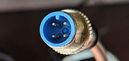
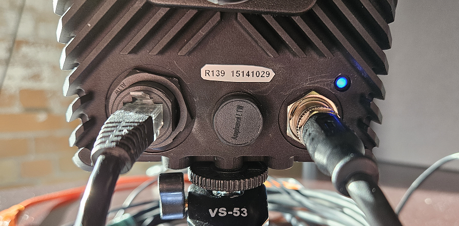
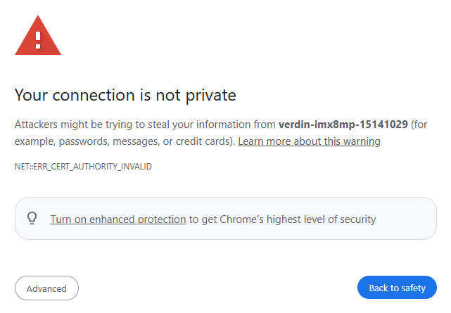
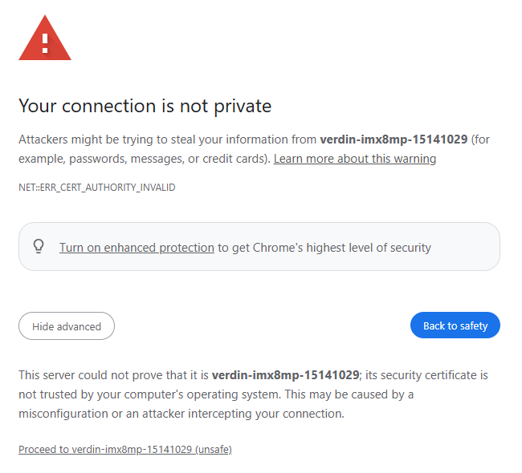
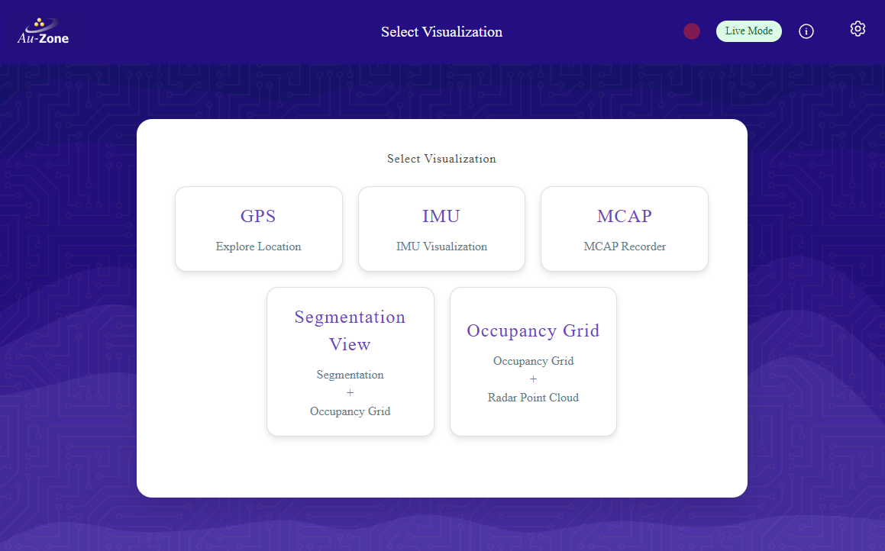
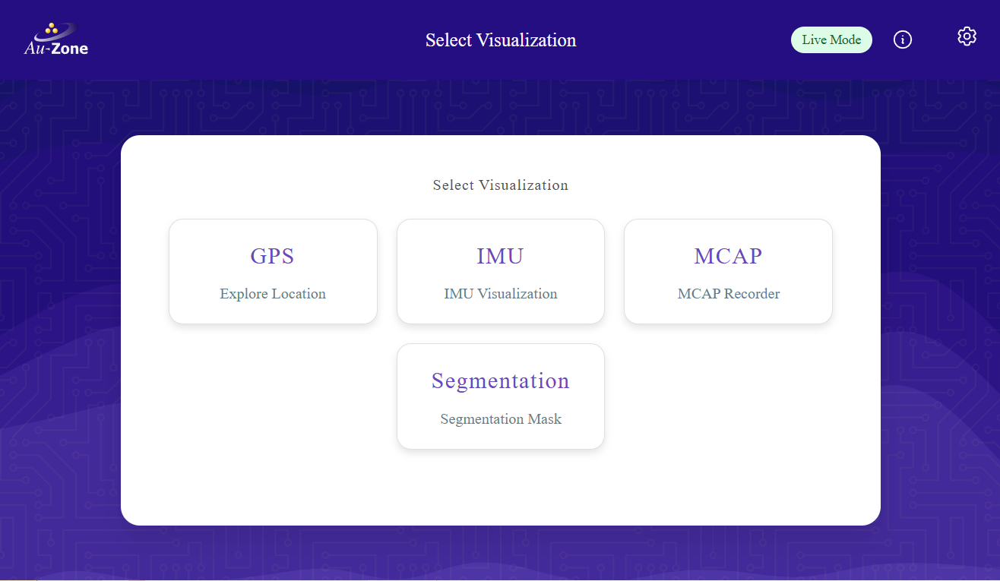
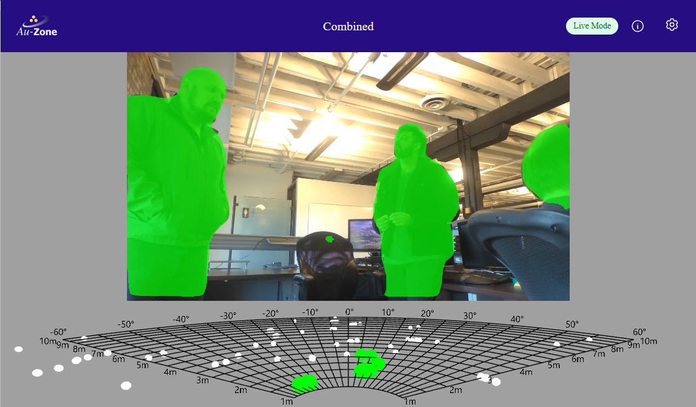
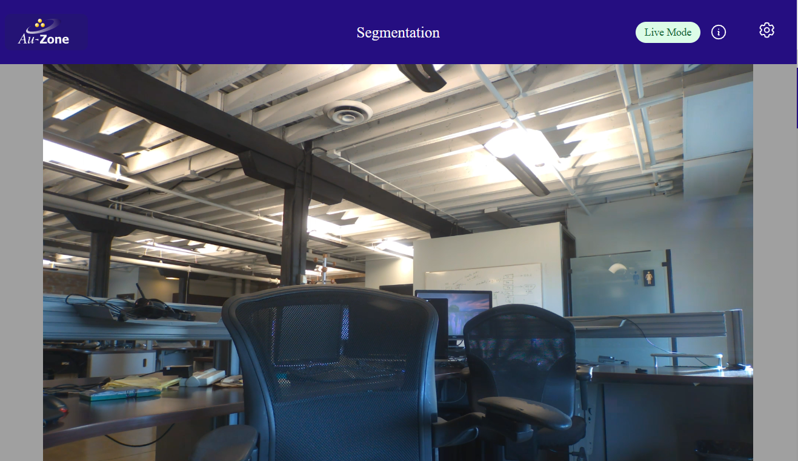

# Quick Start
This article will walk you through the Raivin setup and then lead you to resources for using additional features.

## Unboxing
The Maivin/Raivin box contains the following items:

- The Maivin/Raivin vision module
- A five-meter power cable, M12 circular connector (male) to 2.1mm x5.5 barrel adapter (female)
- Box with power adapters
    - Power-adapter with interchangeable plugs.  2.1mm x 5.5mm barrel adapter (male) connector.
    - Interchangeable plugs for the following regions:
        - NEMA 1-15P (Type A) (North America)
        - CEE-7/16 Alternative II "Europlug" (Type C) (Europe)
        - AS/NZS 3112, ungrounded (Type I) (Australia / Oceania)
        - BS 1363 (Type B) (British) wall adapter
- Desktop tripod

## Connecting the Device
If you wish to mount your Raivin to the tripod, it should be done now before connecting any of the other cables.  There are three mount points on the bottom of the device and one on each side.  Screw the tripod into the center bottom mount point.

Next, connect a standard Category 5 network cable (not included) from your shared network into the device.

Optionally, you can connect an antenna to the SMA connecter on the top-right corner of the back of the device to enhance GPS reception.

Chose the proper power adapter plug from your region and connect it to the power cable.  Then connect the M12 connector of the power cable to the connection at the back of the module, making sure to align the tab at the top of the connecter to its corresponding slot.  
{align=center}

The device should boot up as soon as it is connected.  A blue light above and to the right of the power connecter should start blinking.  
{align=center}
*Raivin showing network connection (left), eight-digit ID number (middle), tripod connected (bottom), and power connection with blue status light on (right)*

```{warning}
The Raivin may get hot during operation.  Do not handle while operating.  Temperature can be measured with the `cat /dev/carrier_temp` command, which will output device temperature in millidegree Celsius.
```

## On Boot Up
The Raivin will have an eight-digit number on the back of the device.  This is the ID number.  The hostname of the Raivin will be "verdin-imx8mp-\<id>.local", which is advertised over Multicast Domain Name System (mDMS).  For the steps below, the eight-digit number is "15141029".  The device will have a hostname of `verdin-imx8mp-15141029.local`.  This hostname can be used to connect to the device over [SSH](./ssh.md) and HTTP.
```{tip}
On Windows machines, you will not need to add the '.local' suffix.
```

The Raivin has a web interface that can be connected to via both HTTP and HTTPS by entering `http://verdin-imx8mp-<id>.local`.  On first connection to the web interface, you will get a "Your connection is not private" warning.
{align=center}  
This is expected and nothing to worry about -- the HTTPS connection needs a SSL certificate which the vision module does not have.  Click the "Advanced" button, and then "Proceed to" link.  
{align=center}

After all that, you should see the [Raivin Main Page](./walkthrough.md).
{align=center}.  
If you have a Maivin, you will see the Maivin Main Page instead:  
{align=center}

From here, we recommend that you check out the Segmentation View page by clicking the "Segmentation View" card.  For a Raivin, it looks as so:  
{align=center}  
and for a Maivin:  
{align=center}  
```{note}
The ultra-short model included in this release was trained for fixed camera and mostly tested indoors.
```