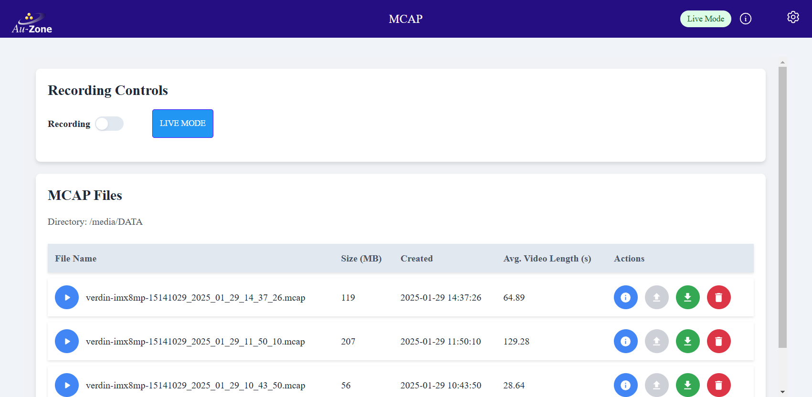
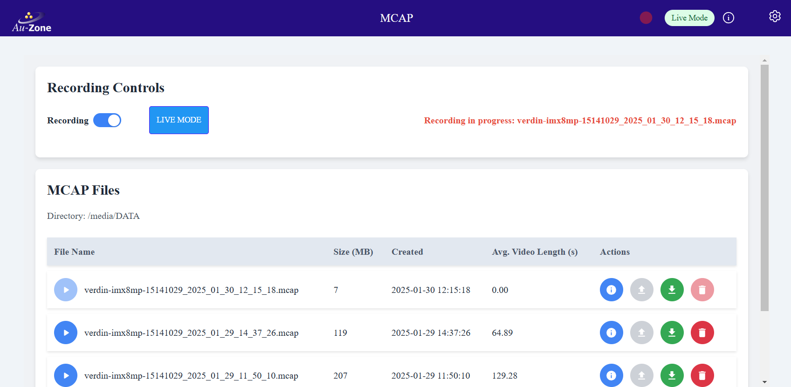
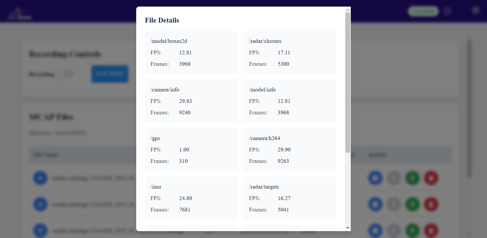

# MCAP Recording Service

## Overview
The Recorder Service enables you to capture and store [ROS2][ros2] topic data in [MCAP][mcap] format, providing a comprehensive recording solution for your Raivin system. This service acts as a data historian, collecting published topics from various services for later analysis and playback.

### How It Works
When active, the Recorder Service:

- Logs specified topics
- Compiles data into an MCAP-format recording
- Automatically saves the file upon service termination
- Provides real-time recording status

## Using the Recorder
The MCAP Recording Service is managed on its own visualization page, which can be accessed by clicking the "MCAP" card on the Raivin Main Page or by typing `https://<hostname>/mcap` in your browser window.  
{align=center}
At the top of page, under the ribbon, we have the Recording Toggle, which will start or end an MCAP recording.  We also have the "Live Mode" button, which will take the Raivin out of ["Replay Mode"](./replay.md) and back to "Live Mode".

Under this, we have the listing of MCAP files currently the MCAP recording directory.  This directory is noted at the top of the list -- in the above image, it is `/media/DATA`.

For each MCAP file, the following elements and information exist, starting from left to right:

- A playback button. Clicking this will put the device into ["Replay Mode"](./replay.md), replaying the sensor information from this MCAP file.
- The filename of the MCAP
- The size of the MCAP, in MB
- The creation date and time of the MCAP
- The video length of the MCAP
- Four Action buttons, which are:
     - The "Details" button, which shows information about the topics recorded in the MCAP file (see below).
     - The greyed-out and currently non-functionality "Upload" button.
     - The "Download" button, which will download the MCAP file to your local machine.
     - The "Delete" button, which will remove the MCAP file.

### Starting a Recording
To start a recording, simply click the "Recording" toggle to begin capturing data.
{align=center}  
Note the the red text describing that recording is in progress with the filename of the recording.  Also notice the the Recording notification on the top ribbon is now on.
```{note}
It may take up to 30 seconds for a recording to start, depending on topic tracked.
```
To stop recording, click the "Recording" toggle a second time.

### Managing Recordings
Once a recording is complete, you can see the size in MB and duration in seconds of the captured data on the MCAP page.  You can also get more detailed metadata, such as the topics recorded, by clicking the "Details" button for the MCAP recording.
{align=center}  
At the bottom of the "File Details" modal, there is a "Close" button to close the modal.
```{note}
MCAP recording file names are saved in `hostname_YYYY_mm_DD_HH_MM_SS.mcap` format, where:
- _hostname_ is the hostname of the device, e.g. `verdin-imx8mp-071744901`
- _YYYY_mm_DD_ is the zero-padded year, month, and day that the recording was started
- _HH_MM_SS_ is the UTC time the recording start in 24-hour notation
```
Any MCAP recording can be deleted by clicking its "Delete" button and confirming that you wish to delete the button.

### Downloading and Analysis
Click the "Download" button to save the MCAP file to your PC.  You can also use a [SSH client to copy files](./ssh.md#secure-copy) off the Raivin.  Once the MCAP recording is saved on to your PC, you can use an MCAP reader such as [Foxglove Studio](./foxglove.md) to analyze the recorded data.

## Configuration
The Recorder Service can have the following settings configured:
- Which topics to record
- Location of the recording file
- Recording compression

These settings can be configured in the [MCAP Recorder Settings Page](./configuration.md#mcap-recorder-settings-page).

[ros2]: https://www.ros.org/
[mcap]: https://mcap.dev/