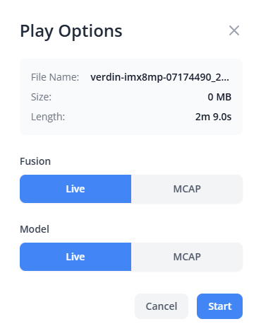
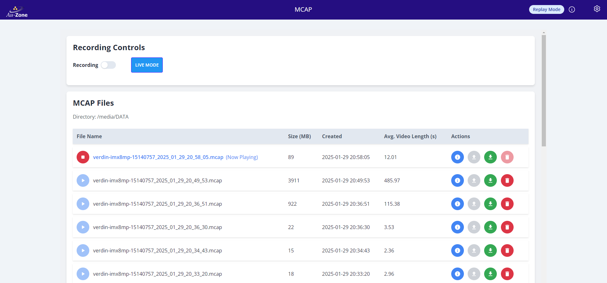
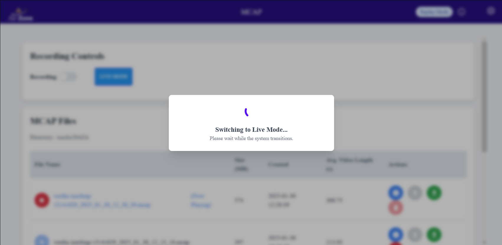
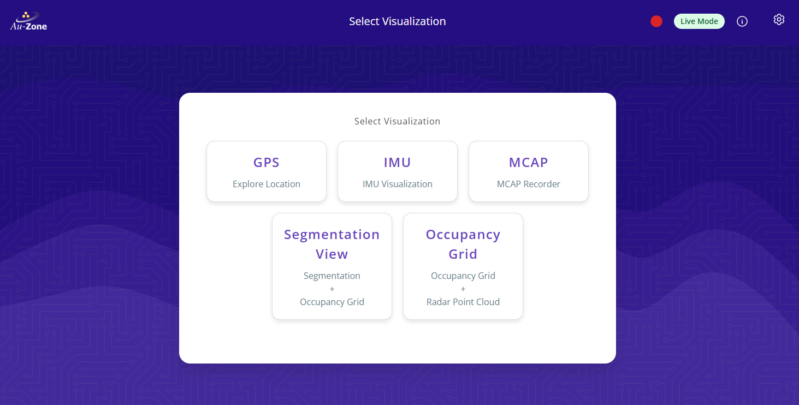
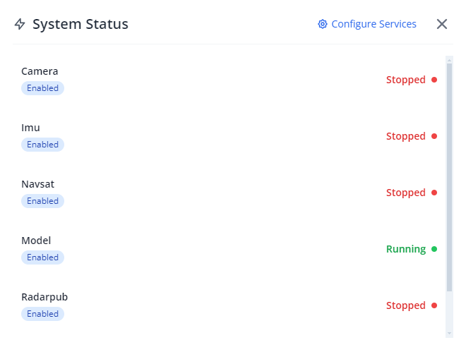

# MCAP Replay Service

## Overview
The Replay Service allows users to play back previously recorded MCAP files, enabling detailed analysis of MCAP data. This service provides flexible playback options and integrates with live fusion and model data for comprehensive testing and validation.

### How It Works
The Replay Service offers:
- Playback of recorded MCAP files
- Hybrid mode combining recorded and live data
- Real-time status monitoring
- Seamless integration with live system operations

## Using the Replay Service
The Replay Service is built into the [MCAP Recorder Page](./recording.md).  You can visit the page by clicking the "MCAP" card on Raivin Main Page or typing `https://<hostname>/mcap` in your web browser.
### Starting Playback
1. Locate your desired MCAP file in the file list
2. Click the "Play" button (▶️) next to the file
3. In the playback options dialog, choose your preferred settings:
   - Fusion Source: Choose between Live or MCAP data for the post-processed radar topics
   - Model Source: Choose between Live or MCAP data for the post-processed image topics  
   {align=center}
4. Click "Start" to begin playback

During playback, the currently playing file will be highlighted and marked as "Now Playing".  The State Indicator at the right in the top ribbon also notes we are "Replay Mode".  
{align=center}

Now that the device is in "Replay Mode", the inputs to the Segmentation, Occupancy, GPS, and IMU pages will come from the MCAP file instead of from the live sensors.

### Playback Controls
- Click the "Live Mode" button to return to displaying live sensor data.  
{align=center}
- Click the stop button (⏹️) on the playing file to end playback
   ```{note}
   Stopping a file from replaying will not put the device back into "Live Mode".  You must click the "Live Mode" button to return to "Live Mode".
   ```
```{note}
When a file is playing, you cannot play another file until you stop the current playback.  Once you stop a file, you can start playing another file by clicking its "Play" button.
```

### Hybrid Mode
The Replay Service supports a hybrid mode where you can:
- Play back recorded sensor data while using live fusion and/or model data  
{align=center}
- Use recorded data for some systems while maintaining live data for others
- Mix and match recorded and live data sources based on your testing needs

# Status Monitoring
This section describes the various states the system can be in and how they are reported.

## System Status Bar
The status bar provides real-time information about your system's operational state and service health.

### Status Indicator
Located in the top-right corner, the status indicator shows:
- **Live Mode** (Green): System is operating with live data
- **Replay Mode** (Blue): System is playing back an MCAP file
- **Degraded Mode** (Amber): Some services are not operating optimally
- **Critical Mode** (Red): Critical services are not functioning

### Recording Indicator
A pulsing red circle appears when the system is actively recording.  
{align=center}

### Service Status
Click the information (ℹ️) button to view detailed service status, which shows the individual service states (Running/Stopped).  
{align=center}