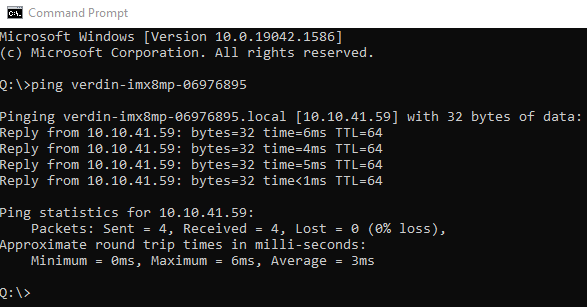
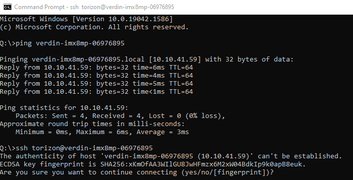
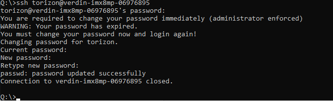
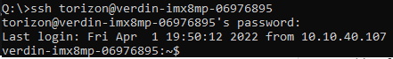

# SSH
This section describes how to SSH into a Raivin using the default "torizon" account, and some basic commands you can use to provide some basic information about your Raivin if you have found an issue.
```{warning}
The "torizon" account is effectively the root account of the Maivin device.  Using this account can cause irreparable harm to the software internals of the device. 
```
```{warning}
As part of the initial SSH session, you will be asked to change the default password.  PLEASE RECORD THIS PASSWORD!  If you forget it, you will be unable to SSH into the device without a reinstall.  
```
You need an SSH client ([OpenSSH][openssh], [PuTTY][putty], etc.) to SSH into the Maivin.

## The Intial SSH Session
First, verify that your Maivin is turned on and connected to the network.  You can follow the [Quick Start instructions](./quickstart.md#on-boot-up) to get the hostname of the device, which for the examples in this section will be `verdin-imx8mp-06976895.local`.
```{tip}
Windows does not need the `.local` hostname suffix.
```
In a command prompt, ping the Maivin's hostname.  
{align=center}
If the Maivin does not reply, please confirm the Maivin is powered on and connected to the network.

Once the ping is successful, use your SSH client to connect to the 'torizon' account on the Maivin's hostname.  For a command-line SSH such as OpenSSH, this should look as:

```shell
ssh torizon@Maivin-hostname
```
For example:  
{align=center}
On the first log of a new or updated Maivin, you may get the "authenticity of host" error.  This is expected, and type "yes" to continue connecting.

On a new Raivin, it will ask you to change the default password to a new password.  Re-enter the 'torizon' password, and then enter a new password twice.  After you change the default password, the SSH session will close so you can re-login with the new password.  
{align=center}

Once you've finished those steps, the next and all future SSH sessions should look as follows:  
{align=center}

You are now at the Linux command-line prompt for the Raivin!

## Standard Debugging Commands
The version of Raivin you are running can be found using `ostree admin status`,
```shell
$ ostree admin status
* torizon e56b949928e920ea6045b794315912eec30ae7ae4aa157a2c4e96b4fd0b9b872.0
    Version: 2025.01rc1
    origin refspec: torizon/maivin/testing
  torizon a5454f3490fbc0463c7ec076416049d1bc0ec93709ded78c988bd17430054bc5.0 (rollback)
    Version: develop-24
    origin refspec: torizon/maivin/develop
```
and in the `/etc/os-release` file.
```shell
$ cat /etc/os-release
ID=torizon-maivin
NAME="Torizon for Maivin"
VERSION="2025.01rc1+build.2 (kirkstone)"
VERSION_ID=2025.01rc1-build.2
PRETTY_NAME="Torizon for Maivin 2025.01rc1+build.2 (kirkstone)"
DISTRO_CODENAME="kirkstone"
BUILD_ID="2"
ANSI_COLOR="1;34"
VARIANT="Maivin"
```
The status of a specific service can be determined by running `systemctl status <service name>`.  For example, we can see the status of the camera service:
```shell
$ systemctl status camera
● camera.service - Maivin Camera Service
     Loaded: loaded (/usr/lib/systemd/system/camera.service; enabled; vendor preset: enabled)
     Active: active (running) since Wed 2025-01-29 10:31:34 CST; 6h ago
    Process: 17955 ExecStartPre=/bin/sleep 30 (code=exited, status=0/SUCCESS)
   Main PID: 18324 (camera)
      Tasks: 21 (limit: 3772)
     Memory: 25.2M
     CGroup: /system.slice/camera.service
             └─ 18324 /usr/bin/camera

Jan 29 10:31:04 verdin-imx8mp-15141029 systemd[1]: Stopped Maivin Camera Service.
Jan 29 10:31:04 verdin-imx8mp-15141029 systemd[1]: Starting Maivin Camera Service...
Jan 29 10:31:34 verdin-imx8mp-15141029 systemd[1]: Started Maivin Camera Service.
```
The logs can be viewed using the `journalctl` command, though this will print all of the logs.  Specific services can be viewed with the `-u` option.
```shell
journalctl -u camera | more
Jan 29 10:28:58 verdin-imx8mp-15141029 systemd[1]: Stopping Maivin Camera Service...
Jan 29 10:28:59 verdin-imx8mp-15141029 systemd[1]: camera.service: Deactivated successfully.
Jan 29 10:28:59 verdin-imx8mp-15141029 systemd[1]: Stopped Maivin Camera Service.
Jan 29 10:28:59 verdin-imx8mp-15141029 systemd[1]: Starting Maivin Camera Service...
Jan 29 10:29:29 verdin-imx8mp-15141029 systemd[1]: Started Maivin Camera Service.
```
To exit the SSH session, type `exit`.

## Secure Copy
We can use secure copy (SCP) to move files to and from the device.  Basic command usage is:
```shell
scp <source file> <destination file>.
```
To describe files on the Raivin, both source and destination, they are formatted as:
```
torizon@verdin-imx8mp-\<dir>:/absolute/path/filename
```
The path is not needed for files in the `torizon` home directory `/home/torizon`, and relative paths from `/home/torizon` can be used.

If the destination file will be named the same as a the source file, a period `.` can be used instead.

For example, if we want to upload the "test.mcap" file to the device from the current working directory on our local machine to remote device `verdin-imx8mp-15141029`, we can run the command:
```
scp test.mcap torizon@verdin-imx8mp-15141029:.
```
This would copy the file to `/home/torizon/test.mcap`.

To copy an MCAP recording from the `/media/DATA/` directory on our device, we could use the following command:
```
scp torizon@verdin-imx8mp-15141029:/media/DATA/verdin-imx8mp-15141029_2025_01_29_14_35_23.mcap .
```

[openssh]: https://www.openssh.com/
[putty]: https://www.putty.org/