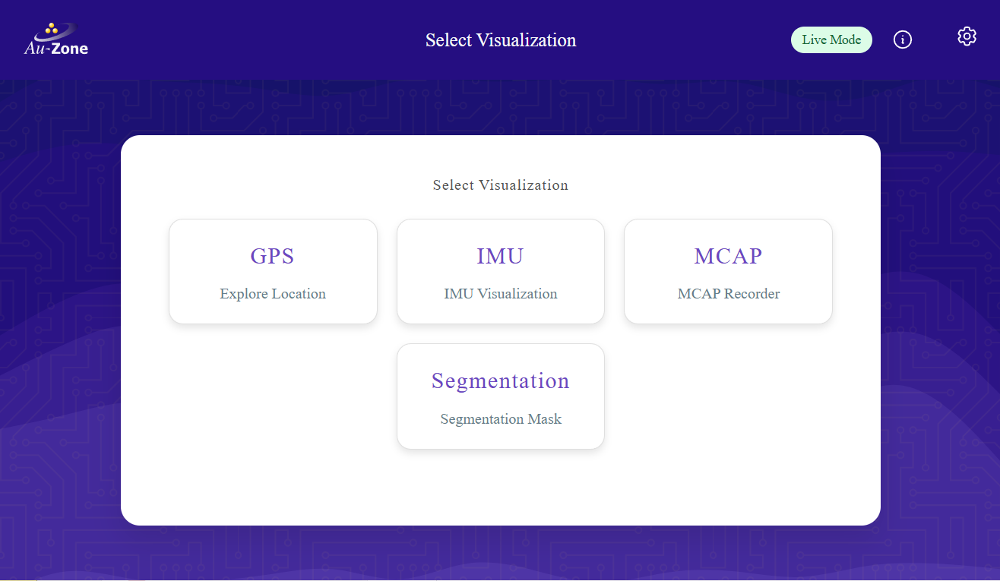
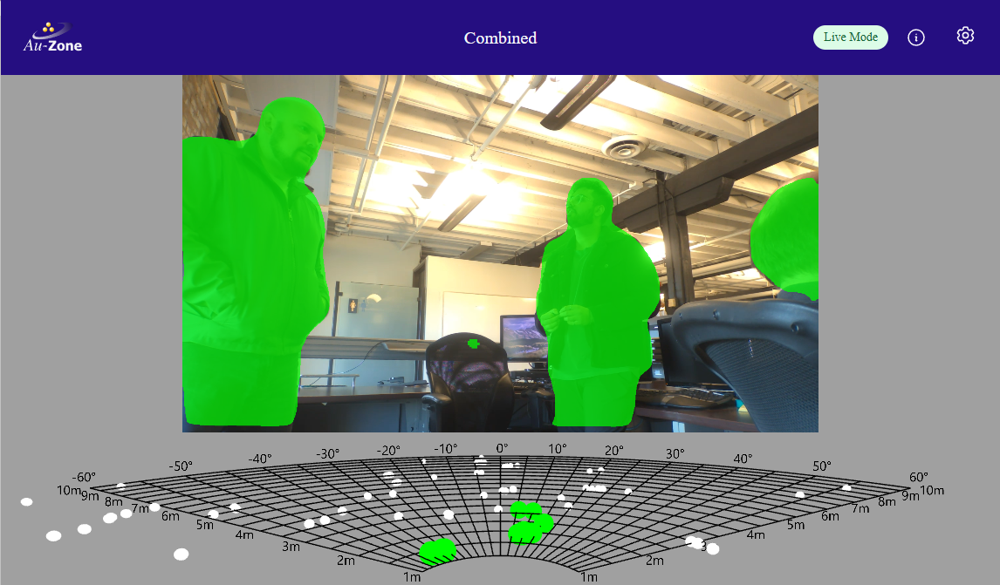

# Web UI Walkthrough

This chapter will walk you through the Raivin's and Maivin's Web User Interface (WebUI).

## The Main Page
The Main Page of the Raivin web interface should look as follows:  
{align=center}

The Main Page for the Maivin looks slightly different:  
{align=center}

There are five cards on the Main Page that link to the Visualization pages:

- **GPS**: This page displays a map with the current location of the device, along with GPS co-ordinates.
- **IMU**: This page displays the 3D orientation of the device with current pitch, yaw, and roll values.
- **MCAP**: This page contains the visual/radar recordings management interface.
- **Segmentation View**: This page shows the camera with running segmentation and/or detection pipeline.  For Raivins equipped with a radar module, it will also show the radar grid.
- **Occupancy Grid**: (Raivin only) This will show the radar grid.

### The Top Ribbon
The ribbon at the top of the Raivin web interface is available on every page of the web interface.  The following three elements are available on every page of the Raivin web interface.

1. On the left, the "Home" button with the Au-Zone icon, which will return the user to the Main Page.
2. In the middle, the title of the current page.
3. The farthest rightmost button, with the gear icon, is the Settings Buttons and will take you to the [Settings Page](./configuration.md).

On the right side of the ribbon, we have a grouping of two indicators an a dropdown menu.  These items are only shown on the Main Page and the pages clicked from the five cards on the Main Page.  These elements, from left to right, are:

4. The Recording Indicator, shown as a red circle when recording from the sensors.
5. The System Status Indicator.
6. The Status Information Dropdown button.

### System Status Indicator
Mousing over the System Status Indicator field will give a brief summary of any problems.  
{align=center}  
*Everything is good!*  
{align=center}  
*The Radar Publishing service is down.*

More on these status can be found in the [Status Monitoring section](./replay.md#status-monitoring)
## The Visualization Pages
These pages contain the user-facing functionality of the vision module.

### The Segmentation Page
The Segmentation page shows camera overlain with the current visual model output.  For Raivin modules, this will also includes the occupany grid at the bottom.  
{align=center}
White points is unmatched, raw data from the radar; green points are raw data matched to segmentation masks.

For the Maivin, its Segmentation Page does not include the Occupancy Grid at the bottom.  
{align=center}

### The Occupancy Page (Raivin-only)
The Occupancy Page shows the raw, radar data, coloured by radar cross-section (RCS) size.  
{align=center}

### The GPS Page
The GPS page shows an interactive map centered on the device's location.  
{align=center}
This should be familiar to anyone who has used standard map web interfaces.  The map can be moved by dragging with left-mouse button (or touch with a touchscreen-enabled device).  The "+" and "-" buttons on the left will zoom-in and zoom-out on the map.  The "Refresh" button will re-center the map on the device's location.  The latitude and longitude are also reported on the web interface.

### The IMU Page
The IMU page shows the device's orientation in 3D.  
{align=center}
My physically moving the device, it's virtual counterpart should move the same way.  Roll, pitch, and yaw values are reported.  If the device's virtual orientation does not match the physical orientation, keep the device's bottom flat and hit the "Reset Orientation" button.

### The MCAP Recording Page
The MCAP Recording Page manages the device's operational state as well as the current recordings on the device.  
{align=center}
More information for this page can be found in the [Recording section](./recording.md).