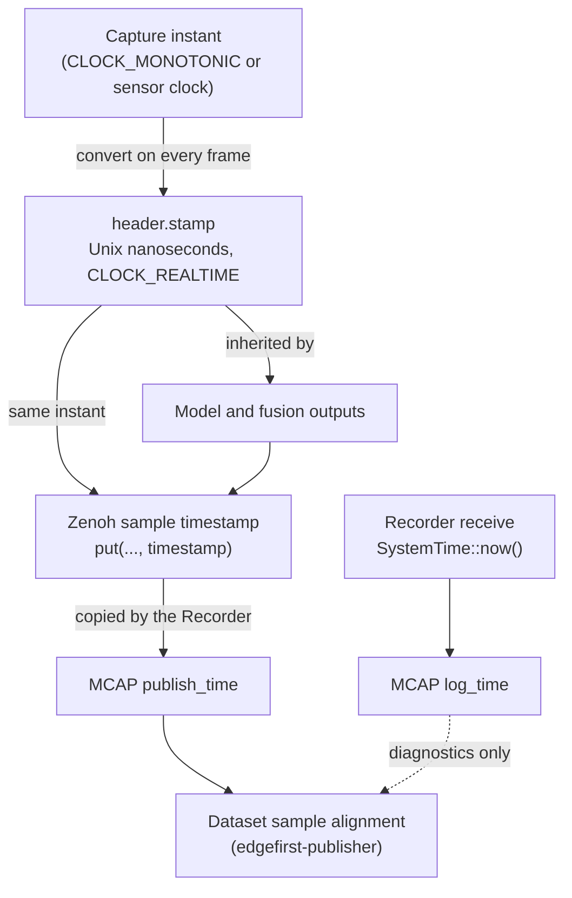
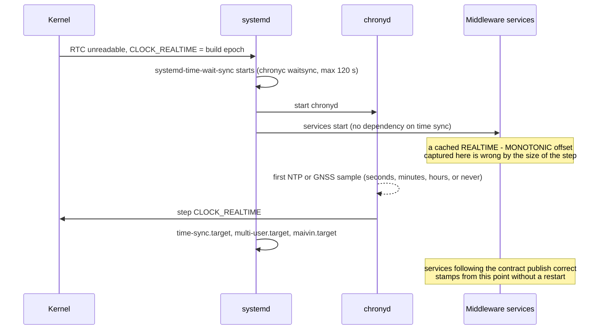

# Clock Synchronization and Timestamps

Every message published by the EdgeFirst Perception Middleware carries time. Camera frames, lidar sweeps, radar cubes, IMU samples, GPS fixes, model detections and fusion outputs are only useful together when their timestamps come from one clock and mean one thing: the instant the measurement was taken. This page describes the clocks available on the device, the timestamp contract every service follows, how the Recorder and dataset Publisher rely on that contract, and how the Maivin platform family keeps the system clock synchronized.

The contract in one sentence: **acquisition time, expressed as Unix time from the host's `CLOCK_REALTIME`, travels unchanged from the sensor through the ROS 2 message header, the Zenoh sample timestamp, the MCAP `publish_time`, and finally into dataset sample alignment.** Recorder receive time is a separate clock, recorded alongside, and is never used to align sensors.

!!! note "Torizon for Maivin 2026.09"

    The timestamp contract described on this page is delivered by the middleware services in the Torizon for Maivin 2026.09 release.

## Three Timestamps per Message

A published message carries time in up to three places. A message with a header is stamped in all three, and two of those must agree. A headerless message, such as `Mask`, has no `header.stamp` and is located in time by its Zenoh sample timestamp alone. In both cases the Recorder's receive time is recorded alongside and is deliberately different.

| Timestamp | Where it lives | Who sets it | Meaning |
| --- | --- | --- | --- |
| `header.stamp` | Inside the CDR payload (`std_msgs/Header`, or the first timestamp field such as `CompressedVideo.timestamp`) | The publishing service | Acquisition time of the measurement |
| Zenoh sample timestamp | Zenoh transport metadata attached on `put()` | The publishing service | The same instant as `header.stamp`, to the `NTP64` resolution of about 0.233 ns |
| MCAP `publish_time` / `log_time` | The MCAP message record written by the Recorder | The Recorder | `publish_time` is copied from the Zenoh sample timestamp; `log_time` is the Recorder's own clock when the sample arrived |

The Recorder never decodes CDR payloads. It copies the Zenoh sample timestamp into `publish_time`, so the MCAP `publish_time` is only as good as the timestamp the publisher attached. This is why the contract requires the Zenoh timestamp to be the same value as `header.stamp`: it makes acquisition time available to schema-agnostic tools without parsing every message type.



`log_time - publish_time` on a recording approximates the end-to-end latency from acquisition to the Recorder: sensor readout, encoding, inference, Zenoh transport and scheduling. On a healthy, synchronized system it is a few milliseconds for sensors and tens of milliseconds for model outputs. It is an estimate rather than a measurement: the two stamps are taken at different points, and across a clock step they fall on opposite sides of it, so the difference jumps by the size of the step and can turn negative. A value of hours or days is not latency at all but a clock-domain fault.

## Clocks on the Device

Linux exposes several clocks, and the middleware uses each for a specific purpose.

| Clock | Behavior | Used for |
| --- | --- | --- |
| `CLOCK_REALTIME` | Unix wall-clock time. Stepped by `chronyd` when the error is large, slewed (frequency-adjusted) when it is small. | All published timestamps |
| `CLOCK_MONOTONIC` | Counts from boot. Never steps, but is slewed together with `CLOCK_REALTIME` by the same frequency adjustments. | V4L2 camera buffer timestamps, latency measurement, timeouts |
| `CLOCK_MONOTONIC_RAW` | Raw hardware counter, not slewed. | Not used for stamps |
| Sensor clocks | Ouster internal oscillator (nanoseconds since sensor power-on), SmartMicro radar cycle time, GNSS time, BNO08x report timebase. | Only when disciplined to the host clock or translated into it |

The important consequence is how the two Linux clocks move relative to each other:

- A **slew** changes the rate of both clocks equally. The difference `CLOCK_REALTIME - CLOCK_MONOTONIC` stays constant.
- A **step** changes only `CLOCK_REALTIME`. The difference jumps by the size of the step.

On the Maivin platform a step of more than a year happens on almost every cold boot, and it happens *after* the middleware services have started (see [Boot Sequence](#boot-sequence)). Any service that captured `CLOCK_REALTIME - CLOCK_MONOTONIC` once and kept using it would publish every subsequent timestamp in the pre-step clock domain, leaving its topics more than a year behind every other topic in a recording. The contract therefore forbids cached clock offsets.

!!! note "ROS 2 convention"

    ROS 2 `header.stamp` is system (wall-clock) time in seconds and nanoseconds since the Unix epoch, and the `sec` field is a signed 32-bit integer. EdgeFirst services follow this convention and saturate at the year 2038 limit rather than overflow.

### Why Acquisition Time on the Realtime Clock

The two clocks answer two different questions, and the middleware uses each for the question it answers well.

- **Durations belong to `CLOCK_MONOTONIC`.** How long a track has been alive, whether a sensor has gone quiet, how much latency a frame accumulated: these are differences between two instants on the same host, and the monotonic clock is the only one guaranteed never to jump between them. The kernel stamps V4L2 buffers on this clock for the same reason, so that video can be correlated with other local sources such as audio regardless of what the wall clock does. Every timeout, expiry and latency measurement in the middleware stays on this clock.
- **Instants that leave the process belong to `CLOCK_REALTIME`.** A stamp is compared with stamps from other services, other devices, GNSS receivers and PTP-disciplined sensors, and it is read by people. The monotonic clock has no meaning outside one boot of one host, so a published instant must be Unix time. ROS 2 headers, the Zenoh sample timestamp (a 32.32 NTP64 value) and MCAP message records all define their timestamps as wall-clock time.

Converting a monotonic capture time to realtime is therefore a translation at the process boundary, not a rejection of the monotonic clock. The translation reads the current difference between the two clocks for every sample, so that a step in `CLOCK_REALTIME` moves the published stamps at the same moment for every service, and the step handling described below reconciles the two sides of it. No service measures a *runtime* duration across the published stamps of one topic; live durations such as track lifetimes and sensor timeouts are taken on the monotonic clock directly. Offline consumers are a separate case and do perform timestamp arithmetic by necessity: the dataset Publisher derives frame-rate buckets and skip durations from `publish_time`, and Replay derives pacing from recorded `log_time` gaps. Both therefore have to handle a clock step inside a file, which is why step handling is part of the contract below rather than an afterthought.

The stamp is the **acquisition** instant, not the publish instant, following the ROS 2 sensor message definitions, where the `Image`, `CameraInfo` and `PointCloud2` headers are documented as the acquisition time of the data. Acquisition time is the only instant that is the same for every representation of one measurement (the raw frame, its H.264 and JPEG encodings, the model output computed from it) and the only one that fusion and dataset alignment can compare across sensors. The publish instant differs per representation by the processing that produced it and is recovered on a recording as `log_time - publish_time`. Two consequences follow:

- The **acquisition instant is the closest one available for each sensor**, in this order of preference. First, the sensor's own timestamp when its clock is synchronized to the host: a lidar disciplined by the Maivin PTP grandmaster stamps every column at the true measurement instant, with no network latency or jitter in the value, and that is better than anything the host can observe. Second, a timestamp taken by the kernel driver at capture, such as the V4L2 buffer timestamp, which the capture driver records in its interrupt handler when the frame arrives (end of frame by default, start of exposure when the driver reports `V4L2_BUF_FLAG_TSTAMP_SRC_SOE`) and which is acquisition time in every sense the contract needs, taken before any user-space scheduling. Third, host time at first observation in user space, for a radar CAN frame set or an IMU report, which includes the transport latency. Whichever instant a topic uses is fixed and recorded in the [Service Reference](#service-reference), so a constant residual to the physical event, such as readout time or CAN latency, can be removed by a consumer with a per-sensor offset.
- The Zenoh sample timestamp and the MCAP `publish_time` carry the acquisition instant rather than the instant of the `put()`. Zenoh describes its timestamp as the ingestion time used to order samples, and MCAP describes `publish_time` as the time the message was published. Both are used here as the acquisition time on purpose, so that ordering, storage and dataset alignment all operate on the one value that is shared across representations of a measurement. While the host clock is synchronized, acquisition stamps are monotone per topic, in the past relative to any router, and unique per key expression, so the ordering guarantees hold. Neither property is unconditional. A backward step of `CLOCK_REALTIME` makes published stamps non-monotonic across the step, and a publisher whose clock runs ahead of a router can produce a stamp in the router's future, which `zenohd` re-stamps or drops (see [Multi-Device and ROS 2 Notes](#multi-device-and-ros-2-notes)). Consumers therefore treat a step as a segment boundary instead of relying on global monotonicity.

## The Timestamp Contract

The rules below are normative for every service that creates, transforms or consumes timestamps.

They describe the EdgeFirst Perception services. An application that publishes its own topics into the same session is outside the middleware and has to implement the same rules itself before its topics can take part in alignment. A publisher that stamps the header with its own publish time, or that calls `put()` without attaching a timestamp and lets the session assign one, produces a topic the Recorder reports as `fallback to recorder receive time`; such a topic is recorded faithfully but does not align with the sensors. The developer examples in this manual predate this contract and illustrate the message schemas rather than the timestamp rules.

### Source Publishers

Source publishers are the services that talk to hardware: camera, lidar (`lidarpub`), radar (`radarpub`), IMU (`imu`) and GPS (`navsat`).

1. **Stamp with acquisition time.** `header.stamp` (or the equivalent first timestamp field) is the instant the measurement was taken, not the time the message was built or published. The instant is the one named for the topic in the [Service Reference](#service-reference) and never changes between releases without a note there.
2. **Stay in the host clock domain.** The published value is Unix time from the host's `CLOCK_REALTIME`. A monotonic capture timestamp, such as the V4L2 buffer timestamp, is converted by adding the current `CLOCK_REALTIME - CLOCK_MONOTONIC` difference, **recomputed at every conversion**. The two reads are not atomic, so the difference is measured as a bracket: read `CLOCK_REALTIME`, then `CLOCK_MONOTONIC`, then `CLOCK_REALTIME` again, take the midpoint of the two realtime reads, and retry when the bracket is wider than a few microseconds because the thread was preempted between the reads. All three reads go through the vDSO and cost tens of nanoseconds, so there is nothing to gain from caching. The conversion is applied as close to acquisition as possible, on the thread that dequeues the buffer, and never to a capture time that has been waiting in a queue: a frame captured before a clock step but converted after it would be shifted by the entire step even though its acquisition was not. A service that buffers monotonic capture times must convert each one on arrival, or record the offset in force when the buffer was captured and use that one. When the true acquisition instant is not available, the host time at first observation is used.
3. **Prefer a synchronized sensor clock; translate or reject an unsynchronized one.** A timestamp generated by a sensor's own clock is the best acquisition time available when that clock is disciplined to the host (for example an Ouster lidar in its `ptp1588` [timestamp mode](../platforms/configuration/lidar.md#timestamp-mode) with the Maivin acting as PTP grandmaster), because it removes the transport latency and jitter from the stamp, and it is used in preference to host observation time. A sensor clock that is not disciplined may be published only when the service maintains a measured offset between the sensor clock and the host clock. Otherwise it is a second clock domain, breaks alignment for every consumer, and host time at first observation is used instead.
4. **Attach the same value to the Zenoh sample.** Every `put()` carries `timestamp(...)` derived from `header.stamp` and converted to Zenoh `NTP64` form. `NTP64` is a 32.32 fixed-point value, so its fractional second quantizes to 2^-32 s, about 0.233 ns, and an arbitrary nanosecond count does not survive the conversion bit for bit: 1 ns decodes to roughly 0.931 ns. The two stamps therefore denote the same instant to within that resolution rather than being byte-identical, and a consumer comparing them allows a tolerance of a nanosecond or two instead of testing for equality.
5. **Never stamp with uptime, `Instant::now()`, or publish-complete time.**
6. **Metadata topics follow their data; configuration topics do not.** `camera/info` describes a frame and is stamped with that frame's acquisition time. Static transforms (`tf_static`) and configuration topics that describe the running service rather than a measurement, such as `model/info` and `radar/info`, are stamped at the time they are published. None of them participates in sample alignment.

### Derived Publishers

Derived publishers consume measurements and publish results: the model service and the fusion service.

1. **Inherit the source stamp.** Model output for a camera frame carries that frame's `header.stamp`, and its Zenoh sample timestamp is the same value. Fusion outputs carry the stamp of the primary sensor of the fused object, which is the radar or lidar point cloud for `fusion/boxes3d` and the occupancy grid. The policy is documented per topic in the [Service Reference](#service-reference).
2. **Latency goes into duration fields, never into the stamp.** Preprocessing, inference, output and decode times are reported in the `Model` message duration fields (`input_time`, `model_time`, `output_time`, `decode_time`). On a recording the same information is available as `log_time - publish_time`.
3. **Messages without a header** (such as `Mask`) are located in time only by their Zenoh sample timestamp, which therefore must be the source acquisition stamp.
4. **Tolerate clock steps.** Trackers and expiry logic keyed on `header.stamp` must survive a forward or backward step without stalling or expiring every track at once. Lifetimes are measured on `CLOCK_MONOTONIC`; a stamp that moves backwards resets the timeline instead of blocking it.

### Recorder

1. `log_time` is `SystemTime::now()` when the sample is received. It is never replaced.
2. `publish_time` is the Zenoh sample timestamp when present and representable as Unix nanoseconds. Otherwise it falls back to `log_time`.
3. The first sample on each topic logs which mode is in use:

    ```text
    Timestamps for camera/frame: source-stamped from Zenoh sample
    Timestamps for fusion/radar: fallback to recorder receive time (missing or invalid source timestamp)
    ```

    A fallback line is a diagnostic that the producer did not source-stamp. It must not be the steady state for any topic that participates in sample alignment: camera frame, H.264, JPEG, camera info, lidar, radar, IMU, GPS, model and fusion topics.

4. A source timestamp that is implausibly far from `log_time` is a diagnostic of a clock-domain fault upstream. The Recorder still records it unchanged so the fault remains visible in the file.
5. **A clock step during a recording is marked, not split.** The Recorder watches for steps with a `timerfd` armed on `CLOCK_REALTIME` with `TFD_TIMER_ABSTIME` and `TFD_TIMER_CANCEL_ON_SET`, which the kernel cancels with `ECANCELED` at the instant the clock is set discontinuously, and confirms the size of the step from the change in `CLOCK_REALTIME - CLOCK_MONOTONIC`. When that difference changes by more than one second the clock has been stepped. The Recorder keeps writing the same file, logs the step, and writes an MCAP metadata record named `clock_step` carrying the receive time immediately before and after the step and the size of the step in nanoseconds. It also writes a `clock_sync` metadata record when the file is opened, with the chrony reference, stratum and estimated error at that moment, so a file recorded before synchronization documents its own epoch. Recordings stay one file per session; every consumer is responsible for handling the step (see below).

### Dataset Publisher

The `edgefirst-publisher` converts MCAP recordings into EdgeFirst datasets (ZIP and Arrow). It aligns exclusively on MCAP `publish_time` and does not decode `header.stamp` on that path.

- Each field (H.264 frame, JPEG, IMU, GPS, model output, radar and lidar point clouds, masks) is buffered by `publish_time` plus its optional `--*-offset` in nanoseconds.
- A dataset sample is emitted for each message on the preferred topic (normally `camera/h264`) once the stream has advanced `--lookahead` (default one second) past it. Companion fields are the buffered values nearest in time to the sample, before or after.
- `-f` frame-rate sampling keeps the first frame in each `1/fps` bucket, measured on unoffset `publish_time` from the first preferred-topic message.
- `--skip-messages` skips a leading duration of the recording, measured from the `publish_time` of the first message on any topic.
- 4K tile stitching is the one place `header.stamp` is read: the [four tiles of a frame](4k/publisher_4k.md#step-2-tile-stitching) are grouped by exact equality of their payload stamps. This works only because all four tiles carry the identical acquisition stamp. The separate step that maps a stitched frame onto a dataset sample is sequential and does not read stamps.

Because everything above happens in one clock, a topic whose `publish_time` sits in a different domain is excluded from every sample: its frames look either already skipped or infinitely far from any companion. The signature of this fault is a dataset with no samples from an MCAP that contains camera messages, which is why the Publisher reports the time domain of every topic instead of finishing silently (see below).

The Publisher must also handle a clock step inside a file, because a recording may start before the clock is synchronized. Every service follows the step at the same moment, so the messages on each side of it are internally consistent and only the boundary needs care. The Publisher reads the Recorder's `clock_step` metadata records first and uses them as the authoritative segment boundaries, reporting the `clock_sync` state of the file alongside. It also scans for discontinuities itself, so that files without metadata records and files with a step the Recorder did not see are handled the same way: a jump in `publish_time` on the preferred topic larger than a few seconds, forward or backward, is a segment boundary. At each boundary it flushes buffered companions so nothing from one side is matched to a sample on the other, restarts the `-f` bucket origin and the `--skip-messages` origin at the first message of the new segment, and continues writing the same dataset with the frame index running on. All time arithmetic saturates instead of wrapping. The step and the message count on each side are reported in the log, and a conversion that discards every preferred-topic message says why, naming the topics whose time domain disagrees with the preferred topic, instead of finishing silently with an empty dataset.

### Replay

The Replay service republishes a recording over Zenoh. It preserves the recorded CDR payloads, including `header.stamp`, and paces playback on `log_time`. The contract requires replayed samples to carry the recorded `publish_time` as their Zenoh sample timestamp, so that a recording made during replay keeps the original acquisition times instead of degrading to receive time. Pacing must not stall on a clock step inside the file. Replay knows the typical interval of every topic from the recording itself. The MCAP statistics give only a message count and the first and last `log_time`, and that span includes any step inside the file, so the count-over-duration rate is only valid after subtracting the steps recorded in the `clock_step` metadata; the median gap between consecutive messages on the topic is the robust estimate and works on files without metadata. When the gap to the next message is far larger than that topic's typical interval, on the order of ten times, Replay waits the typical interval instead of the recorded gap, so a step plays as one ordinary frame period rather than a wait as long as the step itself.

Tools that summarize a recording from the MCAP statistics, such as the Web UI's duration and per-topic frame-rate figures, subtract the steps recorded in `clock_step` metadata from the span, or fall back to excluding gaps larger than a few seconds, for the same reason.

## Time Sources on the Maivin Platform

The Maivin and Raivin run the middleware services as native systemd units on Torizon OS. There are no containers involved, so every service sees the same kernel clocks.

### No Persistent Real-Time Clock

The on-board `rtc-ds1307` loses its stored time on every power cycle because it has no working backup supply. At boot the kernel logs `rtc-ds1307: oscillator failed, set time!` and `hctosys: unable to read the hardware clock`, and systemd initializes `CLOCK_REALTIME` to its build-time epoch. On current Torizon 7 images that epoch is 2025-05-29, which is why unsynchronized recordings and log lines cluster around that date. The clock becomes correct only when `chronyd` obtains a source.

### chrony, GNSS and NTP

`chronyd` disciplines the system clock. The stock Torizon configuration in `/etc/chrony.conf` provides:

```text
confdir /etc/chrony/conf.d
pool 0.openembedded.pool.ntp.org iburst
sourcedir /etc/chrony/sources.d
makestep 1.0 3
driftfile /var/lib/chrony/drift
rtcsync
```

`makestep 1.0 3` allows the clock to be **stepped** if the error exceeds one second during the first three clock updates after `chronyd` starts. Later corrections are slewed. On a cold boot the first update therefore steps the clock by more than a year; every subsequent correction is a gradual rate change that does not disturb `CLOCK_REALTIME - CLOCK_MONOTONIC`.

The Maivin layer (`meta-maivin`) adds the GNSS receiver as a stratum 0 reference in `/etc/chrony/conf.d/gpsd.conf`:

```text
refclock SHM 0 refid NMEA delay 0.5 poll 0 noselect
refclock PPS /dev/pps-gps refid GPS lock NMEA maxlockage 10 precision 1e-7 poll 0 prefer
```

- `NMEA` is the coarse time from `gpsd` over the receiver's serial port (`/dev/ttymxc3`). It is accurate to roughly 200 ms and is marked `noselect`: it exists only to tell the PPS source which second each pulse belongs to.
- `GPS` is the receiver's 1 PPS timepulse on Verdin SODIMM 64, captured by the kernel `pps-gpio` driver and exposed as `/dev/pps-gps` through a udev rule. It is microsecond accurate and preferred over NTP once locked.

```text
GNSS receiver
  ├─→ NMEA over /dev/ttymxc3 → gpsd → SHM 0 ─┐
  └─→ TIMEPULSE on SODIMM 64 → pps-gpio ─────┤
                                             └─→ chronyd (disciplines CLOCK_REALTIME)
                                                  ├─→ pool NTP servers (when a network is available)
                                                  └─→ phc2sys-master → ethernet1 PHC → ptp4l → sensors (opt-in)
```

A healthy unit shows the GPS source selected at stratum 1:

```shell
$ chronyc tracking
Reference ID    : 47505300 (GPS)
Stratum         : 1
System time     : 0.000031795 seconds fast of NTP time
Last offset     : +0.000041701 seconds
$ chronyc sources
MS Name/IP address         Stratum Poll Reach LastRx Last sample
===============================================================================
#? NMEA                          0   0   377     0   +256ms[ +256ms] +/-  250ms
#* GPS                           0   0   377     1    +12us[  +45us] +/-  125ns
^- archer.fsck.ca                2  10   377   128   +557us[  -65us] +/-   39ms
```

!!! warning "Stale /etc/chrony.conf after an OSTree update"

    OSTree merges `/etc` across updates. If `chronyc sources` shows only pool servers at stratum 2 or higher and the GNSS refclocks are missing, compare `/etc/chrony.conf` with `/usr/etc/chrony.conf`; a stale copy that predates the `confdir` directive masks the shipped configuration.

### Boot Sequence

A representative cold boot of a Maivin with network NTP available proceeds as follows. Times are seconds after kernel start.

| Time | Event |
| --- | --- |
| 1.3 s | Kernel cannot read the RTC; `CLOCK_REALTIME` starts at the systemd epoch |
| 4 s | `systemd-time-wait-sync.service` starts a bounded `chronyc waitsync` (up to 24 tries, 5 s apart) |
| 8 s | `chronyd` starts |
| 11 to 12 s | IMU, NavSat, camera, model and Web UI services start |
| 41 s | `chronyd` selects its first NTP source and steps the clock forward to the current date, a step of more than a year |
| 45 s | `time-sync.target`, then `multi-user.target` and `maivin.target` are reached |
| 400 s | `chronyd` switches to the GPS reference once the PPS source is locked; the correction is milliseconds and is slewed |



This is the favorable case. Three facts about the platform mean the step can arrive at any time, or never:

- The middleware services start roughly 30 seconds **before** the clock step even when a source is available. Ordering them after `maivin.target` does not help, because a target's `After=` ordering does not propagate to the units it wants.
- The wait is bounded. `chronyc waitsync` gives up after about two minutes, `systemd-time-wait-sync.service` exits successfully, and boot continues with an unsynchronized clock.
- Neither source is dependable. GNSS needs sky view, an attached antenna and an interference-free band; a unit under a roof, with a damaged cable, or in the presence of jamming or spoofing has no GPS reference. NTP needs a route to the internet, and on a vehicle the network can come up ten minutes after boot or not at all.

### Resilience to Late or Absent Synchronization

No middleware service depends on `time-sync.target`, waits for `chronyd`, or assumes that the clock is correct when it starts. The design treats synchronization as an event that may happen at any moment during operation and requires every stage of the pipeline to be correct before it, during it and after it:

- **Before synchronization** every stamp is in the boot epoch, but every service is in the *same* wrong epoch because they all read `CLOCK_REALTIME` at each conversion. Alignment, recording and dataset conversion all work; only the absolute date is wrong. The Recorder records the chrony state in the file so this is visible.
- **At the step** the publishers follow `CLOCK_REALTIME` immediately because nothing caches an offset. Trackers and expiry logic run on `CLOCK_MONOTONIC`, so a step in stamps neither stalls them nor expires every track. Fusion may pair one camera frame with one radar or lidar sweep from the other side of the step; the mismatch is bounded by pipeline latency and lasts for a single output. The Recorder keeps writing the same file and marks the step in it, and the dataset Publisher, Replay and the Web UI treat the step as a boundary between two consistent segments of one recording.
- **After synchronization** stamps are correct Unix time with no restart of any service. Later corrections from chrony are slews and do not affect the offset between the two clocks.

Startup ordering is therefore never part of the timestamp design. The only unit that legitimately depends on time synchronization is `phc2sys-master`, which distributes the host clock to sensors over PTP and is pointless until the host clock is right.

Because every service tolerates steps, the platform does not need to protect them from steps either. `makestep 1.0 3` limits stepping to the first three clock updates; a unit that first synchronizes to a poor NTP source and only reaches GNSS after those updates would then slew a large residual at up to 83 ms per second. Allowing `chronyd` to step on any update (`makestep 1.0 -1`) is the configuration chrony recommends for machines without a working RTC, and it is safe under this contract.

### PTP for Sensors

The Maivin can act as an IEEE 1588 grandmaster on the internal sensor network (`ethernet1`) using `ptp4l` with hardware timestamping and `phc2sys-master@ethernet1`, which pushes `CLOCK_REALTIME` into the interface's PTP hardware clock with no offset applied, so the hardware clock carries UTC rather than the TAI timescale that IEEE 1588 uses by default and a sensor disciplined from it reads the same Unix time as the host. UTC and TAI are not interchangeable: TAI leads UTC by the accumulated leap seconds, 37 s at the time of writing, so a sensor that assumes a TAI grandmaster, or a `phc2sys` configured to apply the current UTC offset, is off by that amount from every other stamp in the recording. Confirm the timescale when adding a sensor. This is installed but **disabled by default**; enable it per deployment when a sensor should timestamp in the host clock domain:

```shell
sudo systemctl enable --now ptp4l.service phc2sys-master@ethernet1.service
```

With PTP running, the Ouster lidar is set to the `ptp1588` [timestamp mode](../platforms/configuration/lidar.md#timestamp-mode) (`TIMESTAMP_MODE`) so its per-column measurement timestamps are Unix time in the host domain. The default `internal` mode counts nanoseconds since sensor power-on, which is not a host-domain clock and must not be published as `header.stamp`.

## Service Reference

The table records, per topic, where acquisition time comes from and what the contract requires for `header.stamp` and the Zenoh sample timestamp. It covers the stock topics listed in the [Topic Overview](topics/index.md); topics added by an application are the publisher's own responsibility. Topic names are shown without the hostname namespace prefix, and the legacy `model/boxes2d` and `model/mask` topics are disabled by default.

| Service | Topic | Acquisition source | `header.stamp` | Zenoh sample timestamp |
| --- | --- | --- | --- | --- |
| camera | `camera/frame`, `camera/h264`, `camera/jpeg`, `camera/h264/{tl,tr,bl,br}` | V4L2 buffer timestamp (`CLOCK_MONOTONIC`, end of frame) | Monotonic capture time plus the current realtime offset | Same as `header.stamp` |
| camera | `camera/info` | The frame it describes | Frame acquisition stamp | Same as `header.stamp` |
| camera | `tf_static` | Static | Time of republish | Same as `header.stamp` |
| lidarpub | `lidar/points`, `lidar/clusters` | Ouster column timestamps (start of sweep) when PTP-disciplined, otherwise host time at the first packet of the sweep | Host-domain start-of-sweep time; clusters inherit their source cloud stamp | Same as `header.stamp` |
| lidarpub | `lidar/imu` | The sensor's own inertial report (Robosense device information packets) | Host time when the report is read | Same as `header.stamp` |
| radarpub | `radar/targets`, `radar/clusters` | Host time when the CAN frame set completes (the radar does not timestamp CAN targets) | Host time; clusters inherit the newest contributing frame | Same as `header.stamp` |
| radarpub | `radar/cube` | Radar Ethernet port header time (microseconds) | Host-domain time: sensor time only when disciplined or offset-corrected, otherwise host receive time | Same as `header.stamp` |
| radarpub | `radar/info`, `tf_static` | Static | Time of republish | Same as `header.stamp` |
| imu | `imu` | BNO08x rotation-vector report at 200 Hz | Host time when the report is read | Same as `header.stamp` |
| navsat | `gps` | gpsd TPV and GST reports | Host time when the report is handled | Same as `header.stamp` |
| model | `model/output`, `model/visualization`, and the legacy `model/boxes2d` | The input camera frame | Camera frame stamp | Same as `header.stamp` |
| model | `model/mask` (legacy) | The input camera frame | No header in the schema | Camera frame stamp |
| model | `model/info` | Configuration, not a measurement | Time of publication | Same as `header.stamp` |
| fusion | `fusion/radar`, `fusion/lidar`, `fusion/occupancy`, `fusion/boxes3d` | The radar or lidar point cloud the output is built from, selected by `GRID_SRC` and `BBOX3D_SRC` | Point cloud stamp | Same as `header.stamp` |
| fusion | `fusion/model_output`, `fusion/model_output/tracked` | The radar cube the Fusion Model grid was computed from | No header in the schema | Radar cube stamp |
| recorder | MCAP | Zenoh sample timestamp | not applicable | `publish_time` = sample timestamp, `log_time` = receive |
| replay | All replayed topics | Recorded payload | Preserved from the recording | Recorded `publish_time` |

## Inspecting Timestamps in a Recording

Foxglove's playback timeline is driven by receive time (`log_time`). Individual panels can plot or annotate against header stamps, but that does not change the global ordering of messages during playback, so a discrepancy between the two stamps shows up as panels drifting against the timeline rather than as a different playback order. To check the contract directly, compare the two MCAP stamps per topic:

```shell
mcap info recording.mcap
```

```python
import statistics
from collections import defaultdict
from mcap.reader import make_reader

lag = defaultdict(list)
with open("recording.mcap", "rb") as f:
    for _schema, channel, message in make_reader(f).iter_messages():
        lag[channel.topic].append((message.log_time - message.publish_time) / 1e9)

for topic, values in sorted(lag.items()):
    print(f"{topic:32s} median log_time - publish_time {statistics.median(values):+.4f} s  n={len(values)}")
```

Expected results on a healthy recording:

- Every topic that participates in alignment shows a small positive median, from under a millisecond for IMU and GPS to tens of milliseconds for model and fusion outputs.
- No topic shows a value of hours or days.
- No topic shows exactly zero across all messages, which means it fell back to receive time.

On the device, the Recorder's first-sample log lines and the chrony state tell the rest of the story:

```shell
journalctl -b -u recorder.service | grep "Timestamps for"
journalctl -b -o short-monotonic | grep -E "System clock wrong|Selected source|Clock offset"
chronyc tracking
```

## Troubleshooting

| Symptom | Likely cause | Action |
| --- | --- | --- |
| `edgefirst-publisher` writes an empty ZIP and Arrow file although the MCAP contains camera messages | Camera topics are in a different clock domain than the rest of the recording | Run the script above. A constant offset of months or years on `camera/*` means the camera topics are stamped in a different clock domain. Restart the camera service and record again. |
| Frame count is short of `fps × duration` | Some frames fall outside the preferred-topic bucket timeline because of mixed clock domains | Same check as above. |
| Recorder logs `fallback to recorder receive time` for an alignment topic | The producer did not attach a Zenoh sample timestamp | Identify the producer of the topic and check its logs; a producer outside the middleware (for example a custom publisher) must attach the Zenoh timestamp itself. |
| `chronyc sources` shows no `GPS` line, or `#? GPS` never becomes `#* GPS` | `/dev/pps-gps` missing (the `pps-gpio` module was not loaded before `chronyd` started), no GNSS fix, or `gpsd` stopped (`u-center.service` conflicts with it) | `ls -l /dev/pps-gps`, `systemctl status gpsd`, then `systemctl restart chronyd`. |
| Log lines and MCAP file names dated 2025-05-29 | Unit is unsynchronized: no GNSS fix and no reachable NTP server | Provide sky view or a network route; the clock steps as soon as a source is selected. |
| Timestamps jump inside a recording, or its duration shows as more than a year | A clock step while recording (the Recorder marks it with a `clock_step` metadata record) | The Publisher converts both segments into one dataset. To convert only one segment, split the file at the step with `mcap filter --start-secs/--end-secs`. |

## Multi-Device and ROS 2 Notes

- Timestamps compare across devices only if every device is synchronized. Use the GNSS reference where available and NTP otherwise. The error between two devices is at least the sum of their individual distances to the reference, so estimate it from the root distance reported by `chronyc tracking` on *both* devices; the figure from a single device describes only that device's distance to its own reference and does not bound the difference between two of them.
- Zenoh peers do not run a hybrid logical clock, so the sample timestamp is exactly the value the publisher sets. A `zenohd` router does run one and re-stamps any sample more than 500 ms in the future relative to its own clock (or drops it when `drop_future_timestamp` is enabled). Acquisition stamps are always in the past, so this only affects a publisher whose clock runs ahead of the router.
- ROS 2 nodes bridged through `zenoh-bridge-ros2dds` see the same `header.stamp` values and can use standard `message_filters` time synchronizers on them.
- MCAP file names use the device's local time (UTC on Maivin) while all message stamps are UTC nanoseconds.
