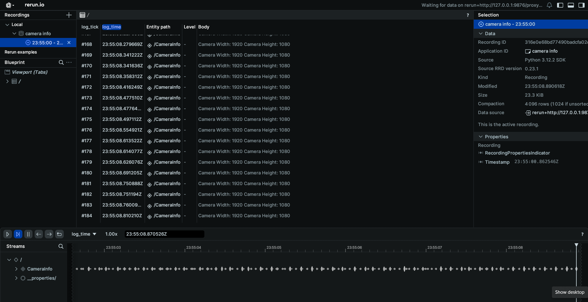
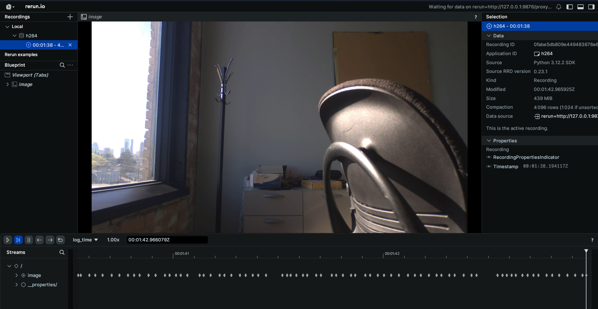

# Camera Schema Examples

These examples demonstrate how to connect to various camera topics published on your EdgeFirst Platform and how to display the information through the command line.

## /camera/info

### Setting up subscriber

After setting up the Zenoh session, we will create a subscriber to the `camera/info` topic

=== "Python"

    ``` python
    # Create a subscriber for "rt/camera/info"
    subscriber = session.declare_subscriber('rt/camera/info')
    ```

=== "Rust"

    ``` rust
    // Create a subscriber for "rt/camera/info"
    let subscriber = session
        .declare_subscriber("rt/camera/info")
        .await
        .unwrap();
    ```

### Receive a message

We can now receive a message on the subscriber. After receiving the message, we will need to deserialize it.

=== "Python"

    ``` python
    from edgefirst.schemas.sensor_msgs import CameraInfo
    msg = subscriber.recv()
    info = CameraInfo.deserialize(msg.payload.to_bytes())
    ```

=== "Rust"

    ``` rust
    use edgefirst_schemas::sensor_msgs::CameraInfo;

    // Receive a message
    let msg = subscriber.recv().unwrap();

    let info: CameraInfo = cdr::deserialize(&msg.payload().to_bytes())?;
    ```

### Process and Log the Data

The CameraInfo message contains camera calibration and configuration information. You can access various fields like:

=== "Python"

    ``` python
    # Access camera parameters
    width = info.width
    height = info.height
    distortion_model = info.distortion_model
    D = info.d  # Distortion parameters
    K = info.k  # Intrinsic camera matrix
    R = info.r  # Rectification matrix
    P = info.p  # Projection matrix
    rr.log("CameraInfo", rr.TextLog("Camera Width: %d Camera Height: %d" % (width, height)))
    ```

### Results
When displaying the results through Rerun you will see a log of the camera width and height.


=== "Rust"

    ``` rust
    // Access camera parameters
    let width = info.width;
    let height = info.height;
    let distortion_model = info.distortion_model;
    let D = info.D;  // Distortion parameters
    let K = info.K;  // Intrinsic camera matrix
    let R = info.R;  // Rectification matrix
    let P = info.P;  // Projection matrix
    ```

## /camera/h264

### Setting up subscriber

After setting up the Zenoh session, we will create a subscriber to the `camera/h264` topic and initialize a container for the H264 feed

=== "Python"

    ``` python
    # Create a subscriber for "rt/camera/h264"
    subscriber = session.declare_subscriber('rt/camera/h264')
    raw_data = io.BytesIO()
    container = av.open(raw_data, format='h264', mode='r')
    frame_position = 0
    ```

=== "Rust"

    ``` rust
    // Create a subscriber for "rt/camera/h264"
    let subscriber = session
        .declare_subscriber("rt/camera/h264")
        .await
        .unwrap();
    ```

### Receive a message

We can now receive a message on the subscriber. After receiving the message, we will need to deserialize it.

=== "Python"

    ``` python
    from edgefirst.schemas.foxglove_msgs import CompressedVideo

    # Receive a message
    msg = subscriber.recv()
    ```

=== "Rust"

    ``` rust
    use edgefirst_schemas::foxglove_msgs::CompressedVideo;

    // Receive a message
    let msg = subscriber.recv().unwrap();

    let video: CompressedVideo = cdr::deserialize(&msg.payload().to_bytes())?;
    ```

### Process and Log the Data

The CompressedVideo message contains H.264 encoded video data. You can convert 

=== "Python"

    ``` python
    raw_data.write(msg.payload.to_bytes())
    raw_data.seek(frame_position)
    for packet in container.demux():
        if packet.size == 0:  # Skip empty packets
            continue
        frame_position += packet.size  # Update frame position
        for frame in packet.decode():  # Decode video frames
            frame_array = frame.to_ndarray(format='rgb24')  # Convert frame to numpy array
            rr.log('image', rr.Image(frame_array))
    ```

=== "Rust"

    ``` rust
    // Access video parameters
    let width = video.width;
    let height = video.height;
    let data = video.data;  // H.264 encoded video data
    ```

### Results
When displaying the results through Rerun you will see the live camera feed from your EdgeFirst Platform.


## /camera/jpeg

### Setting up subscriber

After setting up the Zenoh session, we will create a subscriber to the `camera/jpeg` topic

=== "Python"

    ``` python
    # Create a subscriber for "rt/camera/jpeg"
    subscriber = session.declare_subscriber('rt/camera/jpeg')
    ```

=== "Rust"

    ``` rust
    // Create a subscriber for "rt/camera/jpeg"
    let subscriber = session
        .declare_subscriber("rt/camera/jpeg")
        .await
        .unwrap();
    ```

### Receive a message

We can now receive a message on the subscriber. After receiving the message, we will need to deserialize it.

=== "Python"

    ``` python
    from edgefirst.schemas.sensor_msgs import CompressedImage

    # Receive a message
    msg = subscriber.recv()

    # deserialize message
    image = CompressedImage.deserialize(msg.payload.to_bytes())
    ```

=== "Rust"

    ``` rust
    use edgefirst_schemas::sensor_msgs::CompressedImage;

    // Receive a message
    let msg = subscriber.recv().unwrap();

    let image: CompressedImage = cdr::deserialize(&msg.payload().to_bytes())?;
    ```

### Process and Log the Data

The CompressedImage message contains JPEG encoded image data. You can process the data with the following

=== "Python"

    ``` python
    np_arr = np.frombuffer(bytearray(image.data), np.uint8)
    im = cv2.imdecode(np_arr, cv2.IMREAD_COLOR)
    im = cv2.cvtColor(im, cv2.COLOR_BGR2RGB)
    rr.log('image', rr.Image(im))
    ```

=== "Rust"

    ``` rust
    // Access image parameters
    let width = image.width;
    let height = image.height;
    let format = image.format;  // Should be "jpeg"
    let data = image.data;  // JPEG encoded image data
    ``` 

### Results
When displaying the results through Rerun you will see the JPEG image feed.
