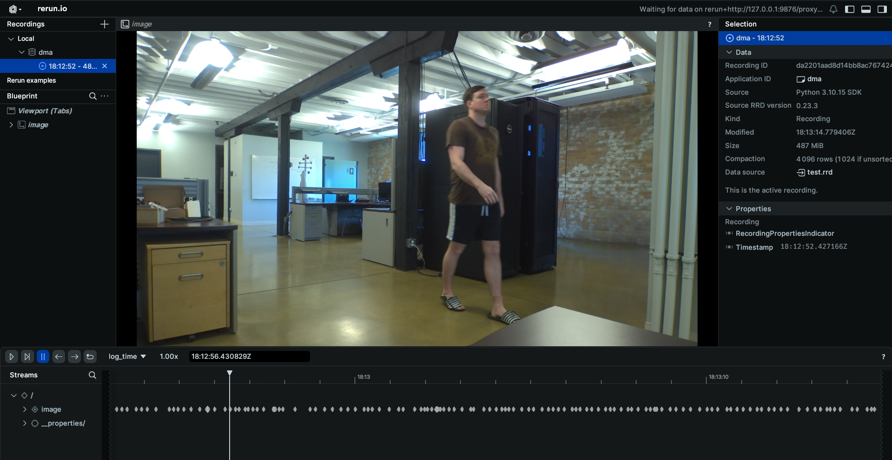
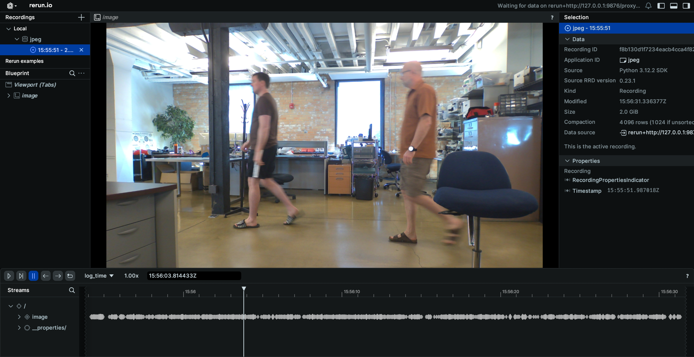

# Camera Schema Examples

These examples demonstrate how to connect to various camera topics published on your EdgeFirst Platform and how to display the information through the command line.

## Camera Info 
Topic: [/camera/info](../../topics/camera.md#camerainfo)  
Message: [Image](../../api/sensor_msgs.md#camerainfo)  
Sample Code: [Python](https://github.com/EdgeFirstAI/samples/blob/main/python/camera/camera_info.py) / [Rust](https://github.com/EdgeFirstAI/samples/blob/main/rust/camera/camera_info.rs)

### Setting up subscriber

After setting up the Zenoh session, we will create a subscriber to the `camera/info` topic

=== "Python"

    ``` python
    # Create a subscriber for "rt/camera/info"
    subscriber = session.declare_subscriber('rt/camera/info')
    ```

=== "Rust"

    ``` rust
    // Create a subscriber for "rt/camera/info"
    let subscriber = session
        .declare_subscriber("rt/camera/info")
        .await
        .unwrap();
    ```

### Receive a message

We can now receive a message on the subscriber. After receiving the message, we will need to deserialize it.

=== "Python"

    ``` python
    from edgefirst.schemas.sensor_msgs import CameraInfo
    msg = subscriber.recv()
    info = CameraInfo.deserialize(msg.payload.to_bytes())
    ```

=== "Rust"

    ``` rust
    use edgefirst_schemas::sensor_msgs::CameraInfo;

    // Receive a message
    let msg = subscriber.recv().unwrap();
    let info: CameraInfo = cdr::deserialize(&msg.payload().to_bytes())?;
    ```

### Process and Log the Data

The CameraInfo message contains camera calibration and configuration information. You can access various fields like:

=== "Python"

    ``` python
    # Access camera parameters
    width = info.width
    height = info.height
    rr.log("CameraInfo", rr.TextLog("Camera Width: %d Camera Height: %d" % (width, height)))
    ```

### Results
When displaying the results through Rerun you will see a log of the camera width and height.


=== "Rust"

    ``` rust
    // Access camera parameters
    let width = info.width;
    let height = info.height;
    let text = "Camera Width: ".to_owned() + &width.to_string() + " Camera Height: " + &height.to_string();
    let _ = rr.log("CameraInfo", &rerun::TextLog::new(text));
    ```

## DMA Buffer
Topic: [/camera/dma](../../topics/camera.md#cameradma)  
Message: [DmaBuffer](../../api/edgefirst_msgs.md#dmabuffer)  
Sample Code: [Python](https://github.com/EdgeFirstAI/samples/blob/main/python/camera/dma.py) / [Rust](https://github.com/EdgeFirstAI/samples/blob/main/rust/camera/dma.rs)  
!!! warning  
    The DMA Buffer example is only functional when run directly on the EdgeFirst Platform as it is references information that is only accessible on the EdgeFirst Platform.

### Setting up subscriber

After setting up the Zenoh session, we will create a subscriber to the `camera/dma` topic

=== "Python"

    ``` python
    # Create a subscriber for "rt/camera/dma"
    subscriber = session.declare_subscriber('rt/camera/dma')
    ```

=== "Rust"

    ``` rust
    // Create a subscriber for "rt/camera/dma"
    let subscriber = session
        .declare_subscriber("rt/camera/dma")
        .await
        .unwrap();
    ```

### Receive a message

We can now receive a message on the subscriber. After receiving the message, we will need to deserialize it.

=== "Python"

    ``` python
    from edgefirst.schemas.edgefirst_msgs import DmaBuffer
    # Receive a message
    msg = subscriber.recv()
    dma_buf = DmaBuffer.deserialize(msg.payload.to_bytes())
    ```

=== "Rust"

    ``` rust
    use edgefirst_schemas::edgefirst_msgs::DmaBuf;
    // Receive a message
    let msg = subscriber.recv().unwrap();
    let dma_buf: DmaBuf = cdr::deserialize(&msg.payload().to_bytes()).unwrap();
    ```

### Process and Log the Data

The DmaBuffer message contains the process ID of the service that created the DMA buffer and the file descriptor of the DMA buffer, both of which will be necessary to access the image.

=== "Python"

    ``` python
    pidfd = pidfd_open(dma_buf.pid)
    fd = pidfd_getfd(pidfd, dma_buf.fd, GETFD_FLAGS)

    # Now fd can be used as a file descriptor
    mm = mmap.mmap(fd, dma_buf.length)
    rr.log("image", rr.Image(bytes=mm[:], 
                             width=dma_buf.width, 
                             height=dma_buf.height, 
                             pixel_format=rr.PixelFormat.YUY2))
    mm.close()
    os.close(fd)
    os.close(pidfd)
    ```

=== "Rust"

    ``` rust
    let pidfd: PidFd = match PidFd::from_pid(dma_buf.pid as i32)
    let fd = match get_file_from_pidfd(pidfd.as_raw_fd(), dma_buf.fd, GetFdFlags::empty())

    // YUYV has 2 bytes per pixel.
    let image_size = (dma_buf.width * dma_buf.height * 2) as usize;
    let mmap = unsafe {
        from_raw_parts_mut(
            mmap(
                null_mut(),
                image_size,
                PROT_READ | PROT_WRITE,
                MAP_SHARED,
                fd.as_raw_fd(),
                0,
            ) as *mut u8,
            image_size,
        )
    };
    let rr_image = rerun::Image::from_pixel_format(
        [dma_buf.width, dma_buf.height],
        rerun::PixelFormat::YUY2,
        mmap.to_vec(),
    );
    let _ = rec.log("camera/dma", &rr_image);

    unsafe {
        munmap(mmap.as_mut_ptr() as *mut c_void, image_size);
    }
    ```

### Results
When displaying the results through Rerun you will see the live camera feed from your EdgeFirst Platform.


## H264 Camera Feed
Topic: [/camera/h264](../../topics/camera.md#camerah264)  
Message: [CompressedVideo](../../api/foxglove_msgs.md#compressedvideo)  
Sample Code: [Python](https://github.com/EdgeFirstAI/samples/blob/main/python/camera/h264.py) / [Rust](https://github.com/EdgeFirstAI/samples/blob/main/rust/camera/h264.rs)

### Setting up subscriber

After setting up the Zenoh session, we will create a subscriber to the `camera/h264` topic and initialize a container for the H264 feed

=== "Python"

    ``` python
    # Create a subscriber for "rt/camera/h264"
    subscriber = session.declare_subscriber('rt/camera/h264')
    raw_data = io.BytesIO()
    container = av.open(raw_data, format='h264', mode='r')
    ```

=== "Rust"

    ``` rust
    // Create a subscriber for "rt/camera/h264"
    use openh264::decoder::Decoder;
    let subscriber = session
        .declare_subscriber("rt/camera/h264")
        .await
        .unwrap();
    let mut decoder = Decoder::new()?;
    ```

### Receive a message

We can now receive a message on the subscriber. After receiving the message, we will need to deserialize it.

=== "Python"

    ``` python
    from edgefirst.schemas.foxglove_msgs import CompressedVideo
    # Receive a message
    msg = subscriber.recv()
    ```

=== "Rust"

    ``` rust
    use edgefirst_schemas::foxglove_msgs::FoxgloveCompressedVideo;
    // Receive a message
    let msg = subscriber.recv().unwrap();
    let video: FoxgloveCompressedVideo = cdr::deserialize(&msg.payload().to_bytes())?;
    ```

### Process and Log the Data

The CompressedVideo message contains H.264 encoded video data. You can convert 

=== "Python"

    ``` python
    raw_data.write(msg.payload.to_bytes())
    raw_data.seek(0)
    for packet in container.demux():
        try:
            if packet.size == 0:  # Skip empty packets
                continue
            raw_data.seek(0)
            raw_data.truncate(0)
            for frame in packet.decode():  # Decode video frames
                frame_array = frame.to_ndarray(format='rgb24')  # Convert frame to numpy array
                rr.log('image', rr.Image(frame_array))
    ```

=== "Rust"

    ``` rust
    use openh264::nal_units;
    use openh264::formats::YUVSource;

    for packet in nal_units(&video.data) {
        let Ok(Some(yuv)) = decoder.decode(packet) else { continue };
        let rgb_len = yuv.rgb8_len();
        let mut rgb_raw = vec![0; rgb_len];
        yuv.write_rgb8(&mut rgb_raw);
        let width = yuv.dimensions().0;
        let height = yuv.dimensions().1;
        
        let image = Image::from_rgb24(rgb_raw, [width as u32, height as u32]);
        rr.log("image", &image)?;            
    }
    ```

### Results
When displaying the results through Rerun you will see the live camera feed from your EdgeFirst Platform.


## JPEG Camera Feed
Topic: [/camera/jpeg](../../topics/camera.md#camerajpeg)  
Message: [CompressedImage](../../api/sensor_msgs.md#compressedimage)  
Sample Code: [Python](https://github.com/EdgeFirstAI/samples/blob/main/python/camera/jpeg.py) / [Rust](https://github.com/EdgeFirstAI/samples/blob/main/rust/camera/)

### Setting up subscriber

After setting up the Zenoh session, we will create a subscriber to the `camera/jpeg` topic

=== "Python"

    ``` python
    # Create a subscriber for "rt/camera/jpeg"
    subscriber = session.declare_subscriber('rt/camera/jpeg')
    ```

=== "Rust"

    ``` rust
    // Create a subscriber for "rt/camera/jpeg"
    let subscriber = session
        .declare_subscriber("rt/camera/jpeg")
        .await
        .unwrap();
    ```

### Receive a message

We can now receive a message on the subscriber. After receiving the message, we will need to deserialize it.

=== "Python"

    ``` python
    from edgefirst.schemas.sensor_msgs import CompressedImage

    # Receive a message
    msg = subscriber.recv()
    # deserialize message
    image = CompressedImage.deserialize(msg.payload.to_bytes())
    ```

=== "Rust"

    ``` rust
    use edgefirst_schemas::sensor_msgs::CompressedImage;

    // Receive a message
    let msg = subscriber.recv().unwrap();
    ```

### Process and Log the Data

The CompressedImage message contains JPEG encoded image data. You can process the data with the following

=== "Python"

    ``` python
    np_arr = np.frombuffer(bytearray(image.data), np.uint8)
    im = cv2.imdecode(np_arr, cv2.IMREAD_COLOR)
    im = cv2.cvtColor(im, cv2.COLOR_BGR2RGB)
    rr.log('image', rr.Image(im))
    ```

=== "Rust"

    ``` rust
    let im: CompressedImage = cdr::deserialize(&msg.payload().to_bytes())?;
    let image = EncodedImage::from_file_contents(im.data);
    rr.log("image", &image)?;  
    ``` 

### Results
When displaying the results through Rerun you will see the JPEG image feed.
