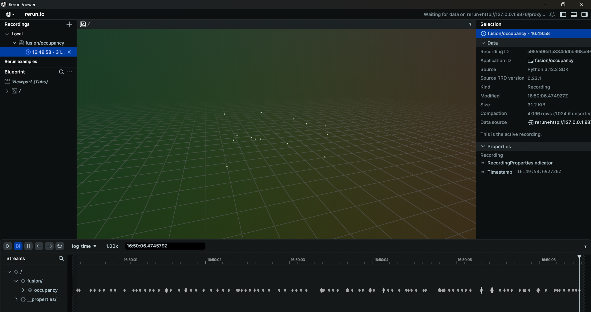
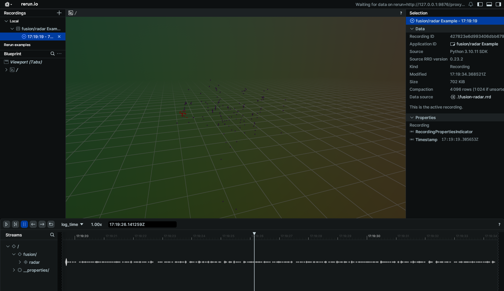
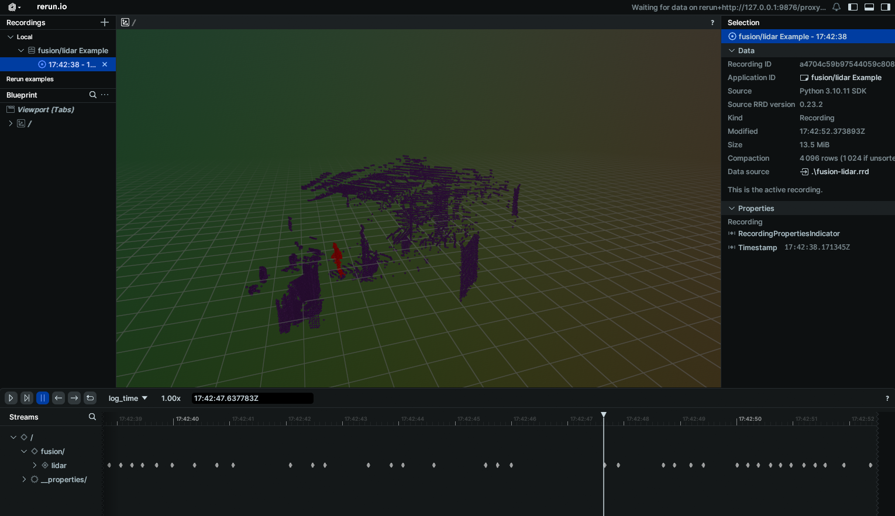

# Fusion Schema Examples

These examples demonstrate how to connect to various fusion topics published on your EdgeFirst Platform and how to display the information through the command line.

## Fusion Occupancy

Topic: [/fusion/occupancy](../../topics/fusion.md#fusionoccupancy)  
Message: [PointCloud2](../../api/sensor_msgs.md#pointcloud2)  
Sample Code: [Python](https://github.com/EdgeFirstAI/samples/blob/main/python/fusion/occupancy.py) / [Rust](https://github.com/EdgeFirstAI/samples/blob/main/rust/fusion/occupancy.rs)

### Setting up subscriber

After setting up the Zenoh session, we will create a subscriber to the `fusion/occupancy` topic

=== "Python"

    ``` python
    # Create a subscriber for "rt/fusion/occupancy"
    loop = asyncio.get_running_loop()
    drain = MessageDrain(loop)
    session.declare_subscriber('rt/fusion/occupancy', drain.callback)
    ```

=== "Rust"

    ``` rust
    // Create a subscriber for "rt/fusion/occupancy"
    let subscriber = session
        .declare_subscriber("rt/fusion/occupancy")
        .await
        .unwrap();
    ```

### Receive a message

We can now await a message from that subscriber. After receiving the message, we will pass that message along to our processing function in a new thread to avoid missing messages.

=== "Python"

    ``` python
    async def occupancy_handler(drain):
        while True:
            msg = await drain.get_latest()
            thread = threading.Thread(target=occupancy_worker, args=[msg])
            thread.start()
            
            while thread.is_alive():
                await asyncio.sleep(0.001)
            thread.join()
    ```

=== "Rust"

    ``` rust
    use edgefirst_schemas::sensor_msgs::PointCloud2;

    // Receive a message
    let msg = subscriber.recv().unwrap();

    let pcd: PointCloud2 = cdr::deserialize(&msg.payload().to_bytes())?;
    ```

### Process the Data

The Occupancy message contains occupancy grid data. You can log the data through the following

=== "Python"

    ``` python
    def occupancy_worker(msg):
        pcd = PointCloud2.deserialize(msg.payload.to_bytes())
        points = decode_pcd(pcd)
        if not points:
            rr.log("fusion/occupancy", rr.Points3D(positions=[], colors=[])) 
            return
        max_class = max(max([p.vision_class for p in points]), 1)
        pos = [[p.x, p.y, p.z] for p in points]
        colors = [
            colormap(turbo_colormap, p.vision_class/max_class) for p in points]
        rr.log("fusion/occupancy", rr.Points3D(positions=pos, colors=colors))
    ```

=== "Rust"

    ``` rust
    let points = decode_pcd(&pcd);
    let max_class = points
        .iter()
        .map(|x| x.fields["vision_class"] as isize)
        .max()
        .unwrap_or(1)
        .max(1);

    let rr_points = Points3D::new(
        points
            .iter()
            .map(|p| Position3D::new(p.x as f32, p.y as f32, p.z as f32)),
    )
    .with_colors(points.iter().map(|p| {
        let (r, g, b) = colorous::TURBO
            .eval_continuous(p.fields["vision_class"] / max_class as f64)
            .as_tuple();
        Color::from_rgb(r, g, b)
    }));
    let _ = rec.log("fusion/occupancy", &rr_points);
    ```

### Results

When displaying the results through Rerun you will see the Occupancy Point Cloud.


## Fusion Output Grid

Topic: [/fusion/model_output](../../topics/fusion.md#fusionmodel_output)  
Message: [Mask](../../api/edgefirst_msgs.md#mask)  
Sample Code: [Python](https://github.com/EdgeFirstAI/samples/blob/main/python/fusion/model_output.py) / [Rust](https://github.com/EdgeFirstAI/samples/blob/main/rust/fusion/model_output.rs)

### Setting up subscriber

After setting up the Zenoh session, we will create a subscriber to the `fusion/model_output` topic

=== "Python"

    ``` python
    # Create a subscriber for "rt/fusion/model_output"
    loop = asyncio.get_running_loop()
    drain = MessageDrain(loop)

    session.declare_subscriber('rt/fusion/model_output', drain.callback)
    ```

=== "Rust"

    ``` rust
    // Create a subscriber for "rt/fusion/model_output"
    let subscriber = session
        .declare_subscriber("rt/fusion/model_output")
        .await
        .unwrap();
    ```

### Receive a message

We can now receive a message on the subscriber. After receiving the message, we will set it up for processing.

=== "Python"

    ``` python
    async def model_output_handler(drain):
        while True:
            msg = await drain.get_latest()
            thread = threading.Thread(target=model_output_worker, args=[msg])
            thread.start()
            
            while thread.is_alive():
                await asyncio.sleep(0.001)
            thread.join()
    ```

=== "Rust"

    ``` rust
    use edgefirst_schemas::edgefirst_msgs::Mask;

    // Receive a message
    let msg = subscriber.recv().unwrap();

    let mask: Mask = cdr::deserialize(&msg.payload().to_bytes())?;
    ```

### Process the Data

The ModelOutput message contains fused model output data. You can log the data through the following

=== "Python"

    ``` python
    def model_output_worker(msg):
        mask = Mask.deserialize(msg.payload.to_bytes())
        np_arr = np.asarray(mask.mask, dtype=np.uint8)
        np_arr = np.reshape(np_arr, [mask.height, mask.width, -1])
        np_arr = np.argmax(np_arr, axis=2)
        rr.log(
            "/", rr.AnnotationContext([
                (0, "background", (0, 0, 0)),
                (1, "person", (255, 0, 0))]))
        rr.log("mask", rr.SegmentationImage(np_arr))
    ```

=== "Rust"

    ``` rust
    let mask_classes = mask.mask.len() / mask.width as usize / mask.height as usize;
    let mask_argmax: Vec<u8> = mask
        .mask
        .chunks_exact(mask_classes)
        .map(argmax_slice)
        .collect();
    let mask = ndarray::Array2::from_shape_vec(
        [mask.width as usize, mask.height as usize],
        mask_argmax,
    )
    .unwrap();
    let rr_seg_image = SegmentationImage::try_from(mask).unwrap();
    let _ = rec.log("fusion/model_output", &rr_seg_image);
    ```

## Tracked Fusion Output Grid

Topic: [/fusion/model_output/tracked](../../topics/fusion.md#fusionmodel_outputtracked)  
Message: [Mask](../../api/edgefirst_msgs.md#mask)  
Sample Code: [Python](https://github.com/EdgeFirstAI/samples/blob/main/python/fusion/model_output_tracked.py) / [Rust](https://github.com/EdgeFirstAI/samples/blob/main/rust/fusion/model_output_tracked.rs)

### Setting up subscriber

After setting up the Zenoh session, we will create a subscriber to the `fusion/mask_output/tracked` topic

=== "Python"

    ``` python
    # Create a subscriber for "rt/fusion/mask_output/tracked"
    loop = asyncio.get_running_loop()
    drain = MessageDrain(loop)
    session.declare_subscriber('rt/fusion/model_output/tracked', drain.callback)
    ```

=== "Rust"

    ``` rust
    // Create a subscriber for "rt/fusion/mask_output/tracked"
    let subscriber = session
        .declare_subscriber("rt/fusion/mask_output/tracked")
        .await
        .unwrap();
    ```

### Receive a message

We can now receive a message on the subscriber. After receiving the message, we will set it up for processing.

=== "Python"

    ``` python
    async def model_output_handler(drain):
        while True:
            msg = await drain.get_latest()
            thread = threading.Thread(target=model_output_worker, args=[msg])
            thread.start()
            
            while thread.is_alive():
                await asyncio.sleep(0.001)
            thread.join()
    ```

=== "Rust"

    ``` rust
    use edgefirst_schemas::edgefirst_msgs::Mask;

    // Receive a message
    let msg = subscriber.recv().unwrap();

    let mask: Mask = cdr::deserialize(&msg.payload().to_bytes())?;
    ```

### Process the Data

The MaskOutputTracked message contains fused model output data. You can log the data through the following

=== "Python"

    ``` python
    def model_output_worker(msg):
        mask = Mask.deserialize(msg.payload.to_bytes())
        np_arr = np.asarray(mask.mask, dtype=np.uint8)
        np_arr = np.reshape(np_arr, [mask.height, mask.width, -1])
        np_arr = np.argmax(np_arr, axis=2)
        rr.log(
            "/", rr.AnnotationContext([
                (0, "background", (0, 0, 0)),
                (1, "person", (255, 0, 0))]))
        rr.log("mask", rr.SegmentationImage(np_arr))
    ```

=== "Rust"

    ``` rust
    let mask_classes = mask.mask.len() / mask.width as usize / mask.height as usize;
    let mask_argmax: Vec<u8> = mask
        .mask
        .chunks_exact(mask_classes)
        .map(argmax_slice)
        .collect();
    let mask = ndarray::Array2::from_shape_vec(
        [mask.width as usize, mask.height as usize],
        mask_argmax,
    )
    .unwrap();
    let rr_seg_image = SegmentationImage::try_from(mask).unwrap();
    let _ = rec.log("fusion/model_output/tracked", &rr_seg_image);
    ```

## Fusion Radar

Topic: [/fusion/radar](../../topics/fusion.md#fusionradar)  
Message: [PointCloud2](../../api/sensor_msgs.md#pointcloud2)  
Sample Code: [Python](https://github.com/EdgeFirstAI/samples/blob/main/python/fusion/radar.py) / [Rust](https://github.com/EdgeFirstAI/samples/blob/main/rust/fusion/radar.rs)

### Setting up subscriber

After setting up the Zenoh session, we will create a subscriber to the `fusion/radar` topic

=== "Python"

    ``` python
    # Create a subscriber for "rt/fusion/radar"
    loop = asyncio.get_running_loop()
    drain = MessageDrain(loop)
    session.declare_subscriber('rt/fusion/radar', drain.callback)
    ```

=== "Rust"

    ``` rust
    // Create a subscriber for "rt/fusion/radar"
    let subscriber = session
        .declare_subscriber("rt/fusion/radar")
        .await
        .unwrap();
    ```

### Receive a message

We can now receive a message on the subscriber. After receiving the message, we will set it up for processing.

=== "Python"

    ``` python
    async def radar_handler(drain):
        while True:
            msg = await drain.get_latest()
            thread = threading.Thread(target=radar_worker, args=[msg])
            thread.start()
            
            while thread.is_alive():
                await asyncio.sleep(0.001)
            thread.join()
    ```

=== "Rust"

    ``` rust
    edgefirst_schemas::sensor_msgs::PointCloud2;

    // Receive a message
    let msg = subscriber.recv().unwrap();

    let pcd: PointCloud2 = cdr::deserialize(&msg.payload().to_bytes())?;
    ```

### Decode PCD Data

The next step is to decode the PCD data. Please see [examples/pcd](pcd.md) for a guide on how to decode the PointCloud2 data.

=== "Python"

    ``` python
    def radar_worker(msg):
        pcd = PointCloud2.deserialize(msg.payload.to_bytes())
        points = decode_pcd(pcd)
    ```

=== "Rust"

    ``` rust
    use edgefirst_schemas::decode_pcd;
    let points = decode_pcd(pcd);
    ```

### Process the Data

We can now process the data. In this example we will find the maximum and minimum values for x, y, z, of points with non-zero vision_class

=== "Python"

    ``` python
    clusters = [p for p in points if p.cluster_id > 0]
    if not clusters:
        rr.log("fusion/radar", rr.Points3D([], colors=[]))  
        return
    max_id = max(p.cluster_id for p in clusters)
    pos = [[p.x, p.y, p.z] for p in clusters]
    colors = [colormap(turbo_colormap, p.cluster_id / max_id)
            for p in clusters]
    rr.log("fusion/radar", rr.Points3D(pos, colors=colors))
    ```

=== "Rust"

    ``` rust
    let points: Vec<_> = points.iter().filter(|p| p.fields["vision_class"] != 0).collect();

    let min_x = points.iter().map(|p| p.x).fold(f64::INFINITY, f64::min);
    let max_x = points.iter().map(|p| p.x).fold(f64::NEG_INFINITY, f64::max);

    let min_y = points.iter().map(|p| p.y).fold(f64::INFINITY, f64::min);
    let max_y = points.iter().map(|p| p.y).fold(f64::NEG_INFINITY, f64::max);

    let min_z = points.iter().map(|p| p.z).fold(f64::INFINITY, f64::min);
    let max_z = points.iter().map(|p| p.z).fold(f64::NEG_INFINITY, f64::max);
    ```

### Results

=== "Python"

    ``` python
    print(f"Recieved {len(points)} radar points with non-background vision_class. Values: x: [{min_x:.2f}, {max_x:.2f}]\ty: [{min_y:.2f}, {max_y:.2f}]\tz: [{min_z:.2f}, {max_z:.2f}]")
    ```

=== "Rust"

    ``` rust
    println!(
        "Recieved {} radar points with non-background vision_class. Values: x: [{:.2f}, {:.2f}]\ty: [{:.2f}, {:.2f}]\tz: [{:.2f}, {:.2f}]",
        points.len(),
        min_x,
        max_x,
        min_y,
        max_y,
        min_z,
        max_z,
    );
    ```

The command line output will appear as the following

```
Recieved 12 radar points with non-background vision_class. Values: x: [1.15, 1.53]      y: [0.24, 0.75] z: [-0.31, 0.26]
Recieved 11 radar points with non-background vision_class. Values: x: [1.15, 1.49]      y: [0.29, 0.75] z: [-0.31, 0.19]
Recieved 10 radar points with non-background vision_class. Values: x: [1.15, 1.46]      y: [0.52, 0.75] z: [-0.31, 0.19]
```

When displaying the results through Rerun you will see the point cloud radar data.


## Fusion LiDAR

Topic: [/fusion/lidar](../../topics/fusion.md#fusionlidar)  
Message: [PointCloud2](../../api/sensor_msgs.md#pointcloud2)  
Sample Code: [Python](https://github.com/EdgeFirstAI/samples/blob/main/python/fusion/lidar.py) / [Rust](https://github.com/EdgeFirstAI/samples/blob/main/rust/fusion/lidar.rs)

This demo requires lidar output to be enabled on `fusion` to work.
By default the rt/fusion/lidar output is not enabled for `fusion`.
To enable it, configure the env LIDAR_OUTPUT_TOPIC="rt/fusion/lidar"
or set command line argument --lidar-output-topic=rt/fusion/lidar

### Setting up subscriber

After setting up the Zenoh session, we will create a subscriber to the `fusion/lidar` topic

=== "Python"

    ``` python
    # Create a subscriber for "rt/fusion/lidar"
    loop = asyncio.get_running_loop()
    drain = MessageDrain(loop)
    session.declare_subscriber('rt/fusion/lidar', drain.callback)
    ```

=== "Rust"

    ``` rust
    // Create a subscriber for "rt/fusion/lidar"
    let subscriber = session
        .declare_subscriber("rt/fusion/lidar")
        .await
        .unwrap();
    ```

### Receive a message

We can now receive a message on the subscriber. After receiving the message, we will need to deserialize it.

=== "Python"

    ``` python
    async def lidar_handler(drain):
        while True:
            msg = await drain.get_latest()
            thread = threading.Thread(target=lidar_worker, args=[msg])
            thread.start()
            
            while thread.is_alive():
                await asyncio.sleep(0.001)
            thread.join()
    ```

=== "Rust"

    ``` rust
    edgefirst_schemas::sensor_msgs::PointCloud2;

    // Receive a message
    let msg = subscriber.recv().unwrap();

    let pcd: PointCloud2 = cdr::deserialize(&msg.payload().to_bytes())?;
    ```

### Decode PCD Data

The next step is to decode the PCD data. Please see [examples/pcd](pcd.md) for a guide on how to decode the PointCloud2 data.

=== "Python"

    ``` python
    def lidar_worker(msg):
        pcd = PointCloud2.deserialize(msg.payload.to_bytes())
        points = decode_pcd(pcd)
    ```

=== "Rust"

    ``` rust
    use edgefirst_schemas::decode_pcd;
    let points = decode_pcd(pcd);
    ```

### Process the Data

We can now process the data. In this example we will find the maximum and minimum values for x, y, z, of points with non-zero vision_class

=== "Python"

    ``` python
    clusters = [p for p in points if p.cluster_id > 0]
    if not clusters:
        rr.log("fusion/lidar", rr.Points3D([], colors=[]))  
        return
    max_id = max(p.cluster_id for p in clusters)
    pos = [[p.x, p.y, p.z] for p in clusters]
    colors = [colormap(turbo_colormap, p.cluster_id / max_id)
            for p in clusters]
    rr.log("fusion/lidar", rr.Points3D(pos, colors=colors))
    ```

=== "Rust"

    ``` rust
    let points: Vec<_> = points.iter().filter(|p| p.fields["vision_class"] != 0).collect();

    let min_x = points.iter().map(|p| p.x).fold(f64::INFINITY, f64::min);
    let max_x = points.iter().map(|p| p.x).fold(f64::NEG_INFINITY, f64::max);

    let min_y = points.iter().map(|p| p.y).fold(f64::INFINITY, f64::min);
    let max_y = points.iter().map(|p| p.y).fold(f64::NEG_INFINITY, f64::max);

    let min_z = points.iter().map(|p| p.z).fold(f64::INFINITY, f64::min);
    let max_z = points.iter().map(|p| p.z).fold(f64::NEG_INFINITY, f64::max);
    ```

### Results

=== "Python"

    ``` python
    print(f"Recieved {len(points)} lidar points with non-background vision_class. Values: x: [{min_x:.2f}, {max_x:.2f}]\ty: [{min_y:.2f}, {max_y:.2f}]\tz: [{min_z:.2f}, {max_z:.2f}]")
    ```

=== "Rust"

    ``` rust
    println!(
        "Recieved {} lidar points with non-background vision_class. Values: x: [{:.2f}, {:.2f}]\ty: [{:.2f}, {:.2f}]\tz: [{:.2f}, {:.2f}]",
        points.len(),
        min_x,
        max_x,
        min_y,
        max_y,
        min_z,
        max_z,
    );
    ```

The command line output will appear as the following

```
Recieved 503 lidar points with non-background vision_class. Values: x: [3.40, 3.81]     y: [0.48, 1.06] z: [-0.93, 0.65]
Recieved 507 lidar points with non-background vision_class. Values: x: [3.41, 3.81]     y: [0.49, 1.07] z: [-0.93, 0.64]
Recieved 523 lidar points with non-background vision_class. Values: x: [3.39, 3.77]     y: [0.47, 1.07] z: [-0.96, 0.69]
```

When displaying the results through Rerun you will see the point cloud lidar data.


## Fusion Boxes3D

Topic: [/fusion/boxes3d](../../topics/fusion.md#fusionboxes3d)  
Message: [Detect](../../api/edgefirst_msgs.md#detect)  
Sample Code: [Python](https://github.com/EdgeFirstAI/samples/blob/main/python/fusion/boxes3d.py) / [Rust](https://github.com/EdgeFirstAI/samples/blob/main/rust/fusion/boxes3d.rs)

### Setting up subscriber

After setting up the Zenoh session, we will create a subscriber to the `fusion/boxes3d` topic

=== "Python"

    ``` python
    # Create a subscriber for "rt/fusion/boxes3d"
    loop = asyncio.get_running_loop()
    drain = MessageDrain(loop)
    session.declare_subscriber('rt/fusion/boxes3d', drain.callback)
    ```

=== "Rust"

    ``` rust
    // Create a subscriber for "rt/fusion/boxes3d"
    let subscriber = session
        .declare_subscriber("rt/fusion/boxes3d")
        .await
        .unwrap();
    ```

### Receive a message

We can now receive a message on the subscriber. After receiving the message, we will need to deserialize it.

=== "Python"

    ``` python
    async def boxes3d_handler(drain):
        while True:
            msg = await drain.get_latest()
            thread = threading.Thread(target=boxes3d_worker, args=[msg])
            thread.start()
            
            while thread.is_alive():
                await asyncio.sleep(0.001)
            thread.join()
    ```

=== "Rust"

    ``` rust
    use edgefirst_schemas::edgefirst_msgs::Detect;

    // Receive a message
    let msg = subscriber.recv().unwrap();

    let boxes: Detect = cdr::deserialize(&msg.payload().to_bytes())?;
    ```

### Process the Data

The message contains a 2D bounding box with distances. Following the optical frame standard, the `center_x` and `width` fields measure the left-right position and size of the box. The `center_y` and `height` measure the up-down position and size of the box. The distance measures how far forward the box is.

=== "Python"

    ``` python
    def boxes3d_worker(msg):
        detection = Detect.deserialize(msg.payload.to_bytes())
        # The 3D boxes are in an _optical frame of reference, where x is right, y is down, and z (distance) is forward
        # We will convert them to a normal frame of reference, where x is forward, y is left, and z is up
        centers = [(x.distance, -x.center_x, -x.center_y)
                    for x in detection.boxes]
        sizes = [(x.width, x.width, x.height)
                    for x in detection.boxes]

        rr.log("/pointcloud/fusion/boxes", rr.Boxes3D(centers=centers, sizes=sizes))
    ```

=== "Rust"

    ``` rust
    // Access box parameters
    for b in boxes.boxes {
        let x = b.center_x;
        let y = b.center_y;
        let width = b.width;
        let height = b.height;
        let label = b.label;
        let distance = b.distance;
    }
    ```
