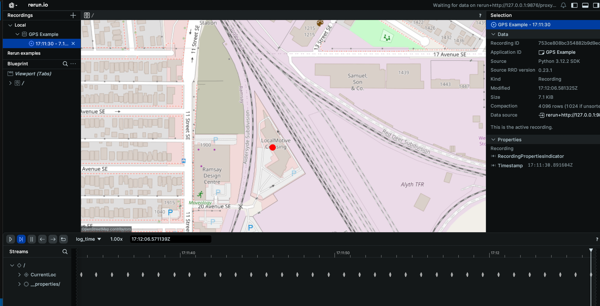

# GPS Schema Example

This example will go through how to connect to the GPS topic published on your EdgeFirst Platform and how to display the information through the Rerun visualizer.

### Setting up subscriber

After setting up the Zenoh session, we will create a subscriber to the `rt/gps` topic

=== "Python"

    ``` python
    # Create a subscriber for "rt/gps"
    subscriber = session.declare_subscriber('rt/gps')
    ```
=== "Rust"

    ``` rust
    let subscriber = session
        .declare_subscriber("rt/gps")
        .await
        .unwrap();
    ```

### Decode GPS Data

We can now recieve message on the subcriber that will be handled by the gps_listener function. After recieving the message, we will need to deserialize it.

=== "Python"

    ``` python
    from edgefirst.schemas.sensor_msgs import NavSatFix
    msg = subscriber.recv()
    gps = NavSatFix.deserialize(msg.payload.to_bytes())
    ```
=== "Rust"

    ``` rust
    use edgefirst_schemas::sensor_msgs::{NavSatFix};
    msg = subscriber.recv()
    let gps: NavSatFix = cdr::deserialize(&msg.payload().to_bytes())?;
    ```

### Get Latitude/Longitude Values and Post to Rerun

We will now pull out the latitude/longitude data from the decoded NavSatFix message and log the data to Rerun.

=== "Python"

    ``` python
    lat = gps.latitude
    long = gps.longitude
    # print("Latitude: %.6f Longitude: %.6f" % (lat, long))
    rr.log("Current Location", rr.GeoPoints(lat_lon=[lat, long]))
    ```
=== "Rust"

    ``` rust
    let lat = gps.latitude;
    let long = gps.longitude;
    // println!("Latitude: {} Longitude: {}",lat, long);
    let _ = rec.log("CurrentLoc", &rerun::GeoPoints::from_lat_lon([(lat, long)]));
    ```

### Results
The command line output will appear as the following
```
Latitude: 51.036506 Longitude: -114.034886
Latitude: 51.036506 Longitude: -114.034886
Latitude: 51.036506 Longitude: -114.034886
```

When displaying the results through Rerun you will see a map with the location of your EdgeFirst Platform marked.
