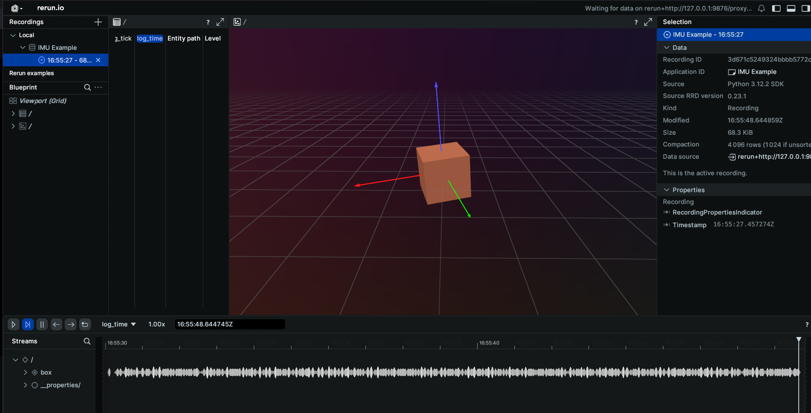

# IMU Schema Example
Topic: [/imu](../../topics/imu.md#imu)  
Message: [Imu](../../api/sensor_msgs.md#imu)
Sample Code: [Python](https://github.com/EdgeFirstAI/samples/blob/main/python/imu.py) / [Rust](https://github.com/EdgeFirstAI/samples/blob/main/rust/imu.rs)

This example will go through how to connect to the IMU topic published on your EdgeFirst Platform and how to display the information through the Rerun visualizer.

### Setting up subscriber

After setting up the Zenoh session, we will create a subscriber to the `rt/imu` topic

=== "Python"

    ``` python
    # Log the initial orientation
    rr.log("/imu", rr.Boxes3D(half_sizes=[[0.5, 0.5, 0.5]], fill_mode="solid"))
    rr.log("/imu", rr.Transform3D(axis_length=2))

    # Create a subscriber for "rt/imu"
    loop = asyncio.get_running_loop()
    drain = MessageDrain(loop)
    session.declare_subscriber('rt/imu', drain.callback)
    ```
=== "Rust"

    ``` rust
    let subscriber = session
        .declare_subscriber("rt/imu")
        .await
        .unwrap();
    ```

### Receive the Message

We can now receive message on the subscriber. After receiving the message, we will need to deserialize it.

=== "Python"

    ``` python
    async def imu_handler(drain):
        while True:
            msg = await drain.get_latest()
            thread = threading.Thread(target=imu_worker, args=[msg])
            thread.start()
            
            while thread.is_alive():
                await asyncio.sleep(0.001)
            thread.join()
    ```
=== "Rust"

    ``` rust
    use edgefirst_schemas::sensor_msgs::{IMU};
    while let Ok(msg) = subscriber.recv() {
        let imu: IMU = cdr::deserialize(&msg.payload().to_bytes())?;
    }
    ```

### Process the IMU Data

We will now pull out the IMU data from the decoded Imu message and send the quaternion to Rerun.

=== "Python"

    ``` python
    def imu_worker(msg):
        imu = Imu.deserialize(msg.payload.to_bytes())
        x = imu.orientation.x
        y = imu.orientation.y
        z = imu.orientation.z
        w = imu.orientation.w
        rr.log("/imu",
                rr.Transform3D(clear=False,
                                quaternion=Quaternion(xyzw=[x, y, z, w])))
    ```
=== "Rust"

    ``` rust
    let x = imu.orientation.x as f32;
    let y = imu.orientation.y as f32;
    let z = imu.orientation.z as f32;
    let w = imu.orientation.w as f32;
    // println!("X: {} Y: {} Z: {} W: {}", x, y, z, w);
    let my_quat = rerun::Quaternion([x,y,z,w]);
    let _ = rec.log("box", &rerun::Transform3D::default().with_quaternion(my_quat));
    ```

### Results
The command line output will appear as the following
```
X: -0.0125 Y: 0.0383 Z: 0.0698 W: 0.9968
X: -0.0125 Y: 0.0383 Z: 0.0698 W: 0.9968
X: -0.0125 Y: 0.0383 Z: 0.0698 W: 0.9968
```

When displaying the results through Rerun you will see a solid cube that is matching the orientation of your EdgeFirst Platform
