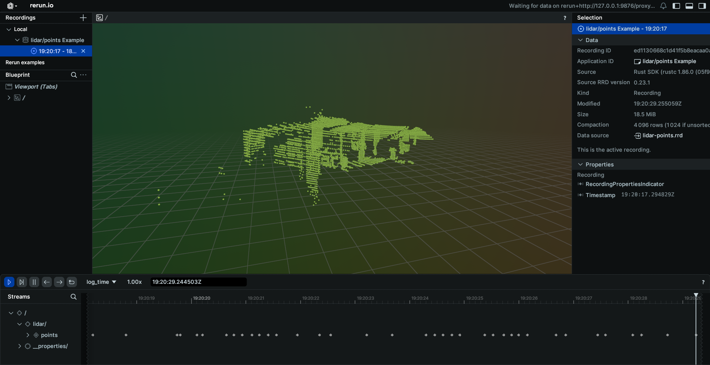
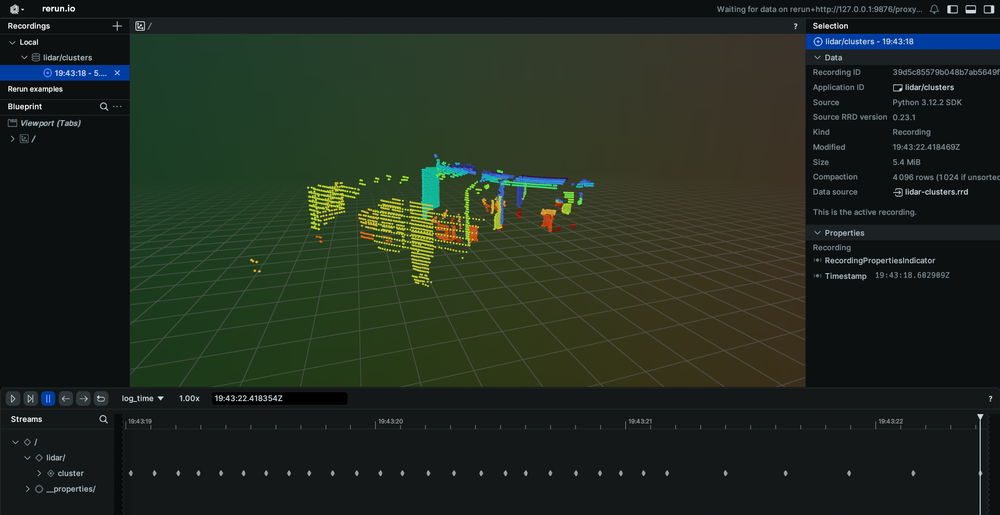
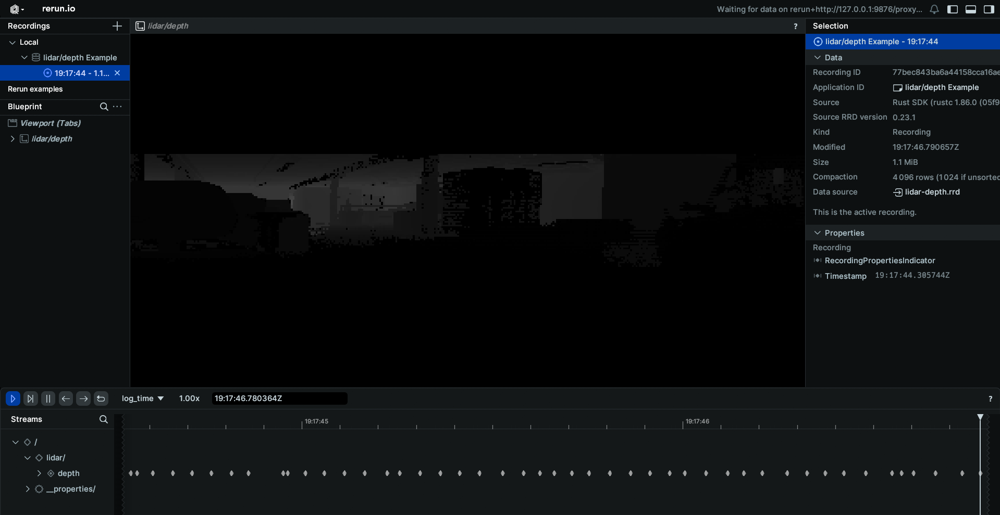
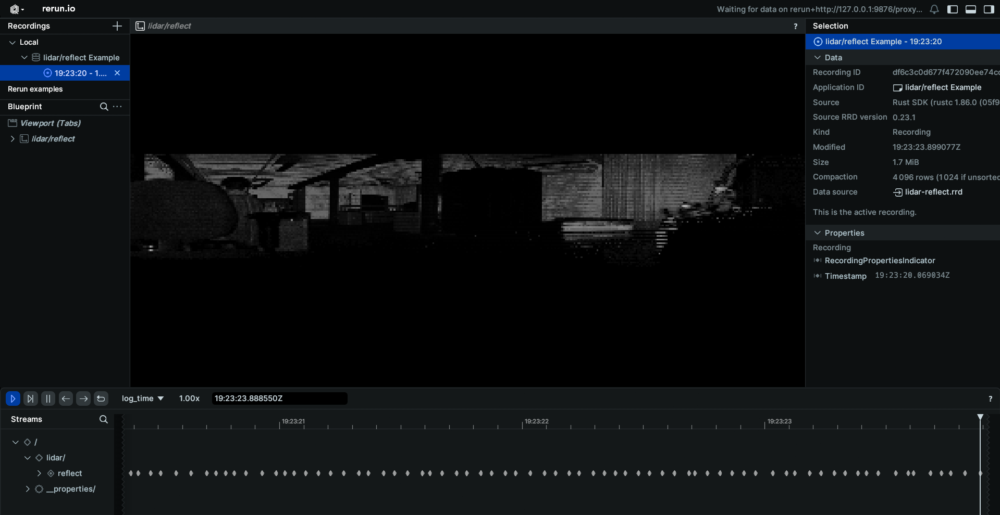

# LIDAR Schema Example

This example will go through how to connect to the lidar topic published on your EdgeFirst Platform and how to display the information on the command line as well as through the Rerun visualizer.


## Lidar Points
Topic: [/lidar/points](../../topics/lidar.md#lidarpoints)  
Message: [Image](../../api/sensor_msgs.md#pointcloud2)

### Setting up subscriber

After setting up the Zenoh session, we will create a subscriber to the `lidar/points` topic

=== "Python"

    ``` python
    # Create a subscriber for "rt/lidar/points"
    subscriber = session.declare_subscriber('rt/lidar/points')
    ```

=== "Rust"

    ``` rust
    // Create a subscriber for "rt/lidar/points"
    let subscriber = session
        .declare_subscriber("rt/lidar/points")
        .await
        .unwrap();
    ```

### Recieve a message

We can now recieve a message on the subcriber. After recieving the message, we will need to deserialize it.

=== "Python"

    ``` python
    from edgefirst.schemas.sensor_msgs import PointCloud2

    # Recieve a message
    msg = subscriber.recv()

    # deserialize message
    pcd = PointCloud2.deserialize(msg.payload.to_bytes())
    ```

=== "Rust"

    ``` rust
    use edgefirst_schemas::sensor_msgs::PointCloud2;

    // Recieve a message
    let msg = subscriber.recv().unwrap()

    // Deserialize message
    let pcd: PointCloud2 = cdr::deserialize(&msg.payload().to_bytes())?;
    ```

### Decode PCD Data

The next step is to decode the PCD data. Please see [examples/pcd](./pcd.md) for a guide on how to decode the PointCloud2 data.


=== "Python"

    ``` python
    points = decode_pcd(pcd)
    ```

=== "Rust"

    ``` rust
    let points = decode_pcd(pcd);
    ```


### Process the Data

We can now process the data. In this example we will find the maximum and minimum values for x, y, z, and reflect

=== "Python"

    ``` python
    min_x = min([p.x for p in points])
    max_x = max([p.x for p in points])

    min_y = min([p.y for p in points])
    max_y = max([p.y for p in points])

    min_z = min([p.z for p in points])
    max_z = max([p.z for p in points])

    min_refl = min([p.fields["reflect"] for p in points])
    max_refl = max([p.fields["reflect"] for p in points])
    ```

=== "Rust"

    ``` rust
    let min_x = points.iter().map(|p| p.x).fold(f64::INFINITY, f64::min);
    let max_x = points.iter().map(|p| p.x).fold(f64::NEG_INFINITY, f64::max);

    let min_y = points.iter().map(|p| p.y).fold(f64::INFINITY, f64::min);
    let max_y = points.iter().map(|p| p.y).fold(f64::NEG_INFINITY, f64::max);

    let min_z = points.iter().map(|p| p.z).fold(f64::INFINITY, f64::min);
    let max_z = points.iter().map(|p| p.z).fold(f64::NEG_INFINITY, f64::max);

    let min_refl = points
        .iter()
        .map(|p| *p.fields.get("reflect").unwrap())
        .fold(f64::INFINITY, f64::min);
    let max_refl = points
        .iter()
        .map(|p| *p.fields.get("reflect").unwrap())
        .fold(f64::NEG_INFINITY, f64::max);
    ```

### Results
The command line output will appear as the following
```
Recieved 24448 lidar points. Values: x: [-15.72, -0.01] y: [-10.52, 4.92]       z: [-2.96, 3.44]        reflect: [0.00, 167.00]
Recieved 24448 lidar points. Values: x: [-15.77, -0.01] y: [-10.54, 4.87]       z: [-1.76, 3.43]        reflect: [0.00, 166.00]
Recieved 24448 lidar points. Values: x: [-15.71, -0.01] y: [-10.50, 4.94]       z: [-2.30, 3.44]        reflect: [0.00, 178.00]
```

When displaying the results through Rerun you will see the pointcloud data gathered by the lidar.


## Lidar Clusters
Topic: [/lidar/clusters](../../topics/lidar.md#lidarclusters)  
Message: [PointCloud2](../../api/sensor_msgs.md#pointcloud2)

### Setting up subscriber

After setting up the Zenoh session, we will create a subscriber to the `lidar/clusters` topic

=== "Python"

    ``` python
    # Create a subscriber for "rt/lidar/cluster"
    subscriber = session.declare_subscriber('rt/lidar/clusters')
    ```

=== "Rust"

    ``` rust
    // Create a subscriber for "rt/lidar/cluster"
    let subscriber = session
        .declare_subscriber("rt/lidar/clusters")
        .await
        .unwrap();
    ```

### Recieve a message

We can now recieve a message on the subcriber. After recieving the message, we will need to deserialize it.

=== "Python"

    ``` python
    from edgefirst.schemas.sensor_msgs import PointCloud2

    # Recieve a message
    msg = subscriber.recv()

    # deserialize message
    pcd = PointCloud2.deserialize(msg.payload.to_bytes())
    ```

=== "Rust"

    ``` rust
    use edgefirst_schemas::sensor_msgs::PointCloud2;

    // Recieve a message
    let msg = subscriber.recv().unwrap()

    // Deserialize message
    let pcd: PointCloud2 = cdr::deserialize(&msg.payload().to_bytes())?;
    ```

### Decode PCD Data

The next step is to decode the PCD data. Please see [examples/pcd](./pcd.md) for a guide on how to decode the PointCloud2 data.


=== "Python"

    ``` python
    points = decode_pcd(pcd)
    ```

=== "Rust"

    ``` rust
    let points = decode_pcd(pcd);
    ```


### Collect the Clustered Points

We will now collect all the clustered points, which are all the points with `cluster_id` above 0.

=== "Python"

    ``` python
    clustered_points = [p for p in points if p.fields["cluster_id"] > 0]
    ```

=== "Rust"

    ``` rust
    let clustered_points: Vec<_> = points.iter().filter(|x| x.fields.get("cluster_id") > 0.0).collect();
    ```

### Results
The command line output will appear as the following
```
Recieved 24448 lidar points. 12193 are clustered
Recieved 24448 lidar points. 12219 are clustered
Recieved 24448 lidar points. 12237 are clustered
```

When displaying the results through Rerun you will see the pointcloud cluster data provided by the LiDAR.


## Lidar Depth
Topic: [/lidar/depth](../../topics/lidar.md#lidardepth)  
Message: [Image](../../api/sensor_msgs.md#image)


### Setting up subscriber

After setting up the Zenoh session, we will create a subscriber to the `lidar/depth` topic

=== "Python"

    ``` python
    # Create a subscriber for "rt/lidar/depth"
    subscriber = session.declare_subscriber('rt/lidar/depth')
    ```

=== "Rust"

    ``` rust
    // Create a subscriber for "rt/lidar/depth"
    let subscriber = session
        .declare_subscriber("rt/lidar/depth")
        .await
        .unwrap();
    ```

### Recieve a message

We can now recieve a message on the subcriber. After recieving the message, we will need to deserialize it.

=== "Python"

    ``` python
    from edgefirst.schemas.sensor_msgs import Image

    # Recieve a message
    msg = subscriber.recv()

    # deserialize message
    depth = Image.deserialize(msg.payload.to_bytes())
    ```

=== "Rust"

    ``` rust
    use edgefirst_schemas::sensor_msgs::Image;

    // Recieve a message
    let msg = subscriber.recv().unwrap()

    // Deserialize message
    let depth: Image = cdr::deserialize(&msg.payload().to_bytes())?;
    ```

### Decode Image Data

Because the depth image is `mono16` encoded, we need to decode the byte array into an array of u16 integers.

=== "Python"

    ``` python
    # Process depth image
    import struct
    assert depth.encoding == "mono16"
    endian_format = ">" if depth.is_bigendian else "<"
    depth_vals = list(struct.unpack(
        f"{endian_format}{depth.width*depth.height}H", depth.data))
    ```

=== "Rust"

    ``` rust
    // Process depth image
    assert_eq!(depth.encoding, "mono16");
    let u16_from_bytes = if depth.is_bigendian > 0 {
        u16::from_be_bytes
    } else {
        u16::from_le_bytes
    };
    let depth_vals: Vec<u16> = depth
        .data
        .chunks_exact(2)
        .map(|a| u16_from_bytes([a[0], a[1]]))
        .collect();
    ```

### Process the Data
We can now process the data. In this example we will find the maximum and minimum depth values.

=== "Python"

    ``` python
    min_depth_mm = min(depth_vals)
    max_depth_mm = max(depth_vals)
    ```

=== "Rust"

    ``` rust
    let min_depth_mm = *depth_vals.iter().min().unwrap();
    let max_depth_mm = *depth_vals.iter().max().unwrap();
    ```

### Results
The command line output will appear as the following
```
Recieved 382x64 depth image. Depth: [0, 19016]
Recieved 382x64 depth image. Depth: [0, 18968]
Recieved 382x64 depth image. Depth: [0, 18944]
```

When displaying the results through Rerun you will see a depth map of what the lidar can see.


## Lidar Reflect
Topic: [/lidar/reflect](../../topics/lidar.md#lidarreflect)  
Message: [Image](../../api/sensor_msgs.md#image)

### Setting up subscriber

After setting up the Zenoh session, we will create a subscriber to the `lidar/reflect` topic

=== "Python"

    ``` python
    # Create a subscriber for "rt/lidar/reflect"
    subscriber = session.declare_subscriber('rt/lidar/reflect')
    ```

=== "Rust"

    ``` rust
    // Create a subscriber for "rt/lidar/reflect"
    let subscriber = session
        .declare_subscriber("rt/lidar/reflect")
        .await
        .unwrap();
    ```

### Recieve a message

We can now recieve a message on the subcriber. After recieving the message, we will need to deserialize it.

=== "Python"

    ``` python
    from edgefirst.schemas.sensor_msgs import Image

    # Recieve a message
    msg = subscriber.recv()

    # deserialize message
    reflect = Image.deserialize(msg.payload.to_bytes())
    ```

=== "Rust"

    ``` rust
    use edgefirst_schemas::sensor_msgs::Image;

    // Recieve a message
    let msg = subscriber.recv().unwrap()

    // Deserialize message
    let reflect: Image = cdr::deserialize(&msg.payload().to_bytes())?;
    ```

### Decode Image Data

Because the reflect image is `mono8` encoded, we don't need to decode the byte array.

=== "Python"

    ``` python
    # Process reflect image
    assert reflect.encoding == "mono8"
    reflect_vals = reflect.data
    ```

=== "Rust"

    ``` rust
    // Process reflect image
    assert_eq!(reflect.encoding, "mono8");
    let reflect_vals = reflect.data.clone();
    ```

### Process the Data
We can now process the data. In this example we will find the maximum and minimum reflect values.

=== "Python"

    ``` python
    min_reflect_mm = min(reflect_vals)
    max_reflect_mm = max(reflect_vals)
    ```

=== "Rust"

    ``` rust
    let min_reflect_mm = *reflect_vals.iter().min().unwrap();
    let max_reflect_mm = *reflect_vals.iter().max().unwrap();
    ```

### Results
The command line output will appear as the following
```
Recieved 382x64 reflect image. reflect: [0, 175]
Recieved 382x64 reflect image. reflect: [0, 166]
Recieved 382x64 reflect image. reflect: [0, 181]
```

When displaying the results through Rerun you will see the reflection data gathered by the lidar.

