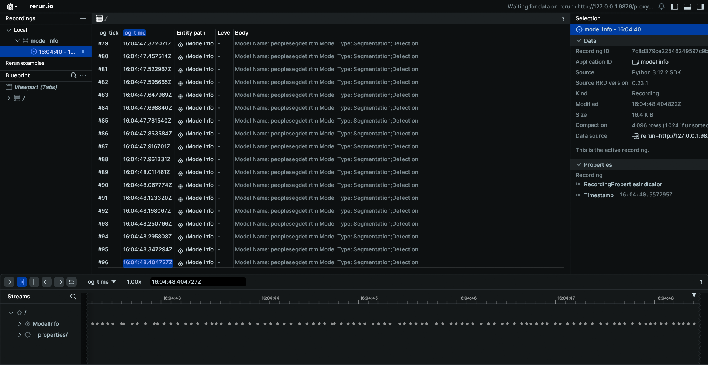
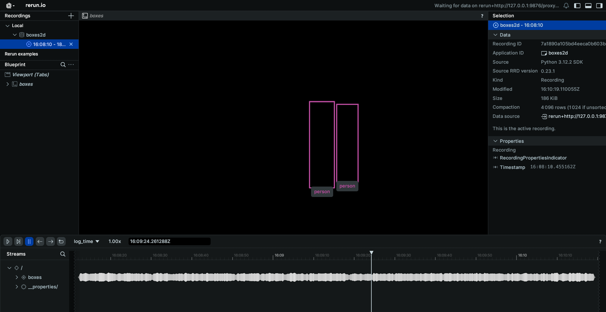
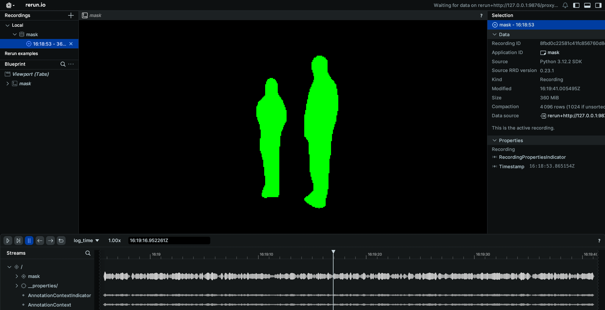
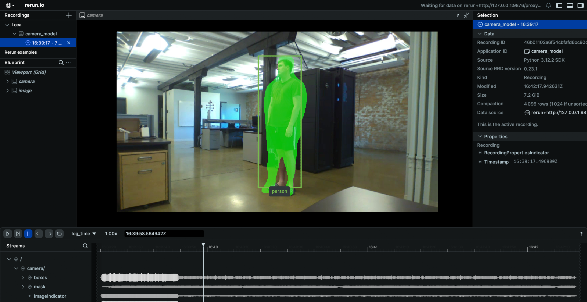

# Model Schema Examples

These examples demonstrate how to connect to various model topics published on your EdgeFirst Platform and how to display the information through the command line.

## Model Info
Topic: [/model/info](../../topics/model.md#modelinfo)  
Message: [ModelInfo](../../api/edgefirst_msgs.md#modelinfo)  
Sample Code: [Python](https://github.com/EdgeFirstAI/samples/blob/main/python/model/model_info.py) / [Rust](https://github.com/EdgeFirstAI/samples/blob/main/rust/model/model_info.rs)

### Setting up subscriber

After setting up the Zenoh session, we will create a subscriber to the `model/info` topic

=== "Python"

    ``` python
    # Create a subscriber for "rt/model/info"
    subscriber = session.declare_subscriber('rt/model/info')
    ```

=== "Rust"

    ``` rust
    // Create a subscriber for "rt/model/info"
    let subscriber = session
        .declare_subscriber("rt/model/info")
        .await
        .unwrap();
    ```

### Receive a message

We can now receive a message on the subscriber. After receiving the message, we will need to deserialize it.

=== "Python"

    ``` python
    from edgefirst.schemas.edgefirst_msgs import ModelInfo

    # Receive a message
    msg = subscriber.recv()
    # deserialize message
    info = ModelInfo.deserialize(msg.payload.to_bytes())
    ```

=== "Rust"

    ``` rust
    use edgefirst_schemas::edgefirst_msgs::ModelInfo;

    // Receive a message
    let msg = subscriber.recv().unwrap();
    let info: ModelInfo = cdr::deserialize(&msg.payload().to_bytes())?;
    ```

### Process the Data

The ModelInfo message contains information about the model configuration. You can access various fields like:

=== "Python"

    ``` python
    # Access model parameters
    m_type = info.model_type
    m_name = info.model_name
    rr.log("ModelInfo", rr.TextLog("Model Name: %s Model Type: %s" % (m_name, m_type)))
    ```

=== "Rust"

    ``` rust
    let m_type = info.model_type;
    let m_name = info.model_name;
    let text = "Model Name: ".to_owned() + &m_name + " Model Type: " + &m_type;
    let _ = rr.log("ModelInfo", &rerun::TextLog::new(text));
    ```

### Results
When displaying the results through Rerun you will see the model info.


## Boxes2D
Topic: [/model/boxes2d](../../topics/model.md#modelboxes2d)  
Message: [ModelInfo](../../api/edgefirst_msgs.md#detect)  
Sample Code: [Python](https://github.com/EdgeFirstAI/samples/blob/main/python/model/boxes2d.py) / [Rust](https://github.com/EdgeFirstAI/samples/blob/main/rust/model/boxes2d.rs)

### Setting up subscriber

After setting up the Zenoh session, we will create a subscriber to the `model/boxes2d` topic

=== "Python"

    ``` python
    # Create a subscriber for "rt/model/boxes2d"
    subscriber = session.declare_subscriber('rt/model/boxes2d')
    ```

=== "Rust"

    ``` rust
    // Create a subscriber for "rt/model/boxes2d"
    let subscriber = session
        .declare_subscriber("rt/model/boxes2d")
        .await
        .unwrap();
    ```

### Receive a message

We can now receive a message on the subscriber. After receiving the message, we will need to deserialize it.

=== "Python"

    ``` python
    from edgefirst.schemas.edgefirst_msgs import Detect

    # Receive a message
    msg = subscriber.recv()

    # deserialize message
    detection = Detect.deserialize(msg.payload.to_bytes())
    ```

=== "Rust"

    ``` rust
    use edgefirst_schemas::edgefirst_msgs::Detect;

    // Receive a message
    let msg = subscriber.recv().unwrap();
    let detection: Detect = cdr::deserialize(&msg.payload().to_bytes())?;
    ```

### Process the Data

The Boxes2D message contains 2D bounding box detections. You can access various fields like:

=== "Python"

    ``` python
    centers = []
    sizes = []
    labels = []
    for box in detection.boxes:
        centers.append((box.center_x, box.center_y))
        sizes.append((box.width, box.height))
        labels.append(box.label)
    rr.log("boxes", rr.Boxes2D(centers=centers, sizes=sizes, labels=labels))
    ```

=== "Rust"

    ``` rust
    let mut centers = Vec::new();
    let mut sizes = Vec::new();
    let mut labels = Vec::new();

    for b in detection.boxes {
        centers.push([b.center_x, b.center_y]);
        sizes.push([b.width, b.height]);
        labels.push(b.label);
    }

    let _ = rr.log("boxes", &rerun::Boxes2D::from_centers_and_sizes(centers, sizes).with_labels(labels))?;
    ```

### Results
When displaying the results through Rerun you will see the boxes without any camera, to see the combined example please see the[Combined Example](#combined-example).


## Model Mask
Topic: [/model/mask](../../topics/model.md#modelmask)  
Message: [Mask](../../api/edgefirst_msgs.md#mask)  
Sample Code: [Python](https://github.com/EdgeFirstAI/samples/blob/main/python/model/mask.py) / [Rust](https://github.com/EdgeFirstAI/samples/blob/main/rust/model/mask.rs)

### Setting up subscriber

After setting up the Zenoh session, we will create a subscriber to the `model/mask` topic

=== "Python"

    ``` python
    # Create a subscriber for "rt/model/mask"
    subscriber = session.declare_subscriber('rt/model/mask')
    ```

=== "Rust"

    ``` rust
    // Create a subscriber for "rt/model/mask"
    let subscriber = session
        .declare_subscriber("rt/model/mask")
        .await
        .unwrap();
    ```

### Receive a message

We can now receive a message on the subscriber. After receiving the message, we will need to deserialize it.

=== "Python"

    ``` python
    from edgefirst.schemas.edgefirst_msgs import Mask

    msg = subscriber.recv()
    mask = Mask.deserialize(msg.payload.to_bytes())
    ```

=== "Rust"

    ``` rust
    use edgefirst_schemas::edgefirst_msgs::Mask;

    // Receive a message
    let msg = subscriber.recv().unwrap();
    let mask: Mask = cdr::deserialize(&msg.payload().to_bytes())?;
    ```

### Process the Data

The Mask message contains segmentation mask data. You can access various fields like:

=== "Python"

    ``` python
    np_arr = np.asarray(mask.mask, dtype=np.uint8)
    np_arr = np.reshape(np_arr, [mask.height, mask.width, -1])
    np_arr = np.argmax(np_arr, axis=2)
    rr.log("/", rr.AnnotationContext([(0, "background", (0,0,0)), (1, "person", (0,255,0))]))
    rr.log("mask", rr.SegmentationImage(np_arr))
    ```

=== "Rust"

    ``` rust
    let h = mask.height as usize;
    let w = mask.width as usize;
    let total_len = mask.mask.len() as u32;
    let c = (total_len / (h as u32 * w as u32)) as usize;

    let arr3 = Array::from_shape_vec((h, w, c), mask.mask.clone())?;
    
    // Compute argmax along the last axis (class channel)
    let array2: Array2<u8> = arr3
        .map_axis(ndarray::Axis(2), |class_scores| {
            class_scores
                .iter()
                .enumerate()
                .max_by_key(|(_, val)| *val)
                .map(|(idx, _)| idx as u8)
                .unwrap_or(0)
        });

    // Log annotation context
    rr.log(
        "/",
        &AnnotationContext::new([
            (0, "background", rerun::Rgba32::from_rgb(0, 0, 0)),
            (1, "person", rerun::Rgba32::from_rgb(0, 255, 0))])
    )?;

    // Log segmentation mask
    let _ = rr.log("mask", &SegmentationImage::try_from(array2)?)?;
    ```

### Results
When displaying the results through Rerun you will see the segmentation without any camera, to see the combined example please see the[Combined Example](#combined-example).


## Model Mask Compressed
Topic: [/model/mask](../../topics/model.md#modelmask_compressed)  
Message: [Mask](../../api/edgefirst_msgs.md#mask)  
Sample Code: [Python](https://github.com/EdgeFirstAI/samples/blob/main/python/model/compressed_mask.py) / [Rust](https://github.com/EdgeFirstAI/samples/blob/main/rust/model/compressed_mask.rs)

### Setting up subscriber

After setting up the Zenoh session, we will create a subscriber to the `model/compressed_mask` topic

=== "Python"

    ``` python
    # Create a subscriber for "rt/model/mask_compressed"
    subscriber = session.declare_subscriber('rt/model/mask_compressed')
    ```

=== "Rust"

    ``` rust
    // Create a subscriber for "rt/model/compressed_mask"
    let subscriber = session.declare_subscriber("rt/model/mask_compressed")
    .await
    .unwrap();
    ```

### Receive a message

We can now receive a message on the subscriber. After receiving the message, we will need to deserialize it.

=== "Python"

    ``` python
    from edgefirst.schemas.edgefirst_msgs import Mask

    msg = subscriber.recv()
    mask = Mask.deserialize(msg.payload.to_bytes())
    ```

=== "Rust"

    ``` rust
    use edgefirst_schemas::edgefirst_msgs::Mask;

    // Receive a message
    let msg = subscriber.recv().unwrap();
    let mask: Mask = cdr::deserialize(&msg.payload().to_bytes())?;
    ```

### Process the Data

The CompressedMask message contains compressed segmentation mask data. You can access various fields like:

=== "Python"

    ``` python
    decoded_array = zstd.decompress(bytes(mask.mask))
    np_arr = np.frombuffer(decoded_array, np.uint8)
    np_arr = np.reshape(np_arr, [mask.height, mask.width, -1])
    np_arr = np.argmax(np_arr, axis=2)
    rr.log("/", rr.AnnotationContext([(0, "background", (0,0,0)), (1, "person", (0,255,0))]))
    rr.log("mask", rr.SegmentationImage(np_arr))
    ```

=== "Rust"

    ``` rust
    let decompressed_bytes = decode_all(Cursor::new(&mask.mask))?;
        
    let h = mask.height as usize;
    let w = mask.width as usize;
    let total_len = mask.mask.len() as u32;
    let c = (total_len / (h as u32 * w as u32)) as usize;

    let arr3 = Array::from_shape_vec([h, w, c], decompressed_bytes.clone())?;
    
    // Compute argmax along the last axis (class channel)
    let array2: Array2<u8> = arr3
        .map_axis(ndarray::Axis(2), |class_scores| {
            class_scores
                .iter()
                .enumerate()
                .max_by_key(|(_, val)| *val)
                .map(|(idx, _)| idx as u8)
                .unwrap_or(0)
        });

    // Log annotation context
    rr.log(
        "/",
        &AnnotationContext::new([
            (0, "background", rerun::Rgba32::from_rgb(0, 0, 0)),
            (1, "person", rerun::Rgba32::from_rgb(0, 255, 0))])
    )?;

    // Log segmentation mask
    let _ = rr.log("mask", &SegmentationImage::try_from(array2)?)?;
    ``` 

### Results

When displaying the results through Rerun you will see the segmentation without any camera, to see the combined example please see the[Combined Example](#combined-example).


## Combined Example

This example will demonstrate how to combine the camera feed with the model messages to create a composite Rerun view. The main difference when using multiple messages in a script, is that we will change from waiting on the message to be received to having a callback function for when a message is received. Using the initial method, the script would hang while waiting for a message topic to be published, so if the messages are being published at different rates, the slowest message rate will limit the others.

Sample Code: [Python](https://github.com/EdgeFirstAI/samples/blob/main/python/combined/camera_model.py) 

### Setting up the subscribers

After setting up the Zenoh session, we will create a subscriber to the three topics

=== "Python"

    ``` python
    # Create the necessary subscribers
    subscriber1 = session.declare_subscriber('rt/camera/h264', h264_callback)
    subscriber2 = session.declare_subscriber('rt/model/boxes2d', boxes2d_callback)
    subscriber3 = session.declare_subscriber('rt/model/mask_compressed', mask_callback)
    ```

=== "Rust"

    ``` rust
    // Create a subscriber for "rt/camera/info"
    let subscriber = session
        .declare_subscriber("rt/camera/info")
        .await
        .unwrap();
    ```

### Subscriber Callbacks
We will now go through the callback functions that are in use for this example. These callback functions will make use of a global variable frame size to allow the script to properly resize the segmentation mask and boxes to overlap the camera feed correctly. Each callback will receive the Zenoh message as the argument.

=== "Python"

    ``` python
    raw_data = io.BytesIO() # Necessary for H264 decoding
    container = av.open(raw_data, format='h264', mode='r') # Necessary for H264 decoding
    frame_size = []
    ```

#### H264 Callback
The H264 callback will receive the CompressedVideo message and decode it, loop through each frame received and log those frames to Rerun in addition to updating frame size.

=== "Python"

    ``` python
    def h264_callback(msg):
        global frame_size
        raw_data.write(msg.payload.to_bytes())
        raw_data.seek(0)
        for packet in container.demux():
            try:
                if packet.size == 0:  # Skip empty packets
                    continue
                raw_data.seek(0)
                raw_data.truncate(0)
                for frame in packet.decode():  # Decode video frames
                    frame_array = frame.to_ndarray(format='rgb24')  # Convert frame to numpy array
                    frame_size = [frame_array.shape[1], frame_array.shape[0]]
                    rr.log('camera', rr.Image(frame_array))
            except Exception:  # Handle exceptions
                continue  # Continue processing next packets
    ```

#### Boxes2D Callback
The Boxes2D callback will receive the Detect message, loop through all detections found and then create lists of the centers and sizes received properly scaled by the frame size that was determined from the camera feed.

=== "Python"

    ``` python
    def boxes2d_callback(msg):
        detection = Detect.deserialize(msg.payload.to_bytes())    
        for box in detection.boxes:
            centers.append((int(box.center_x * frame_size[0]), int(box.center_y * frame_size[1])))
            sizes.append((int(box.width * frame_size[0]), int(box.height * frame_size[1])))
            print(centers)
            print(sizes)
            labels.append(box.label)
        rr.log("camera/boxes", rr.Boxes2D(centers=centers, sizes=sizes, labels=labels))
    ```

#### Mask Callback
The Mask callback will receive the Mask message, decompress the message (if using the mask_compressed message remotely), and then scale the mask to the frame size determined from the camera feed. This mask will then be processed to log the results to Rerun following the AnnotationContext created.

=== "Python"

    ``` python
    def mask_callback(msg):
        mask = Mask.deserialize(msg.payload.to_bytes())
        decoded_array = zstd.decompress(bytes(mask.mask))
        np_arr = np.frombuffer(decoded_array, np.uint8)
        np_arr = np.reshape(np_arr, [mask.height, mask.width, -1])
        np_arr = cv2.resize(np_arr, frame_size)
        np_arr = np.argmax(np_arr, axis=2)
        rr.log("/", rr.AnnotationContext([(0, "background", (0,0,0,0)), (1, "person", (0,255,0))]))
        rr.log("camera/mask", rr.SegmentationImage(np_arr))
    ```

### Results
When displaying the results through Rerun you will see the combined image of the camera feed, segmentation image and boxes.
