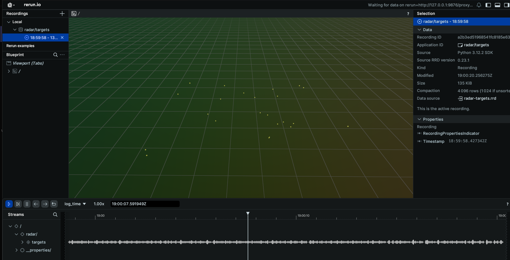
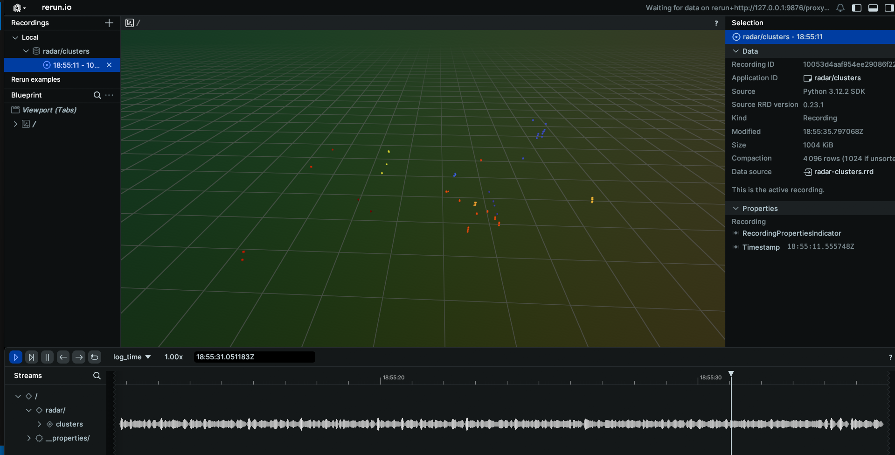
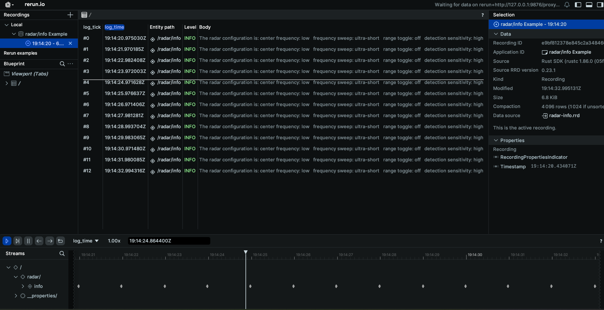
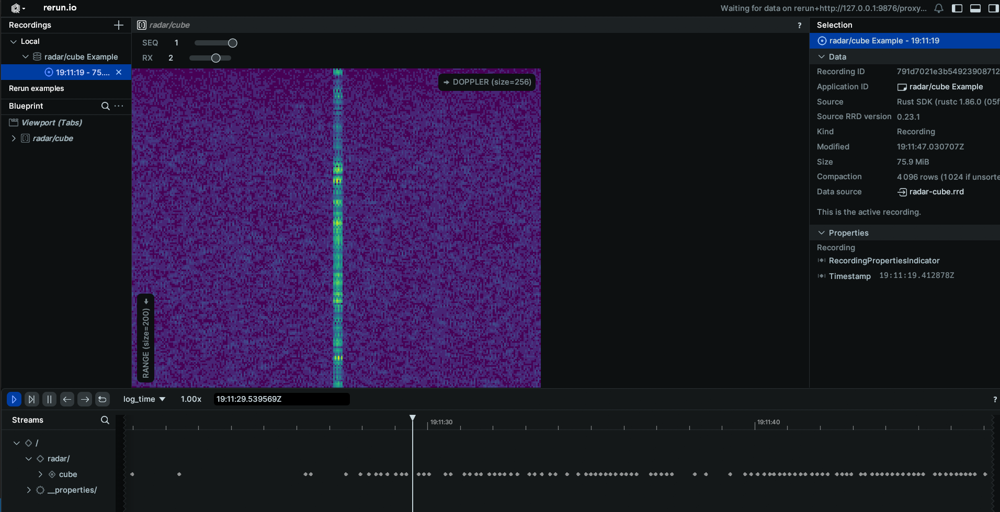
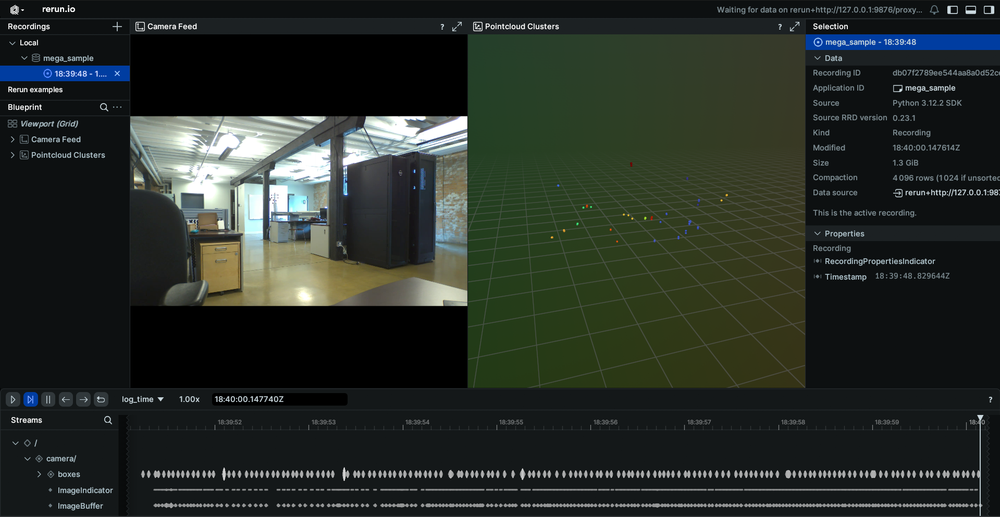

# Radar Schema Example

This example will go through how to connect to the radar topic published on your EdgeFirst Platform and how to display the information on the command line as well as through the Rerun visualizer.

## Radar Targets

Topic: [/radar/targets](../../topics/radar.md#radartargets)  
Message: [PointCloud2](../../api/sensor_msgs.md#pointcloud2)
Sample Code: [Python](https://github.com/EdgeFirstAI/samples/blob/main/python/radar/targets.py) / [Rust](https://github.com/EdgeFirstAI/samples/blob/main/rust/radar/targets.rs)

### Setting up subscriber

After setting up the Zenoh session, we will create a subscriber to the `radar/targets` topic

=== "Python"

    ``` python
    # Create a subscriber for "rt/radar/targets"
    loop = asyncio.get_running_loop()
    drain = MessageDrain(loop)
    session.declare_subscriber('rt/radar/targets', drain.callback)
    ```

=== "Rust"

    ``` rust
    // Create a subscriber for "rt/radar/targets"
    let subscriber = session
        .declare_subscriber("rt/radar/targets")
        .await
        .unwrap();
    ```

### Receive a message

We can now receive a message on the subscriber. After receiving the message, we will need to deserialize it.

=== "Python"

    ``` python
    async def targets_handler(drain):
        while True:
            msg = await drain.get_latest()
            thread = threading.Thread(target=targets_worker, args=[msg])
            thread.start()
            
            while thread.is_alive():
                await asyncio.sleep(0.001)
            thread.join()
    ```

=== "Rust"

    ``` rust
    use edgefirst_schemas::sensor_msgs::PointCloud2;

    // Create a subscriber for "rt/radar/cluster"
    let msg = subscriber.recv().unwrap()

    let pcd: PointCloud2 = cdr::deserialize(&msg.payload().to_bytes())?;
    ```

### Decode PCD Data

The next step is to decode the PCD data. Please see [examples/pcd](pcd.md) for a guide on how to decode the PointCloud2 data.

=== "Python"

    ``` python
    def targets_worker(msg):
        pcd = PointCloud2.deserialize(msg.payload.to_bytes())
        points = decode_pcd(pcd)
        pos = [[p.x, p.y, p.z] for p in points]
        rr.log("radar/targets", rr.Points3D(pos))
    ```

=== "Rust"

    ``` rust
    let points = decode_pcd(&pcd);
    let points = Points3D::new(
        points
            .iter()
            .map(|p| Position3D::new(p.x as f32, p.y as f32, p.z as f32)),
    );

    rr.log("radar/targets", &points)?;
    ```

### Process the Data

We can now process the data. In this example we will find the maximum and minimum values for x, y, z, speed, power, and rcs

=== "Python"

    ``` python
    pos = [[p.x, p.y, p.z] for p in points]
    rr.log("radar/targets", rr.Points3D(pos))
    ```

=== "Rust"

    ``` rust
    let min_x = points.iter().map(|p| p.x).fold(f64::INFINITY, f64::min);
    let max_x = points.iter().map(|p| p.x).fold(f64::NEG_INFINITY, f64::max);

    let min_y = points.iter().map(|p| p.y).fold(f64::INFINITY, f64::min);
    let max_y = points.iter().map(|p| p.y).fold(f64::NEG_INFINITY, f64::max);

    let min_z = points.iter().map(|p| p.z).fold(f64::INFINITY, f64::min);
    let max_z = points.iter().map(|p| p.z).fold(f64::NEG_INFINITY, f64::max);

    let min_speed = points
        .iter()
        .map(|p| *p.fields.get("speed").unwrap())
        .fold(f64::INFINITY, f64::min);
    let max_speed = points
        .iter()
        .map(|p| *p.fields.get("speed").unwrap())
        .fold(f64::NEG_INFINITY, f64::max);

    let min_power = points
        .iter()
        .map(|p| *p.fields.get("power").unwrap())
        .fold(f64::INFINITY, f64::min);
    let max_power = points
        .iter()
        .map(|p| *p.fields.get("power").unwrap())
        .fold(f64::NEG_INFINITY, f64::max);

    let min_rcs = points
        .iter()
        .map(|p| *p.fields.get("rcs").unwrap())
        .fold(f64::INFINITY, f64::min);
    let max_rcs = points
        .iter()
        .map(|p| *p.fields.get("rcs").unwrap())
        .fold(f64::NEG_INFINITY, f64::max);
    ```

### Results

The command line output will appear as the following

```
Recieved 23 radar points. Values: x: [2.04, 9.48]       y: [-2.99, 4.74]        z: [-2.07, 2.09]        rcs: [-13.80, 17.60]
Recieved 23 radar points. Values: x: [2.04, 9.47]       y: [-2.99, 4.21]        z: [-2.11, 2.09]        rcs: [-13.80, 17.60]
Recieved 23 radar points. Values: x: [2.04, 9.47]       y: [-2.97, 4.22]        z: [-2.09, 2.07]        rcs: [-14.00, 17.60]
```

When displaying the results through Rerun you will see the pointcloud radar data.


## Radar Clusters

Topic: [/radar/clusters](../../topics/radar.md#radarclusters)  
Message: [PointCloud2](../../api/sensor_msgs.md#pointcloud2)
Sample Code: [Python](https://github.com/EdgeFirstAI/samples/blob/main/python/radar/clusters.py) / [Rust](https://github.com/EdgeFirstAI/samples/blob/main/rust/radar/clusters.rs)

### Setting up subscriber

After setting up the Zenoh session, we will create a subscriber to the `radar/clusters` topic

=== "Python"

    ``` python
    # Create a subscriber for "rt/radar/cluster"
    loop = asyncio.get_running_loop()
    drain = MessageDrain(loop)
    session.declare_subscriber('rt/radar/clusters', drain.callback)
    ```

=== "Rust"

    ``` rust
    // Create a subscriber for "rt/radar/cluster"
    let subscriber = session
        .declare_subscriber("rt/radar/clusters")
        .await
        .unwrap();
    ```

### Receive a message

We can now receive a message on the subcriber. After receiving the message, we will need to deserialize it.

=== "Python"

    ``` python
    async def clusters_handler(drain):
        while True:
            msg = await drain.get_latest()
            thread = threading.Thread(target=clusters_worker, args=[msg])
            thread.start()
            
            while thread.is_alive():
                await asyncio.sleep(0.001)
            thread.join()
    ```

=== "Rust"

    ``` rust
    use edgefirst_schemas::sensor_msgs::PointCloud2;

    // Create a subscriber for "rt/radar/cluster"
    let msg = subscriber.recv().unwrap()

    let pcd: PointCloud2 = cdr::deserialize(&msg.payload().to_bytes())?;
    ```

### Decode PCD Data

The next step is to decode the PCD data. Please see [examples/pcd](pcd.md) for a guide on how to decode the PointCloud2 data.

=== "Python"

    ``` python
    def clusters_worker(msg):
        pcd = PointCloud2.deserialize(msg.payload.to_bytes())
        points = decode_pcd(pcd)
    ```

=== "Rust"

    ``` rust
    let points = decode_pcd(pcd);
    ```

### Collect the Clustered Points

We will now collect all the clustered points, which are all the points with `cluster_id` above 0.

=== "Python"

    ``` python
    clusters = [p for p in points if p.cluster_id > 0]
    if not clusters:
        rr.log("radar/clusters", rr.Points3D([], colors=[]))
        return
    max_id = max(p.cluster_id for p in clusters)
    pos = [[p.x, p.y, p.z] for p in clusters]
    colors = [colormap(turbo_colormap, p.cluster_id / max_id) for p in clusters]
    rr.log("radar/clusters", rr.Points3D(pos, colors=colors))
    ```

=== "Rust"

    ``` rust
    let clustered_points: Vec<_> = points.iter().filter(|x| x.id > 0).collect();
    let max_cluster_id = clustered_points
        .iter()
        .map(|x| x.id)
        .max()
        .unwrap_or(1)
        .max(1);

    let points = Points3D::new(
        clustered_points
            .iter()
            .map(|p| Position3D::new(p.x as f32, p.y as f32, p.z as f32)),
    )
    .with_colors(clustered_points.iter().map(|p| {
        let (r, g, b) = colorous::TURBO
            .eval_continuous(p.id as f64 / max_cluster_id as f64)
            .as_tuple();
        Color::from_rgb(r, g, b)
    }));

    rr.log("radar/clusters", &points)?;
    ```

### Results

When displaying the results through Rerun you will see the cluster data.


## Radar Info

Topic: [/radar/info](../../topics/radar.md#radarinfo)  
Message: [RadarInfo](../../api/edgefirst_msgs.md#radarinfo)
Sample Code: [Python](https://github.com/EdgeFirstAI/samples/blob/main/python/radar/info.py) / [Rust](https://github.com/EdgeFirstAI/samples/blob/main/rust/radar/info.rs)

### Setting up subscriber

After setting up the Zenoh session, we will create a subscriber to the `radar/info` topic

=== "Python"

    ``` python
    # Create a subscriber for "rt/radar/info"
    loop = asyncio.get_running_loop()
    drain = MessageDrain(loop)
    session.declare_subscriber('rt/radar/info', drain.callback)
    ```

=== "Rust"

    ``` rust
    // Create a subscriber for "rt/radar/info"
    let subscriber = session
        .declare_subscriber("rt/radar/info")
        .await
        .unwrap();
    ```

### Receive a message

We can now recevie a message on the subcriber. After receiving the message, we will need to deserialize it.

=== "Python"

    ``` python
    async def info_handler(drain):
        while True:
            msg = await drain.get_latest()
            thread = threading.Thread(target=info_worker, args=[msg])
            thread.start()
            
            while thread.is_alive():
                await asyncio.sleep(0.001)
            thread.join()
    ```

=== "Rust"

    ``` rust
    use edgefirst_schemas::edgefirst_msgs::RadarInfo;

    // receive a message
    let msg = subscriber.recv().unwrap()

    // Deserialize message
    let radar_info: RadarInfo = cdr::deserialize(&msg.payload().to_bytes())?;
    ```

### Process the Data

The RadarInfo message contains information about the radar configuration. Various fields can be accessed to view the radar's configuration.

=== "Python"

    ``` python
    def info_worker(msg):
        radar_info = RadarInfo.deserialize(msg.payload.to_bytes())
        radar_log = "Range Mode: %s\n" % str(radar_info.frequency_sweep)
        radar_log += "Center Band: %s\n" % str(radar_info.center_frequency)
        radar_log += "Sensitivity: %s\n" % str(radar_info.detection_sensitivity)
        radar_log += "Range Toggle: %s\n" % str(radar_info.range_toggle)
        rr.log("RadarInfo", rr.TextLog(radar_log))
    ```

=== "Rust"

    ``` rust
    // Access radar configuration
    let center_frequency = radar_info.center_frequency;
    let frequency_sweep = radar_info.frequency_sweep;
    let range_toggle = radar_info.range_toggle;
    let detection_sensitivity = radar_info.detection_sensitivity;
    let cube = radar_info.cube;
    ```

### Results

The command line output will appear as the following

```
The radar configuration is: center frequency: low   frequency sweep: ultra-short   range toggle: off   detection sensitivity: high   sending cube: true
The radar configuration is: center frequency: low   frequency sweep: ultra-short   range toggle: off   detection sensitivity: high   sending cube: true
The radar configuration is: center frequency: low   frequency sweep: ultra-short   range toggle: off   detection sensitivity: high   sending cube: true
```

When displaying the results through Rerun you will see a log of the radar configuration.


## Radar Cube

Topic: [/radar/cube](../../topics/radar.md#radarcube)  
Message: [RadarCube](../../api/edgefirst_msgs.md#radarcube)
Sample Code: [Python](https://github.com/EdgeFirstAI/samples/blob/main/python/radar/cube.py) / [Rust](https://github.com/EdgeFirstAI/samples/blob/main/rust/radar/cube.rs)

### Setting up subscriber

After setting up the Zenoh session, we will create a subscriber to the `radar/cube` topic

=== "Python"

    ``` python
    # Create a subscriber for "rt/radar/cube"
    loop = asyncio.get_running_loop()
    drain = MessageDrain(loop)
    session.declare_subscriber('rt/radar/cube', drain.callback)
    ```

=== "Rust"

    ``` rust
    // Create a subscriber for "rt/radar/cube"
    let subscriber = session
        .declare_subscriber("rt/radar/cube")
        .await
        .unwrap();
    ```

### Receive a message

We can now receive a message on the subcriber. After receiving the message, we will need to deserialize it.

=== "Python"

    ``` python
    async def cube_handler(drain):
        while True:
            msg = await drain.get_latest()
            thread = threading.Thread(target=cube_worker, args=[msg])
            thread.start()
            
            while thread.is_alive():
                await asyncio.sleep(0.001)
            thread.join()
    ```

=== "Rust"

    ``` rust
    use edgefirst_schemas::edgefirst_msgs::RadarCube;

    // receive a message
    let msg = subscriber.recv().unwrap()

    // Deserialize message
    let radar_cube: RadarCube = cdr::deserialize(&msg.payload().to_bytes())?;
    ```

### Process the Data

The RadarCube message contains data from the RadarCube.

=== "Python"

    ``` python
    def cube_worker(msg):
        radar_cube = RadarCube.deserialize(msg.payload.to_bytes())
        data = np.array(radar_cube.cube).reshape(radar_cube.shape)
        # Take the absolute value of the data to improve visualization.
        data = np.abs(data)
        rr.log("radar/cube",
                rr.Tensor(data, dim_names=["SEQ", "RANGE", "RX", "DOPPLER"]))
    ```

=== "Rust"

    ``` rust
    let data = Array::<u16, _>::from_shape_vec(
        radar.shape.iter().map(|&x| x as usize).collect::<Vec<_>>(),
        radar
            .cube
            .iter()
            .map(|x| x.unsigned_abs())
            .collect::<Vec<_>>(),
    )?;
    let tensor = Tensor::try_from(data)?.with_dim_names(["SEQ", "RANGE", "RX", "DOPPLER"]);
    rr.log("radar/cube", &tensor)?;
    ```

### Results

The command line output will appear as the following

```
The radar cube has shape: [2, 200, 4, 256]
The radar cube has shape: [2, 200, 4, 256]
The radar cube has shape: [2, 200, 4, 256]
```

When displaying the results through Rerun you will see the radar cube displayed.


## Combined Example

This example will demonstrate how to combine the camera feed with the radar messages to create a composite Rerun view. The main difference when using multiple messages in a script, is that we will change from waiting on the message to be received to having a callback function for when a message is received. Using the initial method, the script would hang while waiting for a message topic to be published, so if the messages are being published at different rates, the slowest message rate will limit the others.

Sample Code: [Python](https://github.com/EdgeFirstAI/samples/blob/main/python/combined/camera_radar.py) / [Rust](https://github.com/EdgeFirstAI/samples/blob/main/rust/combined/mega_sample.rs)

### Setting up the subscribers

After setting up the Zenoh session, we will create a subscriber to the three topics

=== "Python"

    ``` python
    loop = asyncio.get_running_loop()
    h264_drain = MessageDrain(loop)
    boxes2d_drain = MessageDrain(loop)
    radar_drain = MessageDrain(loop)
    frame_size_storage = FrameSize()

    # Declare subscribers
    session.declare_subscriber('rt/camera/h264', h264_drain.callback)
    session.declare_subscriber('rt/model/boxes2d', boxes2d_drain.callback)
    session.declare_subscriber('rt/radar/clusters', radar_drain.callback)
    ```

### Subscriber Callbacks

We will now go through the handler functions that are in use for this example. These handler functions will independently handle each of the messages received through the MessageDrain. Additionally, we will make use of a FrameSize object to communicate the frame size of the camera to the boxes and segmentation mask so they can be resized appropriately.

=== "Python"

    ``` python
    await asyncio.gather(h264_handler(h264_drain, frame_size_storage), 
                         boxes2d_handler(boxes_drain, frame_size_storage),
                         mask_handler(mask_drain, frame_size_storage, args.remote))
    ```

#### H264 Handler

The H264 handler will receive the CompressedVideo message from the MessageDrain and after initializing the required containers will pass that message to the worker, where the message will be processed and logged to Rerun.

=== "Python"

    ``` python
    async def h264_handler(drain, frame_storage):
        raw_data = io.BytesIO()
        container = av.open(raw_data, format='h264', mode='r')

        while True:
            msg = await drain.get_latest()
            thread = threading.Thread(target=h264_worker, args=[msg, frame_storage, raw_data, container])
            thread.start()
            
            while thread.is_alive():
                await asyncio.sleep(0.001)
            thread.join()
    
    def h264_worker(msg, frame_storage, raw_data, container):
        raw_data.write(msg.payload.to_bytes())
        raw_data.seek(0)
        for packet in container.demux():
            try:
                if packet.size == 0:
                    continue
                raw_data.seek(0)
                raw_data.truncate(0)
                for frame in packet.decode():
                    frame_array = frame.to_ndarray(format='rgb24')
                    frame_storage.set(frame_array.shape[1], frame_array.shape[0])
                    rr.log('/camera', rr.Image(frame_array))
            except Exception:
                continue
    ```

#### Boxes2D Handler

The Boxes2D callback will wait for a Detect message from the MessageDrain and will pass that message to the worker, where the message will be processed and logged to Rerun. The boxes logged will use tracking when available. Additionally, this handler will wait until the camera has started and logged a frame size so it knows what the height and width will be to resize the boxes.

=== "Python"

    ``` python
    async def boxes2d_handler(drain, frame_storage):
        boxes_tracked = {}
        _ = await frame_storage.get()
        while True:
            msg = await drain.get_latest()
            frame_size = await frame_storage.get()
            thread = threading.Thread(target=boxes2d_worker, args=[msg, boxes_tracked, frame_size])
            thread.start()
            
            while thread.is_alive():
                await asyncio.sleep(0.001)
            thread.join()

    def boxes2d_worker(msg, boxes_tracked, frame_size):
        detection = Detect.deserialize(msg.payload.to_bytes())
        centers, sizes, labels, colors = [], [], [], []
        for box in detection.boxes:
            if box.track.id and box.track.id not in boxes_tracked:
                boxes_tracked[box.track.id] = [box.label + ": " + box.track.id[:6], list(np.random.choice(range(256), size=3))]
            if box.track.id:
                colors.append(boxes_tracked[box.track.id][1])
                labels.append(boxes_tracked[box.track.id][0])
            else:
                colors.append([0,255,0])
                labels.append(box.label)
            centers.append((int(box.center_x * frame_size[0]), int(box.center_y * frame_size[1])))
            sizes.append((int(box.width * frame_size[0]), int(box.height * frame_size[1])))
        rr.log("/camera/boxes", rr.Boxes2D(centers=centers, sizes=sizes, labels=labels, colors=colors))
    ```

#### Radar Handler

The radar callback will receive the pointcloud message, perform post-processing on the resultant data and then be sent to Rerun.

=== "Python"

    ``` python
    async def clusters_handler(drain):
        while True:
            msg = await drain.get_latest()
            thread = threading.Thread(target=clusters_worker, args=[msg])
            thread.start()
            
            while thread.is_alive():
                await asyncio.sleep(0.001)
            thread.join()

    def clusters_worker(msg):
        pcd = PointCloud2.deserialize(msg.payload.to_bytes())
        points = decode_pcd(pcd)
        clusters = [p for p in points if p.cluster_id > 0]
        if not clusters:
            rr.log("/pointcloud/clusters", rr.Points3D([], colors=[]))  
            return
        max_id = max(p.cluster_id for p in clusters)
        pos = [[p.x, p.y, p.z] for p in clusters]
        colors = [colormap(turbo_colormap, p.cluster_id / max_id)
                for p in clusters]
        rr.log("/pointcloud/clusters", rr.Points3D(pos, colors=colors))
    ```

### Results

When displaying the results through Rerun you will see the combined image of the camera feed with boxes and the radar pointcloud.

