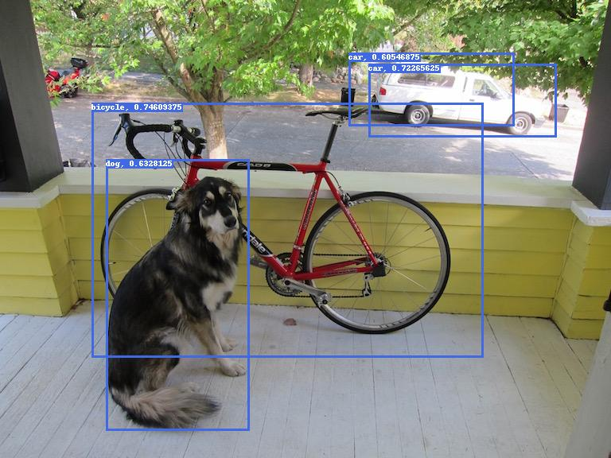

# MobileNet SSD Examples

These examples demonstrate how to deploy a MobileNet SSD model using the NPU of an embedded platform such as a [Maivin](../../../platforms/quickstart.md).  The examples below are split into two parts; model inference on a single image and live model inference using the device's [WebUI](../../../platforms/walkthrough.md).

## Image Inference

In this example, the sample pretrained MobileNet SSD models and the sample image can be found in [ML-Zoo](https://github.com/Arm-Examples/ML-zoo/tree/master/models/object_detection/ssd_mobilenet_v1) and [ssd-tflite repository](https://github.com/apivovarov/ssd-tflite/tree/master).  This example has modified the Python script provided in the "ssd-tflite" repository to deploy the model with the OpenVX delegate to run on the NPU.  Furthermore, minimum dependencies are used to ensure no additional venv/pip installations are needed.  The only dependencies required are `tflite_runtime`, `numpy`, and `pillow` which should already come pre-installed in the Maivin's BSP.  Lastly, the model outputs are then drawn onto the image for visualization.

For a quick demonstration, download the following files for running the example.

1. [MobileNet SSD Model](assets/ssd_mobilenet_v1_0.75_depth_quantized_300x300_coco14_sync_2018_07_18.tflite){: download="ssd_mobilenet_v1_0.75_depth_quantized_300x300_coco14_sync_2018_07_18.tflite" }
2. [Sample Image](assets/dog.jpg){: download="dog.jpg"}
3. [Python Script](assets/run-tflite.py){: download="run-tflite.py"}

Once the files have been downloaded, [SCP](../../../platforms/ssh.md#secure-copy) the files into the embedded platform.

Run the script with the command `python3 run-tflite.py`.  The script should print the inference time in milliseconds and the model detections as follows.

```shell
Time: 8 ms
Found objects:
   2 bicycle 0.74609375 [0.22455344 0.15004507 0.7796775  0.79142797]
   3 car 0.72265625 [0.13997436 0.603076   0.29882038 0.910733  ]
   18 dog 0.6328125 [0.34737465 0.17417745 0.9401951  0.4078675 ]
   3 car 0.60546875 [0.11568993 0.57076305 0.27453592 0.84135157]
```

!!! note "Box Format"
    The bounding boxes should be in the normalized format [ymin, xmin, ymax, xmax].

Furthermore, a new image should be saved `img_vis.jpg` showing the model output visualizations.

<figure markdown="span">
{align=center}
<figcaption>Model Inference</figcaption>
</figure>

The following breakdown of the script describing the steps of the model inference is provided below.

1. Load the model specifying the external delegate to use the device's NPU.

    ```python
    model_path = "ssd_mobilenet_v1_0.75_depth_quantized_300x300_coco14_sync_2018_07_18.tflite"
    delegate = "/usr/lib/libvx_delegate.so"

    ext_delegate = load_delegate(delegate, {})
    ip = Interpreter(model_path=model_path, experimental_delegates=[ext_delegate])
    ```

2. Allocate tensors to allocate memory and sets up input/output tensor bindings.

    ```python
    ip.allocate_tensors()
    ```

3. Call invoke() once at the start as a model warmup since the first call may take up to 9 seconds to run. 

    ```python
    ip.invoke()
    ```

4. Preprocess input image by resizing to the input shape of the model and type-casting the values to the input data type requirements of the model.

    ```python
    image_path = "dog.jpg"

    input_det = ip.get_input_details()[0]
    _, height, width, _ = input_det.get("shape")
    img = np.array(Image.open(image_path).resize((width, height)))

    # is TFLite quantized int8 model
    int8 = input_det["dtype"] == np.int8
    # is TFLite quantized uint8 model
    uint8 = input_det["dtype"] == np.uint8
    if int8 or uint8:
        img = img.astype(np.uint8) if uint8 else img.astype(np.int8)
    else:
        img = img.astype(np.float32)
    img = np.array([img]) 
    ```

5. Query inputs from the model's input details and set the input tensor.

    ```python
    inp_id = ip.get_input_details()[0]["index"]
    ip.set_tensor(inp_id, img)
    ```

6. Run model inference by calling the invoke() function.

    ```python
    ip.invoke()
    ```

7. Query model outputs from the model's output details.

    ```python
    out_det = ip.get_output_details()
    out_id0 = out_det[0]["index"]
    out_id1 = out_det[1]["index"]
    out_id2 = out_det[2]["index"]
    out_id3 = out_det[3]["index"]

    boxes = ip.get_tensor(out_id0).squeeze()
    classes = ip.get_tensor(out_id1).squeeze()
    scores = ip.get_tensor(out_id2).squeeze()
    num_det = ip.get_tensor(out_id3).squeeze()
    ```

These are the postprocessed model outputs which can then be visualized.

!!! note "Output Decoding"

    Output decoding which includes NMS postprocessing is already embedded inside the model.
    The model outputs a maximum of 10 detections.  Currently there is no option to set the NMS parameters such as IoU and score thresholds using this model. 
