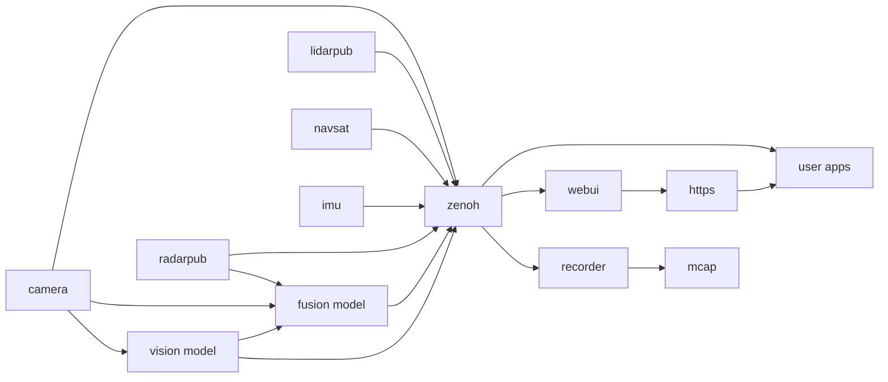

# Middleware Overview

The EdgeFirst Perception Middleware provides a modular software stack built on Zenoh, a ROS2-like communication middleware.

## Architecture

Each service handles a specific task:

- **Camera Service**: Interfaces with the camera and ISP (Image Signal Processor) to deliver frames to other services. It also encodes frames to H.265 video for recording or streaming. You can configure or disable encoding if not needed.

## Communication

Services communicate through Zenoh, a high-performance publisher/subscriber stack. While EdgeFirst doesn't depend on ROS2, services encode messages using ROS2 CDR (Common Data Representation). The middleware uses ROS2 standard schemas where applicable and custom schemas where needed.

See the [Recording](data_collection/recording.md) and [Foxglove](data_collection/foxglove.md) sections for details on streaming, recording, and tool interoperability.

