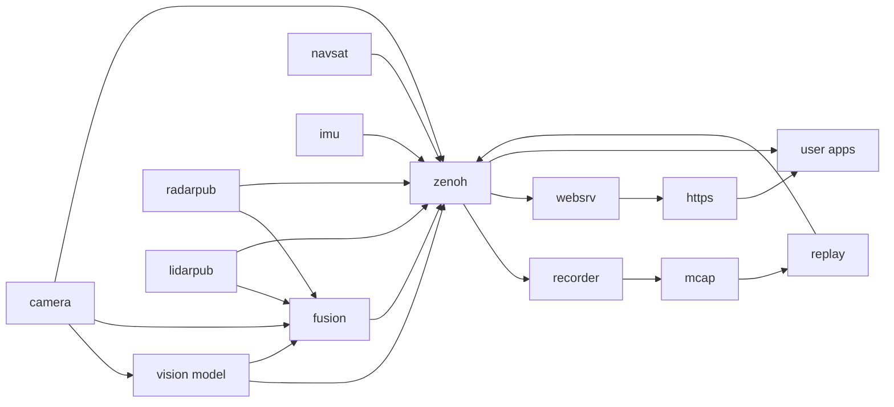

# The EdgeFirst Perception Middleware

The EdgeFirst Perception Middleware is a collection of applications and libraries used in the implementation of the modular perception stack.  The perception stack is built on [Zenoh][zenoh] and uses ROS 2 compatible CDR message formats to publish and subscribe messages on topics accessible in the stack over the network.  The middleware is open source under the Apache 2.0 license and published from the [EdgeFirstAI GitHub organization][github], the [Torizon for Maivin](../platforms/quickstart/maivin/index.md) platform ships the middleware preinstalled and preconfigured.

## Middleware Services

The Perception Middleware is modular and split into various application services, each focused on a general task.  For example the camera service is charged with interfacing with the camera and ISP (Image Signal Processor) to efficiently deliver camera frames to other services who need access to the camera.  The camera service is also responsible for encoding camera frames using the hardware video codec into H.264 video for efficient recording or remote streaming, this feature of the camera service can be configured or disabled if recording or streaming are not required.

The middleware services communicate with each other using the Zenoh networking middleware which provides a highly efficient publisher/subscriber communications stack.  This architecture is similar to ROS 2 and our services encode their messages using the ROS 2 CDR (Common Data Representation).  We use the ROS 2 standard schemas where applicable and augment with our own custom schemas where required.  The [Recorder](data_collection/recording.md) and [Foxglove](data_collection/foxglove.md) chapters go into more detail on how this allows efficient streaming and recording of messages and interoperability with industry standard tools.

## Architecture

Each service handles a specific task and publishes its results on a set of [topics](topics/index.md).  The services are independent processes, a service can be stopped, reconfigured, and restarted without affecting the others, and several instances of a service can run to support multiple cameras or multiple models.

| Service | Binary | Description |
|---------|--------|-------------|
| [Camera](topics/camera.md) | `edgefirst-camera` | Interfaces with the camera and ISP to publish zero-copy camera frames along with H.264 and optional JPEG streams.  Publishes the camera intrinsics and the camera transform. |
| [Model](topics/model.md) | `edgefirst-model` | Runs a vision model on the camera frames using the NPU and publishes detection boxes, segmentation masks, tracks, and timing in a unified message. |
| [Fusion](topics/fusion.md) | `edgefirst-fusion` | Projects the radar and LiDAR point clouds onto the vision model output to classify targets, builds 3D bounding boxes and an occupancy grid, and optionally runs a RadarExp fusion model on the radar cube. |
| [Radar](topics/radar.md) | `edgefirst-radarpub` | Interfaces with the smartmicro radar over CAN and Ethernet to publish the radar point cloud, clusters, and radar cube. |
| [LiDAR](topics/lidar.md) | `edgefirst-lidarpub` | Interfaces with Robosense and Ouster LiDAR sensors to publish point clouds, clusters, and depth and reflectivity images. |
| [IMU](topics/imu.md) | `edgefirst-imu` | Publishes the device orientation, angular velocity, and linear acceleration. |
| [NavSat](topics/navsat.md) | `edgefirst-navsat` | Publishes the GPS position from `gpsd`. |
| [Recorder](data_collection/recording.md) | `edgefirst-recorder` | Records topics into MCAP files with the schemas embedded for playback and dataset creation. |
| [Replay](data_collection/replay.md) | `edgefirst-replay` | Replays MCAP recordings onto the topics in place of the live sensors. |
| Web Server | `edgefirst-websrv` | Serves the [Web UI](../platforms/quickstart/maivin/webui.md), bridges topics to the browser over WebSockets, and provides the configuration, recording, and EdgeFirst Studio upload APIs. |
| Zenoh Router | `zenohd` | Optional router allowing [remote applications](dev/index.md) to reach the device topics. |

The services are built on a set of shared libraries which are also published from the EdgeFirst GitHub organization with Rust, C, and Python bindings.

- **EdgeFirst Schemas** provide the message definitions and CDR encoding for the ROS 2 common interfaces, the Foxglove messages, and the EdgeFirst custom messages, refer to the [API Reference](api/index.md).
- **EdgeFirst HAL** provides the tensor, image processing, decoder, and tracker building blocks used by the model and fusion services.
- **VideoStream** provides zero-copy camera frame sharing across processes along with the hardware codec interfaces.

On Torizon for Maivin the services run as systemd units under the `maivin.target` target with their configuration under `/etc/default/`, refer to the platform [Configuration](../platforms/configuration/index.md) section.  On other platforms the services can be launched in user-mode with the [EdgeFirst Launcher](launcher.md).

## Communication

Services communicate through Zenoh, a high-performance publisher/subscriber stack.  While EdgeFirst doesn't depend on ROS 2, services encode messages using the ROS 2 CDR (Common Data Representation).  The middleware uses ROS 2 standard schemas where applicable and custom schemas where needed.

Each service opens its Zenoh session inside a namespace equal to the device hostname, so the topics are published on bare keys such as `camera/h264` and reach the network as `verdin-imx8mp-XXXXXXXX/camera/h264`.  This keeps the topics of several devices on the same network apart and lets recordings from multiple devices be merged.  Refer to [Middleware Topics](topics/index.md#hostname-namespaces) for the details and to the [Developer Guide](dev/index.md) for subscribing from your own applications.

See the [Recording](data_collection/recording.md) and [Foxglove](data_collection/foxglove.md) sections for details on streaming, recording, and tool interoperability.

For programmatic access to EdgeFirst Studio (dataset upload, snapshots, training artifacts), see the [EdgeFirst Client](../client/index.md) documentation.

[zenoh]: https://zenoh.io/
[github]: https://github.com/EdgeFirstAI
